#prompt #CoT #LLM

> 논문 출처: [Chain-of-Thought Prompting Elicits Reasoning in Large Language Models](https://arxiv.org/abs/2201.11903)

먼저 본 논문을 들어가기 전에 기본이 되는 Cot 논문에 대해 먼저 간략하게 정리 한다. 

## 1. Introduce
- LLM은 많은 발전을 이루었지만 복잡한 산수 추론, 상식 추론 같은 문제를 해결하는 데에는 여전히 한계가 있다.(논문 시점 기준)
- 그래서 오는 Chain of Thought(이하 CoT)를 제시한다.
- CoT의 핵심은 두가지가 존재 하나는 문제 해결 과정에서 모델이 중간 단계의 추론을 명시적으로 생성하도록 하는 것, 두 번째는 fine-tuning대신 few-shot과 같은 질문에 대한 예제를 보여주는것

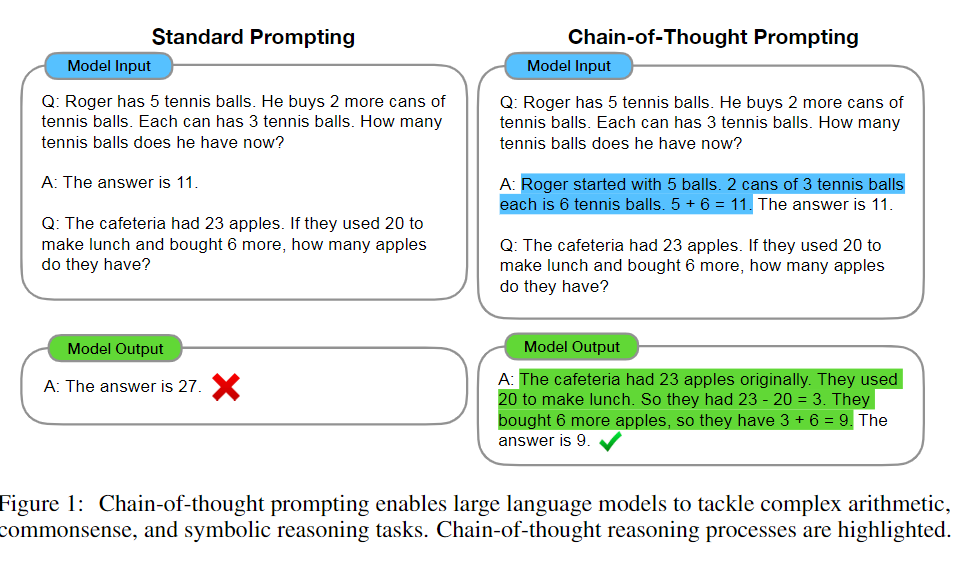

## 2. Chain-of-Thought Promping
- Figure 1 의 그림을 보아 기존의 GPT3에선 Few-shot방식의 테니스 볼 예시로 기초적인 산술 문제를 풀게 유도를 하지만 LLM은 언어 모델로 언어모델은 이번단어를 기준으로 디코더 기반으로 다음 단어를 생성하는 방법을 학습한 모델이지 기본적인 산술방법을 학습하지는 않았기에 출력의 정확도가 매우 낮다. 
- 이렇듯 기존의 LLM은 산술 추론 (Arithmetic Reasoning), 상식 추론 (Commonsense Reasoning), 기호 추론 (Symbolic Reasoning) 등과 같은 문제에선 매우 약한 모습을 보인다.
- 이 논문은 CoT를 제시하며 추론에 약한 LLM의 특성을 보완하기 위해 output에 intermediate reasoning steps(중간 추론?)을 추가하여 문제를 해결할 것이다.
- CoT는 아래의 특성을 가지고 있다.
  - CoT는 출력 결과가 중간 추론 단계를 가지고 있어, 하나의 문제를 여러개로 분해하여 답변을 제시한다. 이는 더욱 많은 추론 단계가 필요한 문제도 할당이가능하다 즉 어려운 문제 추론 문제도 풀 수 있다. 즉 few-shot을 많이 제시해도 효과적이란 뜻
  - CoT는 답변을 내는 과정중 중간 추론 단계를 출력으로 보여주기에 답변 출력에 대한 해석이 가능하다. 이는 모델이 내는 결과에 대해서 해석이 가능해져 원인 분석에 용이
  - CoT는 추론 문제에 유용하다.
  - 기본적으로 더 자세한 Few-shot 방식이기에 다른 문제에도 적용하기 편함

## 3. Arithmetic Reasoning
- 일단 산술 추론 문제를 Cot를 활용하여 결과를 보겠다.
- CoT는 540B의 큰 모델에서 사용될 때 GSM8K benchmark 성능이  finetuning과 비슷하다.

### 3.1 Experimental Setup
- **Benchmarks**: GSM8K 등 4개의 벤치마킹 데이터 이용
- **Standard prompting**: 기본적으로 Few-shot Prompting 방식을 사용
- **CoT**:  Figure 1 처럼 각각 few-shot 예제에 CoT 방식이 있는 답변을 넣는다. 이렇게 저 예시와 함께 8개 추가해서 더 만든다.

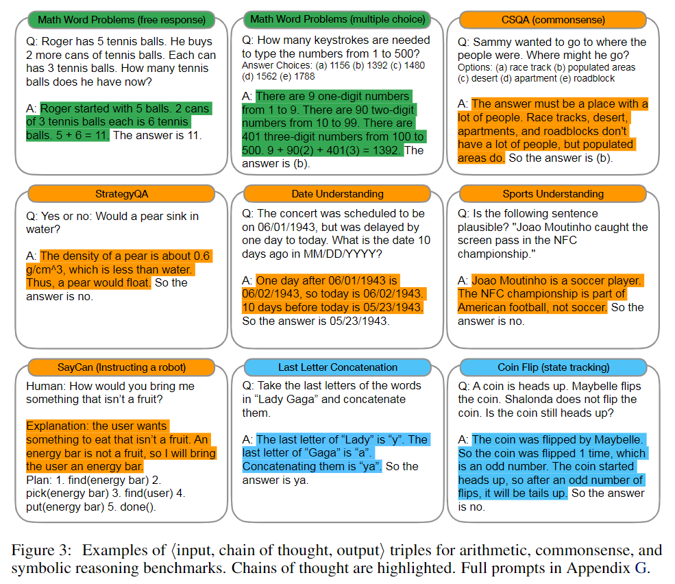

- **Language Model**: GPT-3, LaMDA, PaLM 과 같은 LLM 모델

### 3.2 Result

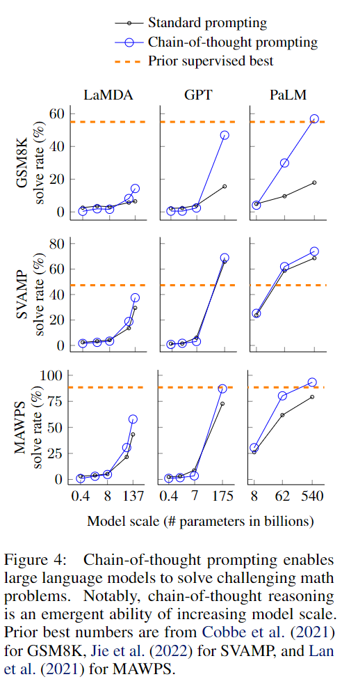

- Figure 4는 모델 성능 벤치 마크 그래프이다.

- CoT는 모델 Scale에 따라 큰 차이를 보인다. scale이 작은 모델에선 Standart한 형식보다 성능이 낮다. 100B이상 크기의 모델에선 큰 효과가 나타난다.

- CoT를 사용하면 복잡한 문제일수록 더욱 나은 결과를 받을 수 있다.

- 이전 작업과 비교해 Cot를 통한 GPT-3와 PaLM은 레이블이 지정된 데이터에 한해서 finetuning된 SOTA(State-of-the-Art)모델에 비견된다.

- 왜 CoT가 잘 작동하는지 궁금해서 추가적인 실험을 해봄

- 결과가 옳게 나온 50개를 샘플링 해봤을 때 는 우연히 맞춘 2개 빼곤 전부 올바르게 추론함

- 결과가 안좋게 나온 50개를 샘플링 해봤을 때 개중 46%는 사소한 실수(계산 실수, symbol mapping 오류, 추론 단계 누락)를 빼면 거의 정확하다.

- 그리고 나머지 54%는 잘못된 CoT를 반환

  > D.2 Incorrect Chain of Thought Analysis
  >
  > - 만약 모델이 오류에 대해서 올바르게 바뀌기 위해선 어떠한 방식을 써야할까? 아래는 그에 대한 내용이다.
  >
  > - 계산 오류(Calculator  error only):계산을 외부 계산기로 계산하지 않으니 46퍼중 8%정도 계산 오류이다. 그래서 파이썬을 계산기로 추가하니 결과가 좋아 졌다.(아마 파이써썬으로 출력과 연계되는 산술 계산 함수를 만든건가 파이썬으로 그냥 계산을 했다는 건가 잘 모르겠음)
  >
  > 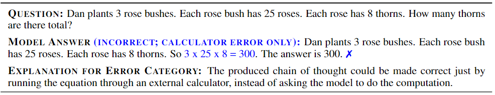
  >
  > - 입력 오류(Symbol mapping error): 단순 마크(+, - 와 같은)를 잘못 입력한 경우로 이 경우를 완벽히 CoT의 영역이라 판단하고 추론 과정에 식을 만드는 예시 혹은 제한 조건을 제시해서 완벽히 컨트롤 한다.
  >
  > 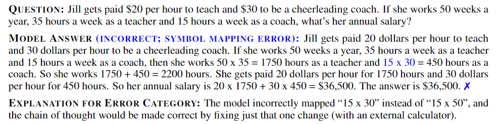
  >
  > - 단계 오류(One step missing error): 추론하는 단계중 한 단계가 잘못된 경우를 말한다. 놓친 추론 단계를 추가하여 CoT를 올바르게 할 수 있도록 조정한다.
  >
  > 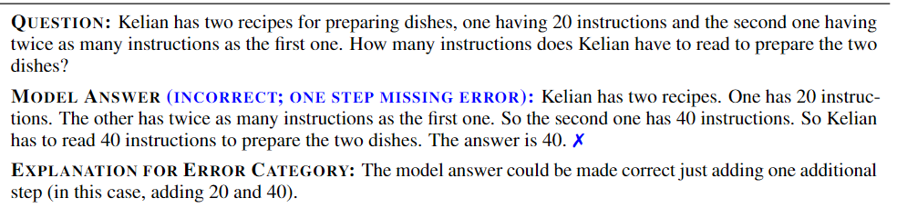
  >
  > - CoT를 잘못 작성한 오류는 50 오류 샘플 중 전체의 54% 였고 대부분 질문의 의미를 이해하지 못한 경우의 에러 였다.
  >
  > 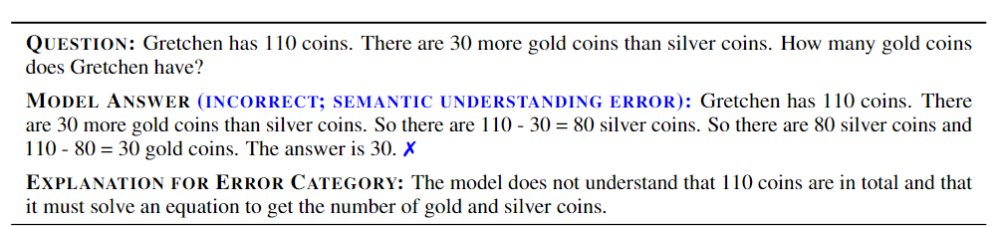
  >
  > - 나머지 오류는 Prompt에서 제안한 지식 혹은 원래 세계의 기본 지식을 위반한 경우 이다.
  >
  > 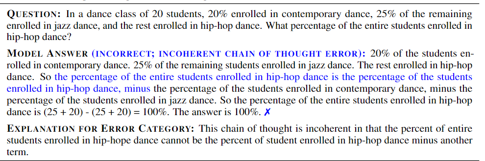

### 3.3 Ablation Study

- Equation only: CoT를 사용하지 않고 문제 해결에 사용될 식만 주어졌을 때 Figure 5 와 같이 크게 성능이 좋지는 않았다.
- Variable compute only: CoT가 어려운 문제를 잘 푸는 이유가 연산이 증가해서(단어 토큰이 많아서) 그런지 확인 해 볼려고 prompt에 dot(...)을 추가하여 equation(연산?, 계산?)을 증가 시켜 보니 baseline(뒤에 문맥을 보니 standard prompt)와 크게 차이가 없다. CoT가 추론에 도움이 된다는 사실을 알 수 있다.
- CoT after answer: 모델의 답변이 실제로 CoT 작업에 영향을 받아 추론 결과를 도출하는지 알아보기 위해 CoT 답변을 최종 답변 뒤에 나오게 하고(ex."답은 6입니다. 사과 2개 배 4개 의 합은" 뭐 이렇게 만든다는거 아닐까?) 결과를 확인하니 baseline과 별반 차이가 없더라. 즉 CoT의 순차적으로 추론하는 방식은 지식을 활성화하는 것을 넣어 추론의 이유에 대한 방식에도 유용하다는걸 알 수 있다.

### 3.4 Robustness of Chain of Thought

- prompt의 few shot 예시 순서 조합은 LLM이 매우 민감하게 받아 들인다.(gpt-3도 예시 순서 따라 acc가 54.3%에서 Sota급인 93%까지 차이가 많이 난다. )
- 그래서 few shot을 근간으로 하는 CoT로도 다른 annotator을 줘서 평가 해본다.(예시를 각각 다른 사람이 작성해서 결과를 본다는 뜻 같음)

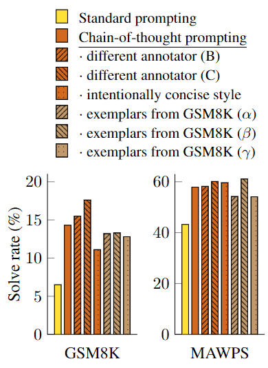

- 여러 예시를 조합했을 때 다양한 조합의 CoT예시가 Standard prompt 보다 효과가 좋았다.
- 그러므로 CoT는 이 단순 예시 순서 혹은 제시한 예시의 수에 견고성?(Robustness) 즉 별로 민감하지 않다는 것을 말할 수 있다.

## 4. Commonsense Reasoning

- Cot로 상식 추론도 해볼 것 이다. 인간과의 소통은 기본적인 배경지식을 바탕으로 이루어 지며 기존의 언어모델은 불가능한 영역이다.
- **Benchmarks**: 상식 추론에 관련된 데이터셋 5개를 사용
- **Prompts**: 이전에 했던 방식과 동일, 데이터셋에서 무작위로 Sample을 뽑아 CoT 구성 후 답변 확인
- **Result**: 아래는 PaLM 모델을 사용한 결과이다.  저번 세션의 결과과 비슷하게 모델의 크기가 클수록 좋은 결과가 나왔다.

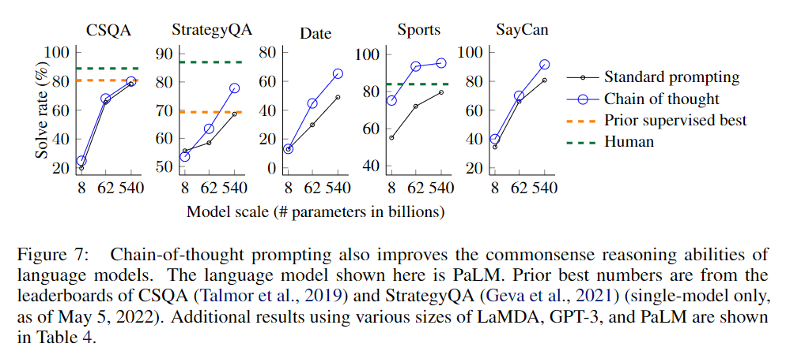

## 5. Symbolic Reasoning

- Symbolic Reasoning은 인간에겐 간단하지만 언어모델에겐 도전적인 작업이다.

- **Task**:우선 두 가지의 Task를 사용한다.

  - Last letter concatenation: 이 작업은 "Amy Brown"과 같은 문자가 들어오면 "yn"과 같이 각각의 단어의 뒷글자를 이어 붙히게 한다. 앞의 문자를 자르는건 gpt-3도 이미 하니 더 어려운 버전으로 뒷 문자를 들고 오게 함

  - Coin flip: 이 작업은 사람이 coin flip을 했을 때 이 동전이 앞면인지 뒷면인지 판단하게 한다.

    ex. '앞면의 동전이 있는데 A는 동전을 한번 뒤집었고 B는 안뒤집었다. 지금 동전은 앞면인가?' -> "아니요"

- 도메인(학습데이터에 비슷한 내용)이 있는 테스트와 없는 테스트 두개를 진행하고, Last letter은 더 어렵게 만들기 위해 3~4개의 단어를 사용할 것이고, coin flip은 같은 작업(동전 뒤집기)을 임의의 횟수로 더 진행해서 정답을 맞추는지 확인 할 것 이다.
- **Result**: PaLM으로 테스트 해본 결과 아래와 같다.

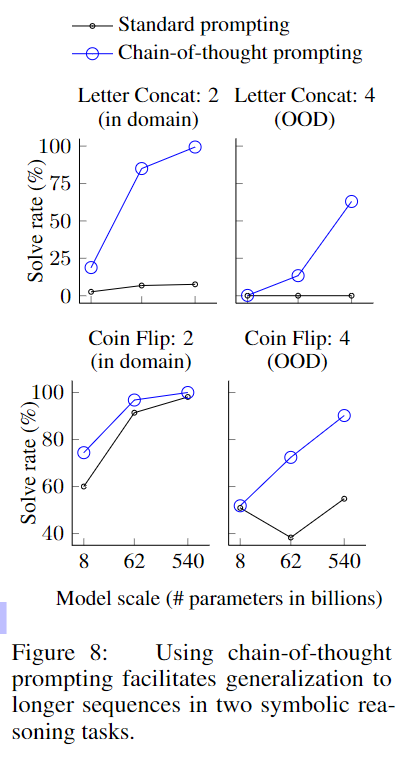

- 모델이 작으면 문제가 어려우면 어려울 수록 도메인이 없는 문제면 CoT를 써도 아무 효과가 없다.
- 하지만 모델이 크면 CoT의 효과는 커지고 이는 모델이 크면 문장이 길어도 충분히 일관된 답을 얻을 수 있다는걸 보여준다.

## 6. Discussion

- CoT는 산술 추론, 상식 추론, 심볼 추론 모두 좋은 성능을 보였다.
- 예제 순서 혹은 다른 예제를 제시해도 Robustness 가 있다. 즉 민감하지 않게 결과를 도출 해 준다.
- 이 논문에서는 어떠한 Fine tuning도 하지 않았다.
- 하지만 아래의 의문도 든다.
  - 모델의 크기늘 늘리면 얼마나 더 추론 해결 능력을 개선할 수 있을까?
  - 언어 모델의 다른 문제에 대해서도 해결할 수 있는 Prompt 방법이 무었이 있을까
- CoT의 추론이 인간의 추론 방식을 모방해도 아직 이게 신경망이 추론하는건지는 잘 모르겠다.
- 또한 CoT의 추론능력의 효과를 볼려면 모델의 사이즈가 커야하는게 한계점이다.

## 7. Reveiw
- 특별한 Tuning이 없이 Prompt 만으로 모델의 결과를 출력하는 방식을 찾다가 본 논문을 읽게 되었다.
- fine tuning을 하지 않고도 이정도 성능 개선을 이루어 낸다는게 매우 놀랍다.
- 내가 마주한 문제에 대해서도 매우 좋은 결과를 보여줘서 만족 스러웠다.
  > 나는 번역모델이 번역을 하되 특정 단어는 번역하지 않는걸 원했다.
  >
  > 예를 들어 한영 Transform 모델에 "나는 서울시에 산다."라고 입력하면 "i live in 서울시" 이러한 형식으로 말이다.
  >
  > 이러한 작업에 few-shot 만으론 한계가 있어 Cot를 사용하여 번역할 단어와 번역하지 말아야할 단어를 제시를 하니 매우 효과가 뛰어 났다.
- 하지만 아쉬운점은 CoT는 사이즈가 작은 모델에선 큰 효과를 볼 수 없기에 결국 컴퓨팅 자원이 부족한 상태에선 사용할 수 없는 방법이란거다. 그래서 공부를 위한 toy 프로젝트에선 사용하기 어려운 방식일 거 같다. 