#LLM #vLLM
- 오역이 있을 수 있습니다. 제가 이해한대로 변형해서 적기 때문에 
- 논문 위치 :https://arxiv.org/abs/2309.06180

## 0. Abstract
- LLM 모델을 서빙 하기 위해선 한번에 높은 처리량을 일괄로 처리해야한다.
- 하지만 [KV cache](obsidian://open?vault=PARA&file=Area_of_responsibility%2FML%26AI%2F%EC%A0%95%EB%B3%B4_KV%20cache%2FKV%20cache)의 크기는 dynamic하기 때문에 어려움을 겪는다.
- batch사이즈가 고정 되어 있어 문장 길이에 따른 여분이 많이 남기에 메모리단편화 같은 메모리 낭비가 심하다.(문장 길이가 길면 KV cache는 더 많이 저장되는데 이게 배치로 그만치 늘려줘야한다. 하지만 배치는 다이나믹 하지 않아 짧은 문장이 들어와도 그 길이를 유지한다.)
- 그래서 우리는 근본적인 OS의 가상 메모리 페이징 알고리즘에 영감을 받은 PageAttention을 제안한다. 
- 우리는 vLLM을 제안하고 KV 캐시 메모리에 거의 낭비가 없는 메모리 관리 방안과, 요청간의 KV 캐시를 더욱 유연하게 공유하여 속도를 빠르게 만든다.
- 이 방식은 Decoding 모델에서 더욱 두드러지면 2~4배의 더욱 빠른 추론 속도를 보인다.

## 1. Introduce

- LLM의 autoregressive는 높은 memory-bound를 일으키고, 비효율적이라 serving 처리량에 대한 GPU 파워를 제한적으로 만든다.
- LLM 서빙시 높은 처리량(Throughput)을 기록할려면 많은 요청을 배치로 일괄적으로 처리해야한다.(그래야 memory IO를 줄이니깐)
- 하지만 이런 방법은 많은 메모리 공간에 Space(빈 공간)를 만든다. 그래서 효율적으로 메모리 관리를 해야한다.

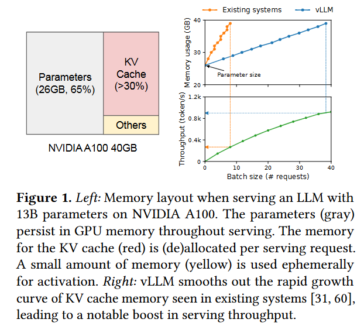

- Figure1는 보면 13B 크기의 LLM 서빙할 때 앤비디아 A100 GPU with 40GB RAM의 메모리 분포 상태를 보여준다.
- 나머지 30%는 요청시 동적으로 움직이는 정보를 저장한다. 이 값들은 KV Cache라고 하는 Transformer의 어텐션 매커니즘의 텐서를 저장한다.
- 모델 파라미터 가중치는 일정하고 Other와 같은 모델 실행 장치들은 아주 작기 때문에 KV Cache 쪽을 적절하게 관리하는게 최대 batch 크기를 결정해서 결국 속도를 결정한다.
- 정통적인 텐서와 다르게 모델이 단어를 생성할 때바다 KV cache는 커지거나 작아지는 특성을 가지고 있어 두 가지의 비효율 적인 측면이 존재한다.

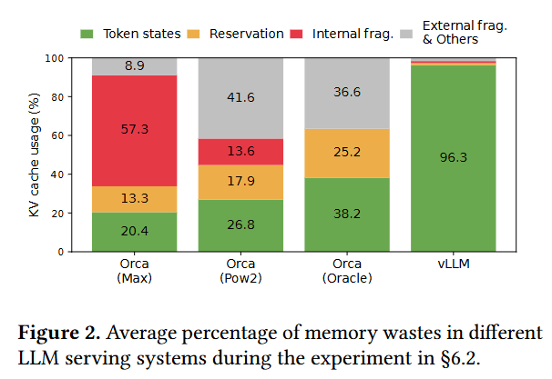

**내/외부 메모리 단편화 문제**

- 기존 프레임 워크는 kv cache를 저장하기 위해 연속적인 메모리 배치 청크를 요청의 최대 크기로 설정한다.  요청이 작으면 비효율 적이든 뭐든 일단 실행이 되고 크면 실행이 안되니깐
- 하지만 이러한 방식은 내부 단편화 문제를 야기한다.(internal memory fragmentation)
- 더욱히 미리 할당하는 것은 매우 비효율적이다. 요청 처리 중 사용하지 않는 메모리가 존재하더라도, 요청 처리 중 사용하지 안흔 메모리가 존재하더라도 다른 요청이 동시에 이를 사용하지 못한다.
- 또한 각 요청마다 할당되는 크기가 달라 외부 단편화 문제(external memory fragmentation)를 야기한다.
- Figure2를 보면 실제 KV 캐시 메모리 영역 중 사용되는 영역은 20.4 ~ 38.2%임을 확인할 수 있다.

**메모리 공유를 하지 못한다.**

- LLM은 Parallel sampling과 beamsearch와 같은 병렬 디코딩 알고리즘을 실행한다. 이러한 요청은 서로 중복되는 KV cache를 가지고 있다.
- 하지만 기존 시스템에선 분리되어 있는 연속적인 공간에서 KV를 메모리에 할당하기에 서로 공유가 불가능하다.
- 그레서 OS의 페이징 솔루션에서 영감을 받은 PaegAttention을 제안한다.
- 이 방식을 사용하므로써 서로 연속적이지 않은 공간에 할당되어 OS의 가상 메모리 기술과 같이 관리가 가능하다.
- 블록은 OS의 페이지로, 문장 생성에 사용하는 토큰은 바이트로, reuqest(요청)은 하나의 OS 프로세스로 생각한다.
- 이러한 PageAttention의 아이디를 사용하여 메모리 낭비가 거의 0에 가까우 vLLM을 제안한다.
- 이러한 방식은 Orca와 FasterTreanformer 와 같은 배치를 활용한 추론 성능 증가 솔루션 보다 뛰어나다.

## 2. Background

- Transformer-Based Large Language Models(트렌스 포머 기반 언어모델)에 대한 개념이 필요하다. 
- LLM Service & Autoregressive Generation의 문장 생성 개념에 대해 알아야 한다.
- Batching Techniques for LLMs에 대해 알아야한다. 이 부분은 KV cache에 대한 개념도 필요로 하고 [Continuous batch](obsidian://open?vault=PARA&file=Area_of_responsibility%2FML%26AI%2F%EC%A0%95%EB%B3%B4_Continuous%20Batch.textbundle%2FContinuous%20Batch)와 ORCA와 같은 개념도 포함

## 3.Memory Challenges in LLm Serving

- 메모리 자원을 사용함에 있어 제일 조절해야하는 문제는 잦은 Memory I/O 로 인한 memory bound 문제이다.
- 그래서 이러한 문제를 해결 할려면 아래와 같은 문제들을 극복해야 한다.
- **Large KV cache**
  - 배치사이즈와 모델의 lenght에 따라 kv의 크기는 말도안되게 커진다. 이러한 방식은 심각한 병목 현상을 초래한다.
- **Complex decoding algorithms**
  - beam 서치와 같은 병렬 디코딩 알고리즘으로 인해 KV 캐시는 공유가 잘 되어야 한다. 같은 KV 캐시를 쓰는 경우가 많으니
- **Scheduling for unknown input & output lengths.**
  - LLM 서비스의 입력과 출력은 계속 변한다. 그렇기에 길이가 더 길어지거나 할 때 기존 kv 캐시 혹은 메모리 들을 날리고 다시 구성도 해야한다.(?)

### 3.1 Memory Management in Existing Systems

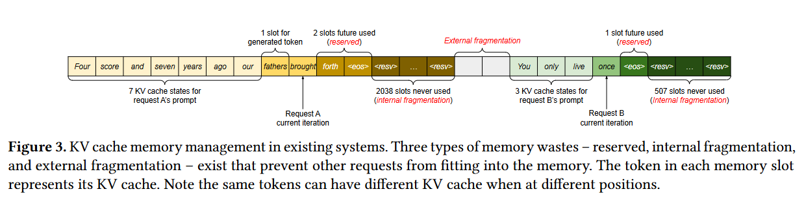

- 기존 LLM의 기존 텐서 들은 메모리에 저장된다. 이 대 예측할 수 없는 입력과 출력 문장의 길이로 인해 항상 최대 Sequence를 유지한다.
- Fig 3에서 보이듯 reserved slots for future token, internal fragmentation(내부 단편화), external fragmentation(외부 단편화)와 같은 문제가 존재한다.
- reserved slots for future token로 인한 사전할당된 청크들은 중간에 공유가 안된다.
- 그렇기에 새로운 Method를 소개한다.

## 4.Method

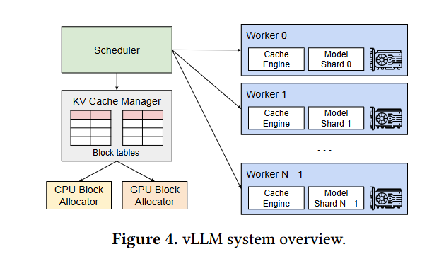

- 위 그림은 vLLM의 아키텍쳐 그림이다.
- vLLM은 centralized scheduler(중앙 집중형 스케쥴러)를 채택하여 분산 작업을 다중 GPU에게 명령한다.
- KV Cache Manager를 사용하여 PageAttention으로 KV Cache를 관리하고 스케줄러의 명령에 따라 GPU의 물리적 메모리를 관리한다.

### 4.1. PageAttention

> **본 논문에서 예시로 사용하는 Prompt 내용은 "Four score and seven years ago our" 이다.**

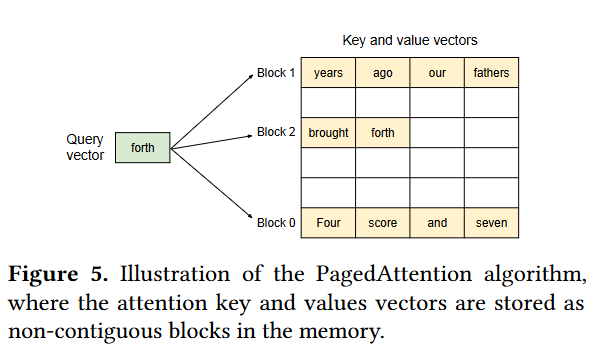

- PageAttention은 OS의 페이징 알고리즘에 영감을 받은 아이디어다.
- OS는 메모리를 Page 단위로 나누어 저장하는데, PageAttention은 이와 비슷하게 각 sequence의 KV 캐시를 KV 블록이라는 page단위 비슷한걸로 나눈다.
-  그렇게 나눈 비연속적인 메모리 공간인 각 블록에는 고정된 수(임의의 수)의 토큰에 해당하는 KV 값이 들어간다.

### 4.2 KV Cache Manager

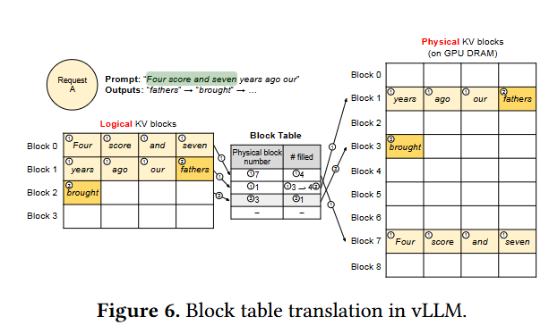

- vLLM의 memory manager는 OS의 가상 메모리(virtual memory)과 같다고 생각하면 된다.
- OS는 페이지 알고리즘은 메모리를 일정한 크기로 딱 나누어 떨어지게 나누고, 가상 page(Logical page)와 물리적 매모리(physical memroy)의 page를 각 페이지의 기준으로 매핑한다. 여기서 당연히 각 page의 size는 
- Logical page들은 연속적이지만 Physical page는 비연속적으로 배치되면서, 서로 각 페이지들은 대응되고 유저 프로그램이 연속된 메모리에 접근하는 것처럼 보여준다.
- 또한 물리 메모리가 미리 revseve될 필요가 없다. 그래서 적절한 동적배치가 가능해 진다.
- vLLM 또한 이러한 아이다어를 사용한다.
- LLM 서빙에서의 KV cache를 관리한다. 이러한 kv를  Logical KV Block으로 관리되며, 왼쪽에서 오른쪽으로 채워진다.
- KV block manager은 block table을 관리하여 각 요청의 가상 블록과 물리 블록을 매핑하고 관리한다.
- 이를 통해 vLLM은 메모리 낭비 없이 KV cache memory의 크기가 동적으로 변경괴는 것을 허용한다.
- BLcok Table을 매핑하는 방식은 아마 OS의 주소 공간 할당 방식과 같은걸로 보인다.

### 4.3 Decoding with PagedAttention and vLLM

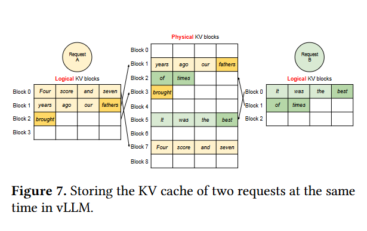

- **그림 6**을 보면 OS의 가사 메모리처럼, vLLM은 max_len에 대한 메모리를 미리 선언안 해도된다.
- 대신 필요한 블록만 예약을 해서 받는다. 7개의 토큰에 각 블록의 길이가 4이니, 2개의 블록 0과1에 순서대로 넣고 Block Table의 주소 할당 체계에 맞게 물리적 메모리에도 7,1번에 넣는다.
- 이 prefill 단계에서 vLLM은 Prompt와 첫 번째 출력 토큰의 kV 캐시를 기존 self-attention 알고리즘을 통해 생성한다. 
- 첫 번째 autoregressive decoding은 물리 블록 7과 1에서 PagedAttention 알고리즘을 사용하여 새로운 토큰을 생성한다.
-  마지막 논리 블록에 남은 슬롯이 하나 있으므로, 새로 생성된 KV 캐시는 거기에 저장되고 블록 테이블의 filled 기록이 업데이트 된다.
- 두 번째 autoregressive decoding step에선 그 블록이 가득 찾기에 새롭게 생성된 kv cache를 새로운 블록을 생성하여 거기에 넣는다. 
- 즉 vLLM은 토큰과 그에 따른 kv cache가 생성됨에 따라 논리 블록을 사용하여 물리 블록에 동적으로 부여한다.
- Fig7은 두 시퀀스에 대한 vLLM의 메모리 관리의 예시를 보여준다.
- 두 스퀀스의 논리 블록들은 물리블록에서 서로 연속적이지 않기에, 물리 블록의 공간은 두 시퀀스 모두에 의해 효과적으로 활용된다.

### 4.4 Application to Other Decoding Scenarios

- 4.3의 시나리오들은 가장 기본적인 하나의 prompt가 들어오면 여러 답을 생성하지 않고 그저 greedy한 방식으로 답변을 생성할 때의 PageAttention에 대한 시나리오 예시이다.
- 하지만 실제 LLM 모델의 디코딩 방식은 절대 greedy하지 않고 Parallel sampling(사용자에게 답변 여러개 주는 방식), Beamsearch와 같은 방식이 많이 사용된다. 이러한 방식은 하나의 prompt가 들어와도 여러 디코딩 문장을 생성해야 해서  kb cache 관리양과 전략이 더 어렵ㄴ다.

**Parallel sampling.**

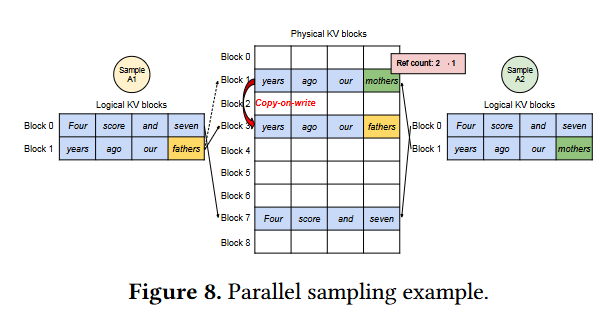

- Parallel sampling을 사용한 디코딩 방식의 Pageattention 방식이다.
- Parallel sampling은 한 요청(혹은 Prompt?)에 같은 input prompt를 공유하면서 여러가지 답변을 내놓는 방식이다.
- 위 그림은 Parallel sampling를 이용한 두 개의 출력을 예시로 들고있다.
- prompt는 결국 한개 이기에 input 단게에선 단 하나의 prompt에 대한 Logical kv cache 블록을 두개 만든다.
- 위 그림에서 두 sequence의 logical block들은 같은 physical block들로 매핑되어 있다.
- 각 physical block에 reference count를 도입하여 한 physical block에 몇 개의 logical block이 매핑되어 있는지 표시한다.
- 이제 생성 phase에 들어가는데 두 squence가 생성하는 샘플이 다르다면 서로 다른 물리적 저장공간이 필요해진다.
- 이때 vLLM은 복사/붙혀넣기(copy on write)를 사용하는데 OS의 fork 방식과 유사하다.
- 복사하는 부분은 생성이 시작되는 블록이다. 복사 후 Ref count를 1로 낮춘다.  Ref count가 2 이상이면 그 숫자 만큼 복사한다.
- 이렇게 생성된 물리 메모리에 생성된 토큰에 대한 KV 값을 저장하면서 서로 다른 output에 대한 KV 값을 저장하고 사용한다.

**BeamSearch**

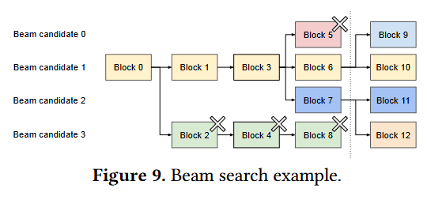

- BeanSearch는 가장 대중적인 디코딩 방식이다. 멀티 디코딩의 시초와 같은 방식이며 높은 퀄리티의 답변을 생성한다.
- Beamsearch는 Parallel sampling과 달리 아웃풋 토큰도 공유하는 부분이 많다. 공유하는 부분은 디코딩 프로세스가 진행됨에 따라 동적으로 변한다.
- 그래서 OS의 compound fork와 유사한 형식으로 kv cache를 저장한다.
- 그림과 같이 문장을 생성함에 있어 BeamSearch는 그 순간의 단어의 확률을 보지 않고 여러 단어를 뽑아서 문장을 만들고 개중 top4개(논문이 top4임)만 남기면서 계속 문장을 만든다.
- 여기서 문장을 생성하면 계속 이전 Blcok을 공유하는 블록들이 늘어난다. 그렇기에 기존 방식은 kv cache copy가 필연적으로 많다.
- 위 그림의 **점선 이후의 **Candidate3은 Candidate2의 모든 Block을 공유한다.
- 빈번한 복사는 메모리 오버헤드를 유발시키는데 vLLM에서는 대부분의 다른 Beam Candidate가 공유된다.
- 새로운 토큰이 이전에 공유된 블록내에 존재할 때만 복사하면된다. 왜냐하면 그 앞의 내용은 어차피 같은거니 그냥 들고와서 쓰는거고 다른 토큰이 생성되는 블록은 새로운 분기가 되고 다른 내용을 가진 블록이 될꺼니 이거만 복사한다.

**Shared Prefix**

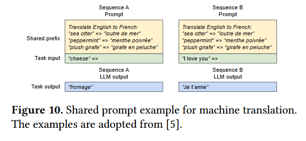

- LLM의 정확도를 향상 시키기 위해서 Prompt Eng가 등장했고 그림 10처럼 예시를 제시하면서 모델한데 물어본다.
- prompt는 보통 주제에 대해서 넓게 커버칠 수 있는 내용을 쓴다. 즉 같은 내용이 많을 것이다. 
- 그래서 그 중복되는 내용을 kv cache에 저장하고, 물리적 메모리에 저장해서, 질문이 들어오면 공통된 prompt 부분은  prefix 작업 시꺼내서 사용한다.
- 이러면 마지막 바뀌는 질문에 대해서만 계산하면된다.

**Mixed decoding methods**

- vLLM은 서로 다른 디코딩 선호도를 가진 요청들을 동시에 처리할 수 있도록 해준다.
- vLLM은 논리 블록을 물리 블록으로 변환하는 공통 매핑 레이어를 통해 서로 다른 시퀀스 간의 복잡한 메모리 공유를 숨긴다.
- LLM과 그 실행 커널은 각 시퀀스에 대한 물리 블록 ID 목록만을 볼 수 있으며, 시퀀스 간의 공유 패턴을 처리할 필요가 없다.
-  기존 시스템과 비교했을 때, 이러한 접근 방식은 서로 다른 샘플링 요구를 가진 요청들을 배칭할 기회를 넓혀주어 시스템의 전체 처리량을 증가시킨다.

### 4.5 Scheduling and Preemption

- 요청 트래픽이 과도하여 메모리 총량을 넘었을 때의 대응방법으로 vLLM은 FCFS(first-come-first-serve) 스케쥴링을 채택하였다.
- LLM은 입력의 길이와 출력의 길이가 항상 다르기에 kv cache의 저장양이 메모리의 용량보다 큰 경우가 종종 발생한다.
- OS의 가상 메모리 페이징 시스템과 마찬가지로 여기도 항상 모든 요청이 메모리 크기만큼만 들어오리란 경우는 없다.
- 그렇기에 vLLM도 두 가지의 고전적인 문제에 직면한다.
  - 어떤 블록을 evict 시킬것인가?(Which blocks should it evict?)
  - evict 시킨게 다시 필요할땐 어떻게 불러올건가(How to recoverevicted blocks if needed again?)
- 일반적으로 evict 정책은 휴리스틱을 사용하여 가장 나중에 접근될 만한 블록을 찾아 퇴커시킬 블록을 선택한다.
- vLLM은 시퀀스의 모든 블록이 함께 접근된다. evict할거면 모든 블록을 evict 아니면 모든 블록 전부 생존한다.
- 그래서 all-or-nothing eviction 정책을 사용한다.
- Beamsarch 처럼 한 요청에 여러 시퀀스가 있다면, Sequence group으로서 gang schedule을 사용한다.
- 위에 말을 조금 풀어서 설명하면, 저~ 위세 봤듯이 빔서치는 하나의 요청이 들어오면 여러가지 문장을 만든다. 즉 시퀀스가 많다. 이걸 따로 보지 않고 하나로 본다는거다.
- 하나의 그룹으로 묶인 시퀸스들은 서로간의 잠재적인 메모리 공유(빔서치 같은거) 때문에 항상 함께 선점(Preemption, 메모리로 올라오는거) 되거나 다시 스케쥴링(rescheduled ) 된다.

**Swapping**

- 이 방법은 OS의 가상 메모리에서도 사용하는 가장 전통적인 방법으로 evicted 페이지를 복사해서 디스크의 빈공간에 swap하는 거다.
- 이 방법에 영감을 받아. evicted blocks을 CPU 메모리에 복사한다.
- 그림 4를 다시보면 CPU Block Allocator와 GPU Block Allocator가 존재하는게 보일것 이다.
- vLLM이 새로운 토큰을 생성했는데 만약 물리적 Block이 모두 소진된 상태라면, 일부 시퀀스를 Preemption(선점 혹은 선택 이라 해석해서 알맞게 쓰셈)하여 해당 시퀀스의 KV cache를 CPU RAM에 Swap한다.
- 일단 preemption 시퀀스(메모리 오버로 CPU간거)를 하나  해당 블록을 evict하면, vLLM은 모든 preemption된 시퀀스(지금 GPU에 있는거와 CPU로 간거 전부)가 일단 무조건 완료될 때 까지 새로운 요청을 받지 않는다.(이게 일단 CPU에 나머지 시퀀스 정보가 있으니, 일단 이 CPU에 있는거 까지 절대 다른거 받지 마라)
- 이 Request가 완료되면 해당 블록은 메모리에서 해체되고(?) Preemption 시퀀스의 블록(CPU에 있는 나머지 요청)이 다시 불러와져 해당 시퀀스의 처리를 다시 진행한다.

**Recomputation**

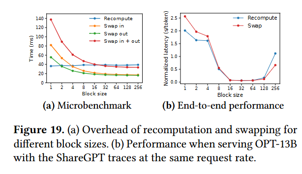

- 이건 Preempted 된 시퀀스를 다시 rescheduled하는 내용인데, 지금 보니깐 이게 빔서치 처럼 공유되는 블록이 있을 때 kV cache를 어떻게 다시 불러오냐 혹은 처리하는 지에 대한 내용 같다.
- 당연히 재계산 latency는 기존의 latency보다 짧다, 이전 decoding 단계에서 생성된 토큰들은 전보 원본 유저 prompt에 붙여 모든 position의 KV 캐시를 단 한번의 phase iteration에서 생성할 수 있기 때문이다.
- Swap과 Recomputation의 성능은 CPU RAM과 GPU 메모리 사이의 bandwidth(대역폭)와 컴퓨팅 파워 즉 성능에 따라 차이가 달라지기에  위의 표를 보고 잘 판단하고 사용했다.

### 4.6 Distributed Excution

- LLM은 너무 커서 대부분의 상황에서 파라미터 사이즈가 GPU 용량을 초과한다.
- 그래서 분산된 GPU(이게 아마 여러개의 GPU란 뜻인듯)에 요청을 뿌리고 분산 실행할 필요가 있다.
- vLLM은 이러한 작업을 실행하기 적절하다.  vLLM은 가장 널리 사용되는  *Megatron-LM* 스타일의 트렌스 포머 텐서 병렬화 전략을 지원한다.
- 이 전략은 SPMD(Single Program Multiple Data) 실행전략을 준수한다.
- 아마 내가 이해한대로 적자면 각 선형층들은 블록단위로 나뉘고, 블록단위로 행렬곱이 수행된다, 각각의 GPU들은 각각의 블록의 중간 계산 결과를 a--recude 연샅을 통해 지속적으로 서로 동기화(합치다?)한다.
- 구체적으로 어텐션 연산자는 어텐션 헤드를 기준으로 분할되며(그 Q 기준인듯, head가 q니깐), 각 SPMD 프로세스는 멀티 헤드 어텐션에서 각각 몇몇개의 Q를 담당하고 subset들을 처리 한다.
- 모델의 병렬 실행을 사용하더라도 입력 토큰 set은 같기에 각 샤드는 결국 같은 KV Cache가 필요한 상황이 자주 있다.
- 그래서 각 GPU Worker는 그림4와 같이 하나의 KV cache Manager를 공유한다. 각 GPU Worker는 스케쥴러로부터 받은 물리 블록의 매핑값을 공유하면서 KV cache를 받는다.
- 이러한 방식 때문에 GPU worker는 동일한 물리 블록 IDs를 가지더라도, 각 GPU Worker는 해당 Worker에 할당 된 Attention Head에 대한 KV cache를 저장한다.
- 진행 순서는 아래와 같다.
  - 스케쥴러는 먼저 Batch안의 요청의 입력 토큰 ID와 각 요청의 블록 테이블을 준비한다.
  - 스케쥴러는 명령을 GPU Woker에게 뿌린다(broadcasts).
  - GPU Woker들은 input  Token IDs(이게 메모리에 주소 인듯)를 받아 모델 실행
  - Attention Layer에선 스케쥴러 메세지에 있는 해당 블록 테이블의 KV cache 읽는다.
  - GPU worker들은 all-reduce 통신을 통해 스케쥴러의 조정 없이 중간 결과를 동기화 시킨다.
  - 마지막으로 GPu worer 들은 이번 iteration의 Sample Token을 다시 스케쥴러에 전송
- 요약하면 Decoding iteration 시작마다 GPU worker는 스케줄러로부터 block table을 받기 때문에 따로 메모리 관리를 synchronize할 필요가 없다.

## 5. Implementation

- LLama 혹은 GPT와 같은 인기 모델 사용
- CUDA 사용
- 분산 작업에 NCCL 

### 5.1 Kernel-level Optimization

- PaegAttention이 기존 방식과 다르기에, 최적화한 GPU 커널을 개발
  - Fused reshape and block write
  - Fusing block read and attention
  -  Fused block copy

### 5.2 Supporting Various Decoding Algorithms

- vLLM은 세 가지 주요 메서드인 fork, append, 그리고 free를 사용하여 다양한 디코딩 알고리즘을 구현
  - fork: 기존 시퀀스 복사
  - append: 시퀀스에 새로은 토큰을 추가
  - free: 시퀀스 삭제
- 아마 위의 설명처럼 그 메모리에 복사하는거 그거인듯, 이거 내용이 물리 메모리 관련해서 이렇게 해서 워커한테 정보를 주는 방식을 다르게 해서 디코딩을 한다 그런듯
- 저자들은 이러한 전략들을 사용하여 향후 다른 decoing 알고리즘에도 메서드를 조합하여 지원될 수 있을 것이라 믿는다.

## 6. Evaluation

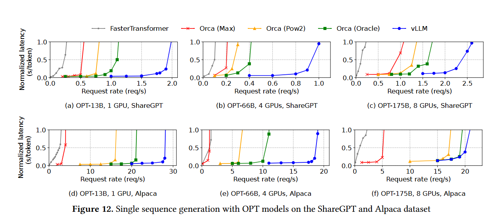

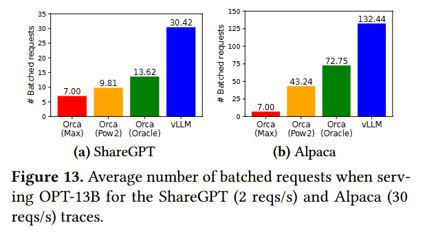

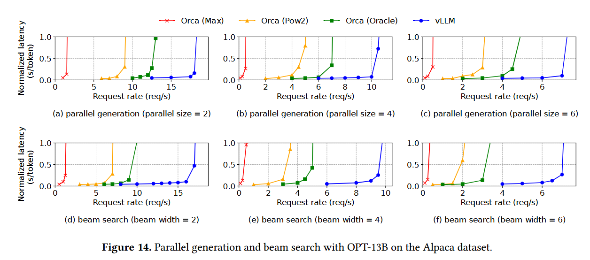

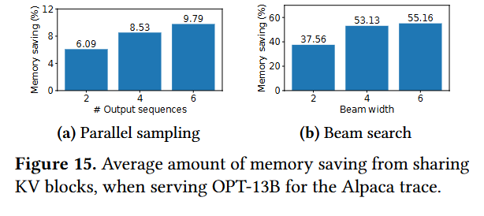

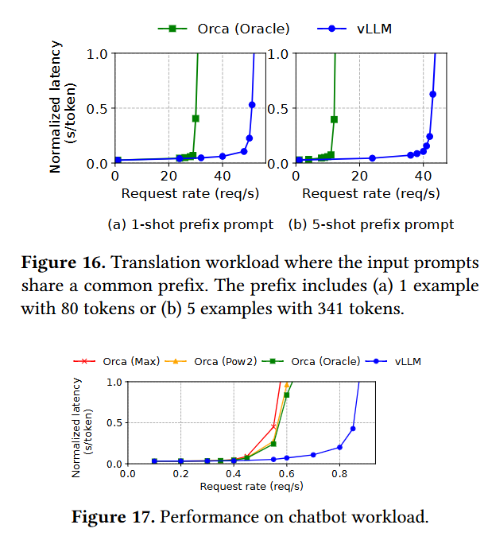

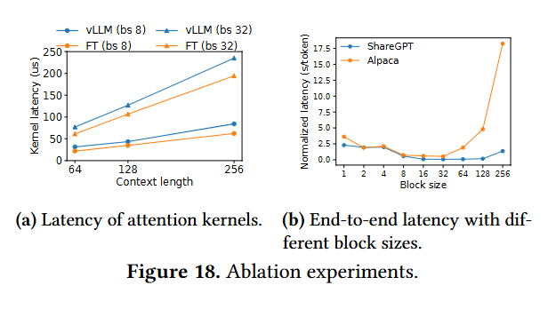

- 각종 결과들은 위와 같다.
- 기존 ORCA와 같은 방식 보다 vLLM이 비슷한 Normalized latency에서 Request rate가 확연히 증가한 것을 알 수 있다.
- Parallel sampling 및 Beam search에서 메모리를 아낄 수 있었다
- 자세한건 논문 참조

## 7. Ablation Studies

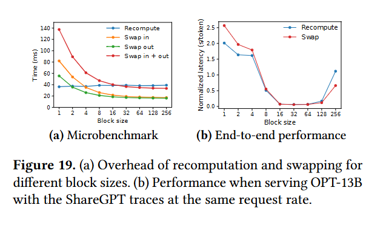

- **Kernel Microbenchmark**: PagedAttention은 주의 연산에서 오버헤드를 가짐,하지만 전체 성능에서는 FasterTransformer보다 뛰어나다.
- **Impact of Block Size**: 블록 크기 16은 vLLM에서 GPU 활용 효율과 내부 단편화를 모두 고려해 최적의 성능을 제공
- **Comparing Recomputation and Swapping**: vLLM에서 작은 블록 크기에서는 재계산이 더 효율적이고, 큰 블록 크기에서는 스왑이 더 효율적이며, 중간 크기에서는 두 방법의 성능이 비슷함

## 8. Discussion

- **길이가 정해져 있지 않은 GPU Workload에는 효과적인 방법이지만 DNN training과 같은 tensor shape이 미리 정해진 작업에는 비효율적이다. 그냥 미리 메모리 할당 작업을 하는게 낫다.**
- 그래도 다른 memory bound 작업에는 많이 사용될 것이다. 실제로 사용되는 모습에 우리는 기쁘다.
- vLLM은 애플리케이션 특유의 의미를 활용하여 가상 메모리와 페이징 개념을 재해석하고 확장한다.
- 이를 통해 요청 처리 시 모든 토큰 상태를 GPU에 저장하거나 블록 재계산을 통한 복구, GPU 커널 결합으로 메모리 간접 비용을 줄이는 등 최적화를 수행한다.

