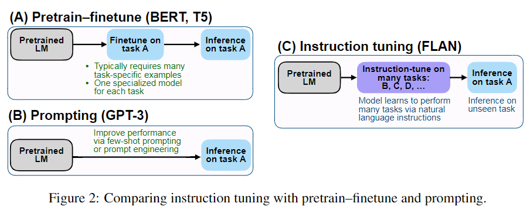
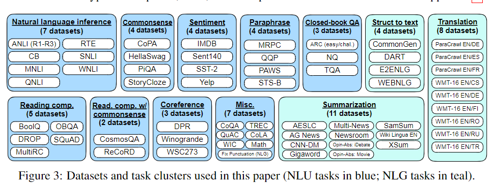
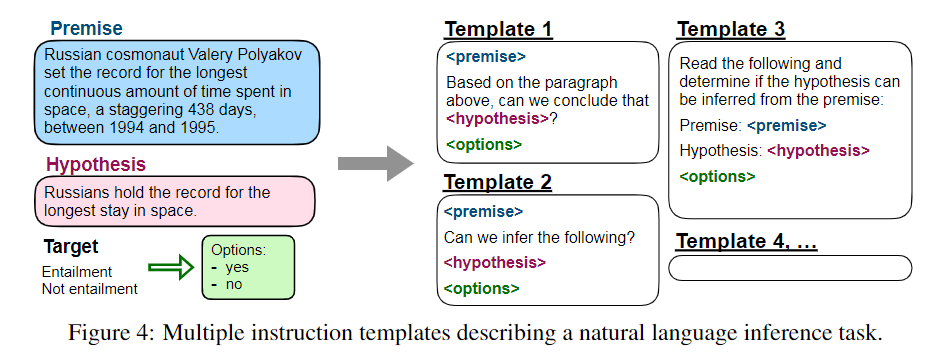
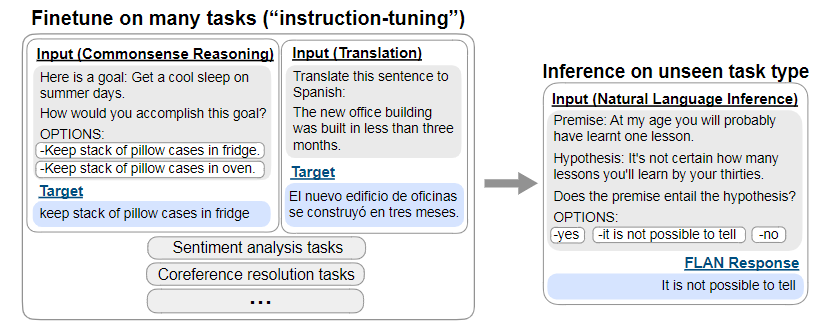
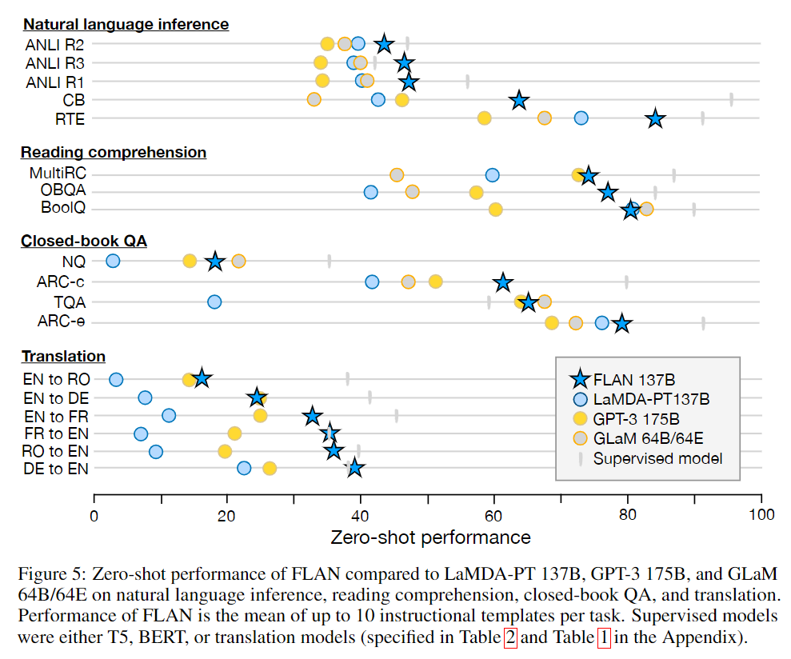
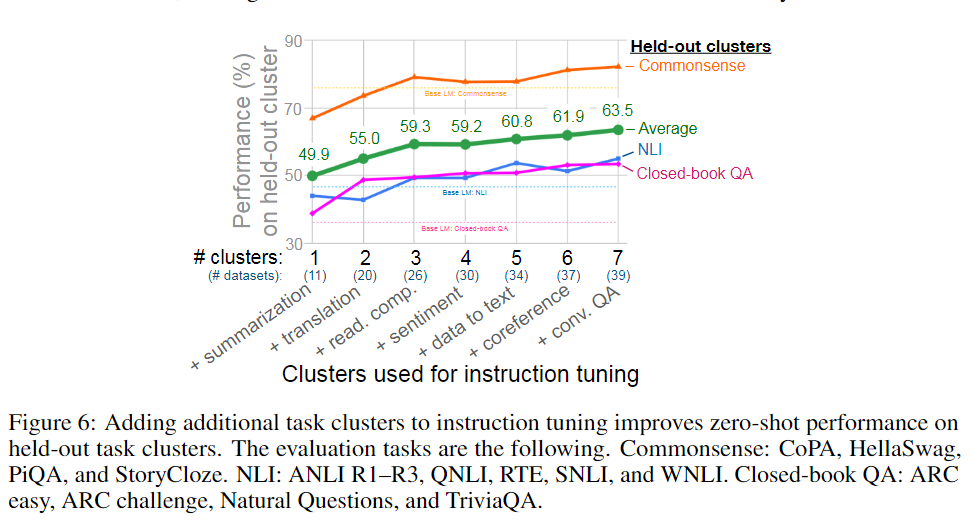
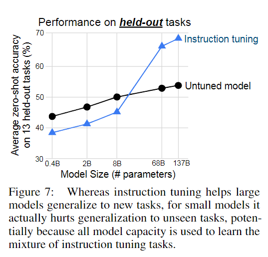
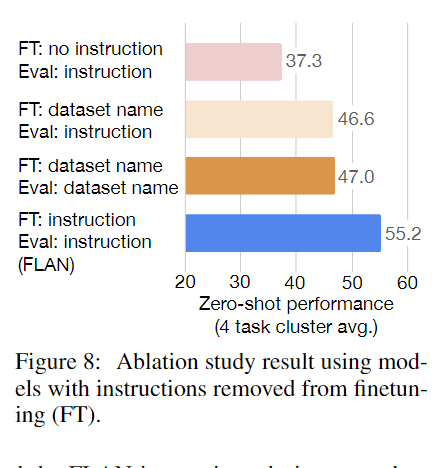
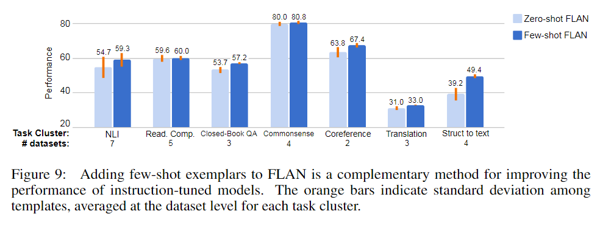
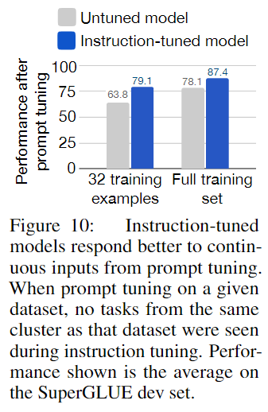

#LLM #Prompt #파인튜닝 

> 논문 링크: https://arxiv.org/abs/2109.01652

## 1. Introduction



- 이 논문은 LM(language Model)의 zero-shot learning 능력을 개선하기 위해 작성 되었다.

- GPt-3는 few-shot에서의 성능은 뛰어나다 하지만 zero-shot성능은 떨어진다.(gpt-4가 나온 이 시점은 아니고 저 시점에서 말이다.)

- 이 논문은 few-shot 성능을 강화하는 방식 대신 instruction tuning을 통해 제로샷 성능을 개선하는 방법을 알아본다.

- instruction tuning을 통해 학습한 FLAN이란 모델은 Zero-shot 방식에 GPT-3보다 강하다.

- NLP Task는 "이 영화의 리뷰는 긍정적인가, 부정적인가" 또는 "how are you 를 한국어로 번역해줘"와 같은 형태이고 이를 instruction tuning에 활용한다.

  >**Instruction tuning의 예시**
  >
  >출처:[[논문 리뷰] Finetuned Language Models Are Zero-Shot Learners](https://gbdai.tistory.com/70)
  >
  >> Input : What's your name?
  >> Output : wie heißen sie?
  >
  >위 예시는 영어-독일어 번역 task이다. 기존의 fine-tuning 방법론은 input sequence를 입력하고 output을 산출해 냈지만 instruction으로 변환하면 아래와 같이 변경된다.
  >
  >> Input : translate 'What's your name?' into German
  >> Output : wie heißen sie?
  >
  >예시를 보면 'What's your name?'을 독일어로 번역하라 라는 지시가 추가된 것을 확인할 수 있다.

> 논문 깃허브 주소
>
> https://github.com/google-research/flan

- 즉 instruction tuning은 지시문을 사용한 prompt를 finetuning을 시키면 학습하지 않은 작업(unseen task)이 들어와도 promp에instruction 방식을 제시하면 fintuning에 instruction을 따르는 방식을 학습했기에 unseen task의 지시사항에도 잘 추론할 수 있을 것이다.

## 2. Flan: Instruchtion Tuning Improves Zero-Shot Learning

- instruction tuning의 목적은 지침을 통해 작업을 감독하여 NLP명령에 대한 응답 능력을 향상 시키는것이다.
- unseen tasks를 평가하기 위해 데이터 세트를 작업 유형별로 나누어 작업한다.

### 2.1 Taks & Templates





- Figure 3과 같이 각각의 데이터 셋은 주어진 같은 작업의 타입에 따라12개의 Task Cluster 중 하나에 넣는다.

- 그러고 원래의 작업을 위한 10개의 template을 수동으로 구성하고 추가로 "turned the task around"를 위한 3개의 template을 만든다. 

  > e.g: 감정 분류는 영화 리뷰를 생성하는 templates가 포함되어 있어야 한다.
  >
  > 아마 이 말이 영화 리뷰에 관련된 질문을 생성을 할 때 이 영화의 감정을 분류하라는 temple만 만들지 말고 '영화 리뷰' 데이터를 생성하는 templates도 만들라는 이야기 같음
  >
  > 원문: (e.g., for sentiment classification we include templates asking to generate a movie review)

- Datasets을사전 학삽된 언어 모델에 맞춰  Instruction tune 하고 Figure 4와 같이 각 데이터 세트의 예제는 해당 데이터 세트에 대해 무작위로  선택된 template의 형식에 맞게 들어간다. 이게 instruction template이다.
- Instruction Template는 Figure 4와 같이 만든다.
- Premise와 Hypothesis을 만들고 Target을 두 개(Entailment, Not Entailment)를 Instruction Template에 제시한다.
- Figure 4를 보면  Premise(사실, 실제 있었던 일에 대한 정보, 명제 같은 걸로 생각), Hypothesis(premise를 기반으로 모델이 답해야 하는 내용, 질문이 될 수 있지만 여기선 Target이 가설이 사실(Entailment)인지 거짓(Not Entailment)인지 판단하는 문제 이기에 가설임) 두 개 만 주어지고 yes인지 no의 target만 주어진다. 하지만 instruction templelate는 이러한 데이터를 가지고 지시문을 넣어준다.

### 2.2 Evaluation Splits

- FLAN이 instruction tuning에서  tasks not seen을 어떻게 수행하는지에 관심이 있으므로 unseen task로 정의한 것이 튜닝된 모델에 잘 작동하는지가 중요하다.
- 만약 c개의 evalulation을 진행하면, 각각의 c개의 task를 제외하고 instruction tuning을 진행한 c개의 model로 evaluation을 진행하는 것이다. 제외한 task는 unsenn task로 이 task의 성능이 잘 나와야 이 논문이 제시하는 방법이 유의미 할 것이다.

### 2.3 Classification with Options

- 결과는 분류 문제(either one of several classes)이거나 텍스트 생성(free text)이다.

- FlAN은 decoder-only language model의 instruction-tuned를 진행한 버전이다. 그래서 생성 작업을 위한 추가 튜닝 작업이 필요 없다.

- 분류문제의 경우 이전 작업에서 *Rank classification* 접근법을 사용했다. 하지만 이 방법은 올바르지 않다.

  > 만약 '예'에 대응되는 많은 답변이 존재하면 '예'가 출력될 확률이 줄어들 수 있다.
  >
  > e.g.,a large number of alternative ways of saying “yes” may lower the probability mass assigned to “yes”

- 따라서 우리는 마지막에 *options*을 추가한다. options에는 출력 클래스 목록을 입력시키고 **FIgure 1**과 같은 옵션은 모델이 분류문제에 대한 응답을 어떠한 식으로 답변을 해야하는지 알 수 있다.



### 2.4 Training Details

- 논문에서 사용한 모델을 **LaMDA-PT** 137B의 GPT와 같은 디코더 언어모델이다. 

- 웹에서 대화데이터와 문서 wikipidia 에서 pretrain되었으며 SentencePiece를 사용하여 BPE 토큰으로 토큰화

- **instruction tuning procedure**, FLan은 LaMDA-PT에 instruction tunning된 모델이다.

- pipline은 일단 모든 데이터 셋을 섞고 각각 데이터셋에서 랜덤하게 샘플을 뽑은 데이터를 tuning에 사용한다.

- 이때 데이터의 크기가 서로 다를 수 있기에 데이터셋에서 추출되는 training example의 개수를 30K로 제한

- 그 후 T5에서 제안된 *examples-proportional mixing scheme*을 사용한다.

  > examples-proportional mixing scheme
  >
  > examples-proportional mixing은 train시에 학습되는 dataset의 크기가 다를 때 만약 random 추출을 할시 단순하게 데이터 크기에 비례하여 sampling을 하면 학습 데이터에 대한 불균형이 일어 날 것 이고 이러면 sample이 적게 추출된 dataset에 대한 학습은 덜되거나 size가 큰 dataset에 대한 많은 학습량이 부여될 가능성이 매우 높다. 
  >
  > 머신러닝 문제에 사용하는 분류 문제 데이터 불균형이라고 생각하면 될 거 같다. 데이터 불균형은 target데이터가 불균형 하면 어느 한쪽이 학습이 덜된다. 라는게 전제 이지만 examples-proportional mixing scheme는 학습시 다양한 dataset을 가지고 학습을 진행 할 때 이 dataset의 크기가 다르면 학습에 불균형이 일어난다. 라고 말 하고 있다.
  >
  > 그래서 이러한 문제를 해결하기 위해 dataset size에 limit을 걸어 놓는 방식을 *examples-proportional mixing*이라고 한다. 수행해야 할 여려 task의 개수를 N이라 하고 각가의 task에 대응되는 dataset을 en,n∈{1,…,N}𝑒𝑛,𝑛∈{1,…,𝑁}, 여러 task들 중 임의의 task를 뽑았을 때 해당 task의 index를 m이라고 한다면  임의의 m𝑚번째 task의 dataset로부터 sampling 할 확률은 rm𝑟𝑚이라고 하며, rm𝑟𝑚은 다음과 같이 정해진다.
  >
  > 
  >
  > 예시와 함께 살펴보자. 
  >
  > 
  >
  > 
  >
  > 
  >
  > 다음과 같은 크기의 dataset들이 존재한다고 가정해 보자, 이때 en𝑒𝑛의 경우 막대그래프의 높이이며, 이는 오른쪽에 명시되어 있다.
  >
  > 
  >
  > 
  >
  > 
  >
  > 이에 대한 rn𝑟𝑛은 다음과 같이 구하게 된다. 이렇게 구하게 된 rn𝑟𝑛는 전체 dataset에서 rn𝑟𝑛 확률만큼 해당 dataset에서 data를 추출한다는 의미이다. 즉, 다음과 같이 training dataset이 sampling 되게 된다.
  >
  > 
  >
  > 
  >
  > 
  >
  > 결론적으로는, **dataset size limit K𝐾를 설정하고, 해당 K𝐾보다 큰 dataset의 경우 K𝐾개만큼만 sampling 하고, 작은 dataset은 그대로 sampling 하는 방법론인 것이다.**
  >
  > > 출처: [[논문 리뷰] Exploring the Limits of Transfer Learning with a Unified Text-to-Text Transformer(t5논문)](https://gbdai.tistory.com/62)

-  Batch size는 8,192 토큰,  optimizer는 adafactor 를 사용, lr은 0.0005를 주었다.

- 입력층은 두개로 각각 1,024과 256이다.

- Final checkpoint는 30k step 이다.

- 학습 스펙은 128 core TPUv3를 60시간 동안 학습 시켰다.

## 3. Result

- FLAN의 평가는 모든 template 의 성능의 평균을 가지고 도출한다. 또한 수동 prompt?(menual prompt)에 사용하기 위해서 각각의 dataset에 대한 최고의 퍼포먼스를 보여준 template도 추출 한다.
- LaMDA-PT에서 비슷한 프롬포트를 사용하여 zero-shot 과 few-shot에 대한 결과를 GPT-3와 비교한다. 여기 LaMDA-PT는 아직 instruction tuning을 하지 않은 상태이고 이 두 비교 결과를 사용하여 instruction이 얼마나 도움을 줬는지 기준점을 새워 판단 할 것이다.
- FLAN은 25개의 dataset중에서 20개가 zero-shot 기준 gpt-3를 능가했고, 10개의 dataset은 few-shot에서도 GPT-3보다 능가하는 성능을 보였다.
-  FLAN은 19개의 dataset중에서 13개가 zero-shot 기준 GLaM를 능가했고, 19중 11개의 dataset은 few-shot에서도 GLaM보다 능가하는 성능을 보였다.
- 우리는 instruction tuning이 NLI, QA, translation, struct-to-text에 매우 효과적인걸 관찰가능 했다.
- 하지만  coreference resolution, commonsense reasoning에서 성능이 다른 공식 모델보다 떨어지는걸 확인 가능했다.  



- 위 그림은 FLAN의 각각의 문제에 맞는 zreo-shot 퍼포먼스중 가장 높은 평균 성능이 나온 10개의 template를 다른 모델과 비교 기록한 그림이며 Supersised model은 T5 혹은 BERT와 같은 인코더가 사용되는 모델이다.

- **Natural language inference (NLI).** FLAN이 전제에 따라 가설이 참인지 아닌지 판단하는 부분에선 좋은 성능을 보인다. FLAN은 `<premise> mean that <hypothesis>?`라는 자연스러운 질문으로 추론을 유도하여 보다 높은 성능을 보였다.

- **Reading comprehension.** MultiRC, OBQA dataset에서 좋은 성능을 보였고, BoolQ dataset은 이미 기존 모델인 LaMDA-PT가 좋은 성능을 내어 FLAN도 성능이 좋다.

- **Closed-book QA** 답변이 포함된 문서를 참조하지 않은 QA 질문 dataset에 대해선 4개의 dataset이 gpt-3보다 성능이 좋다.

- **Translation** fewshot gpte-3보단 성능이 떨어지지만 zero-shot gpt 보단 성능이 좋다. FLAN은 대부분의 학습데이터가 영어고 토크나이저도 영어 전용 토크나이저를 써서 그런지, 영어에서 다른 언어로 번역하는 작업은 gpt-3 보다 떨어진다. 

- **Additional tasks** 위의 결과로 클러스터 별로 보다 강력한 성능은 보여주지만 instruction tunning이 많은 Language model task의 성능을 올려주진 않는다.

  > 대표적으로 commonsense reasoning or coreference resolution tasks 와 같은 작업의 문장 완성에는 크게 성능을 올려주지 않는듯 
  >
  > e.g., commonsense reasoning or coreference resolution tasks formulated as sentence completions

## 4. Ablation Studies & Further Analysis

### 4.1 Number of instruction tuning cluster

- 저자가 이 논문에서 묻고 싶은거는 instruction tuning이 unseen taks에서 모델의 zero-shot성능이 얼마나 개선되냐 이다.
- 처음으로 제거하면서 탐구해 볼 주제는 number of clusters과 각 테스크에 instruction tuning을 사용했을 때 퍼포먼스에 얼마나 효과가 있었는지다.
- NLI, closed-book QA, 와 commonsense reasoning as evaluation clusters만 유지하고 나머지 7개의 클러스터는 instruction tuning에 사용한다.
- 유지된 클러스터 dataset의 성능 평균을 구하고 나머지 클러스터를 1개에서 7개까지 차차 추가하면서 instruction tuning을 하고 평균 성능을 구한다.



- 결과를 확인하니 zeroshot 접근방식의 instruction tuning은 매우 클러스터가 추가 될때 마다 긍정적인 결과를 보여준다.

### 4.2 Scaling LAWS

- zero 와 few shot은 language model에 대체로 효과가 있다.
- 그래서 이번에는 instruction tuning이 얼마나 model scale에 효과를 주는지 연구해 볼 것이다.



- instruction tuning은 논문 이전 작업에 대한 성능은 떨어진다.(아니 held-out task를 뭐라 번역해야함? 이게 맞음?)

- 그래프와 대조해서 봤을때 8b급 크기가 작은 모델에선 오히려 instruction tuning이 성능이 떨어진다.

- 그러나 모델의 크기가 커지면 커질스록 instruction tuning의 성능은 기하급수적으로 올라간다.

- 이러한 결과를 바탕으로 instruction tuning은 모델의 크기가 일정 크기가 넘을 때 사용되어야 한다.

  > Instruction tuning도 결국 새로운 정보를 model에 넣어주는 행위이다. Model의 크기가 작으면 이러한 tuning 과정으로 model의 capacity를 전부 소모하게 되고, 새로운 task에 대해서는 잘 대응하지 못한다. 반면 충분한 크기의 model은 tuning 과정을 거쳐도 남는 capacity가 존재하게 되고, 이러한 잔여 capacity로 새로운 task에 대한 generalize를 수행할 수 있게 되는 원리이다.
  >
  > 출처 [[논문 리뷰] Finetuned Language Models Are Zero-Shot Learners](https://gbdai.tistory.com/70)

### 4.3 Role of Instruction

- 마지막 ablation study는 그냥 multy-task- fine tuning이 좋을걸 수도 있다. 그래서 instruction을 빼고 진행 해 보겠다.
- 각각 3가지의  template를 작성한다.
  - 오직 input'i am humun' output '나는 사람이다'과 같은 형식
  - 데이터 입력에 [Trainslation: WMT14 to Korean]과 같은 데이터 세트에 대한 정보(여기서 데이터셋 이름인듯)을 input에 추가
  - 마지막은 input template를 "Please translate this sentence to Korean: ‘i am humun." 과 같이 논문 제시 방식
- 논문에서 제시된 FLAN 방식이 가장 좋은 것이 확인 가능



- 이 비교 실험을 통해서 unseen task의 zero-shot 성능은 단순한 fine-tuning이 아닌, instruction과 함께하는 fine-tuning이 중요하다는 것을 입증 했다.

### 4.4 Instruction with few-shot exemplars

- 우리는 instruction tuninig의 초점을 zero-shot에 둠, 그래서 few-shot도 확인 함
- 이걸 수식기호로 나타내면서 설명하는데 input이 x output y면 instruction에 대한 input은 instruct(x)로 나타내면 zero-shot이 instruct(x)만 이루어 져 있고 few-shot을 구성 할땐 (xi, yi)k i=1으로 구성한다.(수식 쓰는 법을 모르겠다 ㅋㅋ)
- 그리고 few-shot은 각 질문과 답변 사이에 ⊕와 같은 마크를 넣어 각각을 구분한다.
- 그렇게 나온 수식은 instruct(x1) ⊕ y1 ⊕ instruct(x2) ⊕ y2 ⊕ . . . ⊕ instruct(xk) ⊕ yk ⊕ instruct(x) 과같이 구분한다.마지막 instruction(x)는 최종적으로 우리가 받아볼 답변이다.
- 그니까 아래와 같은거임

```
질문: 1+2의 답변은?
답변: 3
질문: 1+3의 답변은?
답변: 4
질문: 1+5의 답변은?
답변: 6
질문: 1+6의 답변은?
답변: 7
질문: 1+4의 답변은?
```



- 대부분 Few-shot이 성능이 좋은걸 확인이 가능하다.
- 특히 답변이 길고 복잡한 struct-to-text, translation, closed-book QA과 같은 작업은 다른 작업보다 높은 성능적 차이를 보인다.
- 이러한 현상은 exemplar들이 model한테 이해를 높여 주는 현상이다.
- 추가로 모든 task cluster는 template 같의  standard deviation이 few-shot FLAN의 경우 더 낮다.

### 4.5 Instruction Tuning Facilitates Prompt Tuning

- FLAN이 NLP작업에 적합하다면 prepended continuous  variablesoptimized(input 텍스트 앞에 몇 개의 학습 가능한 변수를 사용한다는 뜻 같음)를 prompt tuning을 통해 soft prompt를 사용해서 추론을 해도 더 나은 성능을 달성해야한다.

  > - soft prompt = continuous prompt
  >   - 벡터 형태로 표현된 프롬프트

- instruction tuning을 하는 동안 prompt tuning을 할 때, 2.2 처럼 prompt tuning 작업 할 때의 ClutserT와 같은 작업 클러스터가 없는 Clutser T를 clutser split 하여 SuperGLUE task에 대한 prompt를 훈련시킨다.

- 우리의 prompt tuning은 **Parameter-efficient fine-tuning**(Lesteret al. 2021)을 따른다.

  > [Prompt Tuning]the Power of Scale for Parameter-Efficient Prompt Tuning
  >
  > 출처: [[논문리뷰] The Power of Scale for Parameter-Efficient Prompt](https://yumdata.tistory.com/408)
  >
  > - finetuning의 대안인 Prompt tuning은 모델 가중치를 동결하고 프롬프트의 매개변수를 업데이트 한다. 이 결과를 **soft prompt** 라고 한다.
  > - prompt의 내용을 토큰화 시킨다.
  > - 토큰 값은 임베딩 벡터로 변환 시킨다.
  > - 임베딩 벡터는 모델에 들어가기 전에 가중치로 곱해지고 이 가중치는 학습 대상(파라미터이다.)
  > - 이렇게 해서 나온 벡터는 임베딩 벡터의 의의인 실제의 어휘를 들고 있는 벡터와 일치하지 않게 된다. 하지만 이렇게 학습된 prompt는 보다 나은 결과 도출에 영향을 미친다.
  >
  > prompt tuning의 더 자세한 논문은 알아봐야할 듯




- instruction tuning을 진행한 모델인 FLAN과 기존 원형 모델인 LaMDA-PT 두 개를 기준으로 prompt tuning에 대한 결과를 비교한다.
- 기록은 체크포인트 마다 결과를 측정하였고 instruction model(FLAN)이 기존 모델 보다 최소 10%가 넘는 차이를 보여준다.
- prompt tuning을 사용한 fine-tuinig에도 prompt는 instruction tuning에 사용된 형식에 따라 작성하고 학습 시키는게 좋다는게 결론이다.

## Review

- 이 논문을 맨 처음 읽은 이유는 fine-tuning에 사용될 prompt의 작성 방식이 궁금하여 탐색을 하였다.
- 이 논문에선 instruction tuning이란 방법을 제시하면서 동시에 input으로 들어갈 prompt의 형식에 대해서 자세하게 기술이 되어 있어 도움이 되었다. 이 instruction tuning은 prompt를 활용한 finetuning의 기초가 되는 개념이므로 다른 논문의 기본이된다.
- instruction tuning을 통한 zeroshot 개선 방식을 알기 위해 본 논문을 읽기 시작했지만, zeroshot을 위한 데이터를 cluster하는 방법, 데이터 할루시네이션 방지를 위한 노이즈 질문 생성 방법, 데이터 학습 불균형 해결을 위한 scailing 방법등 finetuning 방법에 대한 정보는 많이 얻어갈 수 있었다.
- 첫 논문 리뷰라 많이 시간이 걸렸고 많은 지식을 얻었지만 조금 아쉽다. prompt를 작성하는 가장 기본적인 정보를 얻었지만 가려운곳을 긁어주진 않아 아쉬웠다. 가장 기본적인 내용을 읽으면서 너무 큰 욕심을 낸거 간다.
