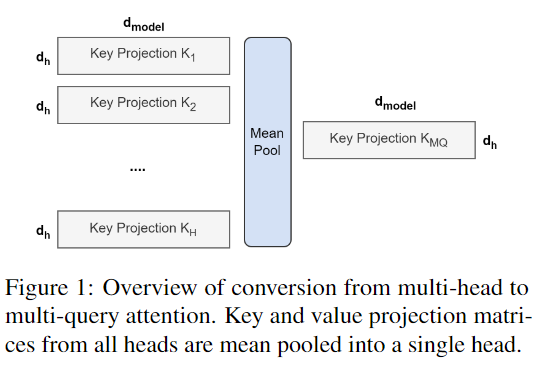
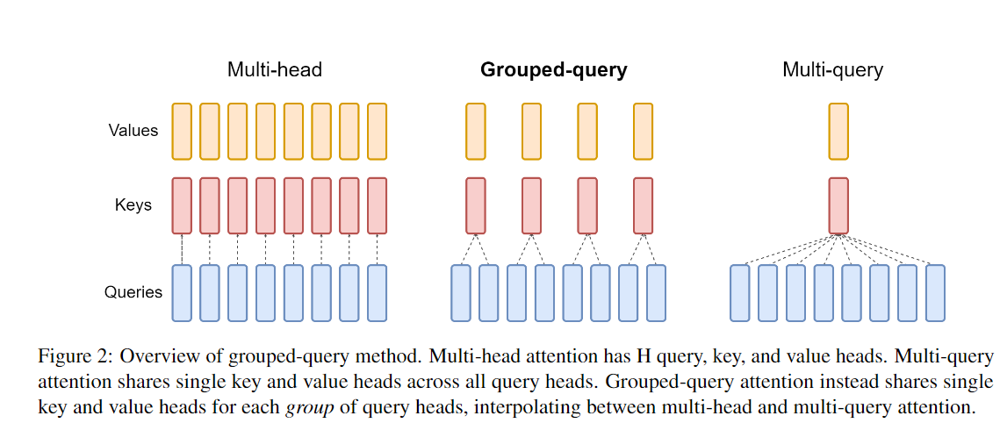
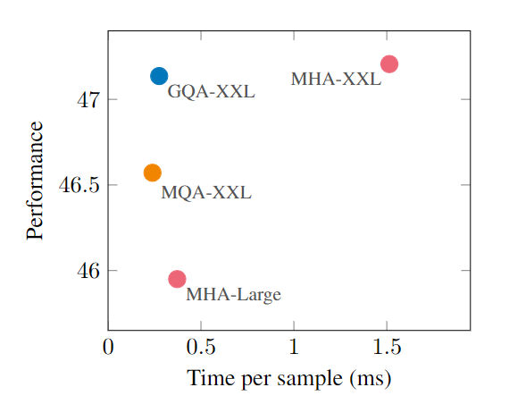
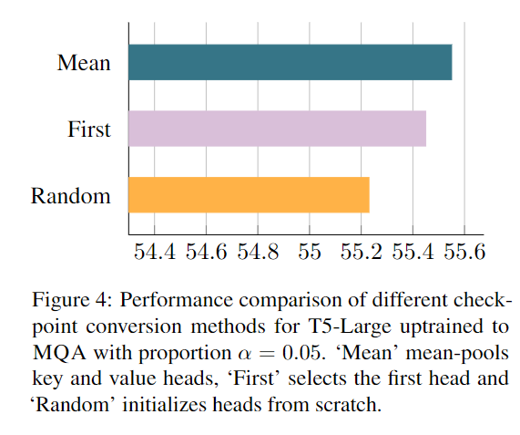
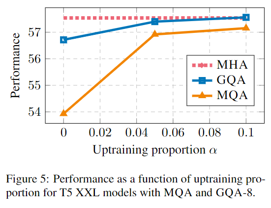
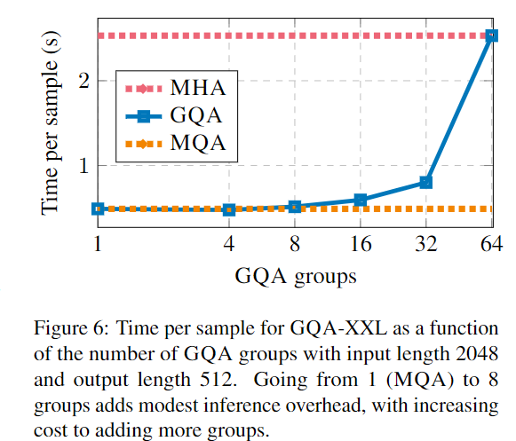

#Attention #LLM #vLLM #LLMInference 
## 0. 들어가며
- 아마 본 논문은 기존 Transforemr Attention보다 개선된 Attention에 대해 다룰것이다.
- LLM Inference & serving 공부를 하다가 여기까지 왔다.
- 모델 서빙에 [KV Cache](obsidian://open?vault=PARA&file=Area_of_responsibility%2FML%26AI%2F%EC%A0%95%EB%B3%B4_KV%20cache%2FKV%20cache)가 핵심이 되는 부분 중 하나인데 이 서빙을 보다 가볍게 하기 위해 별에 별 방법이 다 나오는거 같다.
- 배치 방법을 바꿔 메모리를 보다 효율적으로 관리를 한다던가([Continuous Batch](obsidian://open?vault=PARA&file=Area_of_responsibility%2FML%26AI%2F%EC%A0%95%EB%B3%B4_Continuous%20Batch.textbundle%2FContinuous%20Batch))
- 모델이 들고있는 파라미터의 정보들을 줄인다던가(Quantization)
- 개중 모델의 파라미터 관련 cost를 줄이기 위한 방법중 Attention 쪽을 많이 튜닝을 하는거 같다.
- [Flash Attention]()과 [PagedAttention](obsidian://open?vault=PARA&file=Area_of_responsibility%2FML%26AI%2F%EB%85%BC%EB%AC%B8_Efficient%20Memory%20Management%20for%20Large%20Language%20Model%20Serving%20with%20PagedAttention%2F%EB%A6%AC%EB%B7%B0_Efficient%20Memory%20Management%20for%20Large%20Language%20Model%20Serving%20with%20PagedAttention) 등등 이 두 가지는 LLM의 서빙의 핵심이 되는 내용이다. 이번에 리뷰할 GQA도 group-query Attention도 마찬가지로 앞의 두 가지 보다 선행되어 나온 Attention 방식이다.

## 1. Introduce

- Autoregressive 디코더 추론(inference)는 각 step(단어 생성)에서 디코더의 가중치와 Attention의 K,V를 로드하는데 따른 메모리 대역폭 Overhead가 발생하여 보틀넥 현상, 속도저하 현상이 발생 -> KV cache를 통해 메모리에 K,V값을 저장하여 Inference 속도를 높히는 방식이 LLM 서빙의 핵심 기술중 하나이다. 하지만 들어오는 Generation Sequence가 길면 cache가 기하급수적으로 늘어남
- 이러한 현상은 multy-query Attention(MQA)를 통해 줄일수 있다.
- 하지만 MQA는 품질 저하와 불안정한 학습으로 이어지고, inference에 최적화된 별도 모델의 학습 성능이 매우 떨어질 확률이 높다.
- PaLM과 같은 모델은 MQA 방식을 사용하지만, T5, LLama와 같은 오픈소스 모델들은 잘 사용하지 않는다.
- 본 논문에선 대규모 언어 모델의 더 빠른 Inference를 위한 두 가지 방법을 기술한다.
  - MHA 방식으로 학쉽된 checkpoint(학습 중간 기록)을 불러와서 MQA로 uptraining 하여, original trainning computation의 일부분만 사용해 MHA의 정확도와 MQA만큼의 추론 속도를 확보 
  - **Group Query Attention(GQA)**를 활용한 새로운 Attention 방법: MQA와 MHA의 중간 방식
- GQA를 사용하면 MQA의 속도와 MHA의 퀄리티를 가질 수 있음

## 2. Mehtod

### 2.1 Uptrainnig

- 먼저 MHA 모델에서 MQA로 바꾸는 작업을 진행
- 먼저 초기에 학습된 MHA_value_checkpoint에 기록되어 있는 K,V projection matrices를 MeanPool(평균 풀링) 하여 Single projection matrix로 변환 -> checkpoint converte
  - 이 이유는 Single matrix를 아예 처음부터 random selection을 이용하여 찾는 방법 보다 효과적이었기 때문
- 이렇게 변환된 checkpoint_projection matrix(특정 체크포인트에서 평균 풀링하고 나온 싱글 메트릭스)는 다시 남은 train의 양만큼 pretain을 시킨다. 물론 기존 MHA때와 setting을 동일하게 진행한다.
- GQA도 이러한 방식과 비슷하게 진행한다.

### 2.2 Group-query attention

- GQA는 기존 MHA과 MQA의 사이에 존재한다고 볼 수 있다.
- GQA는 Query head(Query의 개수)를 G(사용자 설정, 그룹 개수)만큼의 group으로 나누고, 각 group의 내부는 서로 K와V를 공유한다. 
- G=1이면 MQA랑 동일 왜냐하면 하나의 KV에 모든 Query를 사용하니깐
- G= len(query head) 이면 MHA랑 동일, 각 QUery에 대응하는 KV가 들어가니깐

- MHA checkpoint를 GQA checkpoint로 converte할 때, MHA checkpoint의 K와 V의 head 들을 각 group마다 묶어서 mean Pooling을 진행한다. 이렇게 GQA group K,V를 구성한다.
- 중간 개수의 group을 가준 GQA는 MHA보다 빠른 적절한 trade-off를 나타낸다.
- MQA로 converte하면 그룹지어지기에 KV cache의 크기가 줄어들고 그에 따라 로드시 메모리에 덜 접속해도된다.
- 이 방법은 모델이 크면 클수록 좋은 trade-off일 것이다.

## 3. Experiments
- Configurations
  - T5의 .1.1 버전 아키텍쳐를 기반으로 하여 JAX, Flax 및 Flaxformer로 구현

    > JAX는 구글이 만든 머신러닝 라이브러리로, 넘파이 GPU에서 연산할 수 있게 하여 기존 넘파이를 개선, 훨씬 빠르게 연산을 진행한다.
  - 각각 MHA 버전의 T5와, MQA, GQA버전 T5 uptraining 버전을 고려
  -  Adafactor optimizer 사용
  - 인코도 부분의 attention은 GQA를 적용하지 않음(그럼 아마 Masked MHA일거임)

- Uptraining
  - key &value head는 mean-pooling으로 계산
  - pretraining의 비율 *α*는 0.05로 설정 -> 체크포인트 50% 구간 부터 GQA를 실행

- Data
  - evaluation dataset임
  - summarization dataset (CNN/Daily Mail, arXiv, PubMed, MediaSum, Multi-News), translation dataset (WMT 2014 En-De), QA (TriviaQA) 사용 사용
  - GLUE가 널리 쓰이는 벤치마크이기는 한데, autoregressive inference에는 부적절해서 제외하였음

- Fine-tuning
  - lr 0.001, batch size 128, dropout rate 0.1
  - CNN/Daily Mail, WMT dataset은 input length 512, output length 256
  - 다른 summ dataset은 input length 2048, output length 512로 설정
  - Trivia QA는 input length 2048, output length 32로 설정
  - greedy decoding 사용

- 속도는 MHA-Large 급으로 낮은데 MHA-XXL급 성능을 보여준다 GQA를 쓰면

- Fugure4를 보면 group시에 matrix 변환을 할 때 (MHA -> GQA) head중 random하게 뽑아서 사용하거나 처음 등장하는거만 사용하는거 보다 평균내는게 낫다는 그림이다.

- 위 사진은 converte의 비율을 보여주는 사진이다. 0.1까지는 proportion을 높여도 성능 향상이 있지만, 0.1 이후로는 성능하락이 관찰됨

- k, v size는 head의 크기에 영향을 받음
- MQA에서부터 head의 크기를 증가시키면 처음에는 time cost가 그케 늘어나지 않으나 MHA에 가까워 질수록 time cost가 늘어나는 것을 확인가능함