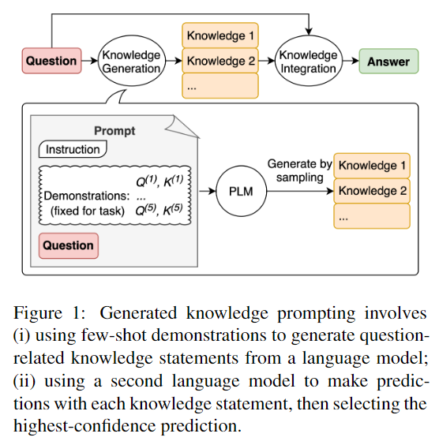
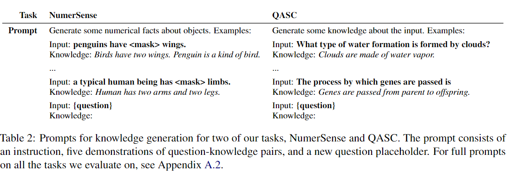
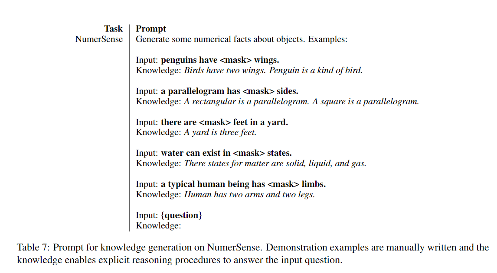
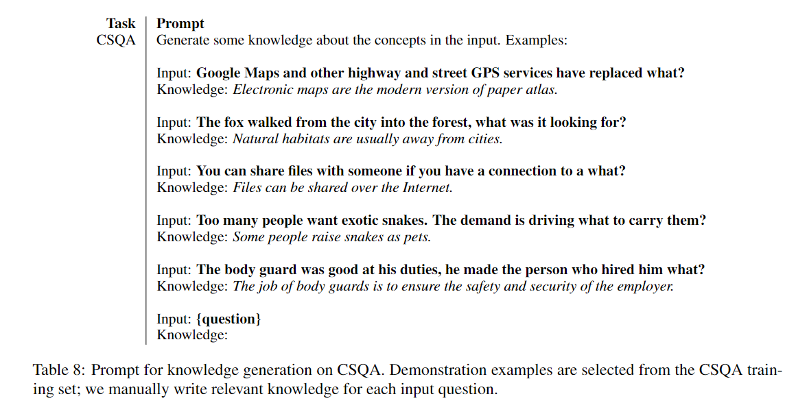
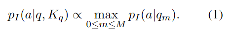
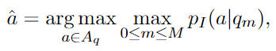
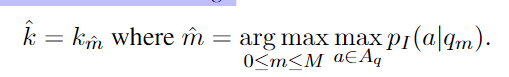
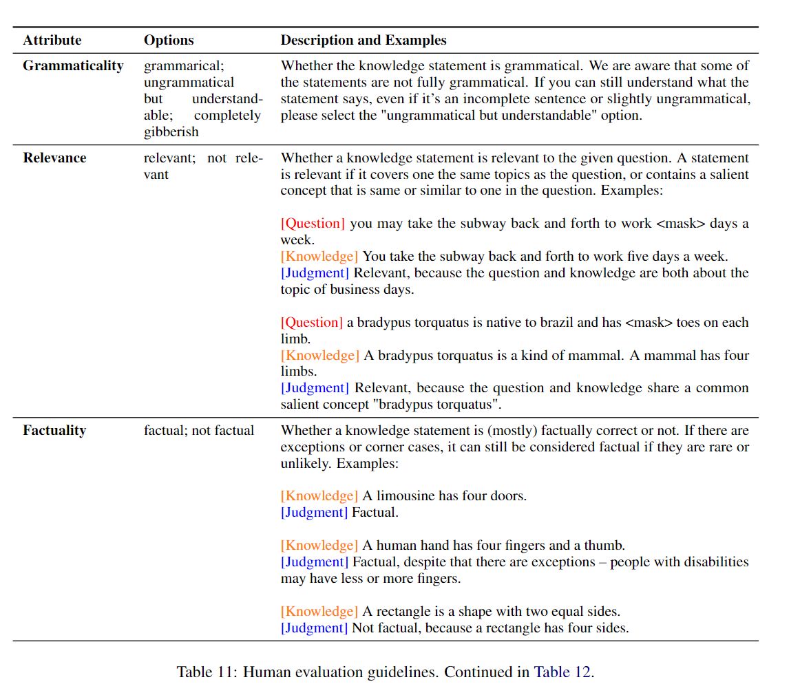
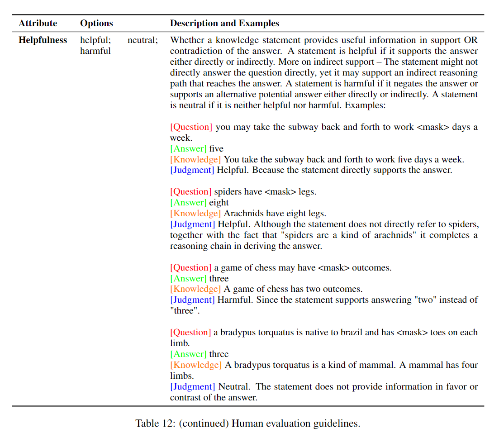
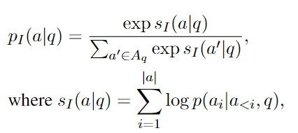

#LLM #Prompt #KD #Agent 
## 0. 총평
- 지금 본 논문을 리뷰하는 시점에선 agent로 외부지식을 끌어다 쓰는 방법이 유행이다. 상위 LLM이 아닌 특정 분야에 특화된 LLM을 사용하여 KD를 진행하는 방식이다. 
- 본 논문도 상위 LLM을 활용하여 sLLM한텐 Prompt로 KD를 사용하여 전수하여 답변의 성능을 높히는 방법이다.
- 티처 LLM으로 다수의 지식을 상성하고 sLLM에게 지식을 제시하여 답변을 생성하는 방식이다.

## 1. Introduce

- 본 논문은 가장 최신 모델에 prompt를 통한 사전 지식을 제시하는게 도움이 되는지에 대해 알아본다.(본 논문은 모델의 예시로 T5-11b를 들음)
-  Zero-shot 혹은 finetunig 방식을 확실하게 도와 새로운 풀 파인튜닝을 하지 않고, 어려운 구조화된 지식을 제공하지 않아도 성능이 개선되는 새로운 접근법인 Generated Knowledge Prompting을 제시한다.(Figure 1 참조)
- 본 방법은 모델에게 받은 지식을 prompt에 질문과 연계된 지식을 작성하면서 문제를 해결한다. 이 방식은 파인튜닝 없이 다양한 상황에 대한 도움을 주고 모델한테 다양하게 퀄리티가 높은 지식을 제시 할 수 있다. 이러한 방식은 간단하게 few-shot-CoT prompt setting 만으로 knowledge statements를 도출 할 수 있다.
- generated knowledge prompting는 아래의 도움을 준다.
  - 모델의 지식의 퀄리티를 높히고
  - 그로인해 모델의 성능이 향상된다.
  - 또한 추론 중 지식을 추가 가능하다.

## 2. Generated Knowledge Prompting

- generated knowledge prompting은 두 단계로 나뉘어져 있다.
  - 첫 번째는  knowledge generation. 즉 언어모델을 활용하여 질문과 관련된 지식 문장을 생성한다.
  - 두 번째 스텝은 knowledge integration이다. knowledge generation에서 나온 지식을 바탕으로 두 언어 모델을 통합하여 언어 모델에서 최종 질문에 대한 결과를 도출합니다.

### 2.1 Knowledge Generation

- 본 task는 언어 모델을 활용하여 질문과 관련된 지식을 출력합니다. 이를 demonstrations 이라 한다.
- 본 작업을 위한 prompt는 사람이 직접 작성하고 Table 2와 같은 형식으로 총 5개의 prompt를 구성한다.

- 예를들어 `새는 두개의 날개를 가지고 있고, 팽귄은 새의 한 종류이다.`라는 문장을 prompt에 제시하고 `팽귄은 <mask> 날개를 가지고 있다.`라는 문장을 질문으로 넣으면 꽤나 괜찮은 지식문이 될 것이다.
- 하지만 `팽귄은 두 개의 날개를 가지고 있다.`라는 질문은 꽤나 빈약한 prompting이 될 것이다. 아마 답을 이렇게 알려주는 형식의 지식 전수는 의미가 없다는 뜻 같음
- prompt에 적은 지식은 deductive reasoning에 도움을 주기 때문이다.
- 이러한 작업으로 여러번 반복하여 다음 모델에 넣을 질문에 따른 다수의 다양한 지식을 얻는다. 아래는 논문에서 제시한 예시 5개중 2개이다.

### 2.2 Knowledge Intergration via Prompting

- 먼저 Knowledge Generation에서 얻은 지식과 질문을 엮어서 prompt에 작성한다.
- 모델에 prompt를 넣고 개중 가장 결과가 좋은 지식 내용을 담고 있는 prompt를 찾는다. 아래의 수식을 이용한다.

- 이렇게 나온 최종 output중 최고의 확신도를 가진 prompt를 찾는다.

- 위는 예시이다.

## 3. Experimental Setup

- 추론 질문 생성은 GPT-3 모델로 사용 
- 추론 답변 모델은 t5 와 gpt-3 사용

### 3.1 Datasets and Task Setup

- 5개의 데이터셋 사용

### 3.2 Inference Model Setup

- 위 수식을 사용하여 질답의 성능을 평가

### 3.3 Knowledge Generation Baselines

- No knowledge, Random sentences, Context sentences, Template-generated knowledge, Retrieval-based knowledge, answers 사용

## 5. Related Work

- 지식은 사전훈련된 모델안의 데이터셋에서 도출이 가능하다.
- 몇몇 질문은 외부 지식을 참조해서 지식 추론 문제를 풀었다.
- 추론 문제 해결하기 위해 수작업으로 지식을 생성하지 않고 모델을 통해 지식을 뽑아내서 유연성이 좋다.

## 6.Conclusion

- 우리가 제시한 방법은 다양한 문제에 대해 유연연 해결책을 제시하고 높은 품질의 지식도 모델을 통해서 추출하여 만들수 있다.
- 최종 결과적으로 괜찮은 결과도 보장한다.