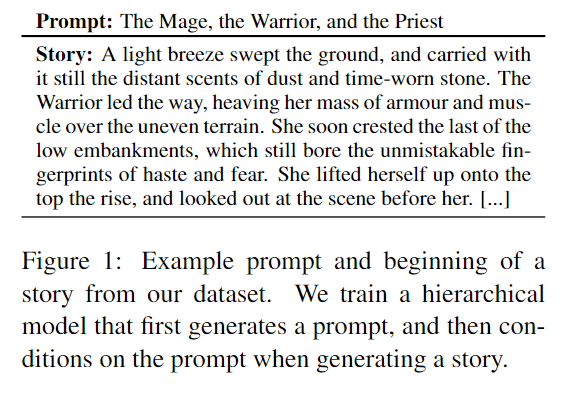
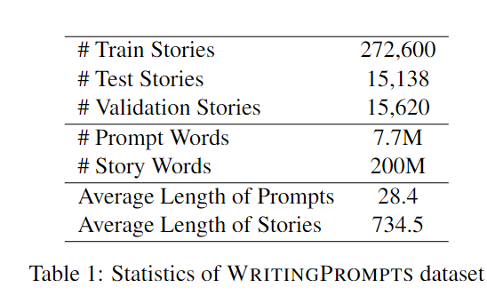
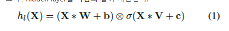
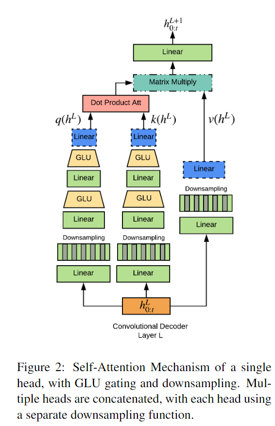
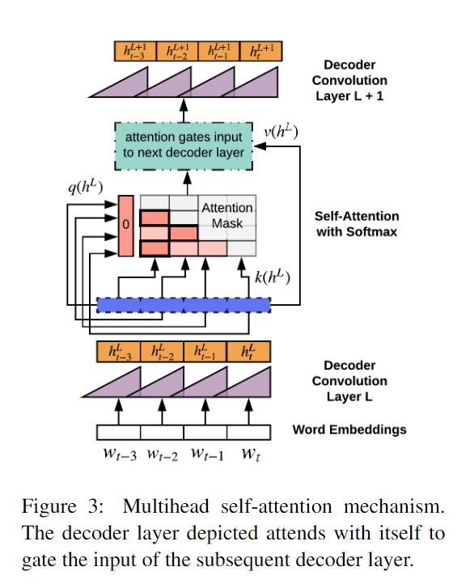
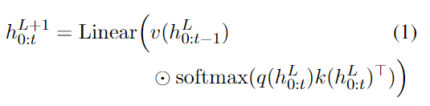
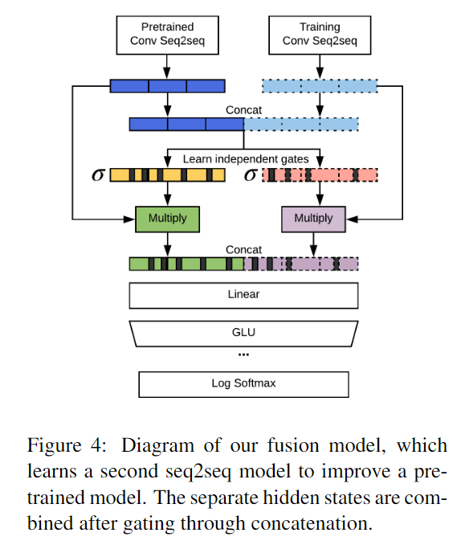
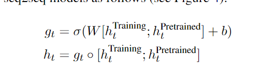

#textGeneration #확률 #LLM 

## 0. BackGround

-  [Convolutional Sequence to Sequence Learning, Jonas 2017](https://arxiv.org/abs/1705.03122)
- [Language Modeling with Gated Convolutional Networks. Dauphin](chrome-extension://efaidnbmnnnibpcajpcglclefindmkaj/https://michaelauli.github.io/papers/gcnn.pdf)

## 1. Introduce

- 스토리 텔링과 가은 작업은 미지의 부분에서 창조하는 부분이고 이번의 글을 쓸 때 미래의 내용까지 계획하여 작성해야 한다.

- 논문은 Figuer 1 과 같이 글의 주제를 의미하는 단어 몇가지를 Prompt에 제시해서 시퀸스 모델에게 답변을 얻을 것 이다.
- 이러한 주제들은 모델의 결과가 주제를 기억하여 문장의 내용이 주제에서 벗어나는걸 방지한다.
- 하지만 첫 실험에서는 Prompt와 Story 사이의 불완전하고 복잡한 의존성(dependencies) 때문에 실패했다.

- 기존의 Convolutional 아키텍쳐는 제한된 양만 받아서 인코딩(NLU)한다.
- 그래서 논문은 다양한 시간대의 이전 시점의 출력에 영향을 받는  Gated self-attention 매커니즘을 소개한다.

- Table1 과 같은 데이터셋을 사용한다.

## 2. Writing Prompt Dataset

- Reddi`s(커뮤니티)에서 계층적 스토리 dataset을 수집하고 각각의 prompt는 여러 결과이야기가 생길수도 있다.
- Figure1과 같은 욕설 혹은 혐오 표현과 같은 내용이 포함되지 않게 dataset을 구성
- dataset에 대한 토큰화는 NLTK를 사용

## 3. Approach

- seq2seq 모델은 다양한 문제에 강력한 성능을 발휘합니다. 하지만 이 모델은 Prompt를 정확히 반영하여 이야기를 생성하지 못하여서 아래와 같은 접근법을 사용하여 문제를 해결한다.

### 3.1 Hierarchical Story Generation

- 좋은 글을 쓰기 위해선 깊은 Hierarchical 구조가 필수이지만, 언어모델은 strictly-word-by-word을(현 시점의 단어는 이전 시점의 단어를 보고 판단한다.) 사용하여 생성하기에 높은 수준의 계획에 의한 글은 만들 수 없다.

- 여기선 모델이 단어 생성을 두 단계로 나누어 계획하는 방법을 소개한다.

  - 먼저 dauphin et al. (2017)이 제시한 GLU를 활용한 Convolution LM를 활용한다.

  - 그리고 스토리를 생성하기 위해 Seq2Seq를 사용한다.
  
    > GLU란?
    >
    > 참고 출처:  [Language Modeling with Gated Convolutional Networks.noowad_github](https://github.com/noowad/paper-summaries/issues/21)
    >
    > Language Modeling with Gated Convolutional Networks에서 제일 처음 제시된 방법으로 GLU는 활성화 함수의 종류 중 하나이다. (맨 처음엔 GRU랑 헷갈렸다....)
    >
    > GLU는 Gated Linear Units의 약자로 LSTM와 유사하게 정보의 출입을 제어하는 역할을 한다. 하지만 CNN에서는 LSTM의 Forget gate(삭제게이트)가 필요하지 않다는 것을 실험적으로 알아냈고, 본 논문에서의 게이트는 각 레이어의 계층을 통해 전달되어야 하는 정보를 제어어하는 output gates와 유사한 역할을 한다.
    >
    > 
    >
    > 
    >
    > 내가 이해한대로 작성을 해 보겠다.
    >
    > CNN Seq2Seq에는 기본적으로 삭제 게이트가 존재하지 않는다. 이는 문장이 길어지고 단어가 쌓이면 쌓일수록 정보의 양이 커지고 초기에 나온 단어는 뒤에서 그 정보의 양이 미미해질 경우가 높다. 그렇기에 LSTM의 삭제 게이트와 마찬가지로 정보의 출입을 제어하는 장치가 하나 필요한데 그게 GLU인거다.
    >
    > GLU는 두가지의 파라미터를 가지고 있는데 가장 기본인 선형함수의 W와 시그모이드 함수의 V다.(bias는 항상 기본이니)
    >
    > 여기서 삭제 게이트 역할을 하는게 저 시그모이드 함수 부분이다. 삭제 게이트와 마찬가지로 저 시그모이드는 학습을 통해 앞에 있는 선형함수를 통해 나온 벡터값들을 조정한다. 시그모이드 함수는 값들을 1이 최대치인 비율로 바꿔주기에 이를 통해 나온 값과 element-wise produc(벡터 위치 곱, 행렬곱 아님)를 하면 단어의 의미가 강한 단어는 그대로 기존의 값이 그대로 남을 것 이고 의미가 약한 단어는 기존의 값이 많이 사라지게 만든다. 물론 어떠한 단어에 강하게줄지 약하게 줄지는 학습을 통해 조율한다. 
    >
    > CNN seq2seq는 LSTM과 다르게 데이터를 병렬로 처리가 가능해 LSTM보다 장점이 있고 이 GLU를 사용하면 LSTM과 마찬가지로 데이터의 입력을 제어하기에 CNN LM의 장점이 부각된다.
  

- 사진은 Convolution LM의 GLU를 사용한 Self-attention 모델이다.

### 3.2 Efficient Learning with Convolution Sequence-to-Sequence Model

- seq2seq는 encoder, decoder로 이루어져 있다.
- 이 두 task는 attention을 통하여 서로 영향을 주고 받으며 encoder에서 나온 벡터값에 가중치를 더한다.

### 3.3 Modeling unbounded Context with gated Multi-scale self attention

- 디코더에 self-attention 사용,병렬작업으로 인해 제한된 컨텍스트 길이에도 성능을 높혀줌 

- **Gated Attention**: 기본적으로 Transformer와 비슷함, 하지만 attention의 q,k,v 는 선형으로 바로 주지 않고 GLU를 거쳐서 준다.
- **Multi-Scale Attention**: attention을 사용한다. 하지만 하나의 Head만 사용하는것이 아닌 Figure2 처럼 각각 다른 양의 DownSample을 거친다. 하나는 모든값을 다 넣고, 두 번째는 입력시간 마다, 세번째는 세번의 입력시간 마다의 값을 벡터로 만들어서 넣어준다. 이러한 다른 scale 방식은 각각의 다른 정보들에 더욱 주의를 기울이게 만든다. 

- Single Attention의 출력의 수식은 위와 같다.
- 만약 과거의 정보를 사용하지 않게 설정한 경우 Figure3과 같이 과거의 정보는 0으로 설정 가능하게 만들었다. 이로인해 과거의 정보가 noise만 제공하는 경우 무시가 가능해 진다.

### 3.4 Improving Relevance to Input Prompt with Model Fusion

- 번역 문제와 달리 이야기 생성은 prompt에 국한 되지 않고 더욱 넓게 생각해야한다.
- 그래서 본 논문은 fusion--based 접근법을 제시한다.

- pretrains 된 GLU seq2seq 모델을 가져와서 Figure4와 같이 추가 학습 시킨다.

- pretrain에 사용된 데이터와 fint tuning에 사용될 데이터 두 개를 concat을 한 다음 그 데이터를 GLU activation을 사용하여 결과를 받아본다. 아래는 그 수식이다.

## 4. Related Work

### 4.1 Story Generation

- 이 때까지 다양한 Text Generarion 모델이 나와서 많은 발전하였다. 그러나 이러한 이전 연구들에 hierarchical generation를 통한 일관성과 구조가 올바른 story를 generation을 하는 연구는 없었다.

### 4.2 Hierarchical Text Generation

- 이전 작업들은 hierarchical generation task로 학습였다. Context를 만들어 단어 생성에 도움을 주거나, 단어, 문장, 단락으로 나누어 학습을 진행 했다.

### 4.3 Fusion Models

- Ramachandra(Unsupervised Pretraining for Sequence to Sequence Learning)에서 제시한 가중치 초기화 후 Fine tuning하는 방식의 Seq2Seq 모델이랑 Chorowsko & jaitly(Towards better decoding and language model integration in sequence to sequence models)가 제시한 모델 두 가지 방식을 섞어서 사용
- 최근에는  Gul- cehre(2015)과 Sriram et al(2017)가 존재한다.

## 5.Experimental Setup

### 5.1 Baseline

- LM: 위에서 설명한 GLU를 사용하는 gated convolutional language model과 self-attention을 사용
- seq2seq: LSTM과 ConV seq2seq와 decoder-self-attention ConV Seq2Seq 매커니즘
- Ensemble: self-attention을 가지고 있는 두 개의  ConV seq2seq 모델
- KNN: 결과를 가장 기본 모델인 KNN 모델과 비교

### 5.2 Fusion Training

- 먼저 준비된 데이터셋은 self-attention을 사용하는 ConV seq2seq에 사전학습 시켜 모델을 하난 만들고 3.4에서 말한거 처럼 두번째 fine-tuning 모델과 함께 결합된다.

### 5.3 Training

- pythorch의 fairseq-py 패키지 사용
- (Sutskever et al., 2013에서 제시한 경사 하강법과 Pascanu et al., 2013 그레디언트 클리핑을 사용

### 5.3 Generation

- 본 논문의 모델을 top-k random sampling 방식을 사용하여 문장을 생성한다.
- 각 시점은 각 단어가 이번에 등장할 확률을 생성한다.(즉 이전 단어를 보고 이번에 이 단어가 등장할 확률을 구한다.) 그런 다음 가장 확률이 높은 상위 10개로 부터 랜덤 샘플링을 한다.(10개인 이유는 논문에서 설정한 하이퍼 파라미터 값이 10이라서다. 원래 사용자가 정하는거임)
- 이 방법은 대체로 방족적인 문구 등을 생성 할 때 beam search 보다 효과가 있었다. beam search는 생성한 문장이 짧은 경향이 있다.
- 다음 단어를 완전히 무작위 생성하면 학습 단계에서 보지 않은 문장이 나올 확률이 너무 높아 답변 생성시 문장이 올바르지 않게 작성 될수 있기에 우리는 최상위 확률 10개를 샘플링하여 그 안에서 단어를 무작위로 생성하여 문장을 생성합니다.

## 5.5 Evaluation

- 비교를 위해 여러가지 모델을 사용해 보고 평가한다. 하지만 우리는 정해진 답을 얼마나 잘 생성하냐를 보는게 아니기에 일반적으로 많이 사용되는 평가지표인  BLEU 혹은 ROUGE등을 사용하지 않는다.
- 본 논문은 모델의 유창한 문장생성과 얼마나 prompt의 키워드 혹은 조건에 준수하였는가를 보고 평가한다. 그래서 테스트 데이터 셋에 대한 모델의 model perplexity와   prompt ranking accuracy를 보고 평가한다.
- perplexity는 모델이 얼마나 다음 단어를  fluently하게 단어를 예측했는지 평가한다.(아마 확률을 본다는거 같은 일반적인 LM 성능 지표를 본다고 한거 보니)
- prompt ranking accuracy는 각 prompt가 생성할 확률이 가장 높은 비율을 가지고 테스트 데이터와 비교하여 판단.
- 그리고 사람에게 모델이 생성한 각 3개의 결과를 보고 판단하게 만듬

## Reveiw

- Background 지식인 ConV seq2seq와 GLU에 대한 지식이 없어 읽기 힘들었다. 하지만 관련 지식을 알고 읽으니 모델의 구성방식과 구성 이유를 알 거 같다.
- 이 논문을 찾아본 첫 번째 이유는 Top-k 방식의 generation 때문이었다.
- beam search를 안 쓰고 top-k 방식을 사용한 이유와 작동 방식에 대해 알아서 좋았다.
- ConV seq2seq와 이야기 생성과 같은 모델의 평가 지표를 아는건 신기 했지만 원래 목표인 Top-k에 대한 정보는 부족한게 매우 아쉽다.