#CoT #Prompt #LLM 

> 논문 출처: [Large Language Models are Zero-Shot Reasoners](https://arxiv.org/abs/2205.11916)

## 0. Abstract

- pretraining된 LLM은 학습데이터에 의해 특정 과제에 특화된 few-shot learning을 통해서 쓰이고 있었다.
- 그런 와중 CoT의 등장은 추론 문제에 대하여 SOTA를 기록한다.
- Few-shot(CoT도 Few-shot 방식임)에 의해 성능이 좋아졌다. 하지만 본 논문에서는 'step by step'만 적어도 성능이 향상 될 수 있다는 걸 말한다.

## 0. Abstract

- pretraining된 LLM은 학습데이터에 의해 특정 과제에 특화된 few-shot learning을 통해서 쓰이고 있었다.
- 그런 와중 CoT의 등장은 추론 문제에 대하여 SOTA를 기록한다.
- Few-shot(CoT도 Few-shot 방식임)에 의해 성능이 좋아졌다. 하지만 본 논문에서는 'step by step'만 적어도 성능이 향상 될 수 있다는 걸 말한다.

## 1. Introduction

- LLM은 최근(이 논문이 쓰일 때) 모델의 Scaling up the size 하는게 대세이다.
- LLM의 성공은 종종 Few-shot이나 Zero-shot에 기인하는 경우가 많다.
- LM 모델에게 제약 조건(조절 방법?, 원문: method of conditioning)을 주는걸 프롬프팅(Prompting)이라고 한다.

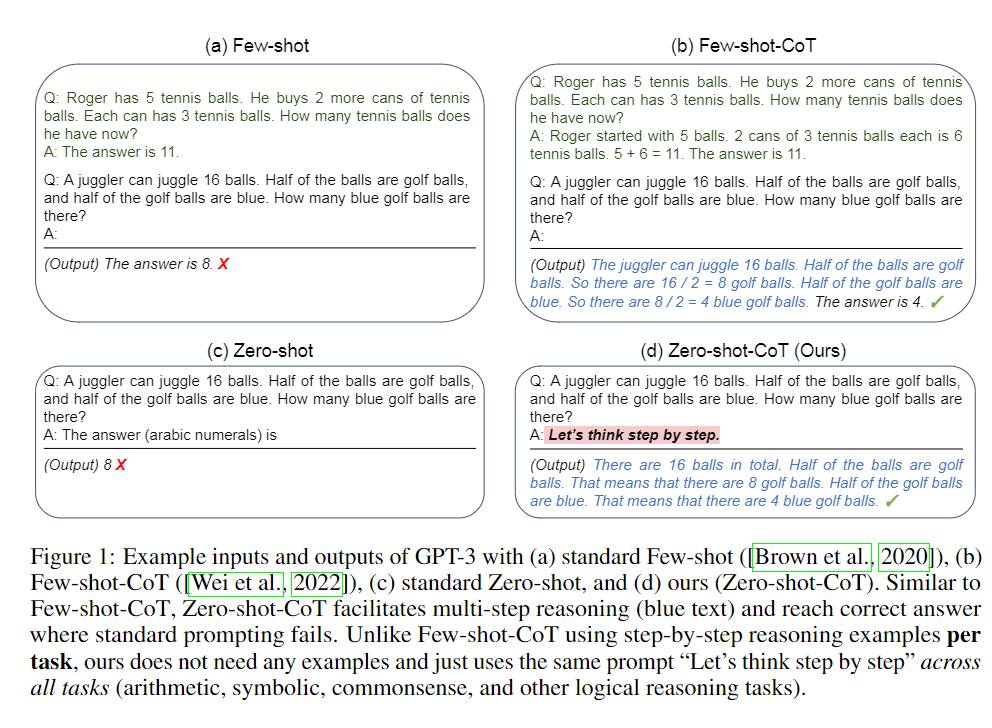

- LLM은 직관적이고 one-step(간단한 이라고 해석 할듯)한 system-1 질문에는 zero-hot과 few-shot에 대해서도 놀라운 성능을 보여준 반면 requiring slow(느린요구??????)하고 다단계 추론이 필요한 system-2 task에서는 100B 혹은 그 이상되는 모델도 어려워한다.
- CoT는 위와 같은 상황에 알맞는 방법이다. 추론 문제에서 CoT를 PaLM은 SOTA를 기록했다.
- CoT의 성공으로 인해 많은 다른 prompting work 연구들도 few-shot에 귀속 되었다. 하지만 우리는 ''Let’s think step by step"이라는 간단한 prompt를 추가하여 그림1과 같이 각각의 질문의 답에 추가하니깐 성공적으로 추론 방법에 대해 출력하였고 기존의 zero-shot는 못했던 정답에 도달하였다.
- zeros-hot은 prompt가 다양한 목적에 사용가능하고 task-agnostric하다.그에 반해 few-shot의 prompt를 질문에 맞춰 사용해야하는 방법을 사용해야한다.
- 우리의 zero-shot-CoT는 아래와 같은 결과를 보인다.

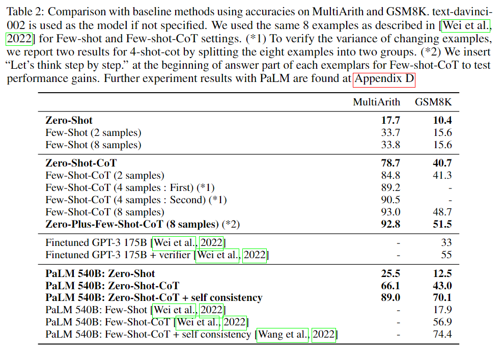

- 비록 Few-shot-CoT보단 성능이 조금 떨어지지만 기존의 zero-shot과 비교하면 엄청난 성능을 보여준다.또한 540b 모델을 쓴다고 했을 때 Few-shot-CoT보다 각각의 원래 바닐라 방법론에 비해서 더욱 큰 상승곡선을 보인다.

## 2. Background

- **Large languaeg models and prompting**: LM 모델은 기본적으로 다음 단어를 예측하는 텍스트 확률 분포 모델이다. LLM은 이러한 모델에 엄청난 양의 데이터를 사전 학습(pretrain)을 시켜 학습시킨 모델로 과거의 fine-tuning 보다 높은 성능을 보인다.
- LLM의 성능을 발휘하기 위해선 prompt가 필요하다. 거기에서 zero-shot과 few-shot이 등장한다.
- **Chain-of-thought prompting** few-shot prompting의 일종으로 LLM의 추론문제에 혁신적인 결과를 들고온 Prompting 방법, 한 개의 답을 단계별로 생각하는 방법을 예시로 제공하여 출력에 영향을 주어 모델이 답을 낼 때 단계별로 생각후 답을 내는 일련의 과정을 출력, 이러한 작업으로 추론 문제에 대한 성능을 높힘

## 3. Zero shot Chain of Thought

- 우리는 zero-shot-CoT를 제시한다. 기존의 Few-shot-CoT는 각각의 질문에 따라 Prompt내용이 다르지만 zero-shot-CoT(이하 Zero CoT)는 질문에 구애 받지 않고 다양한 Prompt에 사용가능하다.
- 사용 방법은 간단한데 그림 1과 같이 *Let’s think step by step*을 추가 시켜주기만 하면 된다.

### 3.1 Two-stage prompting

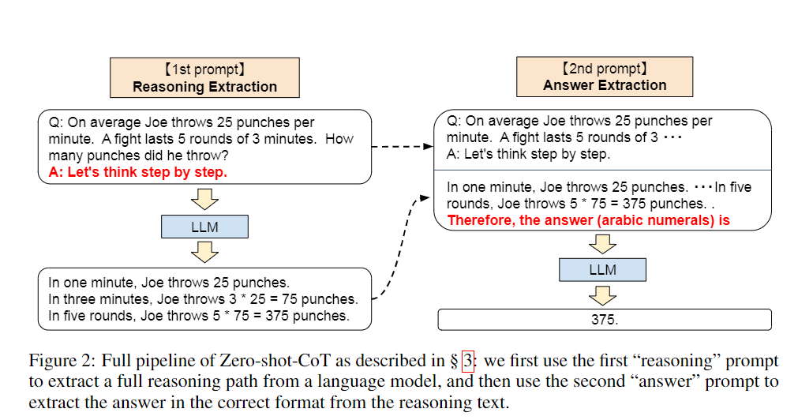

- 우리의 Zero CoT는 그림 2와 같이 두 가지의 prompt 답변을 사용할 것 이다.
- 기존의 zero-shot은 그림 1과 같이 "답변은"이라는 내용이 항상 있다.few-shot과 CoT는 각 Prompt에 질문의 답변만을 추출하는 포멧에 대한 예시가 존재해(CoT는 질문과 답변 방식에 대한 예시를 항상 작성하니깐) 질문에 맞는 답변만을 추출이 가능한데 zero shot은 그게 불가능하다. 
- 그래서 Zero CoT는 그림 2와 같이 생각의 사슬을 생성하는 prompt하나 거기서 질문에 대한 답변만을 추출하는 prompt 두 가지를 사용할 것 이다.
- few-shot CoT는 few-shot 예시에 대한 사람이 직접 꼼꼼한 엔지니어링이 필요한데 반해 zero shot CoT는 따로 엔지니어링이 필요하진 않지만 두 번의 prompting을 거쳐야 한다.

#### 1st Prompt reasoning extraction

-  `Q"[X]. A:[T]`형식의 Prompt 를 준비한다. 이 prompt의 `x`는 질문이 들어가고 `T`에는 x의 CoT 방법을 유도하는 trigger가 들어간다. 본 논문에선 "Let's think step by setp"를 Trigger로 사용하여 `Q:[X] A:[Let's think step by setp]` 형식으로 Prompt를 구성하였다. 각 트리거에 따라 결과가 다르게 나오니 아래의 표를 참고하면 된다. 

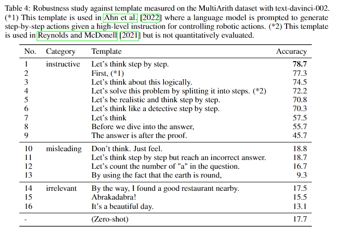

- 어떠한 디코딩 전략도 사용가능하지만 논문에선 가장 기본적인 greedy decoding을 사용하였다.

  > 보통 Beamshearch를 사용하는게 일반적이지만 본 논문에선 단어 생성 당시 가장 확률이 높은 단어를 선택하는 greedy decoding을 사용했다.

#### 2nd prompt: answer extraction

- 1st prompt를 내용은 `[X']`, 사용하여 나온 결과값을 `[Z]`일 때 2nd prompt는 `[X'][Z][A]`로 구성한다.

- 이러한 방식으로 2nd prompt에선 자가 증식을 한 prompt를 사용합니다.

- 이 prompt에는 `[A]`'에 들어가는 Trigger를 질문에 따라 조정한다. 이 prompt와 같은 경우 `herefore, the answer (arabic numerals) is`를 사용했다.

  > 질문 마다 최종적으로 답변해야 하는 형식과 내용이 다르므로 답변의 2nd prompt에 들어가는 Trigger는 항상 바뀐다.

- 이러한 방식으로 2nd prompt를 언어 모델에 집어넣으면 최종적으로 어독자 하는 결과 `[Y]`를 받을 수 있다.

## 4. Experiment

- **Task and datasets**: 12개개의 데이터셋을 4개의 카테고리로 분류하여 사용

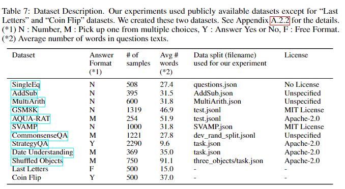

- **Models**: gpt-3 혹은 PaLM과 같은 모델 17개를 사용

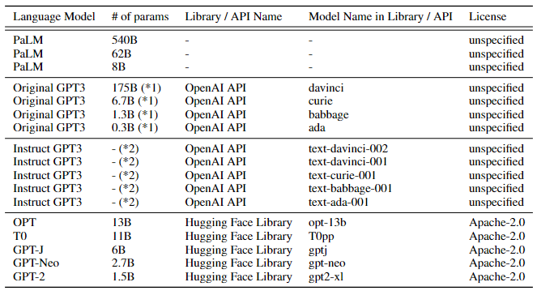

- **Baseline**: 기존 Zero-shot prompt와 Zero CoT를 비교하고 few-shot과few-shot-CoT(Chain-of-Thought Prompting Elicits Reasoning in Large Language Models에서 제시한 prompt 예제)도 같이 사용하여 결과를 확인한다. 또한 우린 greedy decoding을 사용한다. few-shot은 예시 순서에 따라 결과값에 민감하니 모든 실험은 seed값을 고정 후 한번만 실행한다. 

- **Answer cleansing**: 만약 답이 `375 와 356 이다.'라고 나오면 375라고 표기한다. 최종 답변후 multy 답변이 나올걸 대비하여 아래와 같은 답변 클리닝 code를 사용하였다.

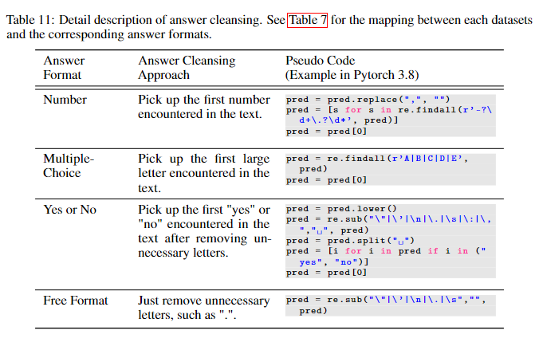

### 4.1 Result

#### Zero-shot vs Zero-shot-CoT

- CoT 방식이 기본적으로 Standard한 방식보다 모든 symbolic 추론과 논리적 추론 문제에 대해 정확도가 높았다. 산출 추론 문제도 대부분 성능이 뛰어 났다. 하지만 다단계 추론이 필요하지 않은 문제는 별 차이가 없다.

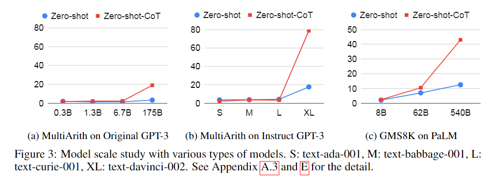

-  물론 기존 few-shot CoT와 마찬가지로 zero-shot CoT도 모델이 크기가 일정 수준을 넘어야 성능이 좋아진다.
- 또한 CoT의 실수도 진짜 사람이 실수할 만한 문제에 대해서만 오류를 범한다. 아래의 사진을 보면 이해가 쉽다.

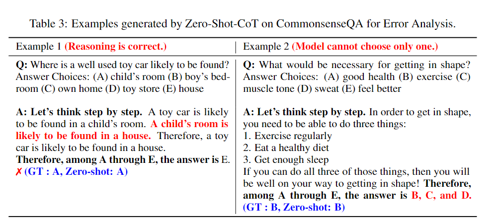

#### Comparison with other baseline

- Few-shot CoT와 비교했을 땐 Few-shot CoT가 성능이 더 좋았다. 하지만 Standard Few-shot과 비교를 해봤을 땐 zero-shot CoT가 성능이 훨씬 좋았다.

#### Does model size matter for zero-shot reasoning?

- 기존의 CoT 논문에서 말한것과 마찬가지로 아무리 CoT가 효과 개선에 도움을 준다고 해도 그 전제는 모델의 크기가 커야한다.

#### Error Analysis

- 더 알아보기 위해 Random으로 instruct - Gpt-3를 통해 나온 결과를 추출해서 살펴보았다.
-  (1)상식 추론 문제: 정답이 맞지 않더라고 종종 유연하고 납득이 가는 생각의 사슬을 만들어 낸다. Zero-shot CoT는 종종 답변을 2개 이상으로 낼 경우가 있다.
- (2)산술 문제: Zero-shot CoT와 Few-shot CoT는 산술문제에서 에러를 띄우면 확연하게 다른 차이를 보여준다.  먼저 Zero-shot-CoT는 정확하게 예측값을 반환해도 불필요한 추론 단계를 거쳐서 오답는 내는 경향이 있다.  또한 종종 출력에 추론을 시작하지 않고 입력질문을 그대로 다시 출력하는 문제가 있다. Few-shot은 생성된 추론에 (3+2)*4와 같은 3항 연산의 식이 나오면 올바르지 않은 답변을 출력하는 경우가 있다.(Few-shot-CoT의 에러에 자세히 알고 싶으면 CoT논문 참조)

#### How does prompt selection affect Zero-shot -CoT?

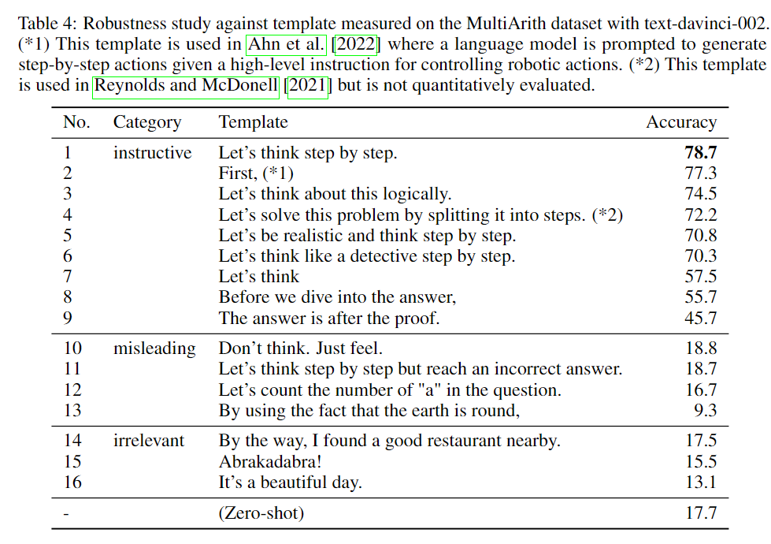

- Webson and Pavlick [2022]에 따라 구체적으로 Template를 3가지 유형으로 나눠서 확인해 봤을 때 정확도(퍼포먼스)는 CoT를 유도하는 방식으로 작성되었을 때 효과가 크다. 심지어 같은 카테고리 안에서도 문장에 따라 정확도의 차이는 매우 크고 흥미로운점은 출력하는 사고의 형태도 다르다.

#### How does prompt selection affect Few-shot-CoT?

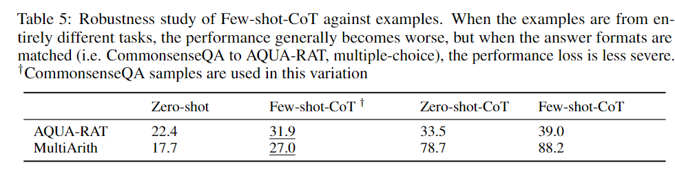

- 위 의 표는 도메인다르지만 응답형식이 같은(CommonsenseQA 에서 AQUA-RAT 등) 데이터를 들고와서 기존 Teamplate에 새로운 문제의 데이터를 넣어 결과를 뽑아 봤을 때의 결과이다.
- 여러 종류의 샘플을 사용하더라도 Cot를 사용하지 않으면  보다 성능은 떨어지며, 더욱히 Few-shot의 작업별 예시 엔지니어링이 중요하다.

## 5. Discussion and Related Work

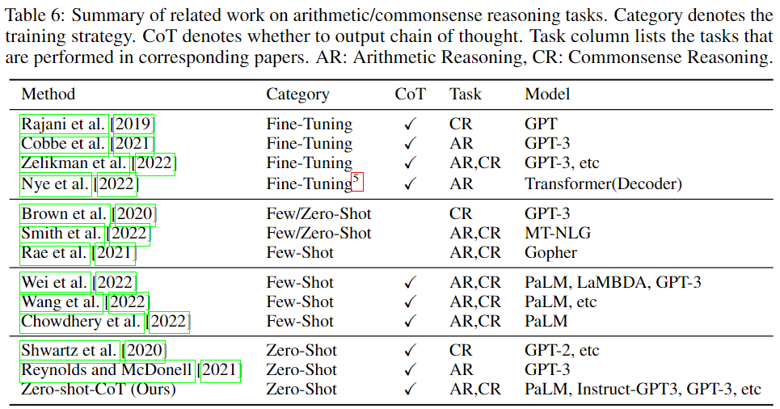

### Reasoning Ability of LLMs

- 기본적으로 pretrain만 시킨 LLMs은 추론문제에 적합하지 않다. 하지만 fine tuning 혹은 few-shot learning 혹은 CoT를 통해서 상당한 수준의 성능을 향상을 시킬 수 있다.

- 단일 trigget를 이용한 CoT의 생각의 사슬은 놀랍도록 사람과 비슷하게 사고하며 오답을 배출할 때 마저도 사람과 비슷하게 오답을 배출한다.
- Zero-shot CoT는 비용이 드는 Fine-tuning 혹은 직접 사람이 예시를 만드는 few-shot과 다르게 비용도 안들고 예시도 직접 만들지 않을 뿐더러 대부분의 도메인의 LLM에 사용가능하다.

### Zero-shot Abilities of LLMs

- 문서 이해, 번역, 요약을 포함하여 system- task는 기존의 LLM도 매우 뛰어난 성능을 보여줬다.
- 기존 LLM의 zero-shot 능력은 fine-tuning 혹은 instruction tuning을 통한 LLM의 도메인에서만 강력한 성능을 보여줬다.
- 우리의 초점은 system-2였으며 zero-shot CoT를 사용하면 이 task에도 성능 향상을 볼 수 있다.

### From Narrow (task-specific) to Broad (multi-task) Prompting

- 대부분의 prompt는 각 과제에 최적화 되어 있다. 하지만 이러한 기법들은 narrow generalization or task-specific skill 이다.

  > 아마 근본적인 문제 해결법은 아니라는 듯, 각 과제에 대해서만 문제 해결 능력을 기른거지 LLM의 성능을 높다고 보긴 어려운듯

- 하지만 Zero-shot CoT는 다영한 범주의 문제들에게 적용가능하고 system-2 task를 해결 가능하다.

### Training Dataset Details

- 본 작업의 한게듣 데이터 셋에 대한 세부정보가 부족하다?
- 하지만 요즘 모델의 크기가 커짐으로 써 다단계 추론에 대한 LLM의 능력이 길러지고 있다.

### Limitation and Social Impact

- 공공데이터는 데이터의 편향이 심해 pretrain시에 모델의 편향을 유도한다.
- Prompting은 LLM의 정보를 사용하여 결과를 받아 보기에 같은 문제점을 공유한다. 그렇기에 zero-shot CoT는 이러한 모델의 편향을 확인할 수 있는 더욱 직접적인 방법이다.

# Review

- CoT의 가장 기본 형태인 few-shot CoT 논문 다음로 읽은 CoT관련 논문이다.
- 개인적으로 Few-shot 처럼 모델의 사이즈도 커야한데 성능이 떨어진다고 하면 메인 프로젝트 모델에는 사용하기 어려울 것 같다.
- 하지만 Few-shot-CoT는 사람이 직접 예시를 적어야 하나 본 논문의 CoT는 문제만 제공을 해줘도 답변을 제시 해 주니 Few-shot-CoT의 예시를 생성하는 작업시 혹은 빠른 결과를 받아야하는 프로토타입 모델을 만들 때는 매우 유용해 보인다.
