#추천시스템 #선형대수 #확률 
- 가장 전통적이고 기본이 되는 Recsys 논문
- 추천 시스템에 가장 자주 사용하는 방법중에 가장 오래된 논문이고, 아직 추천 시스템에 그 기준이 되는 논문
- 이 논문을 제일 이해를 잘 하기 위해선 SVD에 대해 알아야한다.
- 논문의 내용과 다른 리뷰 페이지를 참조하면서 만듬

## Introduction

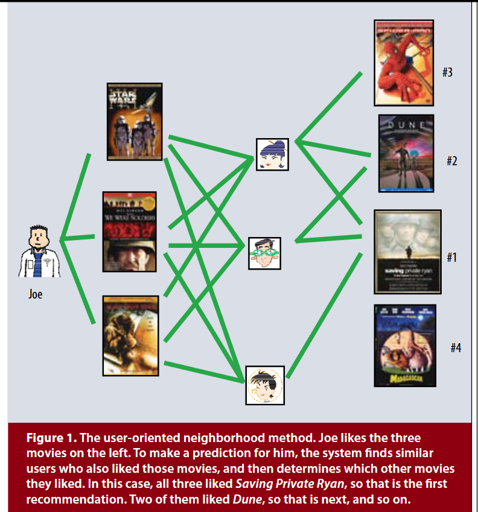

- 추천 시스템은 기본적으로 Content-based Filtering과 흔히 CF 라고 불리는 Collaboratice Filtering으로 나뉜다.
- 본 논문은 Collaboratice Filtering이란 협업 필터링 기반 방식의 하나인 Matrix Factoriztion을 설명한다.
- CF란 사용자와 아이템 간의 상호 관계를 부석하여, 다른 관계를 찾는 것 이다.
- 기본적으로 Domain Free 방식이어서 도메인 지식이 불필요하다는 장점이 있지만, 완전한 새로운 Item 행렬의 등장시에는 추천을 해 줄수 없다. 과거의 데이터가 없기 때문에(Cold Start Problem)

- CF는 근접 이웃 방법(Neighborhood-based CF)과 잠재 요인 모델(Latent Factor model CF)이 존재하는데 Matrix Factorization(행렬분해)는 Latent Factor model 즉 잠재 요인 모델에 해당한다.

> 근접 이웃 방법의 한계
>
> 참조: [[RecSys] Model-Based CF 개념](https://velog.io/@minchoul2/RecSys-Model-Based-CF-%EA%B0%9C%EB%85%90)
>
> -  Neighborhood-based CF(UBCD, IBCF, KNN-CF) 는 두가지 큰 문제점이 있다.
>
> - Sparsity(희소성)문제
>
>   - 데이터가 불충분 하다면 추천 성능이 떨어진다 (유사도 계산이 부정확해지기 때문에)
>   - 신규유저,아이템 처럼 데이터가 부족하거나 없는 경우 추천이 불가능(**Cold Start Problem**)
>
> - Scalability(확장성)문제
>
>   - 유저와 아이템이 늘어날수록 유사도 계산량이 늘어남
>   - 많은 데이터는 정확한 예측을 하지만 시간이 오래걸린다.
>     - 특히 Memory-based CF는 매 유저가 들어올 때마다 계산하기 때문에 실시간으로 추천해주기 어렵다.
>
> - 위와 같은 방식을 Memory-based CF라고도 하며 이러한 방식의 단점을 타개하기 위해 나온 방식이 **지금 알아보는 Model-based CF 방식 중 하나인 Latent Factor Model**이다.
>
> - **Model Based CF의 특징**
>
>   - 데이터에 숨겨진 User-Item relationship 의 잠재적(Latent) 특성,패턴을 찾음
>     - NBCF(Neighborhood-based CF)는 유저 아이템 벡터를 그대로 계산
>
>   - 현업에서 많이 사용 (특히 Matrix Factorization)
>     - 최근에는 MF의 원리를 DL 모델에 응용하는 기법이 높은 성능을 냄
>
>   **Model Based CF의 장점**
>
>   1. 모델 학습/서빙 용이
>      - 데이터는 학습에만 사용되어 모델에 압축된 형태로 저장됨
>      - 이미 학습된 모델을 통해 서빙하기 때문에 속도가 빠름
>   2. Sparsity / Scalability 문제 개선
>      - NBCF에 비해 sparse한 데이터에서도 좋은 성능
>      - 유저 아이템 개수가 늘어나도 좋은 추천 성능
>   3. Overfitting 방지
>      - 전체 데이터 패턴을 학습 -> 특정 주변이웃에 의한 영향력 없어짐
>   4. Limited Coverage 극복
>      - NBCF(Neighborhood-based CF)의 경우 공통의 유저/아이템을 많이 공유해야만 유사도 값의 정확도 향상
>      - MBCF(Model Based CF)는 유사도를 사용하지 않고 전체 데이터 패턴을 학습하기 때문에 이웃 없이도 추천 가능
>
> - 추천 시스템(Recsys)에서 사용하는 데이터의 형식은 두 가지 존재한다. 하나느 Explicit 과 Implicit 방식이다.
>
>   - Explicit feedback
>     - 평점, 별점 등 item에 대한 user의 명확한 선호도를 알 수 있는 데이터
>
>   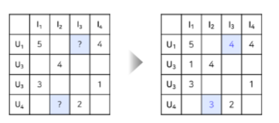
>
>   - Implicit feedback
>     - 클릭여부, 구매여부, 시청여부 등 item에 대한 user의 선호도를 간접적으로 알 수 있는 데이터
>     - 유저-아이템간 상호작용이 있었다면 1(positive), 없었다면 0(negative) 를 원소로 갖는 행렬로 표현
>     - 이때 1이라고 해서 유저가 아이템을 선호한다고 볼 수는 없고, 0이라고 해서 유저가 아이템을 비선호 한다고 볼 수 없다(아이템 자체를 몰랐을 수도 있기 때문에)
>     - 현실에서는 Implicit feedback 데이터의 크기가 훨씬 크고 많이 사용됨
>
>   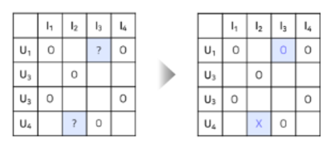
>
> - Latent Factor Model
>
>   - Latent Factor Model 이란 유저와 아이템의 관계를 잠재적 요인(Latent Factor)으로 표현할 수 있을 것이라는 아이디어에서 출발한 모델
>   - User-item Matrix 를 저차원의 행렬로 분해하는 방식으로 작동
>   - 행렬의 차원축소이기 때문에 각 Latent Factor가 무엇을 의미하는지 표면적으로 explicit하게 알 수 없다.
>   - 같은 벡터공간에서 유저와 아이템의 벡터 유사도를 확일 할 수 있고, 이를 통해 추천이 진행된다.
>   - 대표적으로 SVD에서 기반한 Matrix Factorization이다.(SGD, ALS, BPR)

## Background

### Latent Factor

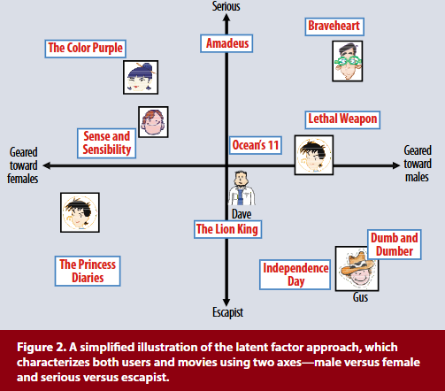

> [Laten Factor 다른 예시](https://yeong-jin-data-blog.tistory.com/entry/%EC%B6%94%EC%B2%9C-%EC%95%8C%EA%B3%A0%EB%A6%AC%EC%A6%98-Matrix-Factorization)

- Latent Fcator model은 잠재적 요인(Latent Factor)으로 표현할 수 있을 것이라는 아이디어에서 출발한 모델이다.
- 즉 **유저와 아이템의 특성을 벡터(Factor, 요인)로 간략화 하는 모델링 기법**

- 위 그림은 논문에서 제시한 영화 선호도 Latent Factor에 대한 설명이다.
- 각 사용자의 선호도를 차원에 기반하여 latent Factor 분석은 진행한 그림이다.
- y축으론 현실성과 비현실적인가를 나타내고, x축은 남성향이냐 여성향인가에 대한 그림이다.
- 위 그림은 벡터의 차원은 2차원으로 정의하고 벡터들이 어디에 존재하는가 알아본 결과이다.
- 실제 분석에선 이 **차원이 제일 중요하다. 이 차원은 그림상에선 2차원으로 설명이 되지만 실제 분석에선 100개가 넘어갈 수도 있다.**
- 즉 실제 분석에선 위 그림처럼 **명확한 특징을 정의할 수 없다. 말 그대로 잠재적인 특성을 파악하는 것 이므로 아이템과 유저간의 관계를 명시적으로 이해할 수 없다.**
- **factor의 공간맵핑을 통해 얻어진 휴리스틱한 판단을 표현한 것 뿐**이지 **각 차원이 실제로 명시하는 특징은 아닌 것**이다.
- 성향을 파악하기 위해 각 유저와 아이템을 잠재 Factor를 표현했고, 이는 같은 공간에 맵핑이 가능하기 때문에 서로의 거리나 각도 등을 통해 유사도를 파악해 잠재적인 취향을 파악할 수 있게 되는 것입니다.
- 여기서 SVD의 시그마의 행렬과 개념이 교차하게 된다.

### SVD

- SVD의 식은 아래와 같다.

$$
A = U\Sigma V^T\\\\
U 는 고유값 분해로 얻은 m \times m 직교행렬 \\
V 는 고유값 분해로 얻은 n \times n 직교행렬\\
Σ 는 m \times n 대각행렬
$$

- SVD는 **특이값 분해**로 각 행렬을 U, V, Sigma로 분해하는 선형대수학의 핵심 개념이다.
- 이때 제일 중요한 개념은 Sigma로, 분해를 통해서 나온 Sigma는 A라는 행렬의 특징을 담고 있다.
- Full SVD를 하고나면 Sigma의 차원은 A의 각 차원에 따른 정보량을 담고있다.
- 다양한 SVD의 형식이 있지만 FULL SVD와 Truncated SVD만 간단하게 설명한다.

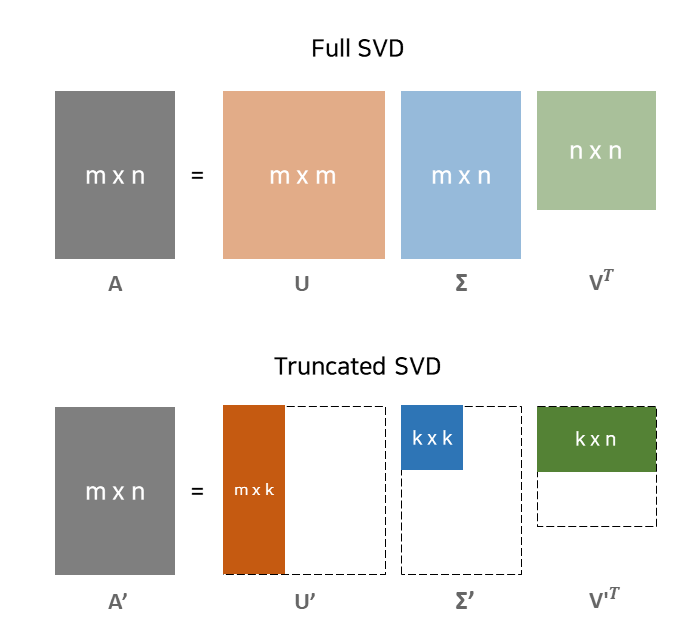

> 출처: [Matrix Factorization : 개요와 원리부터, 최적화(SGD, ALS)까지 이해하기](https://uoahvu.tistory.com/entry/Matrix-Factorization-%EA%B0%9C%EC%9A%94%EC%99%80-%EC%9B%90%EB%A6%AC%EB%B6%80%ED%84%B0-%EC%B5%9C%EC%A0%81%ED%99%94SGD-ALS%EA%B9%8C%EC%A7%80-%EC%9D%B4%ED%95%B4%ED%95%98%EA%B8%B0#Optimization-1)

- Full SVD를 하면 첫번째 그림과 같이 행렬 분해가 이루어 진다.
- Sigma의 크기는 각각 U의 크기와 V의 크기로 이루어 진다. U와 V는 위에서 정의한거처럼 직교행렬이기에 정사각 행렬? 이다.
- Sigma는 대각행렬이기에 주 대각선 이외의 값은 전부 0이다. 이 주대각선의 값들이 중요하다. Sigma의 주 대각선의 값들은 벡터의 길이를 담고 있는데 이는 각 차원의 정보량을 나타낸다.
- 그렇게 나온 Sigma는 k*k 크기 행렬로 쪼갤수 있다.

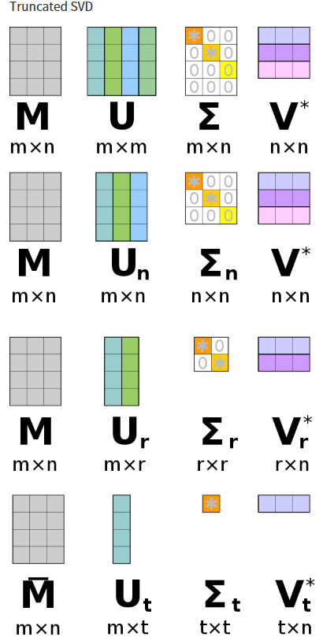

> 출처: [Matrix Factorization : 개요와 원리부터, 최적화(SGD, ALS)까지 이해하기](https://uoahvu.tistory.com/entry/Matrix-Factorization-%EA%B0%9C%EC%9A%94%EC%99%80-%EC%9B%90%EB%A6%AC%EB%B6%80%ED%84%B0-%EC%B5%9C%EC%A0%81%ED%99%94SGD-ALS%EA%B9%8C%EC%A7%80-%EC%9D%B4%ED%95%B4%ED%95%98%EA%B8%B0#Optimization-1)

- Sigma의 크기만큼 U와 V의 크기가 달라지는걸 확인 할 수 있는데, 이는 정보량의 변화를 가져다 주고, 차원에 따라 어느 정도 정보량을 선택할 수 있게 된다.
- 즉 A 행렬의 특징을 잘 쪼개어 각 차원에 따라 중요한 특징만으로 거의 근사하게 복원된 행렬로써, 좀 더 적은 계산과 좀 더 작은 크기로 표현될 수 있는 특징이 있다.

#### SVD의 한계

- 그럼 SVD를 통해 추천시스템 구현이 가능하냐? 하면 아니다.
- 추천시스템의 행렬은 기본적으로 Null 값이 많을 수 밖에 없는데, SVD는 기본적으로 null 값을 허용하지 않는다.
- Sparsity가 높은 데이터의 경우 결측치가 매우 많은데, 실제 데이터는 대부분 Sparse Matrix이다.
- 결측치를 모두 0으로 대체 or 평균값으로 대체하는 방식으로채워 형식상 Dense Matrix를 만들어 SVD 수행하는 방식이 있다.
- 하지만 위와 같은 결측치 대체는 데이터의 양을 상당히 증가시키기 때문에 cost 증가 하고 Null값 대체는 정확하지 않기 때문에 데이터를 왜곡시키고 예측 성능을 떨어뜨린다.
- 그래서 MF(Matrix Factorization)방식을 사용한다.

## Matrix Factorization

- MF는 SVD의 단점을 보완하기 위해 등장한 방식이다.
- 큰 그림에서 SVD를 틀로놓고 분석하지만 SVD와는 완전히 별개의 분석 방식이다.
- MF의 목표는  **관측된 평점만 모델링에 사용**하고 **관측되지 않은 평점을 예측**하는 일반적인 모델을 만드는 것이 목표이다.
- 아래의 그림으로 이해해보자

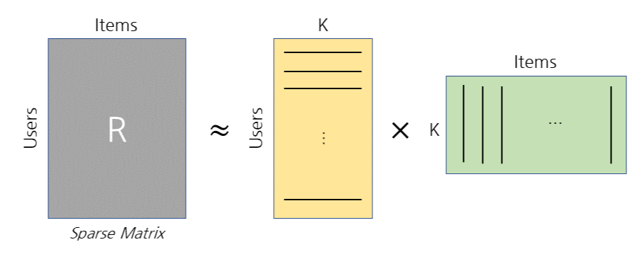
$$
R≈ UI^T=\hat{R} \\
U:UserLen \times K \\
I:ItemLen \times K
$$

> 출처: [Matrix Factorization : 개요와 원리부터, 최적화(SGD, ALS)까지 이해하기](https://uoahvu.tistory.com/entry/Matrix-Factorization-%EA%B0%9C%EC%9A%94%EC%99%80-%EC%9B%90%EB%A6%AC%EB%B6%80%ED%84%B0-%EC%B5%9C%EC%A0%81%ED%99%94SGD-ALS%EA%B9%8C%EC%A7%80-%EC%9D%B4%ED%95%B4%ED%95%98%EA%B8%B0#Optimization-1)

- 위 그림은 MF의 기본 형태의 식과 그림이다.
- MF는 Latent Factor Model 인데, Latent Factor Model의 핵심은 유저와 아이템의 잠재 요인을 벡터화 한다.
- 추천 시스템 구현을 위해 유저가 어떠한 아이템에 대한 행동 혹은 평가가 기록된  Sparse Matrix(여기선 R)이 존재할 것이다.
- User에 대한 Latent Factor가 담긴 행렬, 하나는 Item에 대한 Latent Factor가 담긴 행렬이다. 
- 그림 속 노란색 행렬 속에 **각 유저들에 대한 잠재 벡터가 행방향으로 구성**되어 있고 녹색 행렬 속에 **각 아이템에 대한 잠재 벡터가 열 방향으로 구성 되어 있는걸 확인 가능하다.**
- K는 하이퍼 파라미터로 분석가가 직접 설정한다. K가 크면 정보를 많이 쪼갠다는 뜻이고, 적개하면 적개 쪼갠다는 뜻이다. 여기의 K는 **위 그래프 그림의 차원을 나타낸다.**
- MF는 SVD를 통해 설명 가능하다. 

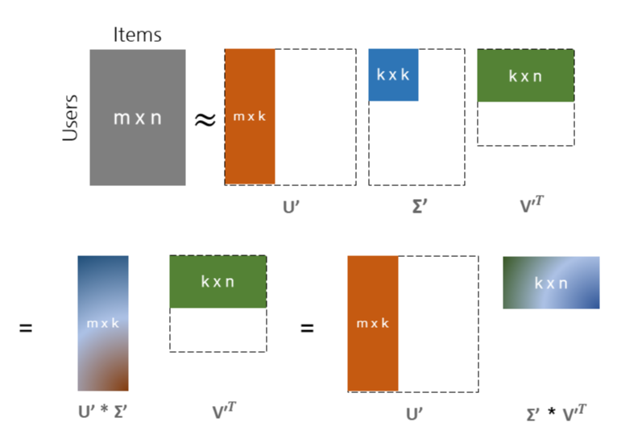

> 출처: [Matrix Factorization : 개요와 원리부터, 최적화(SGD, ALS)까지 이해하기](https://uoahvu.tistory.com/entry/Matrix-Factorization-%EA%B0%9C%EC%9A%94%EC%99%80-%EC%9B%90%EB%A6%AC%EB%B6%80%ED%84%B0-%EC%B5%9C%EC%A0%81%ED%99%94SGD-ALS%EA%B9%8C%EC%A7%80-%EC%9D%B4%ED%95%B4%ED%95%98%EA%B8%B0#Optimization-1)

- Truncated SVD를 통해 우리는 유저와 아이템 간의 sparse matrix를 세개의 행렬로 쪼개 근사하게 표현가능하다.
- Truncated SVD는 MF의 근간이 되는 개념으로 MF는 총 두 개의 행렬로 쪼개야하고 SVD의 Sigma가 그 역할을 한다.
- 주황색으로 표현되었던 m x k 행렬 (U 행렬) 과, 중간의 파란색으로 표현된 k x k (S 행렬) 을 곱하여 m x k 행렬로 만들수 있다.
- 녹색으로 표현된 k x n(I) 행렬과 시그마 행렬인을 곱하여 k x n 행렬로 만들수 있다.
- 어느 방향으로 쪼개도 상관이 없다. 둘 중 어느 방법을 사용하여도 결국 UV^T 방식으로 곱해지기에 각각의 행렬은 **유저의 잠재벡터 행렬이 되고 아이템의 잠재벡터 행렬이 된다.**
- 이렇게 쪼갠 행렬은 이제 식에 맞게 **다시 행렬곱을 진행을 하면서 복원 시킨다. 이는 복원된 예측 행렬로써 그 기능을 수행한다.** 
- 말이 어려운데 그냥 간단하게 **분해를 해서 원본 데이터 보다 노이즈를 가지고 그 노이즈를 제거하는 방식으로 학습한다고 생각하면 편하다. 여기서의 노이즈는 정보의 손실이다.**
- 근데 잊어버린게 있다. 유저와 아이템 간의 평점 행렬은 알다시피 Sparse Matrix이기에 빈 공간이 존재하면 안된다. 행렬을 분해하기 위해선 null값이 존재하면 안된다.
- 그래서 행렬을 분해하기 위해 빈공간은 보통 0 혹은 평균값 등으로 대체하게됩니다.
- 근데 0이나 평균으로 대체 하면 위에서 말했듯 정확하지 않다고 했다. 그래서 여기서 Model base 답게 학습을 진행을 한다.
- Model base이기에 당연히 Optimizer와 Object Function이 존재한다. 이를 통해서 학습이 진행된다.

## MF의 Objective Function and Optimization

- 여기선 머신러닝에서의 MF의 함수들과 학습 방법에 대해서 설명한다.
- 목적함수와 그 학습 방식에 대해 설명하는데 크게 다를거 없다. 기본적으로  오자체곱합에 L2 정규화를 한걸 목적함수로, 옵티마이저는 두가지로 대중적인 SGD와 독특한 ALS 두 가지를 사용한다.

### Objective Function 

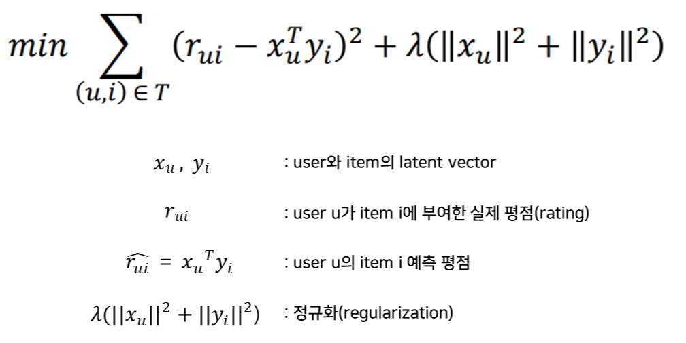

> 출처: [Matrix Factorization : 개요와 원리부터, 최적화(SGD, ALS)까지 이해하기](https://uoahvu.tistory.com/entry/Matrix-Factorization-%EA%B0%9C%EC%9A%94%EC%99%80-%EC%9B%90%EB%A6%AC%EB%B6%80%ED%84%B0-%EC%B5%9C%EC%A0%81%ED%99%94SGD-ALS%EA%B9%8C%EC%A7%80-%EC%9D%B4%ED%95%B4%ED%95%98%EA%B8%B0#Optimization-1)

- 크게 어려울거 없다 기존적이로 **오차제곱합에 L2 정규화를 한 방식을 Objective Function 로 사용한다.**
- 빈 공간을 채워야 하기에 **예측해야 하는 값은 실제 관측된 값과 예측된 값의 오차를 비교한다.**
- 여기서 학습으로 찾는 값은 **유저의 잠재행렬과 아이템의 잠재행렬이다.**
- 하이퍼 파라미터는 **SVD의 Sigma에 해당하는 각 차원의 정보량을 나타내는 각 행렬의 K**와 **L2 정규화에서 행렬의값이 너무 커지지 않게 제약을 걸 때 사용되는 람다 그리고  한 Epoch 마다 학습률을 지정하는 learning late이다.**
- 각 잠재행렬을 구해 **실제값과 예측값을 최소화 하는 방향으로 학습을 하는게 본 식의 학습의 목표이다.**

### Optimization

- Optimization은 학습의 방법을 어떻게 할지 정하는 거다.
- 기본적으로 GD 방식을 사용하는데 여기선 SGD와 ATL을 사용한다.

#### SGD(Stochastic Gradient Descent)

> [SGD 설명은 여기](https://wikidocs.net/21670)

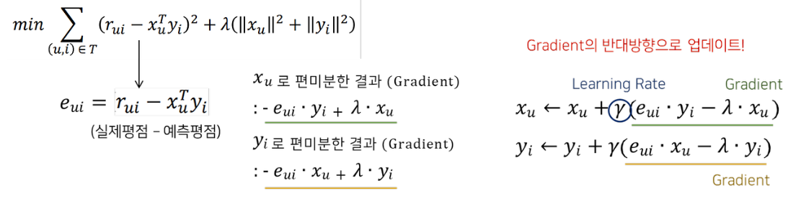

> 출처: [Matrix Factorization : 개요와 원리부터, 최적화(SGD, ALS)까지 이해하기](https://uoahvu.tistory.com/entry/Matrix-Factorization-%EA%B0%9C%EC%9A%94%EC%99%80-%EC%9B%90%EB%A6%AC%EB%B6%80%ED%84%B0-%EC%B5%9C%EC%A0%81%ED%99%94SGD-ALS%EA%B9%8C%EC%A7%80-%EC%9D%B4%ED%95%B4%ED%95%98%EA%B8%B0#Optimization-1)

- 목적함수의 유저 벡터와 아이템 벡터를 각각 편미분하여 각 벡터의 **변화량을 구한다. 그렇게 구한 변화량을 Learning Rate의 비율만큼 각 행렬에 더하면서 유저 행렬과 아이템 행렬의 값을 업데이트 한다.**
- SGD는 경사하강법에서 가장 기초적인 방법이다.
- 여기서 **선형회귀 모델이랑 다른점은 업데이트 해야하는 변수가 두 개라는 점이다.**
- Learning Rate는 알다시피 한 배치마다의 업데이트량을 조절해서 값의 업데이트가 너무 극단적으로 변하지 않게 조절해준다.

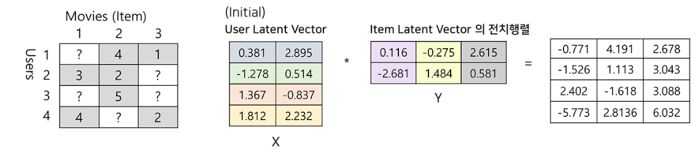

> 출처: [Matrix Factorization : 개요와 원리부터, 최적화(SGD, ALS)까지 이해하기](https://uoahvu.tistory.com/entry/Matrix-Factorization-%EA%B0%9C%EC%9A%94%EC%99%80-%EC%9B%90%EB%A6%AC%EB%B6%80%ED%84%B0-%EC%B5%9C%EC%A0%81%ED%99%94SGD-ALS%EA%B9%8C%EC%A7%80-%EC%9D%B4%ED%95%B4%ED%95%98%EA%B8%B0#Optimization-1)

- 위 업데이트 과정을 요약하면 위 그림과 같다.
- 여기 null 값은 존재해도 된다. 어차피 원본 행렬에서 행렬분해를 진행하는게 아닌 유저 Latent Vector와 아이템 Latent Vector를 그냥 랜덤 초기화해서 곱을하여 예측값을 만들어 존재하는 실제값과 비교하면서 값을 X와 Y를 업데이트 하기 때문이다.

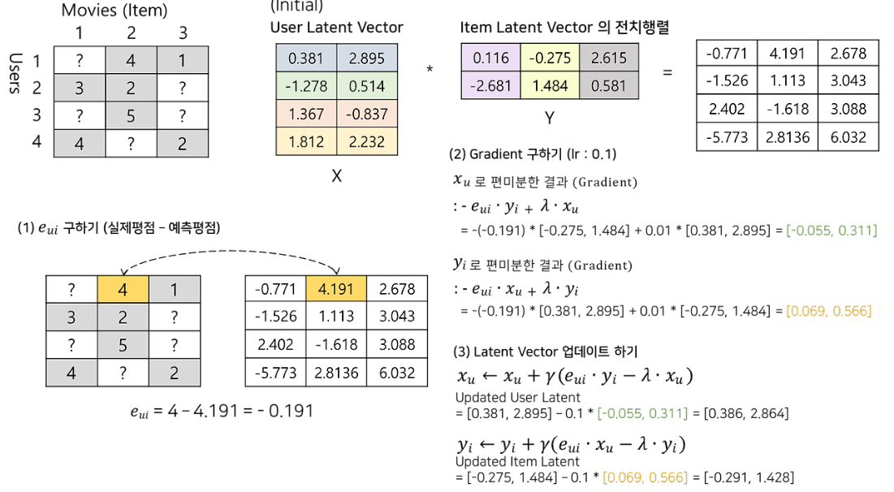

> 출처: [Matrix Factorization : 개요와 원리부터, 최적화(SGD, ALS)까지 이해하기](https://uoahvu.tistory.com/entry/Matrix-Factorization-%EA%B0%9C%EC%9A%94%EC%99%80-%EC%9B%90%EB%A6%AC%EB%B6%80%ED%84%B0-%EC%B5%9C%EC%A0%81%ED%99%94SGD-ALS%EA%B9%8C%EC%A7%80-%EC%9D%B4%ED%95%B4%ED%95%98%EA%B8%B0#Optimization-1)

- 위 그림은 한 epoch의 전체적인 과정을 보여주고 있다.
- 랜덤 초기화 시킨 X와 Y를 통해 초기 예측값을 생성 한다.
- 그 후 실제평점"과, 예측행렬로부터 나온 "예측평점"간의 오차를 구해주고 L2 오차제곱합를 구한다.
- 이 때 서로 비교군은 **실제 관측된 평점이다. null값은 그냥 이정도 나올거다 예측하는거지 저걸로 얼마나 옳게 학습이 되었냐 판단하는게 아니다.**
- 그 후 **유저의 잠재벡터, 아이템의 잠재벡터 각각을 기준으로 목적함수를 편미분**하고 learning rate만큼 그 차이를 업데이트한다.
- SGD는 모든 사용자(u) 잠재 벡터와 모든 아이템(i) 잠재 벡터에 대해서 파라미터 업데이트를 하나씩 순차적으로 진행된다.
- 따라서 **사용자와 아이템 수가 많아질수록 학습이 매우 오래 걸린다**
- 하나씩 순차적으로 학습해야 하다보니 병렬처리가 불가능하다. 이러한 단점을 보완하여 병렬 처리가 가능한 **ALS를 제시한다.**

#### ALS(Alternating Least Squares)

- 본 방식은 SGD 보다 학습 속도를 기하급수적으로 늘려주는 방식이다.
- SGD는 순차적인 알고리즘으로 병렬처리가 불가능하지만 ALS는 특수한 방식으로 학습을 진행하면서 병렬처리를 가능하게 만들어 준다.
- **SGD로는 평점과 같은 사용자가 직접적으로 아이템에 대해 형가를 내린 Explicit FeedBack 에만 적용이 가능하다.**
- **하지만 실무에서의 데이터는 평점처럼 명확하지 않다. **그 사람이 실수로 누른걸 수도 있고, 그냥 평점 5점이 리뷰 이벤트 같은걸로 준 걸수도 있다.
- 이러한 데이터들을 **Implict Feedback이라고 하며 실무에선 본 데이터를 주로 다룬다.**
- **ALS의 메인 아이디어는 유저와 아이템 두 잠재 벡터중 하나(p혹은 q)를 상수값으로 고정하고 다른 하나를 업데이트 하는 방식이다.**

$$
\min_{P,Q}\sum_{observed\,r_{u,i}}(r_{u,i}-p^T_uq_i)^2 + \lambda(||p_u||^2 + ||q_i||^2)
$$

- 위는 ALS 방식의 MF 목적함수 이다. **지금 기호만 달라진거지 위의 목적함수와 다를게 없는 식이다.** 
- 즉, 목적함수는 MF의 SGD랑 같다. 당연하지만, 학습 방법이 다른거지 목적함수가 다를 이유는 없다.
- 그러나 여기서 한 상수를 고정 후 나머지 변수를 찾는 방식으로 학습을 진행한다면? **결국 선형 회귀 문제랑 같아진다.**
- SGD방식이랑 다르게 선형 회귀 모형으로 답을 구할수 있기에 가장 전통적인 방식 OLS 방식을 참조 가능하다

****

#### 추가. OLS란

- 최소 제곱법 혹은 최소 자승법으로 불리면서, **예측값과 실제값의 차이가 최소로 되게 회귀 선을 그리는 방식을 말한다 즉 잔차제곱합이 최소가 되게 학습을 한다..**
- OLS는 회귀 계수가 1개인 가장 단순한 선형회귀 방식이며, 회귀 계수는 기울기 즉 베타를 계속 변화 시키며 최적의 회귀선을 찾는다.

$$
y=X\beta \,\,\,\,\,\,\,\ RSS= ||y-x\beta||^2
$$

- 최적의 미분선을 찾는 방법은 SGD랑 마찬가지로 **미분을 통하여 찾는다. 베타를 기준으로 미분값이 0일 때 RSS는 최솟값을 가진다.**

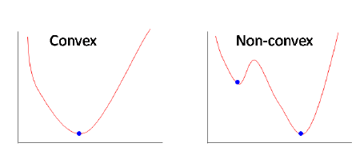

> 출처: [[추천시스템] Alternating Least Square (ALS)를 활용한 Matrix Factorization](https://sungkee-book.tistory.com/13)

- RSS는 Convex funtion이기에 위 그림 처럼 기울기가 0인 곳은 한곳이다.
- 이 점은 매우 큰 장점이다.

***

- MF는 원래 유저 벡터와 아이템 벡터 두 변수를 예측하는 모델이다.
- 하지만 ALS는 두 변수중 찾고자 하는 잠재 벡터 반대 변수 하나를 상수로 고정시킨 다음 잠재 벡터를 찾는 방식이다.
- 결국 우리가 어떠한 값을 찾느냐에 따라서 목적함수가 달라지기에 총 두 개의 목적함수가 존재하게 된다.

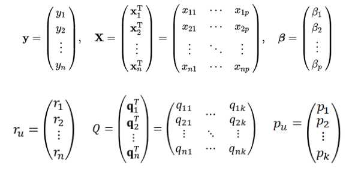
$$
\min_{p_u}||r_u-Qp_u||^2+ \lambda||p_u|| \\
\min_{q_i}||r_i-Pq_i||^2+ \lambda||q_i||
$$

> 출처: [[추천시스템] Alternating Least Square (ALS)를 활용한 Matrix Factorization](https://sungkee-book.tistory.com/13)

- OLS 분석 처럼 목적 함수가 구성된다.
- 각 찾고자 하는 잠재 벡터에 맞춰 r을 지정하고 상수 벡터(Q,P)와 잠재 벡터(pu, qi)의 벡터의 곱를 해서 나온 결과의 오차를 제곱을 한다.
- 뒤 람다는 L2 정규화이다.

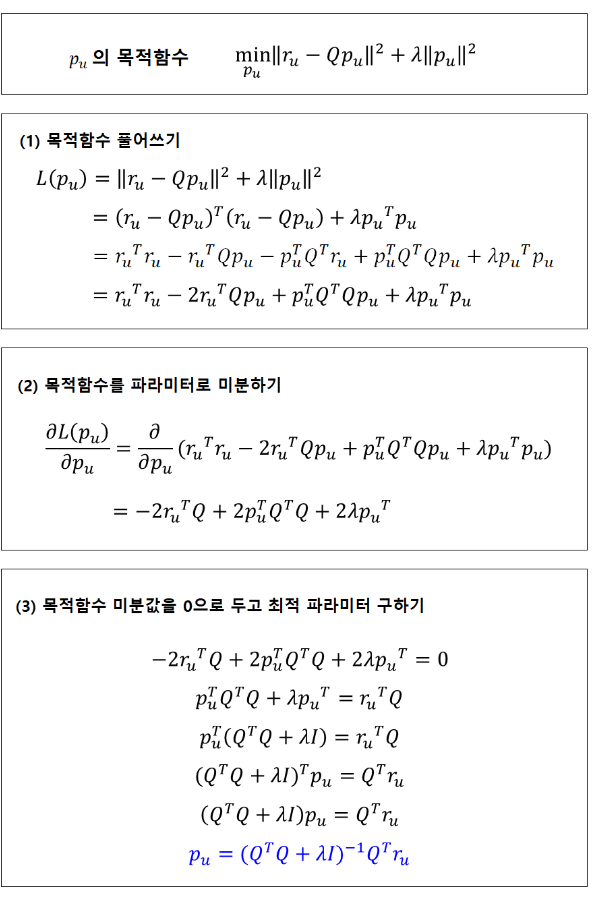

> 출처: [[추천시스템] Alternating Least Square (ALS)를 활용한 Matrix Factorization](https://sungkee-book.tistory.com/13)

- 필요한 값들을 정의했으면 OLS 최적화 방법과 마찬가지로 최적의 해를 구한다.
- 뭐가 많아 보이는데 그냥 미분해서 변화율을 찾고 그게 0일 때를 찾으면 그게 베타가 되고 회귀선의 최적의 기울기가 되는거다.
- 그렇기에 만약 위 그림처럼 p를 찾기 위한 식이면 p가 베타의 역할을 하기에 미분 결과가 0이면 그게 최고의 p값이란 이야기다.
- 위 그림은 p에 대해서지만 q에도 똑같이 적용하면 된다. 번갈아 가면서 위 작업을 총 두번 진행한다.
- ALS는 아래 두 수식을 가지고 서로 번갈아 가면서 업데이트를 진행한다.

$$
p_u=(Q^TQ+\lambda I)^{-1}Q^Tr_u \\
q_u=(P^TP+\lambda I)^{-1}P^Tr_i
$$

- **OLS는 Convexity 덕분에 유일하고 가장 작은 목적함수 값을 보장할 수 있다. 따라서 목적함수는 같거나 작아질수는 있어도 절대 증가하지 않는다. 업데이트를 진행할수록 목적함수는 작아질 수 밖에 없다.** 
- **그래서 ALS는 SGD랑 다르게 순차적으로 업데이트 할 필요가 없다. SGD는 미분 계수가 0이어도 그게 최적의 값이 아닐수 있는데 OLS는 주어진 행렬을 가지고 그냥 계산만 하면 미분계수가 0인 값이 무조건 하나만 나오기 때문이다.**
- **본 방식의 최고 장점은 병렬처리가 가능하게 해준다는 점이다. 주어진 행렬을 가지고 계산만 하면 나오기 때문이다.**

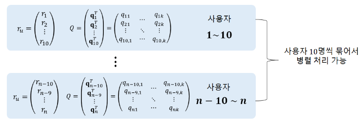

> 출처: [[추천시스템] Alternating Least Square (ALS)를 활용한 Matrix Factorization](https://sungkee-book.tistory.com/13)

## MF의 추가 테크닉 - Adding Biases

- 기본적으로 추천시스템의 데이터에는 특성이 녹아져 있는 데이터라 유저나 아이템 별로 평점에 편향이 존재할 확률이 매우 높다.
- 사람의 성향이 다르기때문에 나처럼 리뷰이벤트 한다고 5점만 주는 사람, 혹은 그 이동진 처럼 앵간하면 점수를 짜게 주는 사람 처럼
- 혹은 아이템 적으로는 어떠한 영화는 불세출의 명작이라 점수가 평균적으로 높고, 혹은 희대의 망작이라 전체적으로 평점이 낮을 수 있다. 즉 **유저와 아이템의 상호 관계와 관계 없이 유저나 혹은 아이템의 자체적인 특성에 의해 그 평점이 영향을 받는 상황이 존재한다.**
- 그래서 기존 식에 **사용자, 아이템 각각의 Bias(편향)를 추가하여 설명할 수 있는 부분을 추가하는 방식으로 모델링 한다.**

$$
\hat{r}_{u,i}= \mu+b_u+b_i+p^T_uq_i \\
\\
\mu: 평균 \\
b_u,b_i: 유저와 아이템의 편향 \\
p_u,q_i:유저와 아이템의 잠재행렬
$$

- Bias를 추가한 목적함수는 위와 같다.
- 여기서 제일 주의할점은 **mu는 학습 데이타로부터 도출되는 상수값인 반면에, Bias들은 모두 학습 대상인 파라미터라는 것이다.**
- 따라서 옵티마이저 시에 두 번째 정규화 텀에 Bias는 추가되어 있지만, mu는 추가되지 않는다.

$$
\min_{P,Q}\sum_{observed\,r_{u,i}}(r_{u,i} -\mu -b_u -b_i -p^T_uq_i)^2 + \lambda(||p_u||^2 + ||q_i||^2 +b^2_u + b^2_i)
$$

- 위는 Bias를 추가해서 수정된 Adding Bias의 목적함수이다. 
- 아 참고로 표현법이 다른 이유는 기존 선형회귀랑 다르게 bias는 스칼라 값 즉 상수이고 p,q는벡터이다.

$$
b_u= b_u + \eta \, \cdot(e_{u,i} - \lambda b_u) \\
b_i= b_i + \eta \, \cdot(e_{u,i} - \lambda b_i) \\
p_u= p_u + \eta \, \cdot(e_{u,i} - \lambda p_u) \\
q_u= q_u + \eta \, \cdot(e_{u,i} - \lambda q_u) \\
$$

-  위 목적 함수를 바탕으로 아래 SGD를 적용하여 업데이트 공식은 위와 같다.
- 수정된 목적함수 식에다가 학습 후 찾아야하는 파라미터가 총 4 종류 이므로 각각 편미분하여 Gradient를 구하고 이를 바탕으로 업데이트를 수행한다.
- 기존 방식 보다 Adding Bias를 적용했을 때 성능이 더 좋게 나온다.

## Additional Input Sources and Temporal Dynamics

### Additional Input Sources

- MF는 위에서 언급했다 시피 Cold Start Problem 문제가 존재한다. 새로운 item 행렬 혹은 유저 행렬이 등장시에는 추천 결과를 가지기 힘든 문제이다.
- 이 경우 사용자에 대한 추가적인 정보 소스들을 모두 통합할 필요가 있다.
-  즉, **행동 정보**(Behavior Information)들이 필요하다. 예를 들어 소매업자는 고객의 구매 기록이나 검색 기록 등을 활용할 수 있다.
- 단순화 하기 위해 Boolean 암시적 피드백이 존재하는 경우를 생각해 보자.

- *N(u)*는 암시적 선호도를 표현한 사용자(u)의 아이템 집합이다. 이 아이템 집합과 비슷한 선호도를 보인 사용자의 데이터를 들고온다.

$$
\sum_{i \in N(u)} x_i
$$

- 이 식을 정규화하는 것이 일반적으로 더 좋은 결과를 가져오기에, 정규화를 하겠다.

$$
|N(u)|^{-0.5} \sum_{i \in N(u)} x_i
$$

- 또 중요한 정보는 인구학적 정보와 같은 **사용자 속성**(User Attributes)이다. 유사하게 표현하면 아래와 같다.

$$
\sum_{a \in A(u)} y_a
$$

- 모든 Signal Source를 통합하여 개선된(Enhanced) 사용자 표현식은 아래와 같다.

$$
\hat{r_{ui}} = \mu + b_i + b_u + q^T_i [p_u + |N(u)|^{-0.5} \sum_{i \in N(u)} x_i + \sum_{a \in A(u)} y_a]
$$

### Temporal Dynamics

- 지금까지의 모델은 사실 정적(static)인 모델이었다. 즉, 시간의 변화를 반영하지 못한다는 뜻이다.
- 하지만 추천 시스템은 시간에 따라 변하는 사용자-아이템 상호작용의 동적(dynamic)인 성질을 반영하는 **Temporal Effect**에 대해 설명할 수 있어야 한다.
- 총 3개의 항이 변화한다.
  - b_i(t): 아이템의 인기는 시간에 따라 변한다.
  - b_u(t): 사용자의 성향도 시간에 따라 변한다. (baseline rating)
  - p_u(t): 시간이 흐름에 따라 아이템에 대한 사용자의 선호는 변화할 수 있다.

$$
\hat{r_{ui}}(t) = \mu + b_i(t) + b_u(t) + q^T_i p_u(t)
$$

## Inputs with varying confidence levels

- 모든 관측값이 신뢰도를 가지는건 아니다.
- 뭐 리뷰이벤트 때문에 좋은 점수를 준걸 수도 있고, 그냥 감독이 싫어서 낮은 점수를 주는 등 점수가 절대적일 수는 없다.
- 그렇기에 예측된 선호도에는 **신뢰도를 붙혀야 한다.**
- 신뢰도는 action의 빈도로 설명이 가능하다. 예를 들어 사용자의 특정 행동을 얼마나 오래, 자주 했었냐가 신뢰도의 실수 값으로 사용한다.

$$
\min_{p, q, b} \sum_{(u, i) \in K} c_{ui}( r_{ui} - \mu - b_i - b_u - q^T_i p_u  )^2 + \lambda (\Vert{q_i}\Vert^2 + \Vert{p_u}\Vert^2 + b^2_u + b^2_i)
$$

- 위는 그래서 신뢰도를 붙힌 새로운 목적함수이며, 신뢰도는  **Implicit Feedback에 사용된다.**

### Implicit Feedback

- Implicit Feedback에는 두 가지의 속성이 존재하는데 첫 번째는 위에서 설명한 신뢰도(confidence)와 두 번째는 선호도(Preference)가 있다.
- Preference는 유저u가 아이템 i를 선호하는지 여부를 binary로 표현한다.

$$
f_{ui} = \begin{cases}
    1, & r_{ui} > 0 \newline
    0, & r_{ui}= 0
\end{cases}
$$

- Confidence는 유저 u가 아이템 i를 선호하는 정도를 나타내는 Increasing function이다.

$$
c_{ui} = 1 + \alpha \, \cdot r_{ui}
$$

- 알파는 positive와 negative 간의 상대적인 중요도를 조정하는 하이퍼 파라미터 이다.

>**Refernce**
>
>https://sungkee-book.tistory.com/13
>
>https://velog.io/@minchoul2/RecSys-MF-Matrix-Facotrization
>
>https://uoahvu.tistory.com/entry/Matrix-Factorization-%EA%B0%9C%EC%9A%94%EC%99%80-%EC%9B%90%EB%A6%AC%EB%B6%80%ED%84%B0-%EC%B5%9C%EC%A0%81%ED%99%94SGD-ALS%EA%B9%8C%EC%A7%80-%EC%9D%B4%ED%95%B4%ED%95%98%EA%B8%B0
>
>https://greeksharifa.github.io/machine_learning/2019/12/20/Matrix-Factorization/
