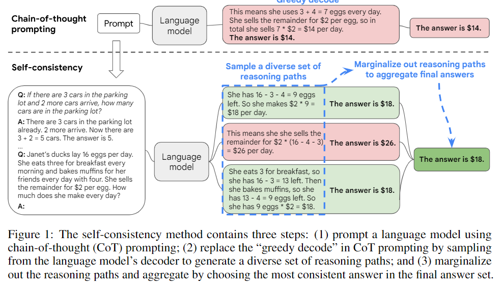
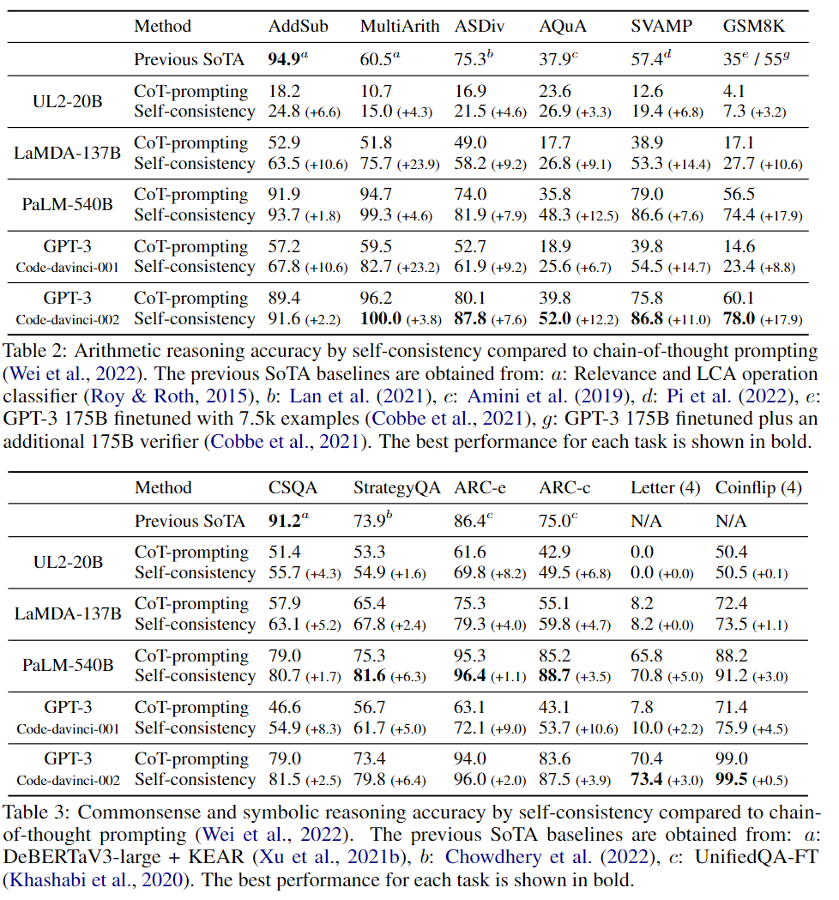
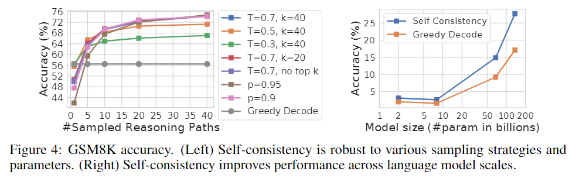
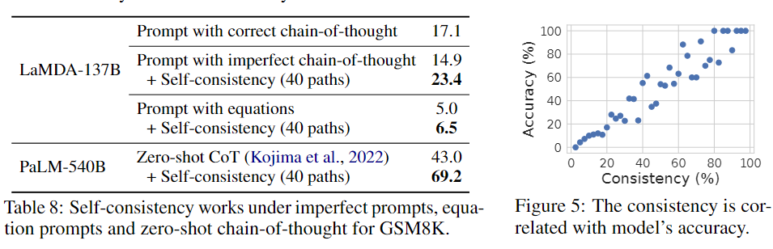

#Prompt #RAG #CoT  

본 논문 리뷰는 논문이 제안한 방식과 결과만 리뷰함

## 1. Introdiction

- 논문 기준 모델의 스케일을 더욱 키우기는 힘들어서 CoT라는 좋은 대안책이 나와 LLM의 성능을 많이 올려주었다.

- 논문은 기존의 CoT에서 사용하던 Greedy 방법론을 대체할  self-consistency 방법론을 소개한다.
- Self-consistency를 사용하면 사람과 마찬가지로 LLM이 다양한 방법에 대해 생각하면서 더욱 좋은 결과를 반환한다.

- 위 사진은 self-consistency의 예시이다.  일반 CoT의 greedy decoding 방식 대신 여러가지 CoT 답변을 생성 한 다음 최종 답변을 다수결로 결정하는 방식이다.
- 이러한 방식은 보다 정확한 답변을 기대할 수 있고, 단일 sample에 의한(하나의 결과에 의한? 이라고 봐야하나)repetitiveness 와 local-optimality를 예방 가능하다. (아마 틀린 결과가 나와도 같은 결과를 계속 반복한다거나 특정 데이터 혹은 주어진 문제에만 강한 성능을 보이는 문제를 예방가능하다는거 같다.)
- 다양한 답변을 만들어서 최적의 결과를 받다 보니 self-consistency은 fine tuning을 하거나 Prompt에 추가적인 정보를 제공할 필요가 없다.
- 또한 모델안에서 돌아서 결과를 취합해 최종 결과를 반환하는게 아닌 모델의 동작과는 전혀 무관한 방식이다.

## 2. Self-consistency over diverse reasoning paths

- 본 논문은 실제 인간 처럼 여러가지 생각을 하고 거기에서 정답을 유추하는게 모델의 decoder 부분에도 적용 가능하다고 생각한다.

- 그래서 본 논문은 self-consistency의 구성/ 작동 방식을

  1. CoT를 활용하여 Prompt를 작성한다.

  2. 다양한 decoder의 출력을 greedy방식을 사용하지 않고 sampling하고 여러가지의 CoT 추론 사슬을 얻는다.

  3. decoder에서 문장을 만드는 알고리즘은 temperature나 혹은 top-k, nucleus smapling을 사용한다.

     > 다양한 decoder의 Smapling for Text Generation을 알고 싶으면 아래 블로그를 참조하는게 편하다.
     >
     > [Sampling for Text Generation](https://huyenchip.com/2024/01/16/sampling.html)

  4. 마지막으로 가장 일관된(가장 많이 등장 혹은 가장 비슷한 추론 후 결과)가 많은 답을 고른다.

- 이러한 방식으로 본 주제를 탐구하였을 때 추론 작업에는 일반적인 답변이 존재 한다는걸 찾았다. 우리가 고정된 하나의 답변을 원할 때도 여러가지 추론 방식이 도움된다는걸 알고  open-ended text generatio방식을 이용하여 self-consistency를 만들었다.

## 5. Conclusion and discussion

-  본 논문은 zero-shot CoT 혹은 few-shot CoT에 대해서도 Self-consistency가 효과가 있다는걸 확인했다.
- 하지만 이 방법에는 딱 한가지 걸림돌이 있는데 다른 언어 모델 방식 보다 계산되어야 하는 양이 많다는 거다. 즉 일반적인 방식 보다 컴퓨팅 스케일이 더 커야한다. 그래서 실제로 사용할려면 논문에서 처럼 40개씩 보지 말고 5~10개 뽑고 self-consistency를 해야한다.

## Reveiw

- 이때까지의 CoT 논문의 transformer 모델의 decoder의 문장 생성 알고리즘이 greedy한 방식을 사용하지만 요번 논문에선 top_k 혹은 temperture을 사용하면서 이걸 사용하면 우째되지 라는 가려운 부분을 긁어 줬다.
- 하지만 이 방식이 CoT 방식이 사용되기는 어려울거 같다. 안그래도 CoT가 유의미할려면 모델의 size가 커야해서 자원을 많이 잡아먹는데 여기서 더 자원을 잡아 먹으면 이건 뭐 대기업 아니면 힘들거 같다.