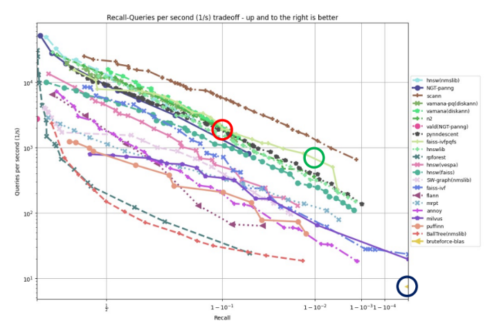
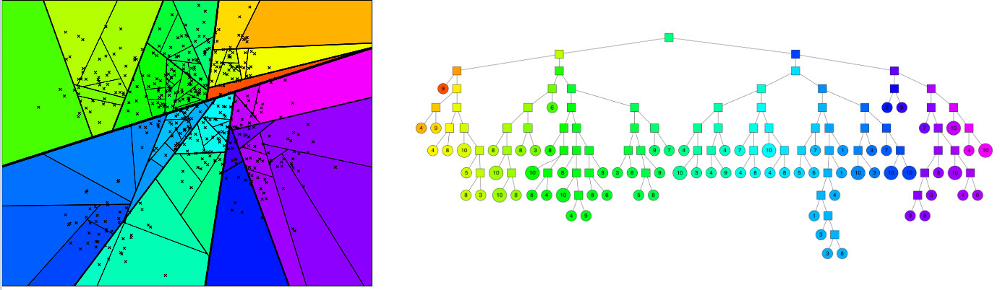
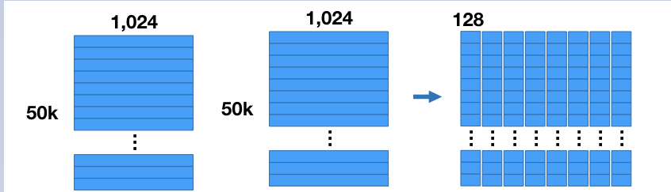

#추천시스템 #벡터디비 #그래프 #알고리즘 #자료구조

- ANN은 Approximate Nearest Neighbor이란 말로 **근사 최근접 이웃 방법**이다.
- 아니 근데 옜날에는 NN 이라는 이름이 붙으면 nearest neighbor 이라는 이름이 붙어서 대충 거리 기반 모델들인 최근접 이웃 탐색 류 라고 생각하면 됬는데 이제 NN은 Neural network의 약자로 더 많이 쓰인다.
- 심지어 ANN은 nearest neighbor과 Neural network 를 약자로 들고있는 서로 다른 개념이 존재함 ㅋㅋ
- ANN(Approximate Nearest Neighbor)과 AI(Artificial Intelligence)를 의미하는 ANN(Artificial Neural network) 이렇게
- 근데 뭐 딥러닝의 ANN 이란 말은 잘 사용하지 않는다. 보통 가장 기초적인 뉴럴넷 모델을 소개할 땐 DNN이라고 하거나 인공지능을 말할거면 AI라고 하지
- 무튼 오늘 배울 ANN은 **벡터 유사도를 공간적인 관점에서 개산 할 때 가장 많이 사용되는 최근접 이웃법이다.** 
- Rag를 사용할 때 대부분의 Vector DB의 유사도 검색에 본 ANN 개념이 주로 사용된다.
- **본 포스팅은 Recommender을 기준으로 설명한다.**

## ANN이란

- 기본적으로 NN(Nearest Neighbor) 들은 Vector Space에서 내가 원하는 Query Vector와 가장 유사한 Vector를 찾는 알고리즘이다.
- NN은 기본적으로 그래서 추천이 아니라 공간의 거리 기반 모델이다.
- 근데 MF 혹은 Item2Vec과 같은 추천시스템의 등장으로 Vector간 유사도 연산을 통해 인접한 이웃을 찾기 위해 도입 된다.
- 가장 대표적인 NN 방식은 KNN으로 개중 **Brute Force KNN 이다.** KNN은 특정 한 벡터(node)와 가장 가까운 K개의 벡터(node)를 구하는 방식이다.
- 하지만 설명만 들어도 알겠듯이 앵커 벡터(혹은 Anchor node)와 다른 벡터들의 모든 거리 혹은 유사도를 계산해야한다. 만약 이게 유저가 만 명만 넘어가도 계산량이 실로 어마어마해진다.
- 물론 정확도 관점으로 KNN은 매우 좋은 모델이다. 하지만 서빙 관점으론 최악의 모델이다. 현 AI 시대는 물론이요 실무에선 정확도 보단 속도가 더욱 중요하다.
- **그래서 ANN이 등장했다. ANN이란 정확도는 조금 포기하고 아주 빠른 속도로 주어진 vector의 근접 이웃을 찾기 위해 완벽한 거리 계산을 통한게 아닌 근사적으로 구한 근접 이웃 방법을 말한다.**

> 출처:[[RecSys] ANN : Approximate Nearest Neighbor 기법](https://velog.io/@minchoul2/RecSys-ANN-Approximate-Nearest-Neighbor-%EA%B8%B0%EB%B2%95)

- 위 그림은 x축은 recall 값이고 y축은 초당 처리 건수로 두 축 모두 logscale로 표현한 그래프이다.
- 파란색 원은 brute froce KNN 방식으로 처리 했을 때 정확도와 속도인데 Recall은 매우 높지만 속도가 타의 추종을 불허할 정도로 느린걸 확인이 가능하다.
- 서빙 관점에서 KNN 모델은 사용이 불가능할 정도의 모델이어서 그에 대한 대응책으로 ANN을 사용한다.

## ANNOY(Approximate Nearest Neighbors Oh Yeah)

- 오 예~~ 
- ANNOY는 기본적으로 Tree base 모델로 Spotify에서 개발하였다.
- 주어진 벡터(node)들을 여러개의 subset으로 나누어 tree 형태의 자료구조로 구성하고 이를 활용하여 탐색하는 방법이다.
- 정확히는 **주어진 벡터공간을 여러개의 부분 공간(Subset)으로 나누는데, 그 나뉘어진 부분 공간을 트리로 표현하여 트리 기반 모델로 구현한다.**

> 출처:https://erikbern.com/

- 위와 같은 벡터들이 2차원 공간에 흩뿌려저 있다고 가정해보자
- **Annoy는 먼저 임의로 2개의 벡터르 선택하여 둘을 가로지르는 초평면(hyperplane)을 그려 두 개의 subspace로 나눈다.**
- 이때 초평면은 두 벡터의 거리를 정확히 절반으로 나누는 평면으로 그려야 한다.

> 출처:https://erikbern.com/

- 위와 같이 hyperplane을 그렸으면 다시 같은 작업을 반복한다.
- 각 부분공간에서 임의의 벡터를 각각 두 개의 벡터를 선택하고 다시 hyperplane을 그린다. 그럼 아래와 같이 총 4개의 Subspace가 나온다.

> 출처:https://erikbern.com/

- 이러한 과정을 **트리 모델로 나타낼 수 있다.**
- 각 트리의 정점을 Subspace라고 한다면 한 단계씩 깊어질 때 마다 subspace는 두 배씩 커져간다.
- 각 노드는 부분 공간을 가리키고, 그 공간 속에 존재하는 벡터의 개수를 노드에 작성한다.

> 출처:https://erikbern.com/

- 이러한 과정을 각 Subspace에 존재하는 벡터의 수가 k개 이하일 때까지 반복한다.
- 여기서 k개는 사용자가 직접 설정하는 하이퍼 파라미터이다.
- 아래의 그림은 k=10일 때 그림이다.
- 아래와 같이 벡터 공간에 hyperplane으로 나눈 공간을 옆과 같은 **이진트리기반(binary tree) 모형으로 분류가 가능**하다.

> 출처:https://erikbern.com/

- 위와 같이 트리 기반으로 만들었으면 원래 목표인 서로 가장 가까운 벡터를 찾는 방법이 필요하다.
- 다행히 **하나의 Subspace 내에 존재하는 벡터들 끼리는 모두 가까이 존재하며, 이진 트리 구조에 의해서 어떤 Subspace 에 존재하는지 아래의 수식을 통해 걸리는 시간을 찾아낼 수 있다.**  

$$
\mathcal{O}(\log_2 N)
$$

> 출처:https://erikbern.com/

- 위와 같은 방식으로 준수한 성능에 빠른 속도로 근사 이웃을 구할 수 있다.
- 하지만 여기서 문제가 생긴다. 위의 그림대로 subspace가 나눠졌지만, 우리의 타겟 벡터(node)가 속한 subspace에 실직적으로 가장 가까운 벡터(node)가 다른 subspace에 있을(혹은 선에 걸치는) 확률이 있다.
- 이러한 문제를 해결하기 위해 두가지 방안을 제시한다.
  - **priority queue(우선 순위 큐)**를 사용하여 가까운 다른 벡터(node)를 탐색하여 정확도를 높임
    - 위 방법은 주위에 있는 데이터도 탐색해야해서 결과 시간이 증가한다.
  - 이진 분류 트리(binary tree)를 RF와 같은 앙상블 모델처럼 여러개 생성하여 병렬적으로 처리하여 다양한 답을 받아봄
- 위 두가지 방안을 사용하면 꽤나 높은 정확도를 보장하지면 결국 작동시간은 다시 늘어단다. 결국 적절한 trade-off가 필요하다.
- 위 방식을 사용하기 위해서 적용해야하는 두 하이퍼파라미터가 존재한다.
  - number_of_trees : 생성하는 binary tree의 개수
  - search_k : NN을 구할 때 탐색하는 node의 개수

- 아래는 search_k = 8인 경우이다.

> 출처:[[RecSys] ANN : Approximate Nearest Neighbor 기법](https://velog.io/@minchoul2/RecSys-ANN-Approximate-Nearest-Neighbor-%EA%B8%B0%EB%B2%95)

- priority queue와 앙상블 기법으로 많은 후보군들을 추출하면 마지막은 NN 모델 답게 **각 벡터(node)의 거기를 구해서 가장 가까운 K개의 벡터를 반환하면 된다.**
- 이러한 ANNOY는 **비교적 적은 데이터 셋을 가진 추천 모델을 빠르게 구현할시 적용할 때 그 강점을 발휘한다.**
- 학습 모델이 아니기에 기존에 생성된 binary tree에 새로운 데이터를 추가 할 수 없다. 즉 실시간성을 가진 모델은 아니다.

## Invert File Index(IVF)

- **본 IVF Fincone에서 제공하는 Faiss(Facebook) 매뉴얼에서 설명한 대로 작성하겠다.**

- 기본적이로 IVF는 Faiss에서 제공하는 알고리즘 방식이다.

- ANN 방식과 비슷한 IVF 방식이다.
- IVF는 FAISS(Facebook AI Simialrity Search)에서 대규모 데이터 세트에서 유사한 벡터를 효율적으로 검색하는데 사용되는 핵심 기술이다.
-  PQ 혹은HNSW와 같은 기술과 결합하면 FAISS의 방대한 데이터의 고속 최근접 이웃 검색을 수행한다.
- 한국어로 직역하면 '역파일 인덱스'이다.
- IVF는 클러스터링을 통한 검색 범위 감소로 구성된다. 사용하기 간편하고 속도가 빨라 꽤나 인기가 있다.

### 들로네의 삼각분할과 보로노이 다이어 그램

> 출처: https://ko.wikipedia.org/

- 보로노이 다이어그램(Voronoi Diagram)은 보로노이가 만든 다이어그램이다.
- 이 다이어 그램은 **각 지점을 기준으로 공간을 나누어 영역 간 관계를 시각화하는 도구이다.**
- 쉽게 말해 하나의 점을 기준으로 그 주변을 가장 가까운 영역으로 나누어 주는 다이어 그램이다. 서로 다른 지점들 사이의 공간적 관계 혹은 거리를 직관적으로 이해하게 도와준다.

### 들로네의 삼각분할

- 보로노이 다이어그램을 이해를 편하게 하기 위해 **들로네의 삼각분할(Delaunay Trianulation)**도 알아본다.

> 출처: https://darkpgmr.tistory.com/96

- 위 그림은 들로네의 삼각분할에 대한 그림으로 위 A와 같은 점들이 존재할 때 이 점들을 연결하여 삼각형을 만드는 방법이 B와 C 처럼 다양하다고 가정해보자
- 들로네의 삼각 분할은 **이러한 삼각 분할 중에서 b와 같이 각각의 삼각형들이 최대한 정삼각형게 가깝게 나오도록 분할하는 방법을 말한다.**
- 들로네 삼각분할의 가장 중요한 특징중 하나는 "어떤 삼각형의 [외접원](https://ko.wikipedia.org/wiki/%EC%99%B8%EC%A0%91%EC%9B%90)도 그 삼각형의 세 꼭지점을 제외한 다른 어떤 점도 포함하지 않는다."는 점이다. 이를 **empty circumecircle**이라고 한다.
- 삼각형이 홀쭉하고 길 수록 외접원도 커짐을 생각하면, b그림이 c 그림 보다 적절한 들로네 삼각분할 방식이란걸 알 수 있다.

### 보르노이 다이어그램

- **보르노이 다이어그램은 들로네의 삼각분할과 함께 듀얼 관계에 있다.**
- 보르노이 다이어그램은 어떤 시드 포인트(Seed Point)들과의 거리에 따라 평면을 분할시킨다.

> 출처: https://darkpgmr.tistory.com/96

- 위 사진과 같이 시드 점이 주어지면 **그 평면을 시드 점과 가장 가까운지에 따라서 영역을 분할한다.**
- 쉽게 생각하면 주어진 땅이 존재한다고 할 때 10개의 국가가 그 땅에서 국가간의 국경선을 나눈다고 했을 때, 각 지역이 어떤나라와 가장 가까운지에 따라서 영토를 나눈 것이 보로노이 다이어그램이다.
- 이러한 관점에서 보로노이 영역은 각 시드점의 세력권을 나타낸다고 볼수 있으며 그 경계선은 균형점을 나타낸다고 볼 수 있다.
- 각 지역을 보르노이 셀이라고 지칭한다.
- 보르노이 다이어그램을 그리는 방법은 **두 시드 점 사이의 거리를 기반으로 두 점 사이의 경계선을 정하는데 이는 두 점 사이의 거리가 동일한 지즘을 이은 선을 경계선으로 정한다.**
- 즉 **두 점 사이의 최단 거리를 그어야하기에 들로네의 삼각분할을 사용하여 각 점들을 잇는 선을 그리고 각 선에 직교하는 선을 그리면서 겹치는 부분을 삭제해 나가면 쉽게 그려진다.**
- **반대로 들로네의 삼각분할을 구하기 위해 보르노이 다이어그램을 활용가능한데 서로 맞다아 있는 지역에 최단거리 선을 그으면 들로네 삼각 분할이 완성된다.**

> 출처: https://darkpgmr.tistory.com/96

### IVF

- IVF는 보르노이 다이아그램에 기반하여 작동한다. 
- 먼저 고차원 벡터를 2D공간에 배치하였을 때 아래와 같은 그림이 나온다.

<iframe width="1044" height="587" src="https://d33wubrfki0l68.cloudfront.net/4143695359a899afc205c9270035d984dea27607/56a39/images/similarity-search-indexes2.mp4"></iframe>

- 각 점들이 위와 같이 존재할 때 제일 처음하는건 클러스터링이다. IVF 클러스터링은 **K-meams 클러스터링을 사용해서 클러스터를 구성한다.**
- k-means 알고리즘 동작과정은 아래와 같다.
  - K개의 클러스터 중심점을 임의로 선택합니다.
  - 각 데이터 포인트들을 가장 가까울 클러스터 중심점에 할당한다.
  - 할당된 데이터 포인트 들의 거리를 계산하여 새로운 클러스터 중심점을 업데이트 한다.
  - 두 번째와 세번째 단계를 반복하면서, 클러스터 할당이 변하지 않거나, 미리 정한 반복 횟수에 도달하고 나면 알고리즘이 종료된다.

- k-means에서 거리를 계산하는 방식은 대표적으로 길이에 평균 혹은 L1 혹은 L2를 사용하여 거리를 구한다.
- K-means를 통해 각 클러스터를 나누면 결과는 **자연스럽게 보로노이 다이어 그램을 통해 나온 결과와 똑같이 나온다.**
- **따라서 IVF의 클러스터링은 보로노이 다이어그램을 활용한 공간 분할에 기반을 두고 있다.**

- 미리 설정한 클러스터링 지역을 구분하고 나면 쿼리벡터를 받아서 기존 ANN 방식과 비슷하게 전개된다.
- 다른 인덱스 search와 마찬가지로 쿼리 벡터 xq를 도입한다. 이 쿼리 벡터는 셀 중 하나에 있어야 하며, 이 시점에서 검색 범위를 해당 셀로 제한한다.

> 출러 https://www.pinecone.io/learn/series/faiss/vector-indexes/

- 하지만 쿼리 벡터가 셀(보르노이 셀)의 가장자리 근처에 떨어지면 문제가 발생한다.
- 가장 가까운 다른 데이터 포인트가 이웃 셀에 포함될 가능성이 높기 때문이다.
- IVF를 통한 검색은 그 쿼리가 속한 클러스터를 기준으로 쿼리 벡터와 나머지 벡터의 유사도를 계산하여 판단하기에 만약 가장자리에 쿼리가 위치하면 검색 성능이 많이 떨어질 수 있다.(다른 클러스터에 있는 벡터와의 거리는 계산하지 않기에)
- 이러한 문제를 완화하고 문제의 품질을 높이기 위해 **nprob라는 것을 사용하여 주위 다른 클러스터 n개까지 포함하여 유사도를 구하는 방식을 사용하는데, ANN 의 우선 순위 큐 방식과 비슷하다.**

> 출처: https://www.pinecone.io/learn/series/faiss/vector-indexes/

- 이 또한 클러스터의 개수와 nprob의 개수를 조절하여 속도와 정확도의 적절한 trade-off가 중요하다.
- 이렇게 나눠진 클러스터에 **Inverted index방식을 사용하여 LIst로 저장하는 게 핵심 방식이다.**
- 직역하면 역인덱스로 저장한다는 방식인데 아래와 같이 이해하면 된다.
  - 각 벡터를 클러스터에 넣어서 벡터 [1,1,1,1]의 인덱스는 1이다.
  - 벡터[1,2,1,2]의 인덱스는 2 벡터[2,1,2,1]의 인덱스는 3이다.
  - 인덱스 1을 cluster1에 인덱스2,3은 cluster2에 배정되었다.
  - 원래라면 {index:cluster}로 데이터가 저장이 될 테지만, 역인덱스 기법을 사용하여 {cluster:Index}로 기록한다.
- 이러한 방식은 원래라면 모든 새로운 쿼리가 cluster2 범위에 존재해서 cluster2를 찾아야하면 모든 인덱스를 뒤져서 cluster2를 값으로 들고 있는 index를 찾아야한다.
- 하지만 이렇게 진행하지 않고 역인덱스로 데이터를 관리하면 cluster2를 기준으로 불러오면 인덱스 2,3이 불러와져 거리를 계산하면 된다. 

### ANNOY와 IVF 차이

- ANNOY는 클러스터를 트리기반으로 진행하고, IVF는 클러스터를 K-means를 기반으로 구성한다.
- ANNOY는 트리에 데이터의 인덱스를 기록하여 고차원 공간에서 활용하기 적절하고, IVF는 대규모 벡터 데이터 셋에서 역인덱스를 사용하여 클러스터링을 활용한다.
- 인덱스를 디스크에 저장하고, 필요한 부분만 메모리에 load하는 ANNOY에 반해 IVF는 전체 인덱스를 메모리에 로드하기에 메모리 사용량이 많고, K-means 때문에 초기 클러스터 구축시간이 오래 걸린다.
- 대신 ANNOY는 트리 기반 모델이기에 트리가 깊어질 수록 검색시간이 오래 걸릴 수 있으며, IVF는 GPU를 사용한 가속과 메모리만 따라주면 매우 빠른 검색 속도를 자랑한다. 그래서 대규모 데이터 검색에 적절하다.
- 둘 다 검색할 클러스터의 수를 조절하여 trade-off를 진행한다.

## Product Quantization(PQ)

- 이 방법은 ANNOY와 IVF와 같이 탐색할 데이터의 양을 줄이는게 아닌 **Quantization 즉 벡터의 크기를 줄이는 데이터 압축 방법이다.**
- Quantization은 요즘 같은 빅데이터에선 많이 사용하는거 같다. 당장 LLM도 파인튜닝도 Quantization을 하고 하는거 보면
- 이런거 처럼 Quantization는 데이터의 크기를 줄요 **메모리의 부하를 줄이는 방식이다. 크기를 줄이는 만큼 당연히 데이터의 변형이 일어나 이 또한 적절한 trade-off가 핵심이다.**
- **PQ는 IVF 방식이랑 융합하여 많이 사용되며, 상당한 속도 증가를 보여준다.**
- 여기서 사용하는 양자화는 VQ(Vector Quantization)을 사용하여 벡터의 크기를 줄인다.
- PQ에서 vector를 압축하는 방식은 아래와 같다.
  - 기존 vector를 n개의 *sub-vector*로 나눈다.
  - 각 *sub-vector* 군에 관해 k-means clustering을 사용하여 cluster의 centroid(대푯값)를 구한다.
  - 기존의 모든 vector를 n개의 centroid(대푯값)로 압축해서 표현한다.

- 이렇게 미리 구현한 centroid(대푯값) 사이의 유사도를 활용하여 두 vector의 유사도를 구하는 연산의 요구량을 낮춘다.

- 양자화의 예시를 들면 아래와 같다.

> 출처: https://pyy0715.github.io/Product_Quantizers/

1. 만약 위와 같이 50,00개의 이미지를 가지고 있다 가정
2. 이미지의 뎁스는 1024이고 양자화라는 이름에 맞게 이 정보량을 축소한다.
3. vector의 크기를 줄이기 위해 일단 먼저 **1024의 차원(뎁스)를 줄이는게 아닌 일단 차원을 여러개의 matrics로 분할한다.**
4. 그럼 왼쪽과 가이 총 8개의 행렬이 나오는데 이를 **sub-veactor**라고 한다. 각 sub-vector는 128 차원을 가진다.

> 출처: https://pyy0715.github.io/Product_Quantizers/

5. 다음으로 각 행렬 즉 sub-vactor에 대해 k=256으로 **k-meansclustering**을 진행한다.
6. 그럼 한 행렬은 50000개 있던 사진들이 256개의 클러스터 안에 들어가게 된다.
7. 이걸 각 서브벡터에 다르게 k-meanscluster를 진행하면 총 256 * 8 = 2048개의 클러스터가 생성된다.
8. 각 클러스터에는 k-means로 인해 생성된 클러스터의 중심값이 존재하는데 이는 **각 클러스터의 대푯값이 된다.**
9. 위 그림의 노란색 테이블의 한 서브벡터에 들어가 있는 **row들은 cluster의 대푯값(centorid)를 나타낸다.**

> 출처: https://pyy0715.github.io/Product_Quantizers/

10. 각 sub-vector가 있을 때,각 사진들은 sub- vector안에 있는 본인이 속한 클러스터의 대푯값을 각 사진의 id로 대체 한다.
11. 이렇게 진행을 하면 각 사진마다 subvector의 개수인 8개 만큼의 대푯값의 id를 가지게 된다.
12. 이러한 각 대푯값 id를 마지막에 다시 연결한 centroid ids로 다시 만들어 낸다.
13. 이러한 식으로 데이터를 압축한다.

- 하지만 알아야 할점이 위 방식은 **데이터를 압축하는 방식이지, 이를 통해 거리를 계산할 수는 없다. 변형된 값인 centroid id간에 거리 계산은 의미가 없다.**
- 그래서 Faiss에서 nearest neighbor search를 수행하는 과정은 look-up 테이블을 사용하여 **exhaustive search(완전탐색)방식으로 동작**한다.

> 완전탐색(exhaustive search)이란 모든 경우의 수를 조합하여 탐색하는 방식을 말한다. 대표적으로  Brute Force 기법과 순열조합이 존재한다.

- 양자화한 데이터를 다시 원복시켜서 거리를 재는건 매우 현명하지 않다.
- 그래서 vector에 대한 각각의 sub-vector와 cluster의 대푯값들에 대해 L2-distance를 계산한다. 이 값을 look-up 테이블화 하는데 이를 subvector distance table이라고 한다.
- 이 테이블의 크기는 256*8이며 기존의 50K 사진들 과의 distance가 근사한다.
- 기존 양자화한 50K의 vector와 새롭게 들어온 Query vector의 유사도를 근사하기 위해서는 대푯값 id들의 distance(거리)을 look-up하여 합산한다.

$$
db vector = [\text{centroid-id1}, \text{centroid-id2}, \text{centroid-id3} ... \text{centroid-id8}]\\
db vector = [\text{lookup-id1} + \text{lookup-id2} + \text{lookup-id3}, ... + \text{lookup-id8}]
$$

- 이러한 방식은 vector를 다시 reconstruct하여 가리를 계산하는 것과 동일한 결과를 제공하고 더욱 낮은 계산 리소스를 필요러 한다.
- Faiss 에선 PQ 기능을 제공할 때 IVF랑 같이 제공한다.

<iframe width="1044" height="587" src="https://d33wubrfki0l68.cloudfront.net/55d7c99f61b9d00f795f15d30340af276758f139/9d76b/images/product-quantization-11-ivf-nprobe.mp4"></iframe>

> 출처: https://www.pinecone.io/learn/series/faiss/product-quantization/

## Hierarchical Navigable Small World Graphs (HNSW)

- 이 방식은 RAG의 VecDB에서 많이 사용하는 방식이다.
- ANN의 대표적인 확장자 방식으로 FAISS에선 IVF방식이랑 결합해서 사용한다.
- 최근에 참여했던 Naver Dan 24의 한 강연에서도 언급한 방식으로 벡터 서치에서 핵심적인 내용중 하나이다.
- Hierarchical Navigable Small World Graphs는 Yu. A. Malkov, D. A. Yashunin 2016에서 제시한 그래프 인덱스 기반 유사도 기법이다.
- 논문에 리뷰를 하겠다.

>Refernce
>
>https://velog.io/@minchoul2/RecSys-ANN-Approximate-Nearest-Neighbor-%EA%B8%B0%EB%B2%95
>
>https://killerwhale0917.tistory.com/32
>
>https://glanceyes.com/entry/%EC%B6%94%EC%B2%9C-%EC%8B%9C%EC%8A%A4%ED%85%9C-ANNApproximate-Nearest-Neighbor%EA%B3%BC-ANNOY
>
>https://www.pinecone.io/learn/series/faiss/vector-indexes/#Locality-Sensitive-Hashing
>
>https://ivoryrabbit.github.io/posts/IVF/
>
>https://pyy0715.github.io/Product_Quantizers/
>
>https://mccormickml.com/2017/10/13/product-quantizer-tutorial-part-1/
