#Attention #textGeneration #LLM 

 ## Attention

Attention(이하 어텐션)은  말 그대로 '집중'이다. 모든 말 혹은 문장에는 가장 큰 목적이 되는 단어가 존재하고 그 단어 의미를 중심으로 문장이 이루어 진다. LM도 문장을 생성 혹은 이해를 할 때 그 각 단어의 중심을 알아채면 조금더 좋은 성능을 보장하지 않을까? 그런 의미의 어텐션 기법이다.

기존의 Seq2Seq 모델은 RNN 기반 모델들은 고질적인 문제가 하나 존재한다. 그 문제점이 문장의 길이가 길어지면 점점 그 앞의 단어의 정보는 흐릿해진다 점이다. 이러한 문제는 시간의 순서대로 입력을 받아 각 정보를 문장의 길이 만큼 뒤로 넘기는 작업의 문제점이었다. 

이러한 문제를 해결하기 위해 BI-LSTM과 같은 양방향 모델도 등장을 하면서 해소가되는듯 했지만 양방향 모델은 결구  NLG에 해당하는 문장 생성에는 사용하지 못한다는 점과 Seq2Seq는 인코더의 정보를 디코더로 넘길 때 Context Vector를 만들어 넘긴다는 작업 때문에 필연적으로 온전한 정보를 넘기지 못하는 문제가 발생하였다.

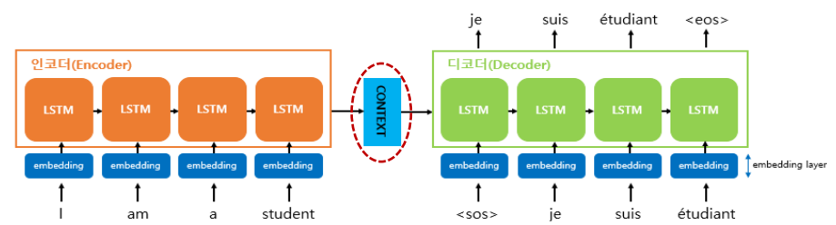

Seq2Seq는 위 의 사진과 같이 정보를 압축하는 Context Vector를 만드는 과정에서 필연적으로 정보의 손실 Bottleneck이 발생한다. RNN 계열 모델의 문제점인 장기 의존성 문제와 더불어 이는 언어모델 개선에 항상 에러가 되는 사항이었다.

이러한 문제를 개선하기 위해 등장한것이 Attention이다. 

>어텐션의 종류
>
>1. 바다나우 어텐션
>   - 콘캣 어텐션(Concat Attention): 
>2. 루옹 어텐션
>   - 닷 프로덕트 어텐션: 𝑠𝑐𝑜𝑟𝑒(𝑠𝑡 , ℎ𝑖 ) = 𝑠𝑇 𝑡 ℎ𝑖
>   - 제네럴 어텐션
>3. 스케일드 닷 프로덕트 어텐션

### Dotproduct Attention

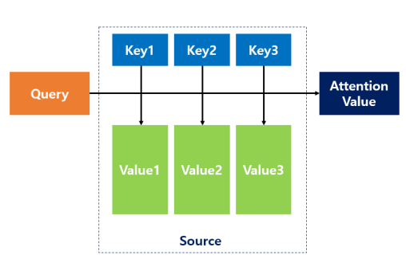

가장 이해하기 쉬운 어텐션 방법인 닷프로덕드 어텐션이다. 버나다우어텐션 등등 있지만 이 닷프로덕트가 맨 처음 이해하기는 제일 쉽다.

어텐션은 아래와 같은 방식으로 작동한다.

1. 각각 쿼디(Query, Q), 키(Key, K), 밸류(Value, V)에 대한 값을 구한다.
   - 여기서 K와 V는 애지간한 상황이 아니면 같은 값을 가진다.
2. Q와 K의 유사도를 구한다.
3. 이 유사도를 바탕으로 나온 값을 V에 적용시킨다.
4. 이러한 값을 어텐션 스코어라고 말한다.

여기서 저 유사도는 내적 혹은 코사인 등등 여러가지가 있지만 여기 닷프로덕트어텐션에서 내적을 활용하여 Q와K의 유사도를 구한다.

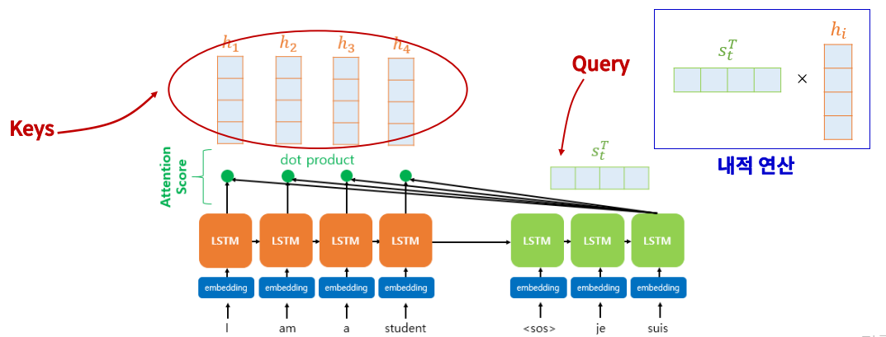

닷 프로덕트 어텐션은 위와 같은 방시으로 진행된다. 먼저 디코더 부분의 예측하고자 하는 시점 t의 은닉상태를 구한다. 이 디코더의 은닉상태와 인코더의 모든 시점 은닉 상태와 유사도를 구한다. 닷 프로덕트는 내적을 활용하여 유사도를 구한다.

디코더의 t시점의 은닉 상태는 Q로 취급하고 인코더의 각 시점의 은닉 상태는 K로 취급한다. 식은 𝑠𝑐𝑜𝑟𝑒(𝑠𝑡 , ℎ𝑖 ) = 𝑠𝑇 𝑡 ℎ𝑖이고 각각의 은닉 상태를 곱하여(내적 연산)을 통해서 나온값을 **어텐션 스코어 벡터**라고 한다. 이 어텐션 스코어 벡터를 전부 Softmax를 덮어씌워 각 스코어의 값이 총합이 1인 0과 1사이의 값으로 변하게 만든다. 

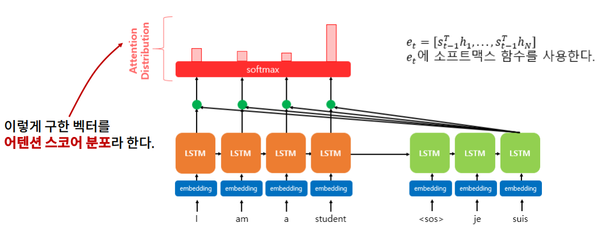

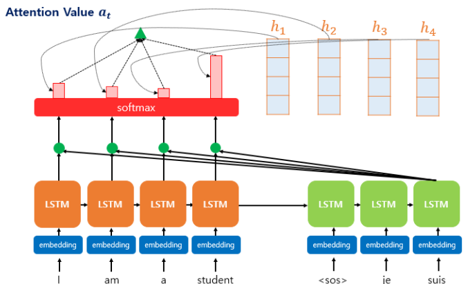

소프트 맥스를 씌운 값을 어텐션 스코어 분포라고 하고 어텐션 스코어 분포의 값을 기존의 인코딩 은닉층의 값에 곱한다. 이 어텐션 스코어 분포는 QK의 내적을 0과1사이의 값으로 변형한 값이기에 각 은닉층에 곱해지면 내적값이 높은 즉 벡터가 서로 비슷하거나 유사하면 인코딩 은닉층의 값을 유지하고, 유사하지 않으면 인코딩 은닉층의 값을 최대한 삭제시킨다.

이렇게 나온 벡터의 값을 전부 더한다. 인코딩의 은닉층의 값이 softmax로 인해 값이 변한걸 전부 합쳐 최종적으로 어텐션 밸류를 구합니다.

$𝑎𝑡 = 𝑠𝑢𝑚𝑁 𝑖=1𝛼 𝑡 𝑖ℎ𝑖$

어텐션 밸류를 구하는 수식이다. 이러한 어텐션 밸류는 종종 인코더의 문맥을 포함하고 있다고 하여 **컨텍스트 벡터(Context Vector)**라고 불린다.

> Seq2Seq + Attention 모델은 기본적으로 은닉층의 값은 각 단어의 값이라고 보면 편하다. LSTM모델은 각 시점의 단어마다 하나씩 임베딩 시켜서 모델에 넣기에 이렇게 인코딩 모델의 은닉층의 값은 그 t시점의 단어에 대한 값이라고 생각하면 된다. 
>
> 즉 디코딩 모델이 이번 시점에서 중점으로 봐야하는 단어의 정보만 최대한 남겨서 단어예측에 사용한다. 그래서 유사도를 사용해서 이번 시점에서 최대한 봐야하는 위치 혹은 단어를 찾는것이다.

```
#아래는 대충 내가 계산한 닷프로덕드 어텐션 밸류까지의 구현 코드이다.
import numpy as np

# Given vectors
a = np.array([2.341, 5.23123, 1.2333, 4.12455678])
b = np.array([1.341, 4.23123, 1.2333, 6.12455678])
c = np.array([4.341, 5.23123, 3.2333, 2.12455678])
d = np.array([1.341, 9.23123, 1.2333, 4.12455678])
Q = np.array([1.341, 2.23123, 3.2333, 4.12455678])

# Step 1: Compute the dot product (Attention scores) between Q and each of a, b, c, d
dot_product_a = np.dot(Q, a)
dot_product_b = np.dot(Q, b)
dot_product_c = np.dot(Q, c)
dot_product_d = np.dot(Q, d)

attention_scores = np.array([dot_product_a, dot_product_b, dot_product_c, dot_product_d])

# Step 2: Apply softmax to the attention scores
def softmax(x):
    exp_x = np.exp(x - np.max(x))  # subtract max for numerical stability
    return exp_x / exp_x.sum()

attention_weights = softmax(attention_scores)

# Step 3: Calculate the weighted sum of the value vectors (a, b, c, d) using attention weights
value_vectors = np.array([a, b, c, d])
attention_output = np.sum(attention_weights[:, np.newaxis] * value_vectors, axis=0)

attention_scores, attention_weights, attention_output
```


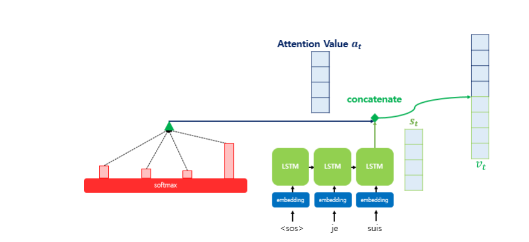

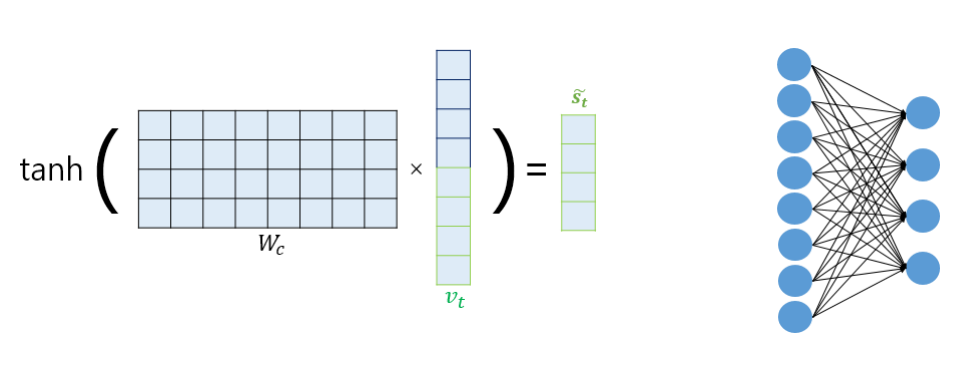

이제 컨텍스트 벡터를 **디코딩의 은닉층의 값 즉 Q에 concatunate한다.**(이건 더하는게 아니라 그냥 연결하는거다.) 이 concatunate한 값을 vt라고 하고 이 vt 벡터는 현재 시점의 예측단어인 yt를 예측하는데 사용하게 된다. 이제 기본적인 신경망 방식의 하이퍼볼릭탄젠트를 사용하는 은닉층에 계산되어 최종적으로 나온 값을 사용하여 출력층 소프트맥스 층에 보내어(𝒚𝒕 = softmax(𝑾𝒚𝒔 𝒕+𝑏𝑦)) 이번 시점의 디코딩이 예상한 단어를 출력한다.

### 바다나우 어텐션

바다나우 어텐션은 닷 프로덕트 어텐션 보다 일찍 제안되었지만 보다 어렵다. 바다나우 어텐션은 컨텍스트 벡터화로 인한 보틀넥 현상을 줄이기 위해 제안된 방식이다. 

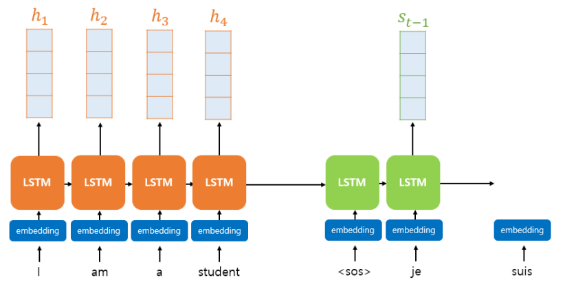

버다나우 어텐션은 닷 프로덕트 어텐션과 다르게 t-1 시점의 디코딩 은닉층 값을 사용하여 어텐션 시점을 구한다.

또한 **그 서로의 은닉층의 값을 바로 사용하지 않고 아래와 같이 학습 가능한 w를 생성하여 그 값을 변환 시킨 다음 두 값의 결과를 더하는 방식으로 어텐션 스코아를 구한다.**

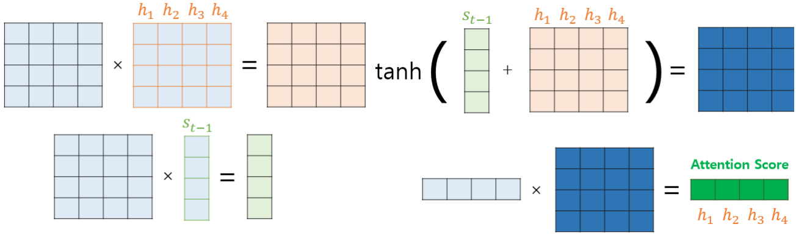

위와 같은 방식으로 각 은닉층에 학습 가능한 w를 곱하고 그 값을 더한 다음 활성화 함수인 tanh을 사용하여 그 값을 또 학습 가능한 새로운 w를 또 들고와서 다시 곱하여 어텐션 스코어를 구한다.

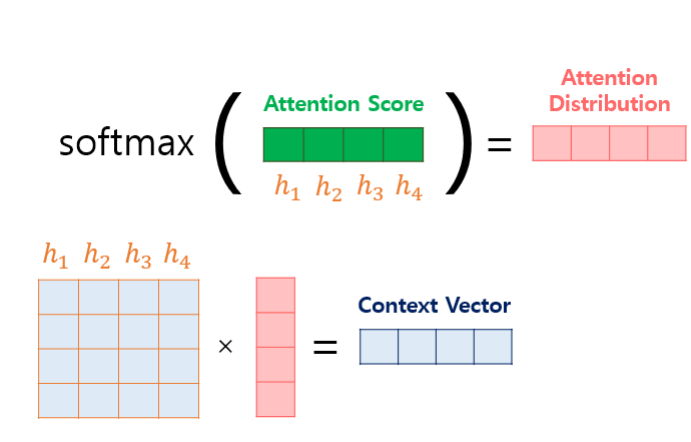

어텐션 분포는 위의 닷 프로덕트 어텐션이랑 동일하게 Softmax를 사용하여 구하고 인코더의 은닉층의 값에 곱하여 집중해야하는 포인트인 컨텍스트벡터를 구한다. 

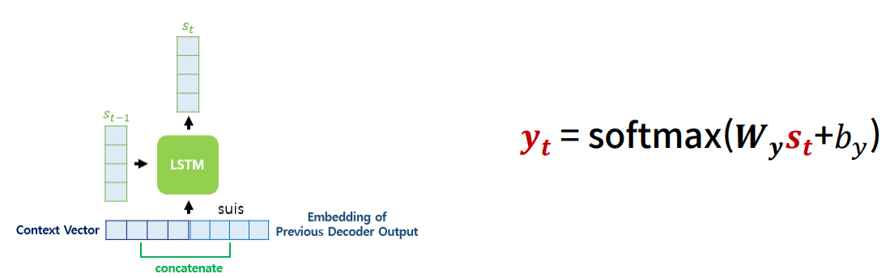

이후 바다나우 어텐션은 이렇게 나온 **컨텍스트 벡터를 디코더의 모델에 들어가기 전의 예측해야하는 시점의 단어의 임베딩 벡터에 Concatunate를 하여 RNN 모델에 넣어 이번시점의 예측 단어를 받는다.**

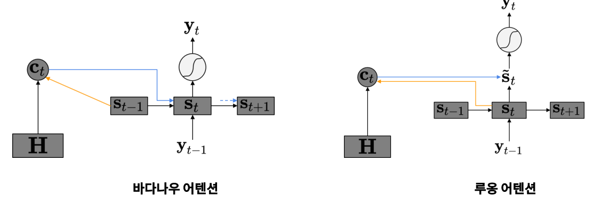

**여기서 바다나우 어텐션과 루옹 어텐션(닷 프로덕트 어텐션 류)의 가장 큰 차이점이 존재하는데 바다나우 어텐션은 어텐션 밸류를 구할 때 이전 시점(t-1)의 디코딩 은닉층 값을 사용하기에 컨텐스트 벡터를 구하고 이번시점(t)의 값과 Concatunate를 할 때는 디코더 모델에 들어가기전에 진행한다. **

**그에 반해 닷 프로덕트 어텐션은 이번 시점의 디코딩 은닉층의 값을 사용하여 컨텍스트 벡터를 출력하기에 Concatunate를 디코더의 은닉층에서 나온 값과 합쳐서 그 값을 출력층에 보내어 결과를 받는다. 위의 그림이 매우 큰 차이점이다.**

## Transformer

어텐션의 등장으로 LM은 아무리 긴 문장도 정보 손실에 상관없이 집중할 곳 을 찾아 보다 좋은 결과를 반환했다. 하지만 아직 문제가 존재하는데 RNN 기반 모델의 공통적인 문제은 순차적인 작업으로 인한 긴 작업시간은 개선이 되지 않았다. 오히려 Attention 작업을 추가로 해야했기에 학습량이 배는 늘어나 시간이 더욱 올래 걸리기 시작했다. 그리고 또한 개선이 되었다고 해도 긴문장에 대한 정보 손실은 여전한 문잿거리였다.

**트렌스포머 모델은 이러한 배경에서 어텐션 만으로 모델을 구성할 순 없을까? 라는 생각에서 시작하였다.** 막말로 CV에 강점을 가지는 CNN도 1D-CNN으로 자연어 모델에 꽤나 강력하게 적용이 가능했는데? 이러한 생각으로 RNN 계열 모델은 지워버리고 오직 어텐션 모델 결과만 출력 받아 그냥 DNN 돌리면 되는거 아닌가? 라는 생각은 대박을 쳤다.

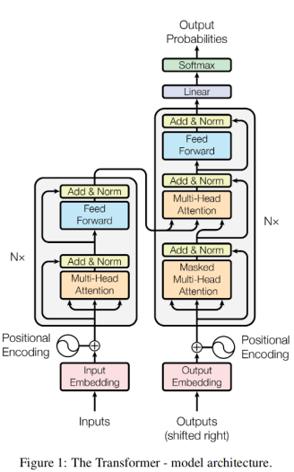

최초의 트렌스포머 모델은 기계번역 모델을 구현하기 위해 학습되고 연구되었다. 기존의 Seq2Seq + Attention의 인코더-디코더 구조는 여전히 유지하지만 RNN 계열 학습 방식을 버리고 따로 Attention 층을 만들어 어텐션 값을 구하고 그 값을 FFNN에 넣는 방식으로 모델을 구현하였다. 이 방식의 가장 큰 장점은 역시 RNN 방식을 사용하지 않음으로써 병렬연산이 가능하므로 모델의 속도가 매우 빨라졌다.

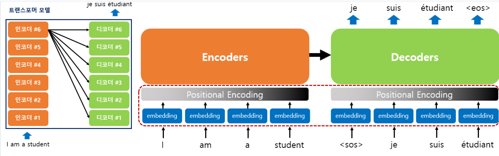

트렌스포머 모델은 기본적으로 다수의 인코더와 다수의 디코더를 사용한다. 논문의 경우 6개를 사용하여 사진에도 예시를 6개 든다.

기존의 Seq2Seq랑 전체적인 인코더 디코더 흐름은 비슷한데 다른점이 존재한다. 기존의 Seq2Seq는 RNN 계열 모델을 사용하여 인풋을 병렬적으로 받을수 없었다. 하지만 트렌스포머 모델은 **Positional Encoding**을 사용하여 단어의 위치 정보를 기록하고 모델에 Input 값을 주기에 병렬적인 작업 처리가 가능해 졌다.

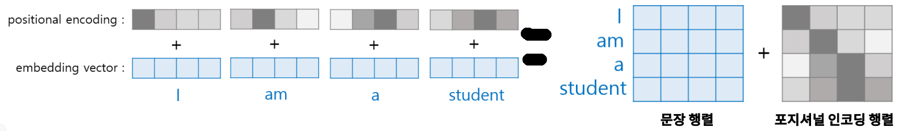

포지셔널 인코딩은 그렇게 어렵지 않다. 각 포지션에 해당하는 벡터를 만들어 임베딩 벡터를 거치고 튀어나온 값에 더해주면서 그 단어의 위치 정보를 추가시키는 방식으로 진행합니다. 포지셔널 인코딩 행렬을 만드는 방법은 아래와 같다.
$$
PE(pos,2i)=sin(pos/10000^{2i/d_{model}})
,,
PE(pos,2i+1)=cos(pos/10000^{2i/d_{model}})
$$
위의 수식은 포지셔널 인코딩 행렬을 만드는 수식이다. i가 짝수는 사인함수를 사용하고 홀수는 코사인 함수를 사용하여 위치에 따른 정보를 각자 더한다. 여기서 pos는 입력 문장의 임베딩 벡터의 위치이고 i는 임베딩 벡터의 차원 dmodel은 트랜스포머의 입,출력 자원 같은 말로 임베딩 벡터의 차원의 크기이다.

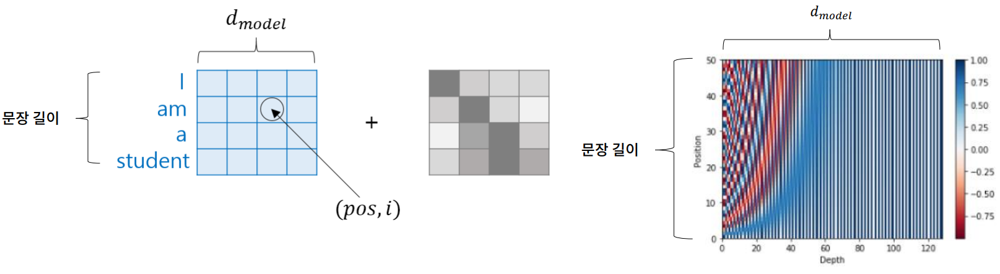

여기서 헷갈리면 안되는게 pos나 i나 뭐 어떠한 값이 아니라 그냥 위도 경도와 같은 좌표를 의미한다. pos는 이 단어가 몇 번째 단어인지 의미하고 i는 임베딩 벡터의 크기 중 여기가 어디인지 나타낸다. 옆의 그림은 문장의 길이 만치 임베딩 벡터를 값으로 나타낸걸 그래프로 나타냈을 때이다. 그림을 보면 단어의 길이가 길수록 임베딩 벡터의 차원을 크게 해야 포지셔널 인코딩 행렬의 값이 다양해지는걸 확인 가능하다.

추후 다른 모델에선 포지션 인코딩을 다른 수식을 사용하여 구현하기도 하고 수식으로 구현하지 않고 아예 파라미터를 준 다음 학습을 시키는 방식으로도 진행한다.

>근데 왜 포지셔널 인코딩을 Sin과 cos를 쓰면서 나타낼까?
>
>출처: https://www.aitimes.kr/news/articleView.html?idxno=17442
>
>**원핫 인코딩**
>
>원핫 인코딩을 활용한 위치 기록은 전체의 순서 위치에 대해서 독자적인 유일한 값을 주기는 편하지만, 말 그대로 yes or no를 활용한 기록으로 유일성을 기록하기 위한 목적만을 들고있어 상호 순서간의 상관성을 기록하긴 힘들다. 이 말에 대해서 생각을 해봤는데 상호 순서가 중요한 이유가 우리의 목표는 언어에 관한 문제이기에 bi-lstm을 사용하는 목적과 비슷하게 양옆의 정보를 기준으로 우린 이번 단어를 유추한다. 하지만 원핫 인코딩은 양옆의 상관성에 대한 정보를 기록하게 하는데는 무리가 조금 있다.
>
>**Sin 함수**
>
>사인 함수는 값이 변해도 그 정보가 급변하지 않아 상호간의 관계를 부드럽게 연결이 가능하다. 근데 사인 함수는 계속 반복하다 보면 서로 다른 위치인데도 동일한 Sin(x)을 가질 수도 있는데 이는 또 다른 Sin함수와 조합하면 구별이 가능하다. 이 때문에 Sin 함수와 비슷한 Cos를 들고와 조합하여 상호간의 관계가 이루어지는 인코딩을 완성시킨다.
>
>코사인 함수는 SIn을 옆으로 이동시킨 값이기에 각각의 함수는 하나의 위치에 대해서 정보를가지고 그걸 조합하여 수열을 만든다.
>
>**위치 정보를 Concatunate를 하지 않고 Adding을 하는 이유**
>
>이건 진짜 나도 궁금했음,
>
>Word embbeding 의 차원의 크기 만큼 위치 임베딩의 차원도 같아야 하는데 Concat을 하면 그럼 차원이 두 배가 되고 파라미터도 두 배가 된다, 그럼 아무래도 리소스적으로 손해가 막심하다. 
>
>그리고 곱하기를 하지 않는 이유도 만약 임베딩의 값이 0.0001 혹은 0이면 곱하는 순간 그 정보를 잃어버리기에 정보를 유지하기위해 덧씌우는 방법을 택했다.

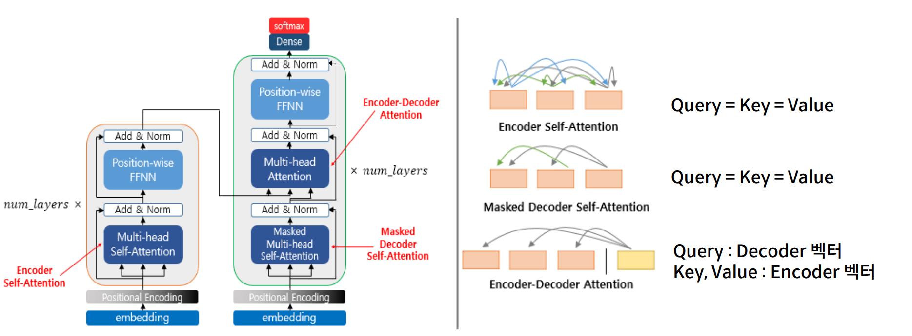

왼쪽의 그림은 각각 인코더 디코더 한 층의 내용물들인데 어텐션레어가 3개나 존재하는데 3개 전부 다른 어텐션 방법이다 골 때린다 정말.

여기서 멀티헤드란 단어는 크게 어려운게 없다. 원래 하나씩 어텐션 밸류를 구하다가 쿼리가 자기 자신이고 LSTM이 아니라 순차적으로 안들어오고 한번에 들어오니 한번에 계산이 가능해져서 그런거다. 여기서 핵심은 셀프와 마스크드 이다.

본 사진의 모든 내용은 논문을 기반으로 설명을 하기에 모든 파라미터는 논문을 기준으로 설명하겠다.

논문에선 인코더 디코더를 총 6개의 층으로 구별을 하였다. 각 층에는 FFNN와 멀티헤드 셀프어텐션이 존재한다. 셀프어텐션의 QKV의 정의는 아래와 같다.

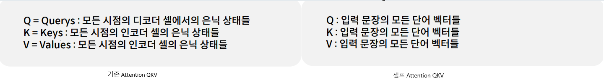

셀프어텐션은 말 그대로 Q를 다른 층 즉 디코더에 들고 오는 게 아니라 자기 자신의 값을 Q로 쓰고 그 상태에서 Attention 밸류를 구하는 걸 보고 말한다. 이게 어떻게 작용하는 걸까? 기본적으로 트렌스포머는 번역 모델에서 시작하였다.(Trans니깐 Tranfomer로 이름 지은 거 같다, 그냥 양키센스임 )`K는 내 친구고, 그는 대학생이다.`라는 문장을 영어로 만들면`K is my friend, he is college student`가 된다. 여기서 `he`가 지칭하는 건 `k`일까 `my`일까 `friend` 우리는 `k`라는 걸 안다. 하지만 언어모델은 그게 쉽지 않다. 그렇기에 셀프어텐션으로 문장 내의 유사성이 높은 단어를 찾아 그 정보를 바탕으로 문장을 해석하면 이거 기가막히겠다 라는 생각이 든다.

q와 k를 사용하여 같은 문장 내에서 서로의 유사도를 구한다. 그렇게 나온 유사도를 가지고 v에 적용시키는 방식이 self Attention 이다.

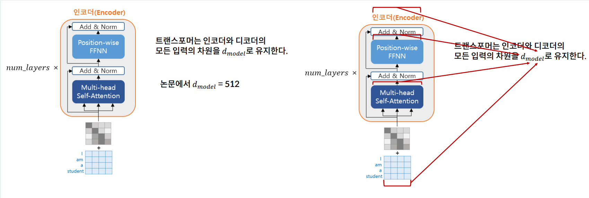

임베딩 문장과 위치 임베딩 값을 합쳐서 인코더 모델에 집어 넣는다. 여기서 핵심은 어떠한 층을 통과하더라고 맨 처음 설정한 dmodel(Dense 크기?)를 유지하게 만든다. 논문은 512이다.

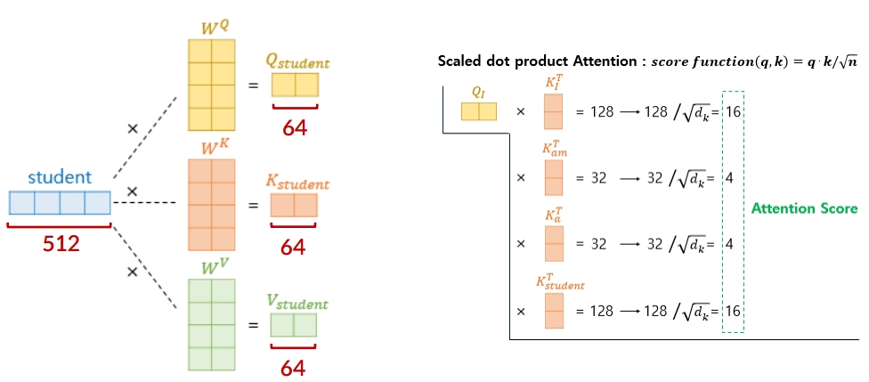

먼저 QKV를 구하는데 셀프어텐션은  바다나우 어텐션처럼 QKV에 각각 파라미터 가중치를 곱한다. 초기 값을 랜덤으로 이 가중치는 학습 대상이기에 epoch가 돌면서 자연스럽게 조정된다. QK를 구했으면 여기서는 닷 프로덕트 어텐션 처럼 두 값의 내적을 구한다. 보통 값이 벡터로 나오기에 두 개를 곱하는 행위 자체는 선형대수학에서 유사도로 인식한다. 

> 당연히 가중치 W들은 QKV 따라 전부 다르다. 같은 값을 가지는게 안다.

QK를 곱하여 유사도를 구하면 그 값이 attention score가 아니라 셀프 어텐션은 특정 값으로 나줘준다.(논문에서 64를 나눴는데 아마 512의 크기에서 최대한 정갈한 스케일링을 진행하기 위함으로 보인다. ) 이렇게 나눠 주면서 attention Score의 값을 스케일링 해준다.

QKV를 컨트롤하면서 학습하는 행동은 모델한테 만약 문장을 그대로 넣으면 이해를 하지 못하기 때문이다. 그래서 학습을 통해 이 단어가 들어 왔으면 가중지를 요로코롬 조로코롬 주면서 최종적으로 문장을 이해하는 작업이 던다. 

물론 워드 임베딩이 현실의 모든 단어를 기준으로 학습을 못하기에 vocab을 사용하기만 qkv의 유사도는 결국 이 문장에서의 단어의 의미를 최대한 이해하게 하는 행동이 된다.

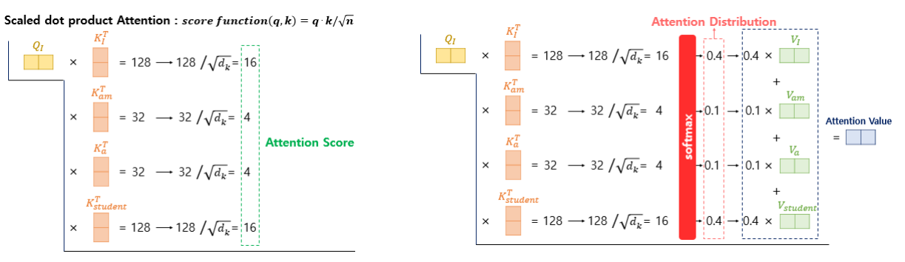


이렇게 스케일된 Attention score를 이제 우리가 알듯이 softmax에 보내어 분포로 만들고 V에 그 값을 곱해주면서 Attention Value를 만든다.

근데 여기까지가 그냥 Self-Attention이다. 우린 이제 병렬적으로 처리가 가능하여 Multy-head-self-Attention을 진행하는데 그럼 결국 벡터가 모여 행렬이 된다. 모든 계산은 이제 행렬 방식으로 바뀐다.

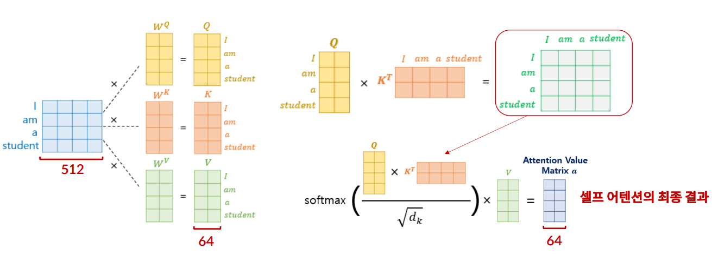

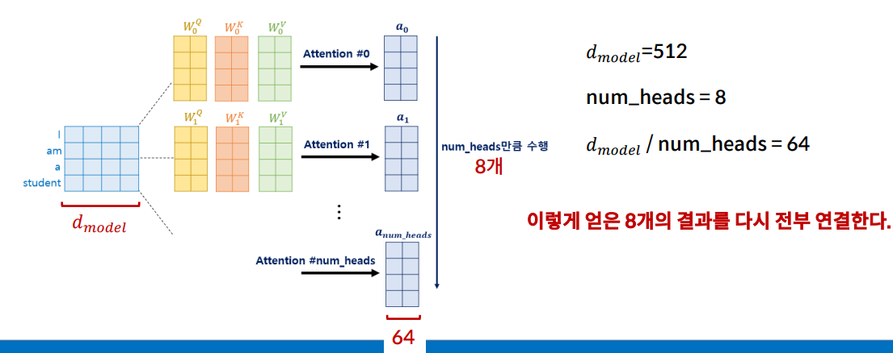

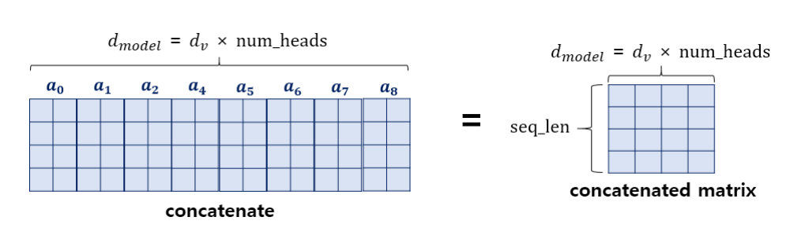

각 단어의 어텐션 매트릭스를 구하면 그 문장(논문의 내용은 한 문장의 번역 기준이기 때문이다.)의 단어의 개수 만큼 어텐션 매트릭스가 나온다. 논문의 기준으론 8개가 나온다. 

여기서 중요한점은 512의 임베딩 차원을 기준으로 들어왔고 단어가 총 8개 존재하기에 어텐션 매트릭스(단어)의 차원의 크기를 64로 만들어 출력을 받았다. 이렇게 나온 어텐션 매트릭스는 FFNN층에 들어가기 전에 모두 concatunate 진행을 하는데 이 때 64 *8으로 계산이 되기체 최종 어텐션 매트릭스는 임베딩 벡터의 차원과 동일해진다. 이는 **Transformer 모델의 각 층의 아웃풋은 항상 인풋과 같아야한다. **라는 조건을 만족하게 만드는 엔지니어링이다.

최종적으로 다시 W를 곱하여 딥러닝 답게 학습 가능한 가중치 계산을 진행하면 Multy-head Attention 층의 계산이 완료 된다. 

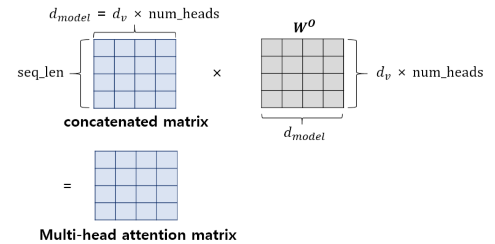

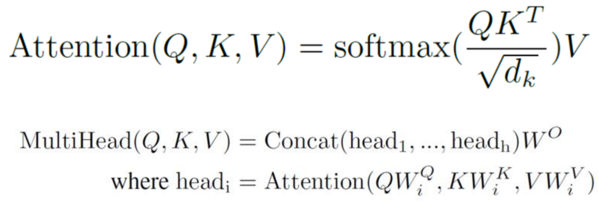

위는 논문에서 제시한 Multy-head Attention 계산 수식이다. h는 head의 개수 이다.

그리고 어텐션을 수행할 때  <pad>와 같은 특수 token이 존재하는데 이는 실제 단어가 아니라 문장의 길이를 맞춰주는 용도이다. 인풋의 크기는 다 같아야 하기에 sentens lenth가 10인데 위의 예시처럼 8만 들어 오면 길이가 맞지 않아 들어가지 않는데 이럴때 <pad>를 써준다. CNN의 Padding과 같은 방식이다.

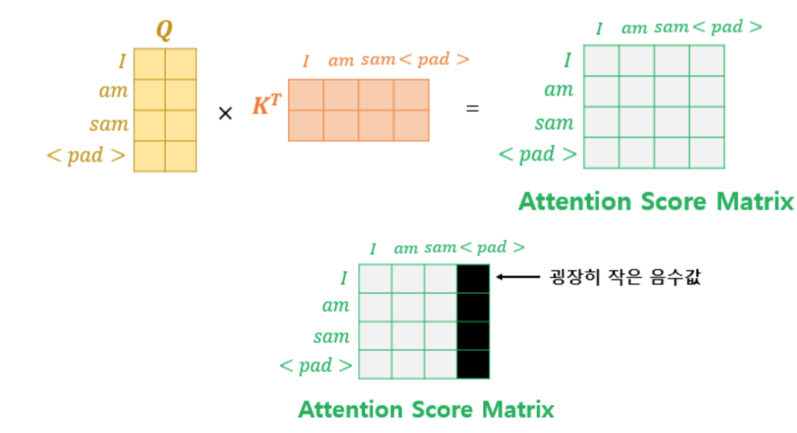

이 <pad> toekn은 임베딩 벡터를 지나면 본인만의 특수한 값을 가지는데 괜히 값이 커서 노이즈로 작용하면 머리아프니깐 <pad>는 대부분의 임베딩 모델에서 아웃풋을 -999 혹은 0혹은 0.0000001과 같은 계산기 본인의 값을 최대한 가지지 않게 한다. Attention에서도 마찬가진데 이 <pad>토큰에는 최대한 값을 덜 전해주기 위해서 굉장이 작은 음수값으로 변환시킨다. 이를 **Masking**이라고 한다.

여기까지 attention의 서브층 연산이다.

이 <pad> toekn은 임베딩 벡터를 지나면 본인만의 특수한 값을 가지는데 괜히 값이 커서 노이즈로 작용하면 머리아프니깐 <pad>는 대부분의 임베딩 모델에서 아웃풋을 -999 혹은 0혹은 0.0000001과 같은 계산기 본인의 값을 최대한 가지지 않게 한다. Attention에서도 마찬가진데 이 <pad>토큰에는 최대한 값을 덜 전해주기 위해서 굉장이 작은 음수값으로 변환시킨다. 이를 **Masking**이라고 한다.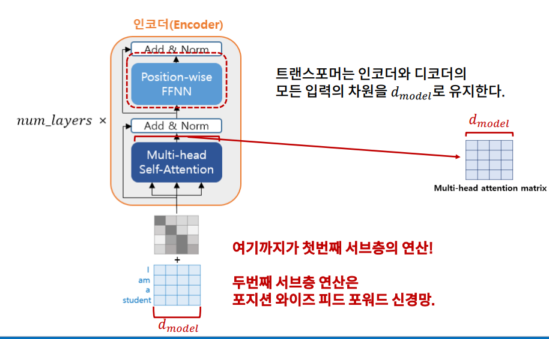

여기까지가 서브층 연산이다. 이렇게 attention 연산이 끝나면 FFNN층으로 옮기는데 이는 전혀 어렵지 않다. 가장 기본적인 딥러닝 연산으로 진행이 되기 때문이다. 

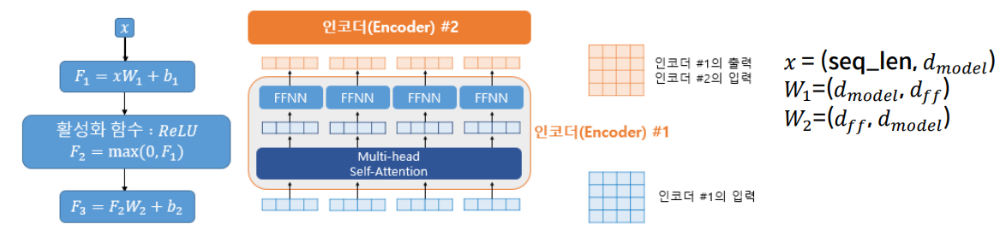

FFNN층은 기존의 딥러닝 방식처럼 학습된다. wb를 통해 가중치와 편향을 학습하고 Activation fungtion을 ReLU를 사용한다. 그런 다음 다시 선형층을 통과시켜 그 값을 출력층에 전달한다.

위 의 사진은 Multyhead로 들어왔으니 모든 작업이 병렬적으로 이루어 진다는 걸 보여준다. 입력의 크기는 두번째 서브층을 통과해도 유지된다. 

여기서 아직 설명하지 않은 부분이 존재하는데 Add&Norm 부분이다.

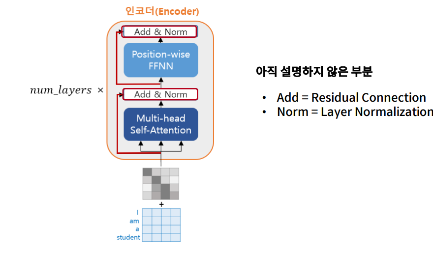

Transformer 인코더를 보면 끝날 때 마다 Residual Connection과 Layer Normalzation이라는 두 가지 추가 테크닉을 사용하는데 이는 인코더 디코더 가릴거 없이 각 서브층이 끝날 때 마다 사용한다. 이를 딥러닝에선 **잔차연결**이라고 한다. 

 Residual Connection인 ADD 기능은 어떠한 연산을 하더라도 그 결과와 입력을 다시 더해주는 작업을 말한다. 즉 Transfomer 그림에선 멀티헤드 나온 행렬과 포지션 임베딩을 더한 임베딩 행렬을 더하거나, FFNN 들어오전의 값과 FFNN을 통과한 값을 더해준다. 이 작업 기존의 입력값을 어느 정도 보존 시키기 위해 사용한다. 딥러닝은 계산이 많아지면 결국 값이 변형이 되어 필연적으로 정보를 잃어버리는데 이를 방지하기 위해서 사용한다.  이 작업을 하지 않으면 깊은 계산과 보틀넥 때문에 LSTM 쓰기 싫어했는데 크게 다를바가 없어진다.(물론 병렬처리가 되는거는 유효하지만)

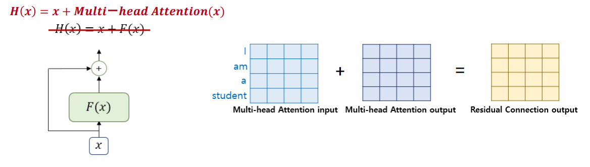

Layer Norm은 이름부터 잘 알듯 정규화를 한다.  ADD를 해서 나온 값을 정규화 해주는데 마지막 차원의 텐서를 기준으로 정규화를 진행한다. 정규화는 가장 대표적인 정규분포와 같은 방식으로 진행이 된다. 마지막 차원의 텐서의 평균과 표준편차를 구하고 일반적인 정규화식을 사용하지만 여기서 또 y(감마)와b(베타)를 들고와서 들고와서 wb와 같이 사용하면서 학습을 진행한다. 그냥 이쯤되면 모든 테크닉 필요없이 wb만 하면서 계산만 하면 어느정도 나오는거 아닐까 라는 의심이 든다.

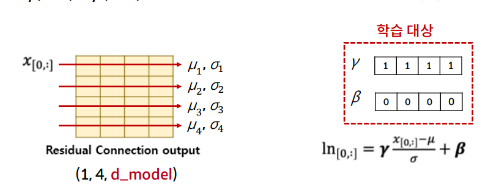

이제 디코더의 Attention파트가 있는데 이름이 **Masked multy-head self Attention**이다. 최종보스다. 기존 방식과 그렇게 차이가 많이 나지는 않는다.

디코더 모델이다 보니 기존 Seq2Seq 모델처럼 문장 생성 시작 토큰과 문장 생성 종료 토큰이 존재한다. Masked는 앞에서 설명한 Masking 기법을 사용한다. 전체적인 Attention value 계산 방식은 동일하나 딱 한가지 Maksed 기법을 사용하는거다. 

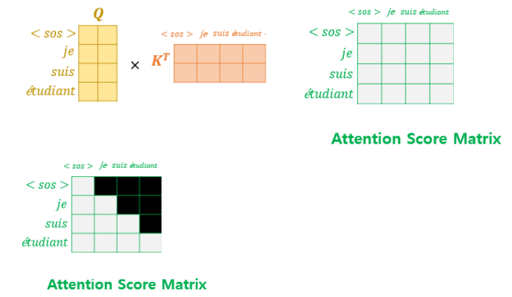

위 사진과 같이 마스킹을 해주는건데 **이는 인코더와 디코더의 차이점 때문에 이러한 방식을 사용한다.** 인코더는 다음 단어를 예측하는것이 목표가 아니라 전처적인 문장이 들어왔을 때 문장을 이해하는게 목표이기에 모든 인풋 단어를 그대로 병렬적으로 처리하는 작업이 문제이지 않으나  이번 단어를 보고 다음 단어를 예측하여 문장을 생성하는 게 목표인 디코더에선 인풋 단어를 있는 그대로 받아 학습하면 개념적으로 문제가 생긴다. 다음 단어를 예측해야하는데 다음 단어를 그대로 알고 있으면 말만 들어도 이상하다.

그렇기에 QK를 곱하여 어텐션 매트릭스를 만들었을 때 아직 등장하지 않은 단어와의 Attention value는 마스킹 처리를 하여 그 값을 감추어 Attention Score Matrix를 구성한다.

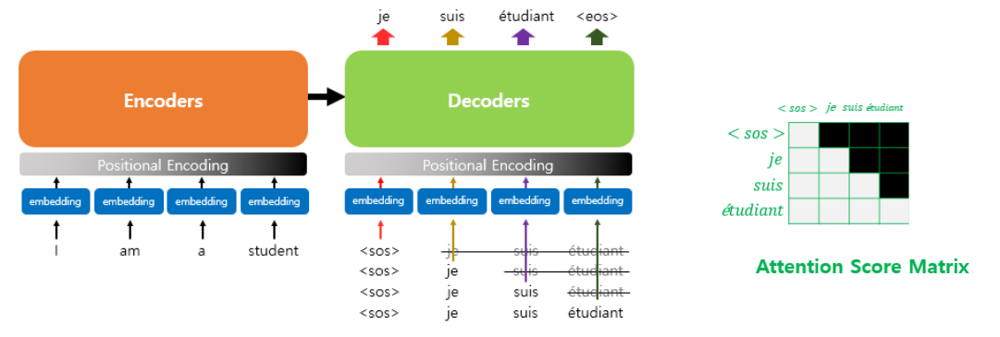

물론 학습 과정에선 LSTM과 마찬가지로 Teacher Forching을 사용하여 학습한다. 괜히 예측시킨걸 그대로 넣으면 학습시간만 늘어 날 뿐이기에, 그 이후의 과정은 Multy-head attention과 동일하게 작업한다. 오로지 디코더의 정의에 맞게 각 포지션에 맞는 정보만 가지고 Attention을 하는 방법을 masked-multy-head-attention이다.

마지막은 Encoder-Decoder의 Attention 값을 가지고 우리가 기존에 알던 Attention을 수행할 일반 Multy-ged attention이다.

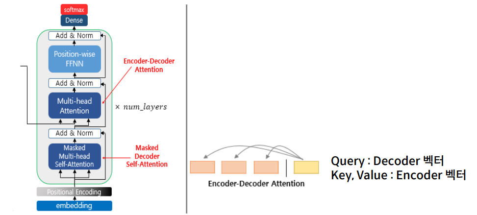

여기 attention은 맨 처음 배운 attention 방식이랑 같다. Self Attention 방식이 아니기에 QKV 가 모두 같지 않고 Q는 Decoder의 벡터를 기준으로 하고 K,V는 Encoder 층의 결과 값을 기준으로 한다. 

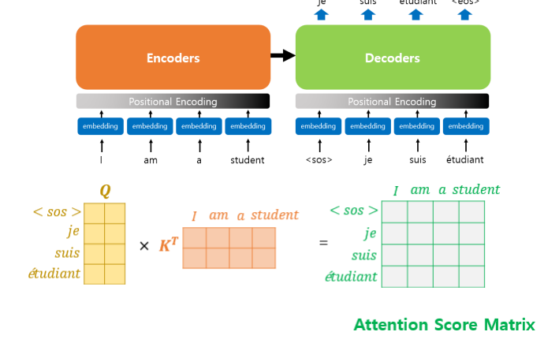

즉 인코더의 값과 디코더의 값을 사용하여 어텐션을 진행하되 그걸 Multy head로 한다는게 차이점일 뿐이다. 

끝
