#Bert #DNN #LLM 

## ELmO

Bert는 Transformer의 가장 기본적인 인코더만 사용한 모델로 주로 분류 문제 혹은 임베딩에 주로 사용된다. 최근 인기인 BGE-m3 모델도 4가지의 Bert기반 모델로 학습된 임베딩 모델이다. 하지만 이 Bert를 알기 전에 Elmo를 먼저 알아야 하는데 엘모는 Embbedings from Language model의 약자로 언어 모델로 부터 얻는 임베딩이란 의미이다.

엘모는 Transformer가 제시되기 전의 모델로 기본적으로 Bi-LSTM으로 모델이 구조화 되어있다. 여기서 특이점은 Elmo는 모델 한개를 가지고 양방향으로 학습을 시키는게 아니라 하나는 정방향 또 다른 하나는 역방향으로 학습을 진행을 하면서 두 개의 모델을 concatunate하면서 결과를 받는다.

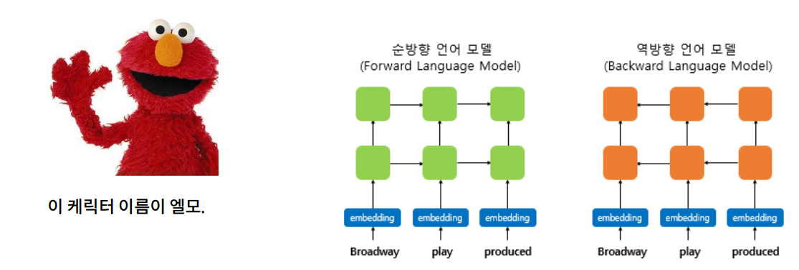

엘모는 기본적으로 사전 학습된 임베딩 모델이다. LLM에 들어서 임베딩은 전부 모델 기반으로 학습 시켜 임베딩 벡터를 받는 쪽으로 발전해 왔다. 거기의 Word2vec 혹은 Glove 와 같은 모델도 있지만 이 ELmo는 Bert의 아빠뻘로 앞의 두 모델과는 다르게 문맥을 반영한 워드 임베딩이 가장 큰 특징이다. 

이러한 방식을 사용하는 이유는 '배' 라는 단어가 들어돠고 의미가 3가지나 되기에 임베딩 값이 달라야하는데 모델은 그걸 모르기 때문인다. 즉 이러한 같은 단어라도 안의 의미를 파악하기 위해선 앞뒤의 문맥을 파악해야 하는데 그렇기 때문에 이렇게 두 가지의 모델을 사용하면서 임베딩 값을 받는다.

 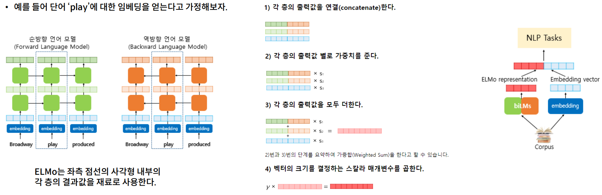

Elmo는 임베딩을 얻기 때문에 many-to-many model 이고 한 층으로 끝나지 않고 딥한 층을 가진다. 순방향 역방향 두 개의 모델을 준비하고 각 층을 지난 값의 결과 값을 concatenate한 다음 가중합을 진행한다. 그리고 최종 크기를 결정하기 위해 스칼라 매개 변수를 곱한다. 저게 어려운게 아니라 그냥 차원 맞춰주는 용도라고 생각하면 된다. 최종적으로 이렇게 elmo와 사전학습된 임베딩 모델이나 혹은 임베딩 법칙을 사용하여 나온 또 다른 임베딩 결과와 함께 concat한 다음 ML모델에다가 넣는다.

## Masked LM

언어 모델은 정방향 역방향 한 방향으로만 진행이 된다. 하지만 사실 언어의 문맥이라는 것은 양방향을 통해서 결정이 된다.그렇다면 왜 언어 모델은 단방향(Unidirectional)이어야만 할까?

양방향 언어모델을 만들 경우, 미리 예측할 단어에 대한 정보를 보게되기 때문이다. 그렇기에 Masked LM 방식을 사용한다. 이 방식은 bert의 근간이 되는 개념이다.

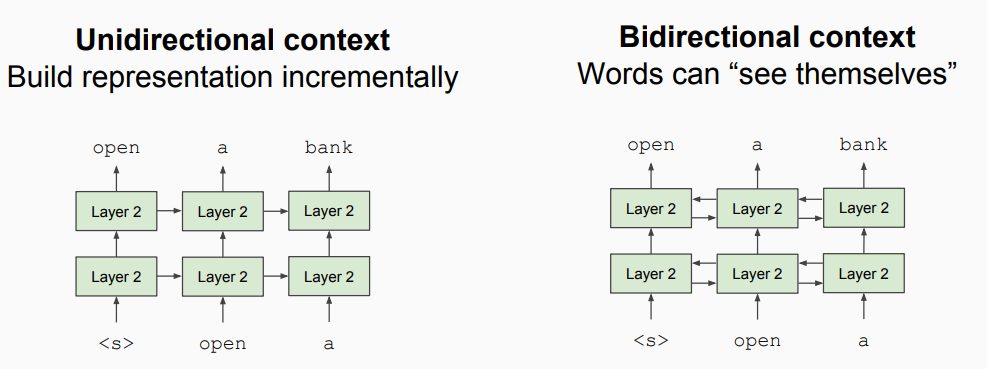

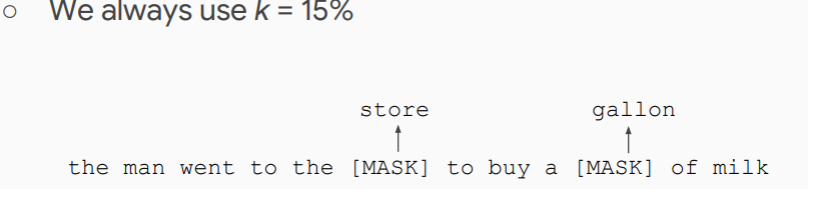

그 방법은 훈련 데이터의 문장 중 몇 개를 마스킹 처리를 해서 그 단어를 예측하는 방식으로 학습을 시키면 되느것 이다. 논문에선 각 마스킹 처리하는 %마다 마스킹 방식을 다르게 하는데 그 방식은 아래와 같다.

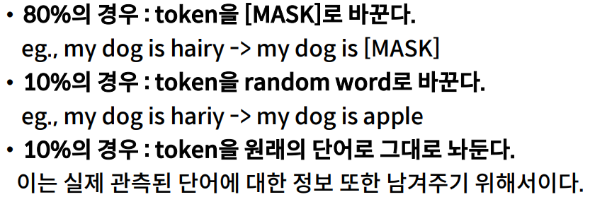

## Bert

Bert는 기본적으로 사전 학습된 모델인 마스크드 언어모델을 말한다. 이제 여기서 부터는 학습 파라미터가 많기에 pretrian 보다는 fine tuning을 하면서 각 모델을 주제 도메인에 맞게 변형시킨다.

bert 이전의 ptr-trian 모델은 아래와 같이 존재한다.

- Feature-based(사전 훈련된 파라미터가 고정)
  - ELMo
  - Shallowly
- Fine-tuning (사전 훈련된 모델의 파라미터를 함께 학습)
  - GPT
  - 단 방향 모델

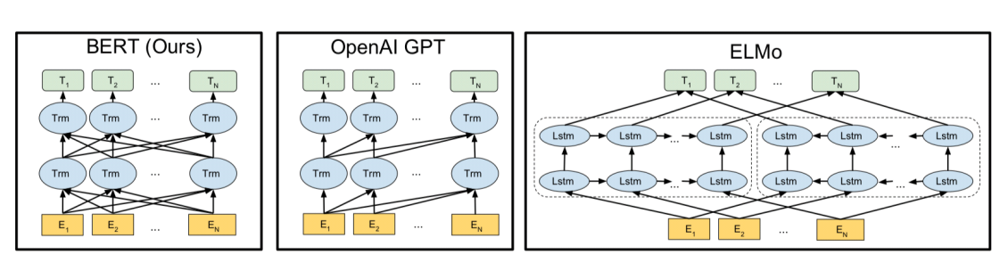

Bert는 기본적으로 인코더만을 사용하고 많이 쌓은 모델이다. 이와 반대로 디코더만 사용하고 많이 쌓은 모델은 GPT 이다. BERT는 언어 생성을 담당하는 디코더 부분을 사용하지 않기 때문에 번역 모델과 같은 문장생성 작업에 사용이 불가능하다. 하지만 문서의 분류 혹은 문서 요약 같은 부분의 문제에선 매우 강한 모델이 된다.

**B**idirection **E**ncoder **R**epreseatation from **T**ransformer 라는 이름을 가졌듯 기본적으로 양방향(bidirection)모델이고 재현하는게 목표이다.Bert 는 학습을 한번만 진행하지 않고 총 두 번의 학습을 진행한다. Pretrain 단계와 fintuning 단계를 거쳐 학습을 진행을 하는데 먼저 **pretrain 단계의 학습은 총 두가지로 이루어져 있는데 하나는 Masked Language Modeling LM 단계와 Next Sentence Prediction이 동시에 진행이 된다.**

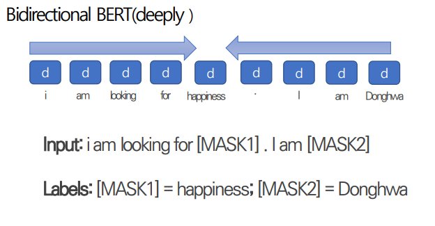

Masked Language Modeling LM은 위의 방식과 똑같이 진행한다. 문장이 들어오면 15%의 단어는 마스킹 처리를 하고 모델이 양 방향 정보를 활용하여 이 단어가 무었인지 예측 한다. 이때 들어가는 데이터는 우리가 직접 마스킹을 하는게 아니라 문장이 들어가면 모델이 알아서 마스킹 처리를 한다. 이 Masking 방식은 Bert의 대표적인 Pretrain 학습의 방식이며 파인 튜닝 시에는 사용하지 않는 방식이다. **Bert는 이러한 작업을 통하여 문맥정보를 알아냅니다.**

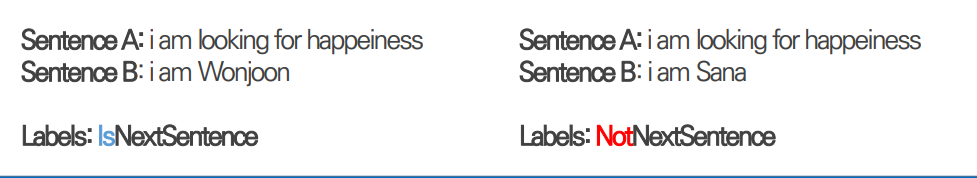

Next Sentence Prediction은 프리트레인 단계에서 핵심적이기 보다는 파인튜닝 단계에서 사용하기 위해 필요한 기술이다. Bert는 Masked 단계로 받을 때 하나의 문장을 받을 수 도 있고 두 개의 문장을 받을 수 도 있다. 보통 우리가 입력 데이터로 넣을 때 하나의 Document를 넣는데 이 때 50%는 실제 AB의 앞뒤 문장을 넣고 50%는 실제 앞뒤 문장이 아닌 조합을 만들어 넣는다. 즉 이 문장의 다음에 올 문장이 맞는지 않맞는지 예측하는 문제를 준다.

물론 Next Sentence Prediction은 그렇게 중요하지는 않다. QA 혹은 두 문장의 관계를 묻는 문제와 같은 문제가 파인튜닝이 들어왔을 때 처리하기 위한 방법이지 Bert의 대부분 성능은 MaskedLM 부분이 담당한다.

>**Bert의 스페셜 토큰**
>
>Bert에는 스페셜 토큰이 존재한다. 기존 Transformer에도 문장의 시작과 끝을 알리는 Seq2Seq의 `SOS와` `EOS가` 존재하듯 모델 시작시 들어가서 결과를 반환해주는 `CLS` Token 두 문장의 끝을 나타내어 두 문장의 경계를 가르기는 `SEP` 마지막으로 Masked LM의 마스킹 토큰인 `Mask`가 존재한다.
>
>각 스페셜 토큰의 임베딩 값은 아래와 같다.
>
>- [PAD] ‑ 0 
>- [UNK] ‑ 100 
>- [CLS] ‑ 101
>- [SEP] ‑ 102 
>- [MASK] ‑ 103
>
>위 시페셜 값들은 bert 모델에 고정된 값이며 직접 불러오면 확인이 가능하다. 

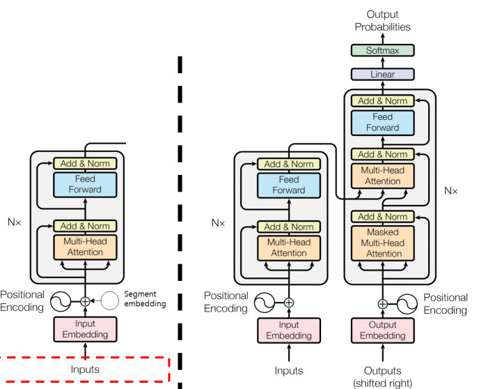

**Bert의 임베딩 방식**

Bert에는 기존 Transformer 모델 보다 많은 임베딩 방식이 사용이된다.

- input Embedding
  - 일반적인 임베딩 방식, 모델이 단어를 이해하기 위해 Vocab에서 가져온 벡터 혹은 임베딩 모델을 타고 나온 벡터를 말한다.
  - 아래 사진의 Token 임베딩이다. 
  - bert의 단어 임베딩은 btye-pair-Embbeding 과 비슷한 임베딩을 사용한다.
- Positional Embedding
  - 병렬처리를 도와주는 Transformer의 임베딩, 포지션 인코딩의 임베딩 버전이며 똑같이 작동한다. 문장내의 단어의 위치를 알려준다.
- Segment Embedding
  - 임베딩 값으로 부여하는 값은 단 두 개 0과1이며 앞의 문장에는 0을 뒤의 문장에는 1을 더해주어서 한 쌍의 문장의 앞뒤 정보를 기록한다.

총 이렇게 3가지의 임베딩이 사용이된다. 인풋 임베딩과 포지션 임베딩은 기존 트렌스포머 임베딩 방식이지만 Segment Embedding은 Next Sentence Predition을 사용하기 위해 존재한다. 임베딩 값은 0과 1 단 두 개의 값만 존재하며 이 임베딩은 Bert가 두 문장의 쌍이  들어 왔을 때 `SEP`토큰과 함께 구별하는 역할을 한다.

포지션 임베딩은 포지션 인코딩이랑 같은 방법이다.

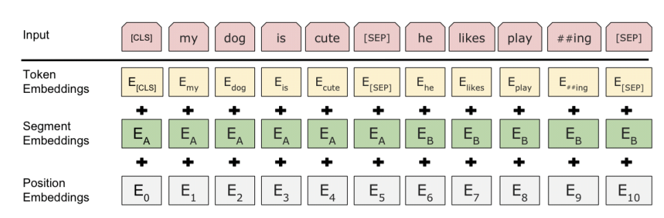 

Bert는 각자 풀고자 하는 모델에 맞게 튜닝이 가능하다. 그렇게 하기 위해선 사전학습시 많은 양의 단어를 학습시켜야하는데 Bert-Large 모델은 24개의 Layer를 사용하고 기본 Base모델은 12개의 layer를 사용한다.

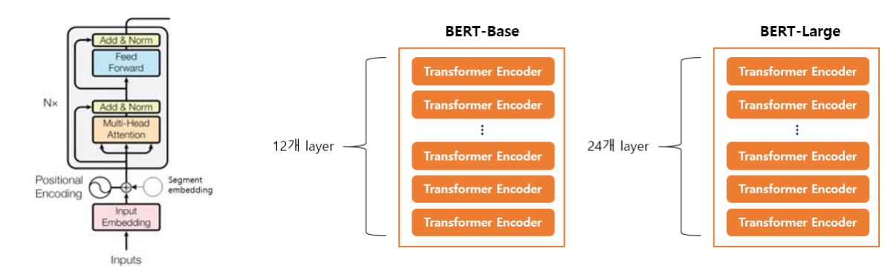

Bert는 텍스트 분류에 강한 모습을 보이는데 이때 최종 Layer에서 나온 모든 벡터를 가지고 Softmax층에 보내어 예측을 하는게 아니라 문장의 시작을 알리는 맨 처음 들어가는 [CLS] 토큰의 출력값 벡터만을 Softmax 층으로 보내어 분류문제를 해결한다.

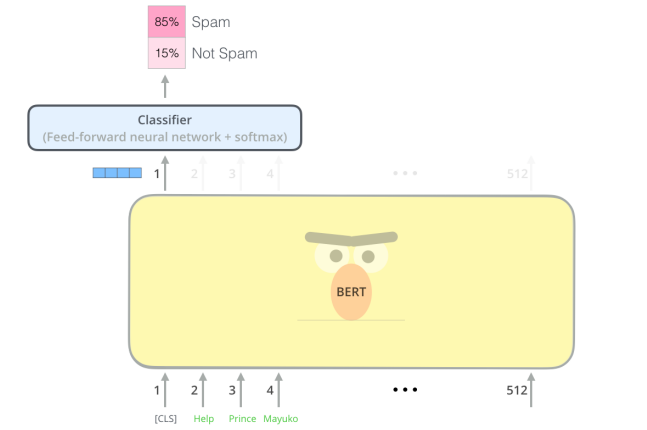

왜 맨처음 들어가는 토큰을 가지고 예측을 하나? Bert는 양방향 모델이기에 언어의 이해는 MaskedLM을 통하여 단어를 예측함으로써 전체 문장에 대한 이해를 하고 정방향,역방향으로 masked 단어를 알아내고 역방향에서 오는 정보를 탁 받아서 결과를 반환하기 때문이다.

**Bert의 사전 훈련 방식**

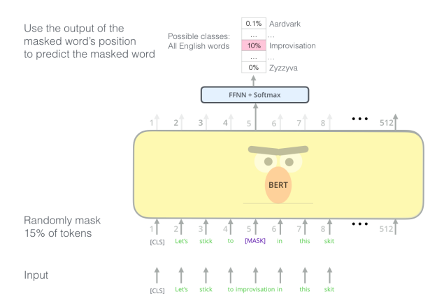

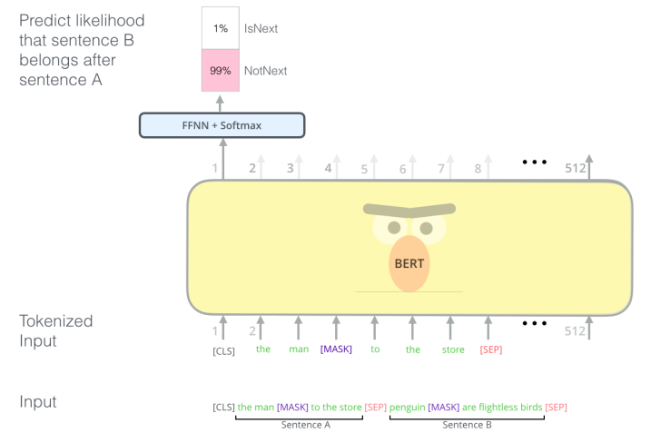

Bert는 위에서 설명했든 사전훈련시에 맨 처음 작업은 맨 위의 그림처럼 Masked LM을 통해서 문장의 몇%를 마스킹 처리를 시키고 그 Masking 단어를 예측함으로써 문장의 의미를 파악한다. 

그 후 두 번째로는 뒤의 문장이 있든 없든(없으면 전부 [pad]토큰이 들어가 다른 데이터와 길이를 맞춘다.) 다음 문장이 이 문장 뒤에 와도 되는건지 아니면 안되는건지를 학습합니다. 

**pretrain 단계에선 모델에게 문장을 학습시키는게 목표이기에 한 문장을 넣든 두 문장을 넣든 따로 label이 되어 있지 않는 데이터를 사용합니다.** 이 점은 fineuning과의 가장 큰 차이점입니다.

**Bert의 파인튜닝 방식**

위 의 방식으로 학습된 모델은 이제 풀고자 하는 문제에 맞게 다시 추가 학습을 시킵니다. Mask와 NSP 두 학습 방식을 주제에 알맞게 사용하는게 관건입니다. 여기서 제일 핵심은 **파인튜닝 단계 부터는 이제 주제에 맞는 데이터를 집어 넣는데 주로 label이 있는(긍정/부정, 문장의 연결이 올바른지 etc) 데이터를 사용합니다.** 우리가 기존의 모델과의 가장 큰 차이점입니다. 초기 사전학습은 문자를 이해시키고 파인튜닝 단계에서는 task에 맞는 label 데이터를 들고와 학습시켜서 원하는 답을 얻어 냅니다. 이 방식은 추후 모든 LM 혹은 NLP 모델에서 사용되는 모델 방식이 됩니다.

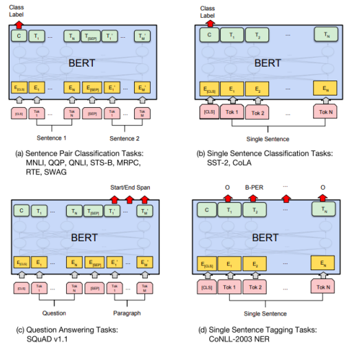

BERT는 Task에 따른 결과 출력이 다르다.

- **텍스트 분류**

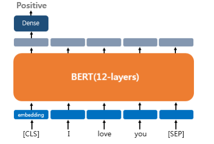

- 텍스트 분류는 어렵지 않게 [CLS]의 값의 출력을 기준으로 결과를 도출한다.
- 여기서 헷갈리면 안되는게 파인튜닝도 maskLM 작업을 당연히 한다. MaskLM 작업도 거쳐서 양방향으로 영향을 받은(물론 맨 처음 단어라 뒤에서 만 받은거지만) 최종 CLS 출력의 결과물을 FFNN 층으로 보내어 분류를 한다.

- **태깅 작업**

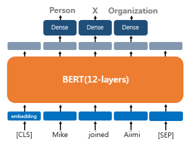

- 태깅 작업도 마찬가지로 가능하다. 대신 최종 결과를 [CLS] 토큰만 출력하는게 아닌 각 단어에 대해 모두 출력해야한다.
- **자연어 추론**

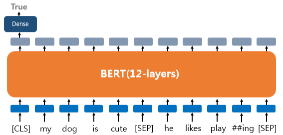

- 추론 문제란 두 문장의 논리적인 관계에 대해 알아 내는 문제입니다.
- 여기서 부턴 두 문장에 대한 **관계**에 대해서 [CLS] 토큰의 결과를 받아야한다.
- [SEP] 토큰과 세그먼트 임베딩을 활용하여 두 문장을 씨게 구분하고 두 문장의 관계를 예측(분류) 합니다.
- **질의 응답(QA)**

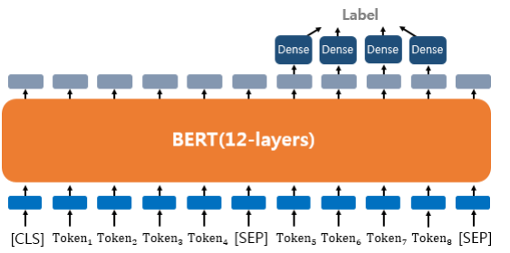

- QA 문제 또한 텍스트를 쌍으로 받는 Task이다.
- 앞에는 [질문]을 뒤에는 [질문의 답변이 들어있는 문장] 이러한 형식으로 한 데이터를 구성합니다.
- “강우가 떨어지도록 영향을 주는 것은?” 라는 질문이 주어지 고, “기상학에서 강우는 대기 수증기가 응결되어 중력의 영향을 받고 떨어지는 것을 의미합니다. 강우의 주요 형태는 이슬비, 비, 진눈깨비, 눈, 싸락눈 및 우박이 있습니다.” 라는 본문이 주어졌다고 해보겠습니 다 이 경우, 정답은 “중력” 이 되어야 합니다. 

- 즉 답을 생성하는게 아니라 저중 self-attention을 통한 가장 핵심이 되는 단어를 찾아 반환한다. 물론 단어가 여러개가 되어 문장형식으로 출력도 가능하고 단답으로도 출력이 가능하다.

**어텐션 마스크**

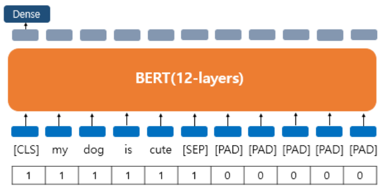

BERT 를 실제로 실습하게 되면 어텐션 마스크라는 시퀀스 입력이 추가로 필요하다. 어텐션 마스크는 BERT가 어텐션 연산을 할 때, 불필요하게 패딩 토큰에 대해서 어텐션을 하지 않도록 실제 단어와 패딩 토큰을 구분할 수 있도록 알려주는 입력이다. 이 값은 0과 1 두 가지 값을 가지는데 숫자 1은 해당 토큰은 실제 단어이므로 마스킹을 하지 않는다라는 의미이고, 숫자 0은 해당 토큰은 패딩 토큰이므로 마스킹한다는 의미이다. 위의 그림과 같이 실제 단어의 위치에는 1, 패딩 토큰의 위치에는 0의 값을 가지는 시퀀스를 만들어 BERT의 또 다른 입력으로 사용하면 된다.
