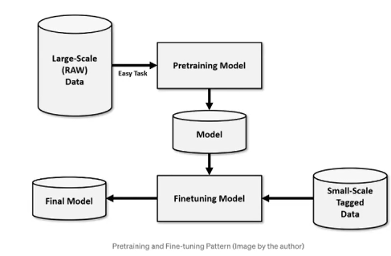
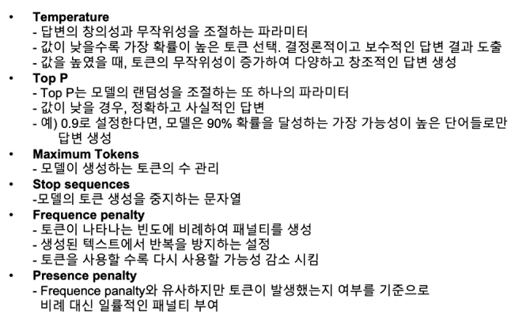

#파인튜닝 #LLM 

파인 튜닝은 미리 학습된 모델에 미세 조정을 한다는것을 의미, 모델의 특정 레이블이 저장된 예제를 제공한 다음 역전파라는 프로세스를 통해 가중치를 업데이트, 상위개념으로 Transfer Learning이 있고 그 안에 Finetuning이 존재한다.

**파인 튜닝 방법**

- Full Fine-tuning
  - 말 그대로 모든 모델 변수를 포함 pre-train 모델 전체를 ine-tuning 하는 작업
  - 이 방법은 모든 파라미터를 재 학습시키기에 리소스와 시간이 많이듬, 하지만 학습의 성능은 보장
  - 주로 기존 모델이 내가 하고자 하는 작업의 목적의 차이가 클 때 사용
- Feature extraction(Repurposing)
  - 이건 pre-train 모델 전부를 재 학습 시키는 방법이 아닌, 결과 출력에 가까운 레이어에서 간단한 조정을 하거나 새로운 학습 데이터에 맞는 레이어를 추가 시켜서 모델을 학습시킨다.
  - 일반적인 지식을 유지하면서 상위 레이어에만 특정 작업을 강요하기에 리소스와 시간이 비교적 덜 들지만, 학습의 성능은 Full-fine tuning 보다 다소 떨어짐
  - 학습데이터가 작은 경우에 유용하다.

**파인 튜닝 유형**

- Supervised Fine-tuning
  - 미세 조정 단계에서 레이블이 지정된 학습 데이터셋을 사용하는 프로세스, 즉 지도학습 방법
  - 주로 LLMs 모델에는 이 방법이 사용됨
  - 텍스트 분류, 이메일 필터링, 감성분석, 질의응답, 문장의 유사도에 성능 향상 도움 많이됨
- Unsupervised Fine-Tuning
  - 비지도 학습 방식으로 학습이됨
  - 분류, 군집 이러한 모델에 학습이 많이 도움됨
  - Mask 언어모델링, 자동 Encoder와 같은 방법을 이용해서 학습 가능
  - LLM 모델을 파인 튜닝 할 때는 이 방식으로 잘 사용안하고 위의 방식을 사용함
  - 이건 조금더 작업에 특화된 도메인 지식을 주입하기 위해 사용하는 경우가 많음 -> 아마 임베딩 모델 파인튜닝 같음 Unsupervised SimCES 와 같은 방식, Rag의 성능이 잘 나오지 않을 때 고려해야하는 방식

 **OPen AI 하이퍼 파라미터**

이건 다 아는데 맨 뒤에 두개의 내용을 몰라서 캡펴

## PEFT

- 적은 매개변수 학습으로 빠른 시간에 새로운 문제를 해결하는 Fine-tuning 방법
- LLM 모델은 너무 커서 전체 모델 즉 풀파인튜닝을 하기에는 비용적으로나 시간적으로 리소스적으로 불가능에 가까움 -> 그래서 등장
- 전부를 건드리는게 아니라 잘 안쓰는 부분은 얼려놓고(Freeze) 그 나머지만 활용하여 모델을 조정함
- check point 파일(튜닝할 때 중간 중간 생기는 로그 파일) 관리에도 용이
- 허길페이스에 많은 기술이 많음
- 대표적으로 LoRA, Prefix-Tuning, Prompt Tuning, P Tuning 등이 존재한다.

대표적인 PEFT 기술

- Knowledge Distillation(지식 증류)
  - 성능이 좋은 모델을 가지고 성능이 좋지 않은 모델에게 지식을 전당하는 방식
  - Teacher model이 student model에게 정보를 전달하는 방식으로 고도하한다.
  - 모델의 크기도 줄이기 가능하고, 정규화도 가능함
- Pruning(가지 치기)
  - 모델의 불필요한 부분을 끊어내는 방식, 모델의 경량화가 주 목적
  - 중복 덜 중요한 매개변수를 식별 ->  그거를 삭제하여 불필요한 계산 방식을 삭제한다.
- Quantization(양자화)
  - 제일 유명하고 기업에서 많이 쓰는 모델 경량화 방식
  - 양자화는 모델변수의 가중치 정밀도를 낮춰서 계산량과 메모리를 낮춤
  - 주로 모델이 32-bit 부동 소수점으로 매개변수 값을 저장하는데 이 값을 8-bit 부동 소수점 소수로 압축하여 저장한다. 즉 필요 없는 정보는 다 짤라낸다고 생각하면 편함
  - 이러한 방식으로 진행을 하면 단편적으로 모델의 크기 자체가1/4정도 줄어들 확률이 높음
- Low-Rank Factorization
  - 가중치 행렬을 Low-Rank Factorization에 근사화 시켜서 행렬의 양을 줄인다.
  - 즉 가중치를 줄여서 근사치 값으로 매핑하는 방식으로 계산량을 줄인다.
- Knowledge Injection
  - 모델의 파라미터를 수정하는게 아니라 테스크별 정보를 주입하여 특정 테스크에 대한 사전학습 모델 성능 향상
  - 기존 아키텍쳐를 수정하여 테스크별 아키텍쳐를 학습
  - 기존에 존재하는 모델을 최대한 활용하여 효율적인 파인튜닝 기술
- Adapter Modunes
  - 추가 학습을 진행하는게아니라 사전에 학습된 모델을 추가하는 경량 모델

### LoRA(Low Rank Adaptation)

- 업데이터 행렬로 알려진 순위 분해 가중치 행렬 쌍을 기존 가중치에 도입하여 새로운 추가 정보를 가지기 위해 가중치 훈련에만 집중합니다.
- 이 내용은 따로 논문을 읽어서 자세하게 리뷰 예정
- 기존 모델에 새로운 LoRA 층을 얹혀서 병합하여 결과를 바꾼다.

### Prefix Tuning

- 적은 매개변수 학습으로 빠른 시간에 새로운 문제를 해결하는 Fine-tuing 방법
- 다양한 언어와 도메인의 데이터 모델을 적용할 때 유용
- 다양한 태스크에 모델을 신속히 적용할 때 유용
- prefix 즉 일련의 연속적인 태스크 특화 벡터를 붙이는 방식

### Prompt Tuning

- 특정 다운 스트림 태스크를 수행하기 위해 언어모델의 가중치를 고정하고 개발 태스크 마다 프롬프트의 파라미터를 업데이트하는 Soft Prompt 학습 방식으 사용

### P tuning

- 사전에 학습된 LM에서 인풋으로 Prompt 역할을 하는 연속적인 파라미터를 사용
- Discrete prompt searching의 대안으로 gradient descent를 통해 이러한 연속적은 prompt를 최적화

