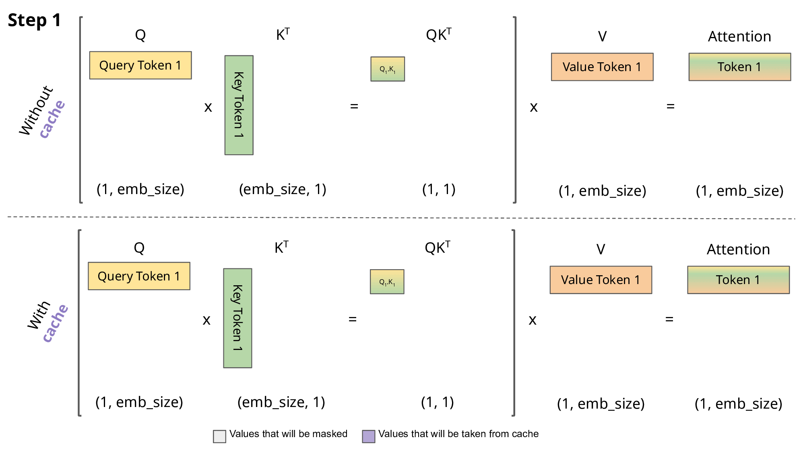

#LLM #Attention #LLMInference #memory 

### Autoregressive와 Decode의 계산
개념적으로 (autoregressive의 정의)
매 스텝 지금까지의 **전체 시퀀스**를 넣어 다음 하나를 뽑는다.

```
[prefix]          → t1
[prefix, t1]      → t2
[prefix, t1, t2]  → t3
```

논리적으론 매 스텝 전체가 관여. 이건 맞는 정의.

**근데 이러면 미친 낭비다**
`[prefix, t1]`을 통째로 다시 넣으면 prefix의 K,V를 **또** 계산. 근데 이미 계산했고, **causal mask 때문에 뒤에 t1이 붙어도 prefix의 K,V는 안 변한다.** → 재계산 = 순수 낭비.

그래서 실제 (KV Cache)
이미 계산한 K,V를 저장해두고, **모델 입력으로는 새 토큰 1개만** 넣는다.

```
prefill:  [prefix] 통째로 한 번  → K,V 저장         → t1
decode1:  [t1] 1개만            → t1의 K,V만 추가    → 저장된 전체로 attention → t2
decode2:  [t2] 1개만            → t2의 K,V만 추가    → 저장된 전체로 attention → t3
```

> **★ 핵심: attention은 전체를 보지만(cache 덕분), 새로 계산하는 건 매번 새 토큰 1개뿐.** "전체를 다시 넣는" 효과는 나되 재계산은 안 함. **출력 토큰은 둘 다 완전히 동일.** cache는 결과를 바꾸는 게 아니라, 이미 한 계산을 안 하려고 저장해두는 것.

> ⚠️ 실제 모델 입력창에 들어가는 건 매 스텝 **마지막 토큰 1개**뿐. "prompt + 지금까지 생성한 것" 전체가 다시 들어가는 게 아니다. (그건 사람이 보는 논리적 맥락일 뿐)
새 토큰 1개(t1)만 입력. 이때:

##### decode의 계산

|                  | 과거 토큰 (P1~Pn)    | 새 토큰 (t1)          |
| ---------------- | ---------------- | ------------------ |
| **Q** (쳐다보기)     | ✗ 안 함            | ✓ 계산               |
| **K, V** (보여지기)  | ✗ **cache에서 꺼냄** | ✓ 계산               |
| **attention**    | ✗                | ✓ (t1의 Q × 전체 K,V) |
| **FFN** (출력 만들기) | ✗ 안 함            | ✓ 계산               |

→ **Q도 FFN도 K,V도 전부 새 토큰(t1) 1개분만.** 과거 토큰은 K,V조차 재계산 안 하고 cache 참조만.

**왜 과거 토큰의 Q·FFN은 필요 없나 — Q와 K,V의 비대칭**
- **Q** = "다음을 예측하려고 남을 **쳐다보는 시선**"
- **K, V** = "남한테 **보여지는 내용**"
- 지금 예측 대상은 **t1의 다음** 하나뿐.
    - 쳐다봐야 하는 건 t1만 → **Q는 t1만**.
    - 과거 토큰은 "보여지는 대상" → **K,V만 제공** → 그건 cache에 있음.
    - FFN(출력 생성)도 지금 필요한 위치는 t1 하나 → 과거 FFN 불필요.

**Attention이 실제로 하는 계산 (Q·K 점수 → V 가중합)**
attention은 "비교"라기보단 **"Q가 각 K와 얼마나 맞는지 점수 매기고 → 그 점수로 V들을 가중합"** 하는 것.

### KV Cache
kv 캐시는 LLM 모델의 계산량을 감소 시켜준다. 최종적으로 계산량을 감소 시켜 보다 빠르게 결과를 받아 볼 수 있는 방법이다.

GPT와 같은 Transformer의 Decoder 모델은 문장을 생성하기 위해 이전 단계의 출력을 이용하는 데 이를 Auto-regressive 모델이라고 한다. 이번에 생성된 단어 토큰은 다음 시점의 단어 토큰을 예측하기 위해 사용되는 LM 모델을 말한다.

transformer 모델은 QKV를 활용한 Attention이라는 방식으로 문장의 핵심을 계산하는 방식이 존재하는데 이 때 디코더의 Attention 방식은 masked-self-attention 방식으로  qk를 구하는데 아래와 같은 방식으로 연산이 이루어 진다.



> KV cache가 연산량을 줄이는 방법 (ref: https://medium.com/@joaolages/kv-caching-explained-276520203249)

여기서 Kv Cache란 기존의 Key/Value 텐서를 각 단어가 나올 때 마다 계산을 하는것이 아니라, GPU에 그 값을 저장하여 이전 토큰의 Key/Value를 계속해서 기억해서 재계산되는 연산을 줄여 최종적으로 연산량을 줄이는게 목표이다. 

Kv Caching은 computer & memory trade-off의 대표적인 예시로 컴퓨팅의 양을 줄이는 대신 메모리 사용량을 증가시키면서 속도를 높이는 방법이다. 물론 이러한 방식은 메모리 사용량을 많이 잡아 먹는다는 문제가 존재한다.

### Context Window Size

Kv cache의 메모리 요구량이 늘어나는 이유는 Context Window Size가 계속해서 늘어나기 때문이다. Context WIndow란 모델이 언어를 예측할 때 영향을 받는 최대 텍스트 양을 의미한다. GPT-4는 최대 32,000개의 토큰을 참조하야 처리가 가능하다. 대표적이로 Skip-gram과 CBOW가 있다.

이 Context Window SIze는 많은 내용을 담고 있는 문서를 참조하는 Rag와 같은 기술을 처리하기 위해 점점 커지고 있으며 필연적으로 한 단어를 예측하기 위해 참조하는 단어가 많아 지면서 kv cache를 하기 위해서 필요한 메모리의 양은 더더욱 커지는 중이다.  


> 독점 LLM과 오픈소스 LLM의 context window size 비교 (by author)

### KV Cache 메모리 요구량 계산


위 식으로 Kv cahe의 메모리 요구량을 구할 수 있다. 

LLM의 sequence length는 지속적으로 커지고 있어 LLM serving 시 long context를 처리하는 것은 매우 중요한 이슈가 되고 있다. 아래 그림은 single node(A100–80GB x8. 총 GPU 메모리 용량: 640GB )를 기준으로 LLaMA2–70B 모델 serving에 필요한 메모리 용량(weight + KV cache)을 나타낸 것이다. Sequence length가 4K일 경우, single node 수준에서 batch size=256을 처리할 수 있는 반면(weight + KV cache:460GB < 총 GPU 메모리 용량: 640GB), sequence length가 128K일 경우, singe node 수준에서 겨우 batch size=8을 처리할 수 밖에 없다. 이와 같은 결과를 통해 다음과 같은 사실을 알 수 있다.

1. Long Context와 Large batch size 조건에서 KV cache가 weight보다 월씬 더 많은 메모리를 소비한다.
2. KV Cache의 메모리 소비량이 매우 커질 경우, 추론 시 GPU 메모리 용량이 bottleneck으로 작용할 수 있음을 의미한다.


### LLM serving시 sequence length와 batch size 결정하기

LLM의 weight는 고정된 값인 반면 KV cache는 sequence length와 batch size에 따라 변화, GPU 메모리는 대부분 weight와 KV cache로 채워지며 GPU메모리 용량에 따라 지원하는 sequence length와 batch size가 결정된다. 따라서 토큰 당 KV cache의 용량을 알 수 있다면 GPU 메모리 용량에 따른 지원 가능한 sequence length과 batch size를 계산 할 수 있다. Llama-2 13b를 Single GPU(A-100-8GB)에서 서비스 한다면 지원 가능한 sequence lenth와 batch size는 다음과 같다.


위 사진은 LLaMA2-13b가 26GB이기에 serving 서버의 메모리 26을 제외시키고 KV cache가 가능한 크기 54B 내에서 모델에게 Batch size와 Sequence length를 주어 cache 가능한 양을 계산한다. 한 레이어의 크기가 0.82MB다.

1.  최대 sequence length
   - batch size = 1일 때,   0.82MB*1*seq_len=54GB이므로 최대 sequence length = (approx.) 65854이다.
2. 최대 batch size
   - sequence length=4K일 경우, 0.82MB*batch_size*4096=54GB이므로 batch size = (approx.) 16이다

만일 A100 GPU(80GB)가 아닌 A100 GPU(40GB)를 사용한다면 메모리 용량의 제약으로 최대 sequence length와 최대 batch size는 모두 1/4 가량 줄어드는 것을 확인할 수 있다.


GPU 메모리 용량(40GB vs 80GB)에 따른 LLaMA2–13B의 max. sequence length와 max. batch size의 변화 (by author)

### 결론

LLM이 long context를 지원할 경우, KV cache가 급격하게 커지면서 GPU 메모리 용량에 따라 추론 시 LLM의 최대 sequence length와 최대 batch size가 결정되는 것을 확인하였다. Long context를 처리하거나 생성을 해야 할 때 GPU 메모리 부족 문제는 batch 처리를 어렵게 만들어 하드웨어 효율성을 낮추는 문제를 초래한다. 이러한 관점에서 제한된 GPU 메모리 용량를 효율적으로 사용하기 위해 다음과 같은 여러가지 방법을 사용할 수 있다.

- 모델 weight의 memory footprint를 줄이는 방법 (e.g. quantization)
- KV cache의 memory footprint를 줄이는 방법(e.g. GQA, MQA)
- Model Parallelism을 사용하여 모델을 여러 GPU로 분할 처리하는 방법 (e.g. tenosr parallelism 등)

KV cache는 HuggingFace의 transforemr 패키지에선 use_cache라는 parameter를 제공하여 , kv cache를 켜거나 끌 수 있다.

Reference

>https://medium.com/@joaolages/kv-caching-explained-276520203249
>
>https://moon-walker.medium.com/long-context%EB%A1%9C-%EC%9D%B8%ED%95%9C-large-kv-cache%EC%9D%98-%EB%AC%B8%EC%A0%9C%EC%A0%90%EA%B3%BC-%ED%95%B4%EA%B2%B0-%EB%B0%A9%EC%95%88-part-i-kv-cache%EC%9D%98-%EB%A9%94%EB%AA%A8%EB%A6%AC-%EC%9A%94%EA%B5%AC%EB%9F%89-025f3d5dea93
>https://dytis.tistory.com/54
>-> 위 링크의` 다음 포스트에서는 LLM inference 최적화를 위해 KV cache의 memory footprint를 줄이는 방법에 대해서 알아보도록 할 예정이다.`도 무조건 봐라

