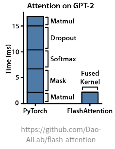
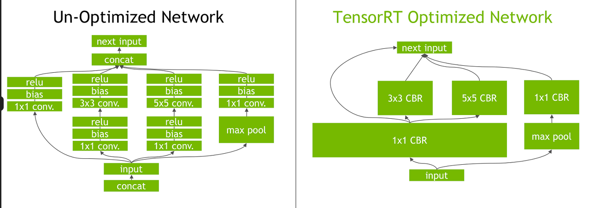

#LLMInference #vLLM #Attention #memory 

> [LLM 인퍼런스 훑어보기(커널퓨전)](https://dytis.tistory.com/58) 의 정보를 따라가고 있습니다.

## kernel Fision 이란?

LLM 모델의 서빙에 관련된 기술들을 알아보고 있다. LLM 모델의 경량화 기법이 대두되면서 이제 sllm vllm 과 같은 모델의 크기를 경량화 시키던가 모델의 계산량을 줄이던가 하는 방법이 중요해지고 있다. 개중 커널 퓨전이란 방식에 대해 알아 보겠다.

GPU는 Kernel 단위로 연산이 이루어 집니다. 예를 들어 우리가 두 개의 텐서를 서로 Matmul 후에 ADD 하는 연산을 수행할 때, Matmul kernel, Add kernel 이렇게 두 개의 커널을 실행하게 됩니다. 이때 두 개의 커널을 실행하는 대신 두 개의 커널을 하나로 하쳐 실행하는 것을 Kernel Fusion이라고 한다.

GPU에서 연산이 실행되면, 필요한 데이터를 메모리로 불러와 연산을 수행한 후, 결과를 다시 메모리에 저장한다. 기본적으로 커널퓨전은 연속된 독립적인 계산 작업들을 단일 하드웨어 작업으로 통합한다. 결과적으로 여러 독립적인 계산을 하나로 통합하여 메모리 이동(메모리 접근 횟수)을 최소화하고 실행 오버헤드를 감소 시켜 전체적인 성능을 향상시킬 수 있다.

이 기법은 학습과 평가 단계 모두에 적용 가능하므로, 딥러닝 모델 사용 시 유용한 최적화 전략 중 하나로 간주된다.

## Kernel Fusion 필요성

- 메모리 대역폭 최적화: 여러 커널이 연속적으로 실행되면 각 커널마다 메모리 읽기/쓰기가 발생하여 메모리 대역폭이 낭비될 수 있다.
- 실행 오버헤드 감소: 각 커널 실행 시 발생하는 오버헤드를 줄여 실행 시간을 단축 한다.
- GPU 활용도 증가: 더 큰 커널은 GPU의 병렬 처리 능력을 더 효과적으로 활용할 수 있습니다.

## Kernel Fusion방법

직접 CUDA C++ kernel 코드를 작성하는 방법과 Pythorch JIT, Nvidia - TensorRT, Tensorflow XLA등과 같은 툴킷을 사용하여 연산을 자동으로 인식하여 kernel fusion하는 방법이 있다. 물론 수동 구현의 난이도는 상상을 초월한다. 따라서 그냥 패키지를 사용하게는 마음 편하다.

## Kernel Fusion 인퍼런스(Pytorch)

[pytorch performence 인퍼런스](https://pytorch.org/tutorials/recipes/recipes/tuning_guide.html#fuse-pointwise-operations)

[Pytorch JIt 인퍼런스](https://pytorch.org/docs/stable/jit.html#)

[Pytorch introduce to torchScript](https://pytorch.org/tutorials/beginner/Intro_to_TorchScript_tutorial.html)

[딥러닝 모델 배포하기 TorchScript & Pytorch JIT](https://happy-jihye.github.io/dl/torch-2/)

## TensorRT

TensorRT는 네트워크 계산 그래프를 구문 분석하고 그래프 최적화의 기회를 찾습니다. 이러한 그래프 최적화는 그래프의 기본 계산을 변경하지 않고, 대신 작업을 훨씬 빠르고 효율적으로 수행하기 위해 그래프를 재구성합니다. 그래프 재구성 단계에서, kernel fusion을 사용하여 연산 성능도 최적화한다.

> 출처:https://developer.nvidia.com/blog/tensorrt-3-faster-tensorflow-inference/

위 그림은 GoogleNet 아키텍처의  inception 모듈을 TensorRT에서 최적화한 결과를 시각적으로 보여준다. 왼쪽 네트워크에서는 오른쪽과 같이 다양한 크기의 컨볼루션, 바이어스, 그리고 ReLU 레이어를 CBR이라고 불리는 단일 커널로 효과적으로 결합할 수 있습니다.

>https://developer.nvidia.com/blog/tensorrt-3-faster-tensorflow-inference/
>
>https://developer.nvidia.com/ko-kr/blog/nvidia-tensorrt-inference-%EC%B5%9C%EC%A0%81%ED%99%94-%EB%B0%8F-%EA%B0%80%EC%86%8D%ED%99%94%EB%A5%BC-%EC%9C%84%ED%95%9C-nvidia%EC%9D%98-toolkit/
>
>[Llama3 TensorRT](https://developer.nvidia.com/ko-kr/blog/supercharging-llama-3-1-across-nvidia-platforms/)

## Kernel Fusion

### Deepspeed Inference(deep fusion)

Deepspeed Inference는 여러 연산자를 단일 커널로 융합하여 커널 호출 수와 커널 전체의 기본 메모리 엑세스 대기 시간을 줄일 수 있다. Kernel Fusion은 Pytorch Jit 컴파일러, TensorFLow XLA 등 에서 사용되는 일반적인 기술이지만 DeepSpeed의 deepfusion은 다르다. 요소별 연산을 주로 융합하는 기존 fusion 기술과는 달리 deep fusion은 element-wise operation, mamul, reduction을 모두 단일 커널로 융합하여 커널 호출 횟수롸 메인 메모리 엑세스를 크게 줄임

> 출처: https://www.microsoft.com/en-us/research/blog/deepspeed-accelerating-large-scale-model-inference-and-training-via-system-optimizations-and-compression/

### FlashAttention

> 깃허브: https://github.com/Dao-AILab/flash-attention

기존 Attention의 많은 I/O 로 인한 메모리 문제를 해결한 방법, 고대역폭 GPU매모리(HBM) GPU 온칩 SRAM 사이의 메모리 읽기/쓰기 횟수를 줄이기 위해 Tiling을 사용하는 "IO-aware"알고리즘, Kernel Fusion의 방식의 하나로 하나로 융합된 mask, matmul 등과 같은 연산을 융합된 kernel에 실행함으로 한번에 HBM에 저장, 특히 pytorch의`torch.nn.functional.scaled_dot_product_attention`(SDPA)함수는 FlashAttention을 기반으로 구현되었다. 추후 더욱 자세하게 작성

