#rnn #DNN #LLM 

## RNN의 개념과 종류

CV에 기본이 CNN이라면 RNN은 자연어 딥러닝에서 가장 기초가 되는 모델이다. 기본적으로 데이터를 시간 혹은 순서에 중점을 두어 현 데이터를 이전 데이터의 정보를 바탕으로 결과를 도출한다.

RNN은 연속적 시퀀스를 처리하기 위한 신경망 모델이다. 사람은 글을 읽을 때, 이전의 단어들을 기억을 하고 다음 단어를 이해한다.

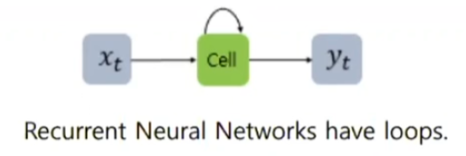

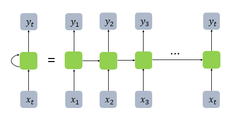

위 그림은 RNN의 가장 기본적인 그림이다. `xt`의 정보를 받으면 반복 `cell`에서 현재와 과거의 정보를 조합하여 `yt`를 반환한다.

만약  `나는 오늘 피곤하다.`라는 문장이 들어오면 `나는`,`오늘` ,`피곤하다` 이러한 단어들이 `xt`에 들어간다. 그럼 맨 처음 들어온 `나는` 이라는 단어가 먼저 cell을 통과하면 이제 그 정보를 가지고 `오늘`이라는 단어가 들어올 때 이전 단어의 정보를 함께 계산해서 다음 cell에 넘긴다.  이러한 작업으로 각 시점에 대한 정보를 다음 시점에 정보를 전달하면 반복적인 학습을 한다.

즉 **RNN은 입력의 길이만큼 신경망을 구축하고, 입력을 받는 각 순간(timestep, 시점)에 과거 데이터의 정보를 받아 값을 도출하는 모델이라고 할 수 있다.**   

RNN은 피드포워드신경망(FFNN)에 시점이라는 개념을 도입한 것 이다.

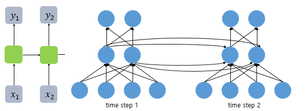

위 그림과 같이 하나의 시점에 FFNN 한 모델이 존재하는 것 이다. `x1`은 단어가 한 개 들어 온 것이고, 이 단어는 임베딩 레이어를 지나서 벡터형식으로 들어 온다. 즉 위의 사진은 단어의 의미를 나타내는 임베딩 벡터가 4차원이라는 것 이다.

RNN은 보통 3가지 케이스에 활용한다.

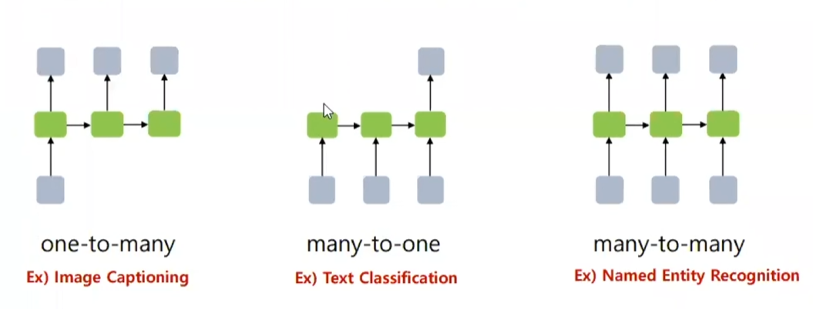

여기서 one-to-many는 주로 이미지에 사용한다. 하나의 이미지 파일을 넘겨주면 그 이미지에는 어떠한 내용이 있는지 찾아내는 것이다. 여기서의 시점은 각 이미지의 위치로 그림에 사람과 강아지가 존재하면 사람과 강아지가 존재한다는 결과를 출력하는 것 이다.

many-to-one와 many-to-many은 자연어 처리에서 주로 사용되는데 각각 텍스트 분류와 나중에 포스팅할 개채명인식 NER태깅에 주로 사용된다. many-to-one RNN을 자연어 처리에 사용하면 주로 문서의 모든 단어를 입력값으로 받아 최종적으로 문서를 분류하는 모델에 사용이 된다. 즉 모델이 글을 읽고 이 문서 어떠한 문서인지 판단 하는 모델이고,  many-to-many는 각 입력값을 받았을 때 그 입력값에 대한 결과를 출력하는 형식, 즉 각 단어가 어떠한 단어인지 혹은 시점의 결과를 순차적으로 반환하는 모델이다.

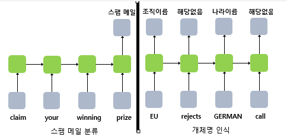

## RNN의 학습 방식

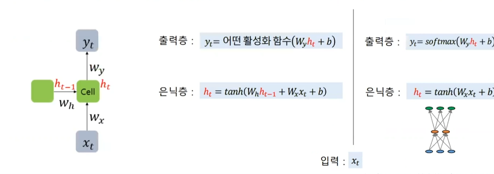

RNN에서 FFNN의 은닉층에 해당하는 레이어는 셀(cell)이라고 부르며 그 셀의 출력을 은닉 상태라고 한다. RNN은 시점에 따라서 입력을 받는데 현재 시점의 hidden state인 `ht`의 연산을 위해 hidden state의 `ht-1`의 입력을 받는다. 이것이 RNN이 과거 정보를 기억하는 방식이다.

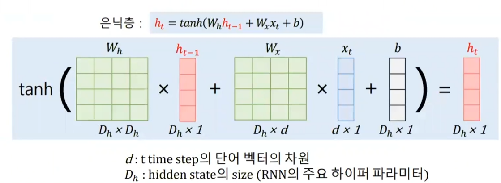

RNN cell의 을 수식으로 나타내면 위와 같다. 현재 시점의 단어의 임베딩 값을 입력값으로 받으면 일반적인 FFNN과 같이 `y=xt +b` 수식으로 받는다. 하지만 여기서 바로 비선형함수를 사용하는 것이 아닌 이전층의 입력값인 `ht-1`의 값을 받아 이 값 또한 새로운 `w`값 가중치를 줘서 계산에 포함 시킨다.이렇게 비선형 함수까지 거쳐 나온 `ht`값은 모델이 다음 시점의 값이 들어오면 과거의 정보를 전해주기 위해 다음 시점의 cell층으로 넘긴다. 이때 RNN의  cell층의 비선형 함수는 무조건 하이퍼볼릭탄젠트(tanh)을 사용한다. 

## RNN의 문제점과 LSTM

RNN은 현재 시점의 정보를 이전 시점의 정보와 결합하여 다음 시점으로 정보를 넘긴다. 이러한 작업 방식은 '장기 의존성 문제(Long-Term Dependency Problem)'을 야기한다.  

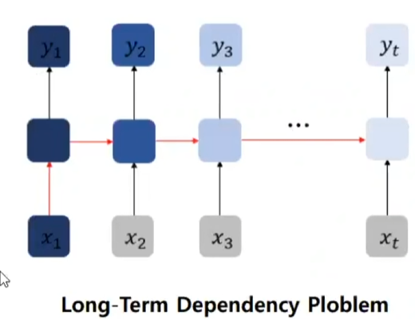

위 의 사진을 보면 짙은 남색의 첫 값이 뒤로 가면 갈수록 옅어지는 그림을 볼 수 있는데 이 말은 RNN의 길이가 길어지면 처음에 나왔던 정보가 후반에 가서는 그 양이 미미해지는 현상이다. 이는 `ht`를 만드는 식에 보면 계속 비선형 함수인 하이퍼볼릭탄젠트를 사용을 하는데 이 함수는 벡터값을 -1~1 사이로 계속 만들기에 이러한 계산 방식이 계속 진행이 되면 h1의 값은 뒤에 가면 갈수록 그 정보량이 미미해진다. 이는 바닐라 RNN의 고질적인 문제이다. 그래서 LSTM 방식을 사용한다.

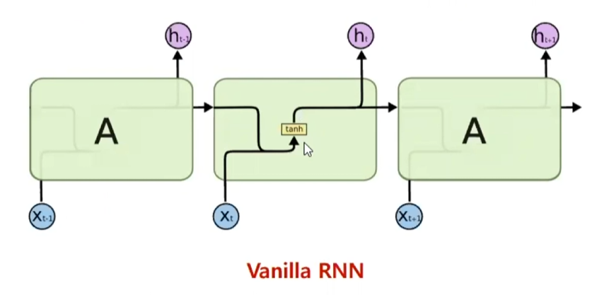

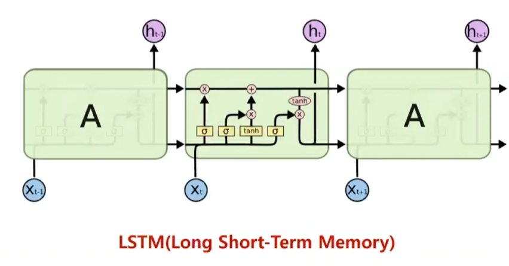

위 그림은 바닐라 RNN과 LSTM의 작동 방식의 차이를 나타낸다. **보통 LM에서 RNN을 사용한 모델이라고 하면 기본적으로 LSTM 모델을 사용한다고 가정한다.**

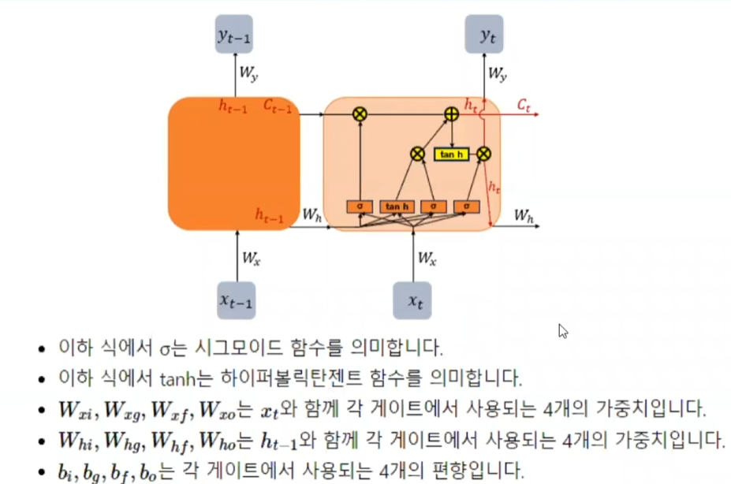

LSTM에서 핵심이 되는 부분은 `Ct`부분이다. 이 부분이 바닐라 RNN의 '장기 의존성 문제' 를 해결하기 위해 고안된 방법이다. `Ct`이 부분은 Cell State라고 하며, 바닐라 RNN은 HIdden State만 사용을 한다면 LSTM은 두 State를 모두 사용한다. cell State는 gate라는 구조를 통해서 정보를 더하거나 빼는 등의 통제를 가한다.

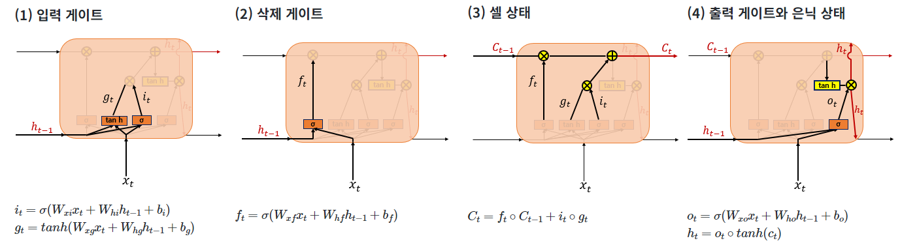

입력 게이트

- 입력 게이트는 현재의 정보를 기억하기 위한 게이트이다.
- 과거의 hidden_state 값과 입력값을 받아 각각 시그모이드 함수와 하이퍼볼릭탄젠드를 활성화 함수로 사용해서 두 개의 값을 구한다.

> 입력 게이트에서 시그모이드 활성화 함수를 사용하여 값을 구하는 이유는 현재의 정보량을 얼마나 남길지 결정하기 위해서이다. 이 부분이 필요한 이유는 다음에 나올 삭제 게이트와 함께 셀 상태에서 꼭 필요하기 때문이다.

삭제 게이트

- 삭제 게이트는 정보를 삭제하기 위한 게이트이다.
-  `ht-1`값을 받아 현재의 입력(단어의 임베딩 벡터)과 함께 시그모이드 함수를 사용하여 0~1의 사이 값으로 변경한다.
- 이 값이 0에 가까울 수록 많은 정보가 삭제된 것이고 1에 가까울 수록 적은 정보가 삭제 된 것이다.

> 입력 게이트에서 시그모이드 함수를 쓰는 식과 같다. 다른점은 서로 다른 `W`와 `b`를(파라미터) 사용한다는 거다.

 셀 상태(셀 스테이트, cell_state)

- 입력 게이트의 두 값을 원소별 곱(entrywise product)을 진행한다. 
- 삭제 게이트의 `ft`값과 이전 시점의 cell값인 `ct-1`을 원소별 곱(entrywise product)을 진행한다.
- 두 값을 더한 값을 이번 시점의 `ct`로 기록한다.

> 원소별 곱(entrywise product)은 두 행렬의 동일한 위치 값끼리 곱하는 걸 말한다. 

> 이 부분에서 입력 게이트의 시그모이드 식과 삭제 게이트의 존재 의의가 나온다. 여기서 삭제 게이트의 `ft`가 0에 가까워 지면 이전 시점의 cell state의 값인 `ct-1`은 0에 가까워 진다. 반대로 현재 시점의 정보 보존량을 나타내는 `it`의 값이 0에 가까워지면 그 또한 마찬가지다. 즉 **삭제 게이트는 이전 시점의 입력을 얼마나 반영할 것인가, 입력 게이트는 현재 시점의 값을 얼마나 반영할 것인가**를 결정하기 위한 게이트 들인 것이다. 이 두 값을 더해서 각각의 게이트끼리 힘싸움을 하게 만든 것 이다.

> 이게 왜 현재 시점과 과거 시점의 힘싸움이냐면 결국 각각의 값을 구하기 위해 우리는 결국 가중치와 편향`W`와 `b`를 사용하는데 이 파라미터들은 학습을 진행하면서 계속 값이 수정이 되고 이때 삭제 게이트의 가중치와 입력 게이트의 가중치 둘 중 어떠한 가중치에 값을 더 높게 혹은 낮게 줄 때 결과 값이 더 좋은지를 알아보면서 값을 수정을 한다.

출력 게이트 

- 출력 게이트에선 이번 시점의 hidden state를 구한다. 
- 출력을 위한 값으로 변경을 해야하지 cell state 값을 하이퍼볼릭 탄젠트를 사용하여 -1에서1 사이로 값을 변경한다.
- 이번 시점의 정보량을 다시 부각시키기 위해 시그모이드를 사용한 값과 cell state의 값을 원소별 곱을 한다.
- 여기서 나온 hidden state의 값을 다음 셀에 넘기거나 출력하여 softmax층으로 보낸다.

이러한 LSTM을 사용하여 아래와 같은 다양한 RNN 모델들을 구축한다.

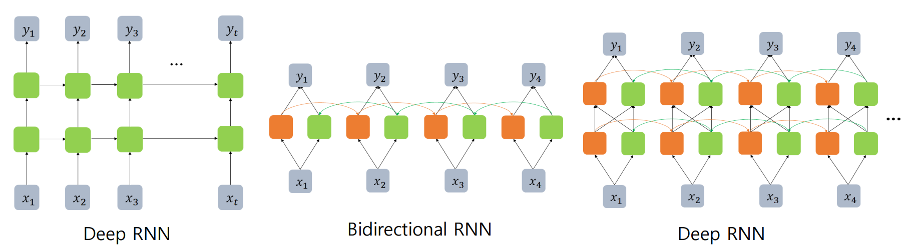

 Deep RNN은 은닉층을 몇겹 더 쌓은 모델이고 여기서 중요한 모델은 Bi-RNN 혹은 BI-LSTM으로 불리는 Bidirectional(이후 BiRNN)모델이다. BiRNN모델은 학습을 진행 할 때 순서대로 학습하는 부분과 역방향으로 학습하는 부분 두 형식으로 학습을 진행하며 이러한 학습 방식은 앞의 문맥뿐 아니라 뒤의 문맥까지 학습에 영향을 주어 빈 칸 채우기와 같은 목표를 가졌을 때 매우 효과적이다.

## GRU

GRU는 뉴욕대학교의 자랑스러운 한국인 교수님이 제안하신 방법이다. LSTM과 마찬가지로 RNN의 의존성 문제를 해결하기 위해 제시된 모델이며 LSTM에서는 출력, 입력, 삭제 게이트라는 3개의 게이트가 존재하는 반면, GRU에서는 업데이트 게이트와 리셋 게이트 두 가지 게이트만이 존재한다.

LSTM보다 게이트의 개수가 줄어들어 학습시 찾아야하는 파라미터의 수가 줄어들어 lSTM 보다 빠른 속도를 자랑한다.

> [위키독스 딥러닝 자연어](https://wikidocs.net/22889)에선 경험적으로 데이터의 양이 적을 때는 매개 변수의 양이 적은 GRU가 조금 더 낫고, 데이터 양이 더 많으면 LSTM이 더 낫다고 한다.

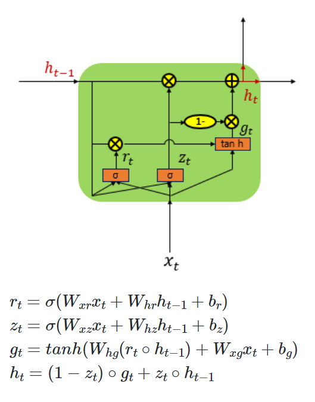

LSTM과의 차이점은 Cell_State가 없기 때문에 다음 시점으로 정보를 전달할 때 hidden_state만 넘긴다는 차이점이 있다.

# 1D-CNN

CNN은  보통 이미지 처리에서 많이 사용되는 DNN 모델이다. 이미지 처리에서 사용되는 CNN은 2D-CNN(혹은 그 이상) CNN모델이다. CNN은 커널(혹은 필터 이하 커널)라는 행렬을 가중치로 사용하는데 이 커널을 입력데이터 행렬과 합성곱을 하면서 그 데이터의 특징점을 부각시켜 데이터를 처리하는게 특징이다.

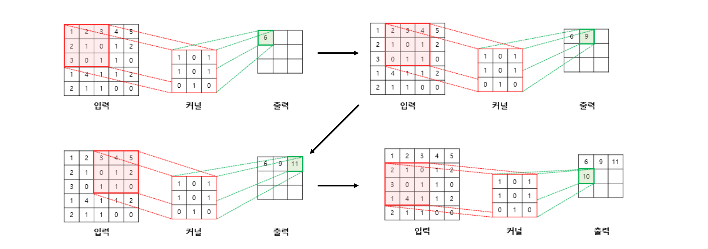

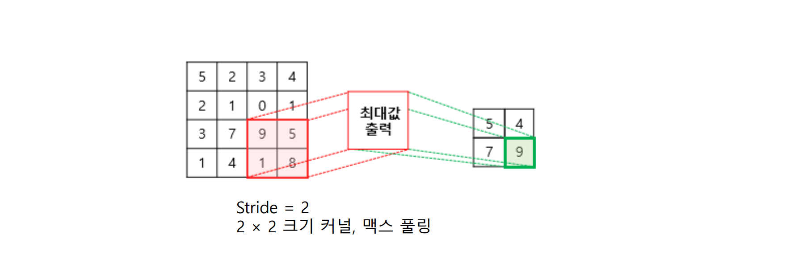

위 사진은 가장 기본적인 2D-CNN의 합성공 방식이다. 커널은 행렬이고 이 커널로 이미지의 가장 왼쪽 위 부터 가장 오른쪽 아래까지 순차적으로 겹치는 부분의 각 이미지와 커널의 원소값을 곱해서 모두 더한 값으로 출력을 한다. 

이렇게 계산된 값은 다음층으로 보내는데 이 층을 풀링 층이라고 한다. 풀링도 종류가 다양한데 합성곱을 통해 나온 행렬의 최댓값을 샘플링하는 맥스풀링(MaxPooling), 행렬의 평균을 샘플링하는 민풀링(MeanPooling) 자주 사용하진 않지만 최솟값을 추출하는 민풀링(MinPooling)이 존재한다. 가장 대표적이고 대중적인 풀링방식은 맥스풀링이며 합성곱으로 특징을 부각시키고 가장 큰 특징을 추출하는 작업이다.

움직이는 거리는 스트라이드(Stride)라고 하며 직접 설정 할 수 있다. 지금 가장 위 예시는 스트라이드가 1인 예시이다. 또한 자연어 처리와 마찬가지로 패딩(Padding) 기법이 있다. 자연어 문제에의 패딩은 서로 다른 문장 길이를 통일시키는게 목적이지만 이미지에선 사진 주위에 0을(제로 패딩[Zero Padding])을 감싸 줘서, 합성곱을 진행할 때 사진의 끝에 있는 데이터들도 다른 데이터들 처럼 같은 횟수로 합성곱이 진행되게 한다. 

이러한 CNN 모델은 자연어에서도 빛을 발휘한다. 데이터와 커널의 합성곱 진행을 가로 세로로하는 2D-CNN과 달리 자연어 문제에서는 위에서 아래로 한 방향으로만 합성곱을 진행하는 1D-CNN 방식을 사용한다.

> 이 방식도 한국인! 김윤님이 첫 발표를 했다.

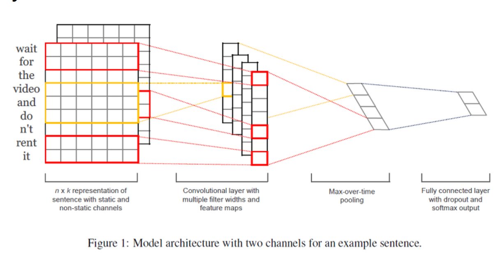

1D-CNN의 학습 방식은 기존의  RNN과 같이 임베딩을 거치고 커널을 사용한 합성곱을 진행한다. 이 커널은 RNN의 w,b와 같은 학습 해야 하는 파라미터이다. 가로로는 임베딩 벡터의 차원이고 세로는 문장 혹은 문서의 길이이다. 만약 문장 혹은 문서의 길이가 부족하다면 2D-CNN과 마찬가지로 패딩을 한다. 길다면 trim으로 줄인다.

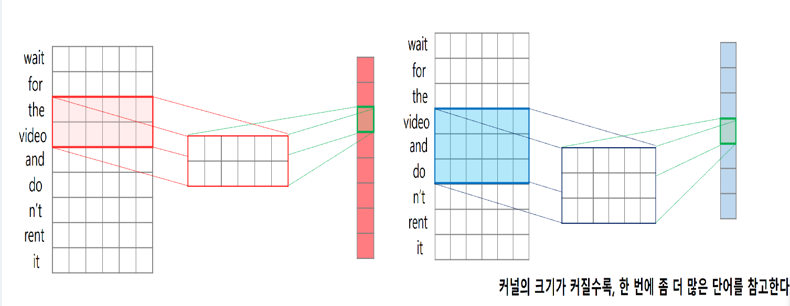

1D-CNN은 오직 한 방향으로만 커널을 스트라이드 하면서 합성곱을 진행한다. 1D의 의미는 하나의 방향으로만 움직이기에 붙혀진 이름이다. 커널로 임베딩 행렬을 위에서 아래로 순차적으로 겹쳐지는 부분을 합성곱을 진행을 한다.

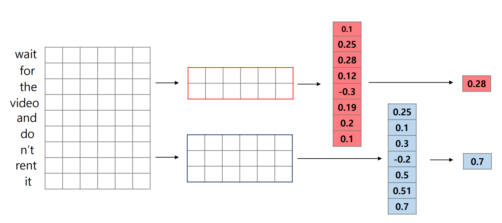 

그러곤 맥스풀링(Maxpooling)을 한다. 이미지지 처리의 CNN과 비슷하게 합성곱을 통해 나온 행렬의 가장 높은값을 다음 층으로 보낸다.

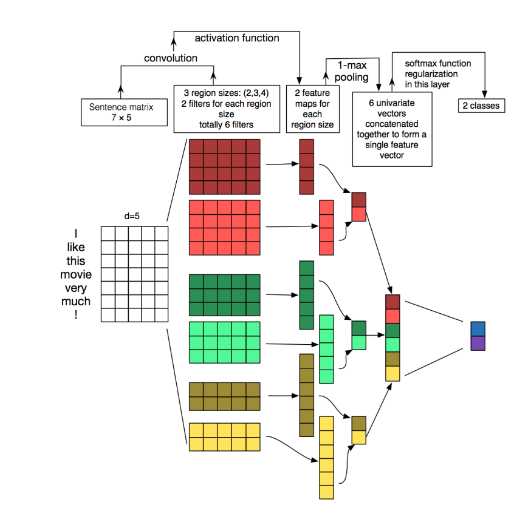

전체적인 1D-CNN의 학습 설계도 이다. 정리하자면 임베딩 벡터를 받으면 사용자가 설정한 커널의 크기로 합성곱을 진행한다. 여기서 커널은 모델이 학습 해야할 파라미터이며 **커널을 두 개 이상 설정을 할 수 있다.** 지금 위의 사진으로 커널은 (2,3,4)이다. 사진과 같이 임베딩 벡터의 크기가 5면 (*4*,5) 크기의 커널을 기준으로 합성곱을 *3*번 진행할 거고(이 때 -1씩 줄이면서 진행한다.) 이러한 작업을 *2*번 진행을 할 거란 이야기이다.

합성곱이 진행이 되면 풀링층에 넣어 MaxPooling을 진행하고 모든 값들을 다시 모은 뒤 그 값을 가지고 가중치 곱을 지나 Softmax 진행을 하여 결과값을 출력한다.

> 참고로 저 작은 박스 하나하나가 모두 파라미터인데, 실제 모델을 짜보면 위 박스보다 더 많은 파라미터가 나온다. 그 이류는 저 박스들은 w(기울기)만을 나타내기에 b(편향)은 안그려진거다. 기본적으로 Tensorflow 딥러닝은 b가 필수이기에 커널 혹은 가중치 행렬 하나당 b가 1개 추가되는거다. 즉 저기 사진에선 16개의 편향이 존재한다.

## 1D-CNN의 문자 단위 합성곱

1D-CNN은 문자(Character) 단위로도 합성곱을 진행 할 수 있다. 아래의 그림과 같이 합성곱을 진행할 행렬을 단어 단위가 아닌 문자 단위로 만들어서 CNN을 진행하는 방식이다.

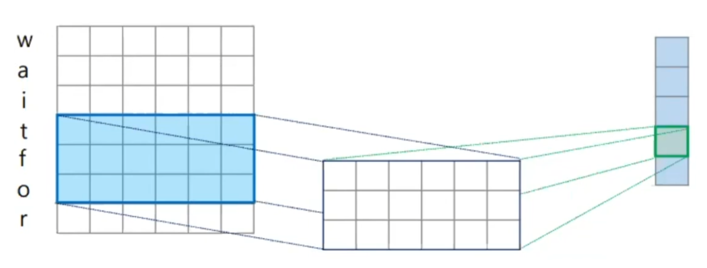

이러한 방식의 장점은 Vocab에 없는 새로운 단어인 OOV문제에 강건한 모델을 만들 수 있는 장점이 있다. 기존에는 현실에 존재하지만 vocab에 없는 단어든 오타 혹은 신조어와 같은 단어를 모델은 학습시 본적이 없으니 out-of-vocab의 준말이 oov로 임베딩을 하고 결과를 출력한다. 하지만 단어 단위로 임베딩을 하면 '단어'라는 단어를 실수로 '단워'라고 작성을 해도 모델은 문자 단위로 '단'과 '워'를 통해 임베딩 벡터를 출력을 하고 이 임베딩 벡터는 '단어'의 임베딩 벡터와 비슷할것 이다. 이러한 작업을 'Charater Embedding(문자 임베딩)'이라고 한다. 다른 포스팅에서 깊게 다루겠다. RNN도 문자 임베딩 방식이 따로 있으니

그렇다고 Charater Embedding 방식을 혼자 사용하진 않는다. 아무래도 단어의 의미가 많이 퇴색되다 보니 일반 Embedding과 함께 concatunate해서 두 벡터를 연결한 다음 사용 한다.

# NER Tagging

NER Tagging은 시퀀스 레이블링의 한 종류로 개체명 인식이라고 한다. 개체명 인식이란 비정형 텍스트의 개체명 언급을 인명, 단체, 장소, 수치등 정의된 분류로 분류하는 작업인데 만약 '나는 학생 이다.'라는 문장이 들어오면 나: 사람, 는: 전치사, 학생: 직업, 이다.:O 이렇게 각 개체에 대한 정보를 기입하듯 NER 태깅은 시퀀스 레이블링의 한 종류로써 [x1, x2, x3...]에 대해서 [y1, y2, y3...]을 각각 부여하는 작업을 말한다. 

개체명 인식 작업은 RNN의 mamy-to-many 모델로 하는게 일반적이고 코드에 `return_sequences = True`로 작성을 하면 각 단어(시점)마다 결과가 출력이 된다. RNN중에서 주로 Bi-LSTM을 사용한다. 한 단어의 성질을 알기에는 앞뒤 문맥을 고려하는게 좀 더 문맥을 파악하기에 편하기 때문이다.

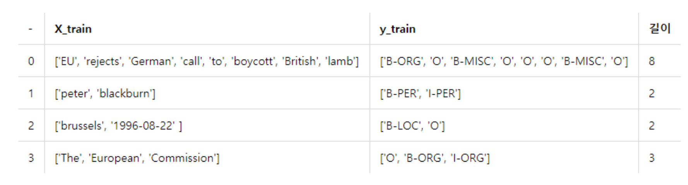

NER 태깅은 보통 BIO 태깅과 같이 사용되며 결과 출력시 같이 라벨링 된다.

BOI 태깅은 개체명 인식에서 제일 자주 사용되는 태깅 방법이며 각각 B,I,O로 나누어 표기한다. B는 Begin의 약자로 개체명인 단어의 시작 표기하고 I는 inside의 약자로 개체명에 시작점이 아닌 내부에 표시한다. O는 Outside의 약자로 개체명이 아닌 부분을 의미한다.

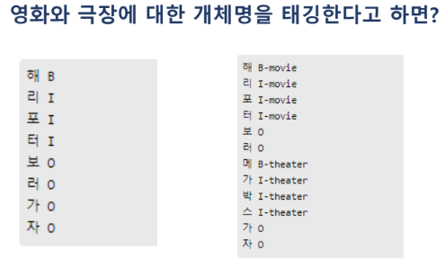

주로 태깅 작업은 개체명에 의미를 부여하는 NER 과 개체명인지 아닌지 판단하는 BIO를 동시에 쓴다. 위의 사진과 같이 NER기준에선 '해리포터'는 영화 제목과 관련된 단어라 전부 'movie'로 태깅되고 movie로 태깅관 음절(영어의 경우 단어임)기준으로 시작 음절인 '해'에는 B가 들어가 `B-movie`를 작성하고 시작 지점이 아닌 개체명에는 'I-moive'가 들어가는걸 볼 수 있다. o는 개체명이 아니기에 NER 정보는 들어가지 않는다.

## CRF

CRF는 Conditional Random Field의 약자로 딥러닝 모델이 아닌 통계적인 방식으로 개체명을 처리하는 방식이다. 딥러닝이 등장하기전에도 독자적으로 존재해왔던 모델로써 이 CRF를 BI-LSTM 모델 안에 하나의 층으로 추가하여 개체명 인식 모델을 구축하는게 일반적이다.

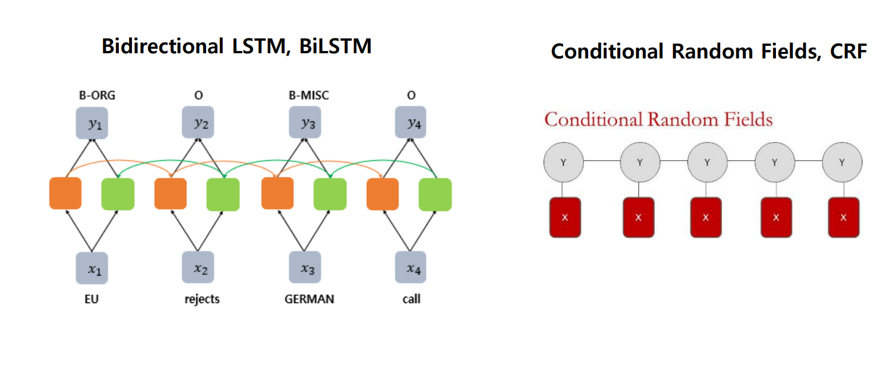

일단 최초의 태깅 작업은 Bi-LSTM으로 결과를 받으면 그 결과를 바로 출력하지 않고 분류 문제를 처리하기 위해 나온 Softmax층의 결과를 CRF층에 넣는다. Softmax층에서 나온 확률들을 CRF층에 넣어서 각 태깅 조합의 확률을 살펴 본 다음 최종적으로 판단하여 결과를 출력한다. 

왜 SoftMax에서 멈추지 않고 한번 더 CRF 층에 넣어 결과 받아볼까? 그 이유는 Softmax층에서 출력한 결과는 각 시점의 최고 확률이기 때문이다. 

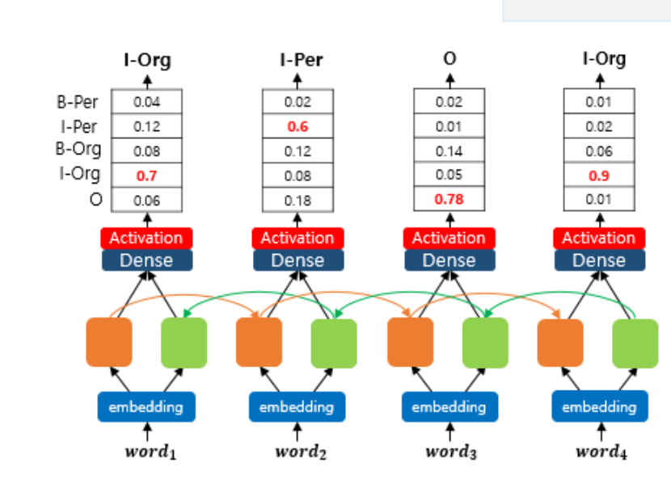

각 소프트 맥스 층에서 나온 결과 예시이다.  보통 단어의 시작을 알리는 부분의 태그는 B로 시작하여야 한다. 하지만 그림에서는 I로 판단항 출력중 이다. 물론 충분한 학습을 통해 개선될 여지가 있지만 RNN의 정의에선 전체적인 BIO에 대한 흐름을 학습하는것이 아닌, 출력 시점을 기준으로 앞의 시점이나 양 옆의 시점과 연계하여 판단하는 것 이기에  이 단어는 학습시 앞뒤의 단어로 봤을 때 I일 확률이 가장 높다로 결과를 출력하지, B로 시작해야 한다 혹은 O뒤에는 I가 등장하지 않는다와 같은 규칙 자체를 깊게 학습하지 못할 것 이다. 그렇기에 CRF층을 쓴다. 

CRF층의 목적은 각 시점의 태깅 확률을 반환하는게 아닌 최종적으로 조합된 결과의 확률을 파악한다. 태깅에는 정해진 규칙이 있어 학습데이터에는 일정한 규칙이 존재할 것이고 CRF는 이러한 규칙을 학습하는데 초점을 둘 것이다. 위 그림을 보면 RNN 학습을 통하여 나온 첫 시점의 단어가 다른 학습데이터에선 I로 많이 쓰인 단어인지 문장의 맨 앞은 무조건 B로 시작 되어야 하지만 I로 판단하는 모습을 볼 수 있다. CRF는 단어의 태깅이 아니라 규칙을 학습하여 이 단어는 다른 문장에서도 I일 때가 많았으니 I일 것이다가 아닌 문장에서 시작은 B다! 라는 규칙을 학습하여 RNN으로 나온 결과를 조정하여 최적의 조합을 출력하는게 목적이다.

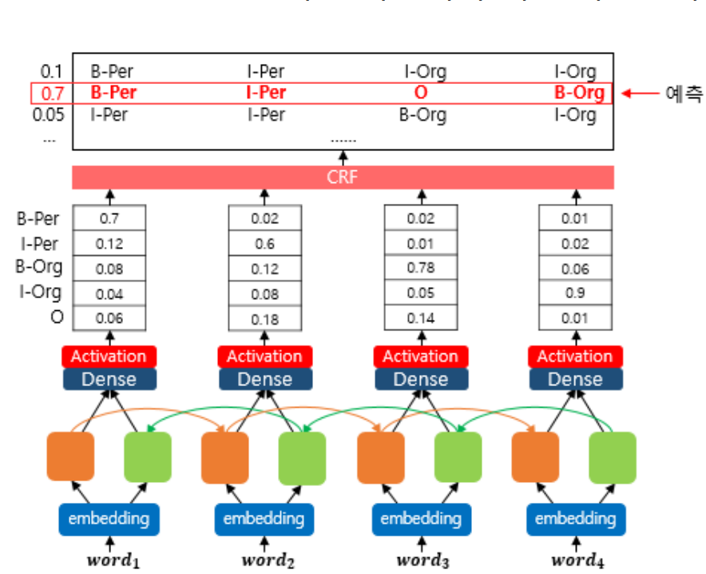

그리고 NER 태깅 같은 경우 임베딩 벡터를 1D-CNN의 Charater Embedding과 함께 사용하면 더욱 좋은 성능을 보인다. OOV 문제도 해결될 뿐더러 

[End-to-end Sequence Labeling via Bi-directional LSTM-CNNs-CRF](https://arxiv.org/abs/1603.01354) 논문에선 POS 태깅은 몰라도 NER 태깅에선 유의미한 성능 개선을 보여준다고 결론 짓고 있다.

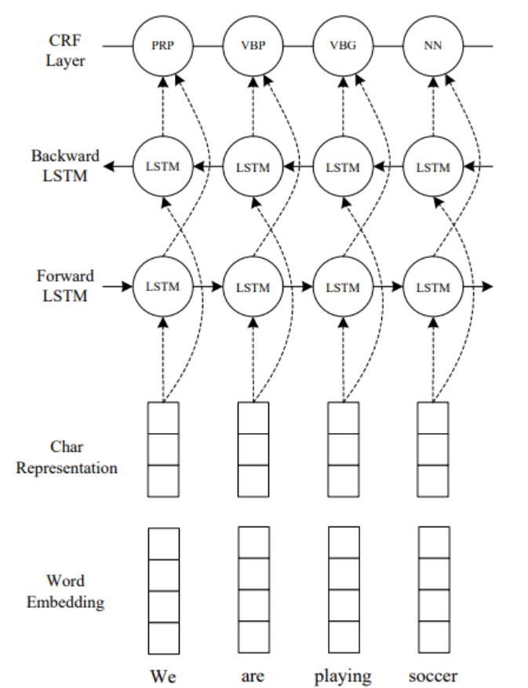

