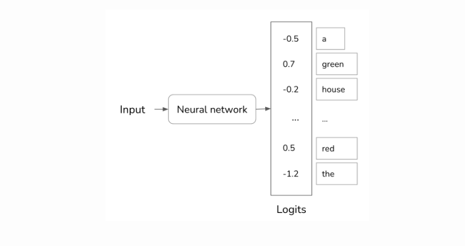
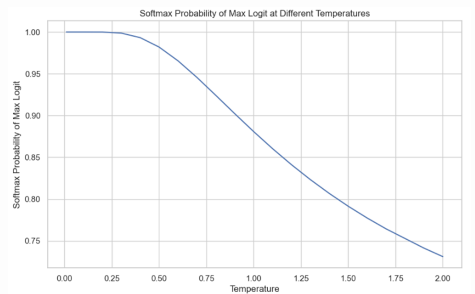
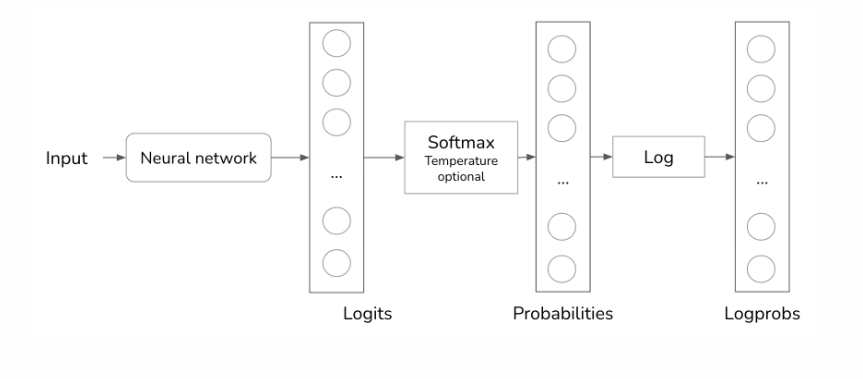
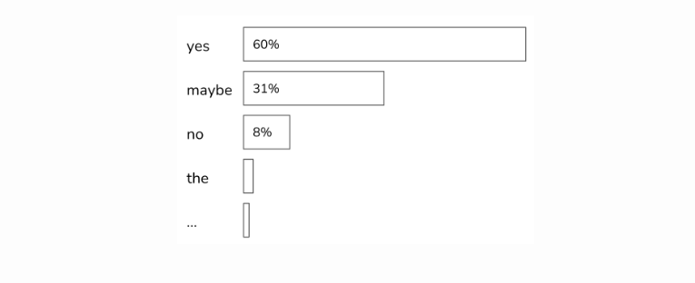
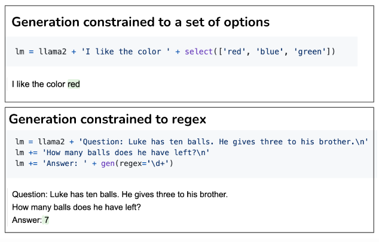
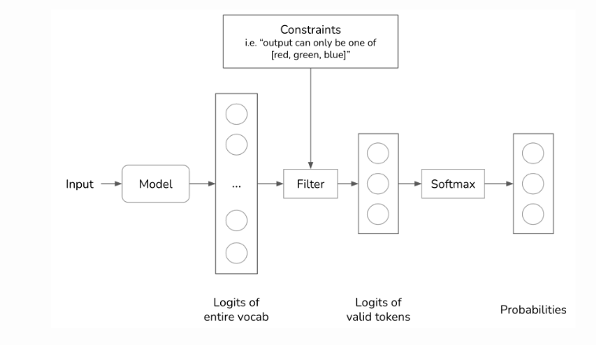

#LLM #확률 #textGeneration #LLMInference #디코딩 

> 출처: [Sampling for Text Generation](https://huyenchip.com/2024/01/16/sampling.html)

위 블로그의 내용을 번역 후 리뷰한다. 원하는 text generaion sampleing 기법이 적혀 있다. 모든 내용을 번역하는게 아니라 해당 포스팅의 각 부분에 블로거가 하고 싶은 말만 적겠다.

해당 부분은 그리고 LLM 디코딩의 핵심 적인 부분과 파라미터를 설명하고 있다.

## Document

AI의 확률적으로 답하는 능력은 창의적인 문제에 적합하다. 하지만 이러한 특성은 inconsistency와 hallucinations의 이유가 된다. 왜 AI는 확률적일가? 본 문서에선 3가지로 나뉘어 그 이유를 설명한다.

1. **Sampling**: temperature, top-k, top-p를 포함한 sampling 기법과 전략
2. **Test time sample**: 모델의 성능 향상을 위한 multy output sampling
3. **Structured outputs**: 모델의 특정 형석의 출력을 하게 만드는 방법

------

**Table of contents**

- Sampling
  - Temperature
  - Top-k
  - Top-p
  - Stopping condition
- Test Time Sampling
- Structured Outputs
  - How to generate structured outputs
  - Constraint sampling

------
## 디코딩(Decoding)
- 언어 모델은 매 스탭 마다 모델의 마지막 레이어가 로지스틱 값에 소프트 맥스를  거쳐 단어 사전에서 존재하는 단어 중 이번 스탭에 등장할 만한 단어 확률 분포를 내놓고 단어를 뽑는다.

**Greedy decoding**
- 가장 기본적인 방법으로 매 스탭 화귤 최고 토큰만 선택한다. 
- 가장 빠르고 결정적 즉 같은 질문이 들어와도 답변이 바뀔일이 없다.
- 근데 모든 그리디한 방식이 마찬가지지만 문장 전체로 보면 항상 최선의 단어를 생성했다고 볼 수 없다.
- 그래서 빔서치가 나왔다.

**빔서치(BeamSearch)**
- 각 단어의 생성 때 후보 시퀀스를 k개 유지하면서 여러 갈래를 동시에 뻗어보고, 문장 완성시 누적 확률이 가장 높은 시퀀스를 선택한다.
- 그리디 보다 전역적으로 나은 문장을 생성한다.
- 하지만 실무에선 빔서치 방식을 사용하지 않는다.
	- 매번 k개의 후보 시퀀스를 만들고 문장을 만들고 선택하다보니 문장 생성이 엄청 느림
	- 결과가 밋밋하고 생각외로 너무 흔한 답변만 생성하여 퀄리티가 별로임 즉 그리디 보다 좋은 정답을 만드는건 자명한 사실이지만 너무 정답만 생성하기에 답변이 로봇같다.
		- 정답인 문장 !- 좋은 문장이기에
	- 그래서 빔서치는 **기계 번역, 음성 인식, 요약**과 같은 태스트에서만 사용
## Sampling

- 언어 모델은 먼저 다음 단어를 예측하기 위해 Vocab에서 다음 단어의 확률분포를 계산한다.
- 
- 만약 스펨메일을 분류하는 문제라고 한다면 현 시점에서 스펨메일일 확률이 높은지 적은지만 판단하면 되지만 이러한 현 시점에서 가장 확률이 높은거만 샘플링하는 greedy sampling 한 방식은 언어모델에선 항상 같은 답변문장만 만들 확률이 높다.
- 만약 '내가 가장 좋아하는 색상은 ..'이라는 문장이 생성될라고 할 때 '녹색'과 '빨강'의 확률이 각각 50%, 30%면 사람의 따라 좋아하는 색상이 다를 수 있어도 학습 될 때의 시점에선 vocab안에 있는 색을 표현하는 단어들 중 '녹색'이 가장 높았기에 '녹색'이라는 단어만 항상 생성이 된다.

### Temperature

- 언어 모델이 확률 분포에 기반하여 다음 단어를 예측해서 문장을 만드는 작업의 가장 큰 문제는 덜 창의적인 답변이 생성된다는 거다.
- Temperature은 등장 가능한 단어의 확률을 재분포하는 방식이다.

- 먼저 input이 들어오면 logits vector를 반환한다. 이 logitsvector의 크기는 vocab의 크기와 동일하고 하나의 logits은 하나의 단어에 매핑된다.
- 이 logistics값이 높으면 언어모델이 선택할 확률은 높은건 맞지만 logistics이 단어가 선택될 확률을 나타내진 않는다. logistics은 음수가 존재할 수도 있다. 하지만 확률은 음수가 존재할 수 없기 때문이다. 그래서 logistics을 확률로 번형하기 위해  softmax를 사용한다.

$$
p_i = \text{softmax}(x_i) = \frac{e^{x_i}}{\sum_j e^{x_j}}
$$

- Temperature는 logits 값이 softmax함수에 들어가기 전에 사용되는 상수이다. temperature이 T, logit 값이 xi일 때 `xi/T`로 계산하여 이 수정된 logits 값이 softmax에 들어간다. 
- logits 값이 `[1,3]`이 있다고 가정해 보겠다.
  - Temperature를 사용하지 않았을 때 즉 Temperature = 1일 때 Softmax에 값을 넣으면 `[0.12, 0.88]`이 된다.
  - Temperature = 0.5 일땐 `[0.02, 0.98]`
  - Temperature = 2 일땐 `[0.27, 0.73]`
- Temperature가 낮으면 모델은 logits 값이 높은 값을 더욱 부각시킨다.
- Temperature는 값이 낮으면 낮을수록 높은 창의성을 유발하지만 모델 결과의 일관성은 떨어트린다.

- 이 그림을 보면 Temperature가 0.1 이하이면 softmax가 가장 높은 값에 배정되면서 항상 같은 값이 나온다.
- 보통 Temperature은 0.7이 권장되지면 실험에 맞게 계속 조정하면서 찾아야한다.
- 만약 Temperature을 0으로 설정하면 모델은 softmax등을 사용하지 않고 `argmax`를 사용할 것이다.
- model은 학습을 통한 확률을 기반으로 예측을 하는데, 결과가 완전한 무작위성의 띈다면 학습이 부족한 경우이다.
- Open AI는 이러한 단어 확률을 [logprobs](https://cookbook.openai.com/examples/using_logprobs)로 받는다.

> Open AI의 Logprobs
>
> Open ai의 logprobs는 각 토큰이 순서대로 발생할 가능성을 나타낸다. p는 확률이며 이 확률을 log(p)한게 logprobs다. opean ai 는 이 logprobs에 4가지 포인트가 있다고 한다.
>
> - Log(p)가 높으면 높은 확률을 나타내기에 모델의 성능을 평하할 때의 척도로 사용가능하다.
> - 또한 log이디 때문에 값이 음수이거나 0 일수 있다.
> - logprob를 사용하면 생성된 문장의 결과를 수치화 하여 표현 가능하다.  이러한 스코어링은 모델의 결과들을 비교가능하게하고 최고의 답변을 뽑을 수 있다.
> - 이러한 결과의 수치화로 모델의 결과에 대한 인사이트를 도출하여 결과로 나오지 않은 다양한토큰에 대해 고찰이 가능하다.
>
> 

- 아래 댓글을 보니Temp = 0은 argmax와 동일하므로 매우 높은 temp는 가능한 토큰에 대한 균일한 균포에서 샘플링한다. 라는 점도 알아두면 좋겠다고 한다.

### Top-k

- Top-k는 모델의 성능을 줄이지 않으면서 컴퓨팅 작업량을 보다 줄이기 위한 방법이다.
- 일단 softmax를 사용해서 vocab의 단어의 등장 비율을 구하기 위해선 모든 단어의 logits의 합을 구하고 각 logits에 logtis을 나눠 주는데 LLM 특성상 vocab의 크기는 너무 크다.
- 이러한 방식의 계산량을 줄이기 위해 softmax층에 logits 값을 넣기 전에 Top-k를 사용하여 상위 k개를 사용자가 선택을 하고 넣는다.

- k의 값이 작으면 작을수록 보다 일관된 대답을 보내지만, 창의성은 보다 떨어진다.

### Top-p

- 질문에 따라 대답해야하는 형식이 다르기에 고려해야하는 단어의 수가 다른데 top-k의 방식은 대답이 k개 안에서 추출하고 답변을 생성하기에 일단은 고정되어 있다.
- 중심 샘플링(nucleus sampling)이라거 알려진 Top-p방식은 확률을 구한다음 내림차순으로 그 확률을 정렬합니다, 그런 다음 허용치인 p를 설정을 하면 모델은 선택된 단어 토큰의 확률의 합이 p가 될 때까지 샘플링합니다.

- 위의 사진처럼 확률이 등장했을 때 p = 0.9면 모델은 'yes'와 'maybe'만 샘플링하고 p = 0.99 면 이제 'no'까지 샘플링합니다.
- 위의 설명을 보면 알 수 있듯 top-p는 top-k와는 다르게 모델의 계산량을 줄이지는 않습니다. 
- 하지만 top-p방식은 문장 생성시 가장 연관이 깊은(확률의 이 앵간하면 높음) 단어 위주로 생성을 하기 때문에 효과는 좋다.
- top-p의 방식은 인기가 많다.

### Stopping condition
- 모델은  토큰을 하나씩 생성후에 단어 시퀀스를 생성합니다. 이는 시간도 오래걸리고 컴퓨팅 자원도 많이 잡아먹습니다. 그래서 시퀀스를 생성하는 작업을 조건을 걸어 멈추게한다.
- 만약 간단한게 문장의 길이를 제한하는 방법이 있다. 하지만 이 방법은 문장이 중간에 끊길수 있다.
- 두번째로는 `<EOS>`와 같은 stop 토큰이 나오면 시퀀스 생성을 멈추는 것 이다.

## Test Time Sampling
- test time compute은 컴퓨팅 시간을 제어한다는 방식으로 이해할 수 있는데 그게 아닌다.
- 다중 출력으로 결과를 받으면 가장 원하는 결과를 선택하거나 아니면 자동적으로 최상의 결과를 선택하는 방법 둘 중 하나를 사용할것 이다.
- 여기서 판단하는 근거는 언어모델의 출력된 토큰 시퀀스를 사용하는 것 이다. 토큰은 모델에 의해 계산된 등장 확률이며 단어들이 모여 출력 문장이 되면 이 확률들을 곱하여 최종 결과를 반환한다.
- 만약 `[i, love, you]` 토큰이 있다고 가정하면
  - `i`의 확률은 0.2
  - `i`가 나오고 `love`가 나올 확률 0.1
  - `l`가 나오고 `love`가 나오고 `you`가 나올 확률 0.3
  - 총 결과는 0.2 * 0.1 * 0.3 = 0.006
- 이러한 식으로 결과를 구한다. 식은 아래와 같다.

$$
p(\text{I love food}) = p(\text{I}) \times p(\text{love}|\text{I}) \times p(\text{food}|\text{I, love})
$$

- 하지만 주로 사용하는건 저 위에서 설명한 logprob 방식으로 계산하는 것 이다.

$$
\text{logprob}(\text{I love food}) = \text{logprob}(\text{I}) + \text{logprob}(\text{love}|\text{I}) + \text{logprob}(\text{food}|\text{I, love})
$$

- 로그를 씌우면 `*`는 +로 계산한다.
- logprob를 사용하는 이유는 짧으면 아무래도 확률이 높을태니 로그를 씌움으로써 모든 값은 -가 되는걸 활용하여 그 값의 평균을 구해 짧은 문장만 선택하게 하는 편향을 피하기 위해서 이다.
- 다른 방법은 이전 세션에서 말한거 처럼 각 결과에 사람이 직접 점수를 매기는것 이다.
- 다수의 출력을 받고 가장 마은에 드는 결과만 뽑아 쓰는 방식은 연구도 활발하고 결과도 좋습니다. 하지만 컴퓨터 리소스 혹은 평가 기준 데이터 구축 같은 비용은 부담되는게 현실이다.

## Structured Outputs

- 모델의 목적에 따라 출력이 특정 형식 혹은 제약 조건을 따라야 하는 경우가 있다.
  - test-to-sql 과 같은 text-to-code 작업은 그 언어에 해당하는 특정 문법이 지켜져야하고 유요한 코드 혹은 함수여야 한다.
  - 만약 당신이 모델이 출력한 자질구레한 답변들(ex. "여기 답변이 있습니다. .........") 말고 질문에 해당하는 핵심 부분만 답변으로 받고 싶다면 모델은 json과 같이 구조화된 output을 반환해야한다.
- 대표적으로 open Ai의  API에 JSON mode가 존재한다. 하지만 항상 json 형태로 값을 반환하니 max_token 길이가 출력길이보다 짧으면 답이 짤릴경우가 많으니 조심
- 아래와 같은 지짐 내용을 예시로 들어 만들면 출력이 가능하다.

### How to generate structured outputs

- Promptint, smapling, finetuning과 같은 AI 하위 기술들로 출력에 조건을 걸어 원하는 output을 받아 볼 수 있다.
- instruction을 제시하는 Prompting은 현재 가장 쉬운 방법이지만, 모델이 항상 json 형태로 출력하라는 instruction을 따른다는 보장은 없다.
- finetuing은 현재 원하는 형식 혹은 내용에 해당하는 결과를 받고 싶을 때 가장 선호되는 접근법이다. 이 방법은 prompting 보다 안정적이고 모델이 output을 추론 할 때 리소스도 많이 줄인다.

### Constrain sampling

- Constraint sampling은 텍스트 생성의 방향을 강제하는 기술이다.(아마 원하는 결과로 나오게 만드는 기술인듯)
- 원하는 포멧으로 출력하기 위해 가장 간단하지만 비용이 많이드는 방법은 Test Time Sampling 처럼 원하는 답변이 나올 때 까지 계속 반복하는것 이다.
- Constraint sampling 또한 단어 Sampling 중 제약하는 방법이다. 하지만 아직 많은 정보가 없기에 이 아래의 내용은 블로거가 이해한내용으로 작성된다. 틀릴수 있다.

- 우리가 원하는 수준의 output을 만들기 위해 먼저 일반적인 방식과 마찬가지로 voab에 있는 모든 단어들의 logits를 구한다.
- 그런 다음 logits에서 우리가 제약을 걸어 원하는 logits 값만 남기고 그 단어만 softmax 층으로 넘겨 단어 생성을 시작합니다.
- 위 의 그림을 예시로 기본적인 decoder모델애서 constraint을 추가해 filtering합니다.
- 실제로 이 방식은 모든 문법에 대해 제시할 수 없으니(ex. json의 작성 방식 혹은 Csv의 작정 방식)이 방법이 의미가 없다고 생각하지만 몇몇 사람들은 filter 조건을 걸어 주었기에 학습시 더욱 많은 리소스가 투자되어 실제로 좋은 결과가 나온다고도 생각한다.

