#LLM #DNN #rnn 

## RNN

자연어 처리(NLP)는 크게 자연어 이해(NLU)와 자연어 생성(NLG) 영역이 있다. NLU 문제는 대표적으로 텍스트 분류가 있고 NLU에는 Chatbot이 있다. 우리는 이렇게 모델이 들어온 문제를 이해하고 문장을 생성하는 모델을 LM(Language Model)이라고 한다. 대표적으로 번역 모델이 존재한다.

DNN기반의 LM 모델의 기본은 RNN을 활용한 LM모델이다.

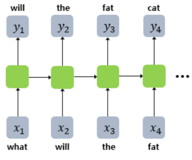

현재 시점의 단어를 보고 다음 단어를 예측하는게 LM의 가장 기본적인 목표라면 RNN은 그러한 문제에 알맞기로는 야구 팀의 김성근 급으로 다가 제격이다. tramsformer 기반 모델들이 등장하기 전까지는 RNN이 LM의 최고봉이었다. 입력의 길이도 자유로우면서 임베딩 층을 추가하여 워드 임베딩의 이점까지 가진다. RNN은 언어모델(이하 LM)로 학습할 시 Teacher forcing이란 훈련 기법을 사용한다.

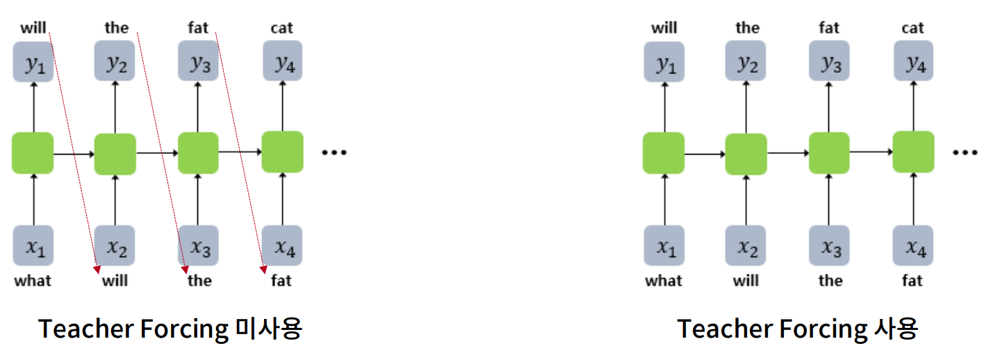

기존 RNN은 예측한 값을 그 답을 입력값으로 넣어 예측하는 방식으로 작동하는데 이 방식은 학습단계에서 학습시간을 많이 잡아 먹으므로 test 단계에서만 사용하고 학습단계선 Teacher Forcing이란 방법을 사용하여 input을 한번에 넣어 각각의 예측값과 실제값을 한번에 학습한다. 이러한 방식은 학습의 속도를 개선시킨다.

하지만 여기서 RNN LM이 만약 양방향으로 학습하는 BI-LSTM으로도 구현이 가능할까? 정답은 절대 불가능 하다. bI-LSTM의 정의는 예측하고자 하는 값의 이전값과 다음값의 정보를 들고와 이번 시점의 값을 예측하는 방식으로 작동한다. 하지만 LM 모델은 기본적으로 이번 시점의 단어를 기준으로 다음 시점의 단어를 예측하는 모델이기에 전제부터 잘못되었다. BI-LSTM은 LM에는 구조상 적합하지 않은 모델이다.그래서 이 RNN 방식을 더욱 개선 시킨 모델이 등장하는데 그게 Seq2Seq모델이다. 

## Seq2Seq

Seq2Seq은 기본적으로 번역 모델의 개선을 위해 만들어 졌다.

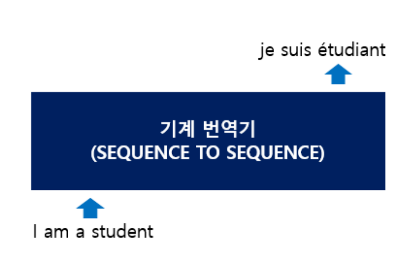

위 그림과 같이 문장을 넣으면 기계번역기 모델인 Seq2Seq 모델을 지나 번역된 결과를 받는게 목적이었으며 여기서 더욱 발전된 모델인 Transformer의 기초가 되는 모델이다.

Seq2Seq은 입력된 시퀀스로부터 목적에 맞는 다른 도메인의 시퀀스를 출력한다.

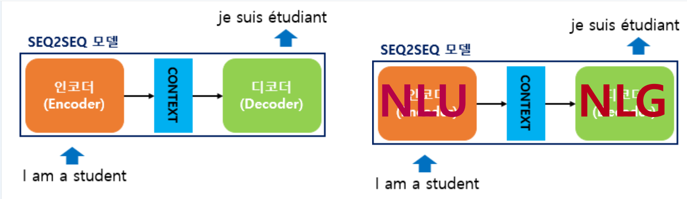

Seq2Seq모델은 한 모델에 두가지의 작동 방식이 담겨져 있다. 문장을 이해하는 Encoder와 답변을 생성하는 Decoder이다. Encoder는 NLU 모델이고 Decoder는 NLG 기반 모델이다. Seq2Seq의 인코더와 디코더는 기본적으로 서로 다른 방식의 RNN 아키텍쳐를 사용한다. 

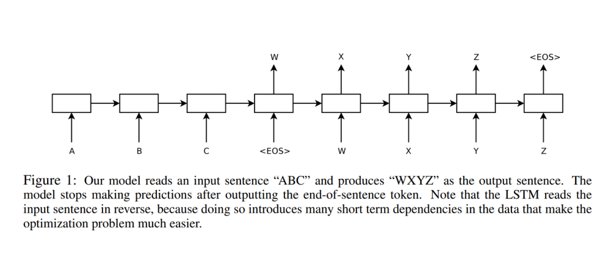

 Seq2Seq를 최초로 제시한 논문을 살펴보면 위와 같은 작동 방식을 가진다. 인코더에서 각 임베딩된 벡터를 받아서 그 값을 디코더로 보낸다. 논문의 디코더는 생성의 시작과 끝을 알리는 표기를 <EOS>로 하였다.

생성을 담당하는 디코더는 인코더와 작동 방식이 조금 다르다.

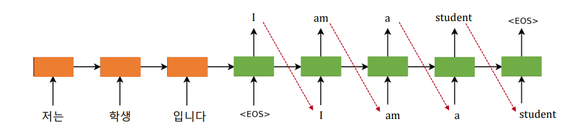

주황색은 인코더이고 초록색은 디코더 부분이다. 논문의 Figure1을 보기 쉽게 변형한 형태이다. 인코더 부분은 단어벡터를 그냥 입력 시점에 따라 천천히 하나씩 받는다. 하지만 디코더는 인코더의 마지막 값을 받으면(Context) 시작을 알리는 <SOS> 혹은 <start>와 같은 마크를 생성하여 각 시점마다의 다음 단어를 예측하는데, 디코더의 입력값은 이전 결과 단어를 이번 시점의 입력으로 받아 다음 단어를 예측한다는게 인코더와의 차이점이다. 이러한 방식으로 모델이 위 사진과 같은 문장의 끝을 알리는 <EOS> 혹은 <End>와 같은 마크가 나올 때 까지 반복한다.

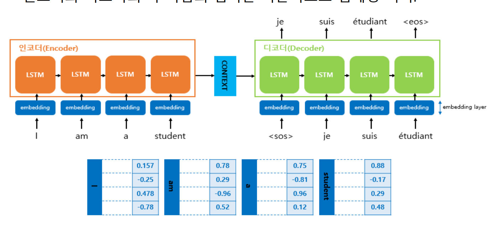

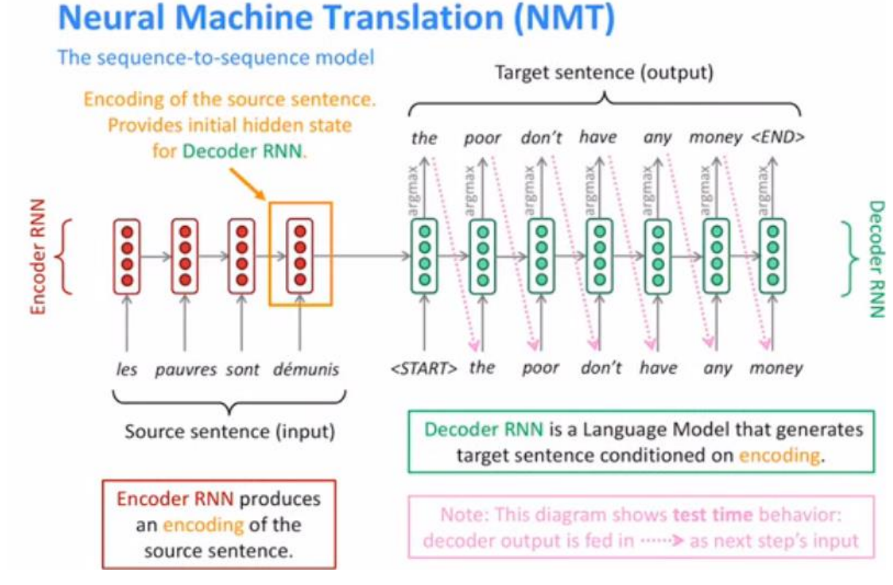

인코더를 다 지나고 디코더로 넘겨주기 전 마지막 은닉 상태를  Context vector(컨텍스트 벡터)라고 한다. 컨텍스트 벡터는 디코더 RNN 셀의 첫번째 은닉 상태로 사용되고 디코더의 <SOS>와 같은 문장 생성의 시작을 알리는 단어가 들어오면 첫 단어를 예측한다. 단어를 예측하면 그 단어는 다음 시점의 입력값으로 들어가게 되고 저번 시점의 은닉층의 값을 받아 다시 이번 시점의 단어를 예측한다.

단어를 예측하고 다음 시점에 그 단어를 넣어서 다음시점의 단어를 예측하는 방식은 필연적으로 학습시간이 오래걸릴수 밖에 없다.

- 학습단계의 결과 도출의 목적은 학습데이터로 넣은 target값을 맞추는게 목표이기에 단어를 알맞게 예측하기 위해 역전파 과정을 거치면서 그 단어를 찾아야한다.
- 이러한 방식도 오래걸리는데 RNN은 만약 초기의 단어 예측이 잘못되면 다음 시점의 단어까지 올바르게 나오지 않을 확률이 매우매우 높다. 그렇기에 하나의 예측만 실패해도 적절한 가중치를 찾는 과정은 매우 오래 걸린다.

그렇기에 RNN의 학습 단계의 디코더는 Teacher forcing이란걸 사용한다. 훈련 단계에서 Teacher Forcing을 사용하면 학습시간을 획기적으로 단축이 가능한데, Teacher forcing은 기존의 RNN 디코더 방식과 다르게 작동시킨다.

기존의 방식은 위에서 말했듯 이전 시점에서 예측한 단어를 이번 시점의 입력값으로 받아 단어를 예측을 하는 방식인데,Teacher forcing은 학습 단계의 디코더의 입력값에 정답을 넣어준다. 즉 이전 시점의 출력값을 이번 시점의 인풋으로 넣는게 아니라 어차피 학습단계에선 정답 문장이 알고있으니 한번 실수하면 계속뒤의 단어를 잘못 예측해서 한 문장을 확 꼬아버리게 되서 학습시간이 오래걸리니 일단 인풋은 정답으로 계속 넣어주고 학습을 하자는게 그 취지이다.

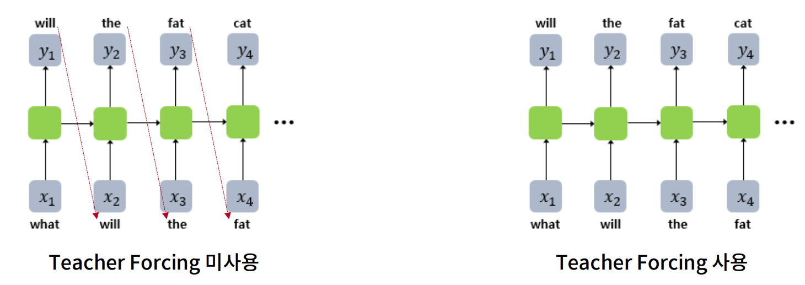

물론 모든 데이터에 대해서 Teacher forcing을 하는게 아니라 비율을 정해서 수행하는데 이 비율은 하이퍼파라미터이다. 이 비율을 높게 설정할수록 빠른 학습이 보장되지만 학습데이터에 과정합이 되어 테스트 단계에서 악영향을 줄수 있다. 테스트 혹은 실전 투입된 모델에선 Teacher forcing을 사용하지 않고 기존의 방식처럼 현 시점의 출력을 다음 시점의 입력으로 사용한다.

## Beam Search

Seq2Seq의 디코더의 문장 생성 방식은 본 포스팅을 하는 현재는 괜찮은 솔루션들이 많다. 지금 설명할려는 Beam Search 뿐만 아니라, tempeture 혹은 top-k, top-p 등등 하지만 여기선 가장 기본이 되는 Greedy와 Beam Search 방식을 알아보겠다.

Seq2Seq의 디코더는 기본적으로 RNN 언어모델로 매 시점마다 가장 높은 확율을 가지는 단어를 선택한다. 이번 시점의 단어를 예측하기 위해 Softmax층 함수를 써서 가장 확률이 높은 단어를 추출하는 방식 딱 여기서 뭐하지 않는 가장 기본적인 형태를 Greedy Search라고 한다. 가장 기본이 되는 방식이며 다양한 컴퓨팅 기술에 현 시점의 가장 확률이 높은 방식으로 알고리즘을 통틀허 말하는 Greedy한 방식의 일종이다.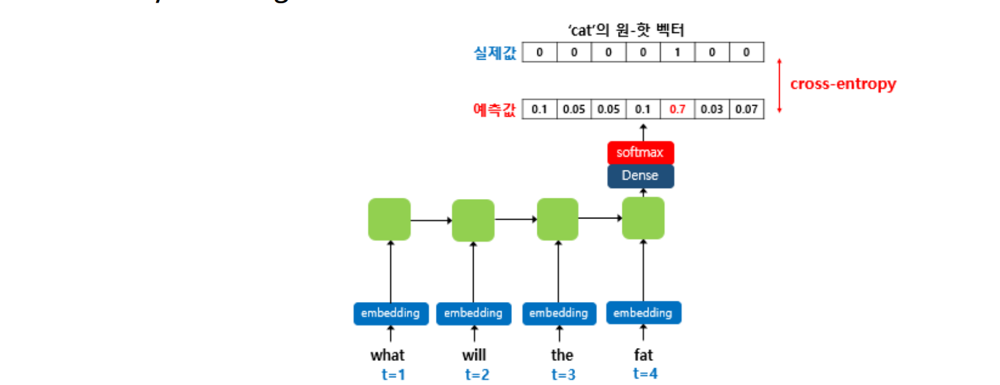

하지만 항상 Greedy 알고리즘 방식들은 한 가지 문제에 직면하게 되는데 각 시점에 최고의 선택을 한다, 이러한 방식이 최종 결과까지 좋다라는 보장이 없다는거다. 현 시점의 최고의 선택을 한다고 하더라도 완성된 문장을 보면 그 선택이 최적의 선택이 아닐 확률이 부지기수이다.

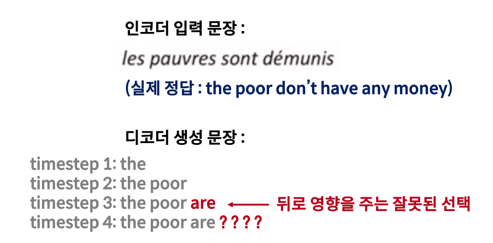

greedy search 방식은 순간 잘못된 선택을 했더라도 그 결정을 취소할 수 없다. 만약 그 순간 잘못된 선택을 하더라도 취소를 할 수 있다거나, 문장을 여러개 만들어서 최종 결과물이 가장 좋은 문장을 뽑으면 그럼 어떨까? 그러한 방식이 Beam search Decoding이다.

Beam search Decoding은 매 시점 가장 확률이 높은 단어 하나를 선택해서 최종 문장 하나를 만드는게 아니라 매 시점 가장 확률이 높은 K개의 단어를 선택 후, 다음 시점의 단어들의 확률을 예측한다. k* vocab size 개의 후보군 중 다시 확률이 높은 k개의 후보군만 선택하고 나머지 단어는 제거 한다. 

이렇게 최종적으로 k* k *...... 갸의 후보군 중에서 가장 확률이 높은 k개의 후보군만을 유지 후 개중 최고의 문장을 고른다.

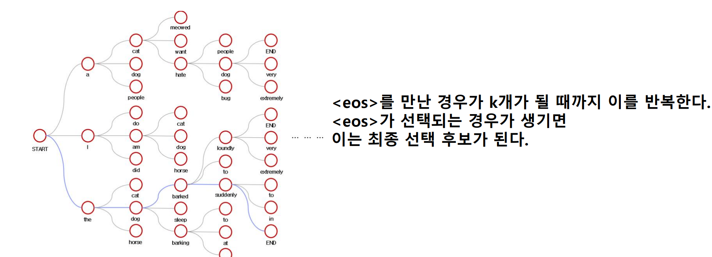

위 사진 처럼 진행이 된다. 위 사진은 k=3 인 경우로 사진을 예시로 보면 이해가 쉽다. 문장을 생성하는 Start가 들어오면 문장의 시작에서 가장 확률이 높은 단어 3개를 뽑는다. 여기서 각각 단어의 뒤에 단어가 확률이 가장 높은 3개의 단어를 추출하고 거기서 가장 확률이 높은 단어 3개(각 단어중 한개가 아니라 사진 처럼 9개 전부를 봤을 때 두 단어가 연결이 됐을 때 가장 확률이 높은 두 단어 조합을 고르는 거다.)를 또 예측해서 최종 <eos> 혹은 <end>가 나올 때까지 반복한다. 만약 k=2 일 땐 아래의 예시처럼 작동한다.

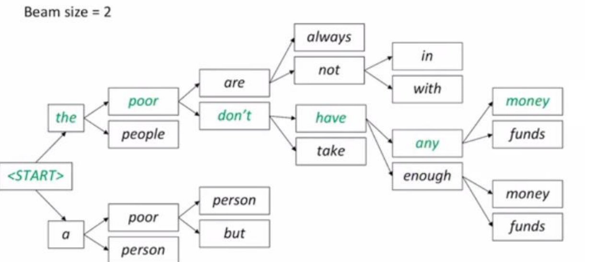

물론 이러한 Beam search 방식 또한 항상 최적의 해를 보장하지는 않지만 greedy search 보다 안정적인 결과를, 모든 단어의 확률을 구해 가장 확률이 높은 문장을 선택하는 Exhaustive Search 보단 안정적인 리소스 확보를 보장한다.  

 

