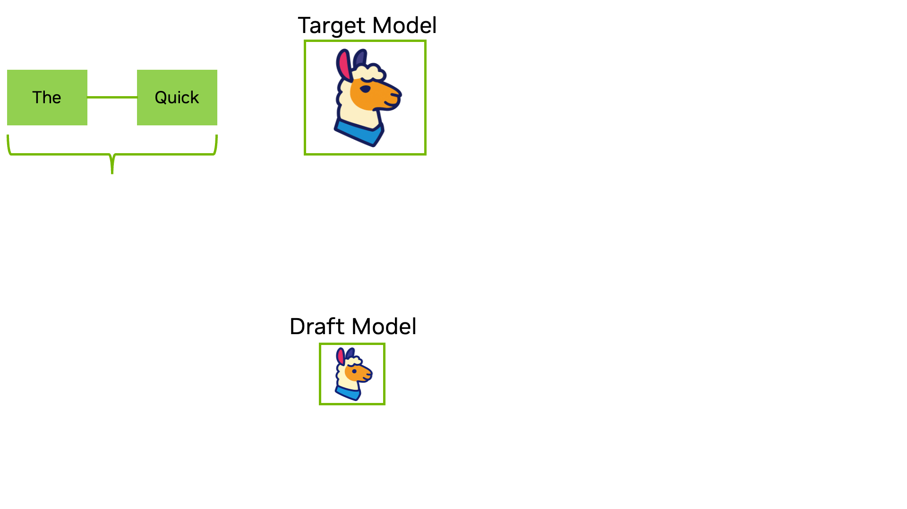
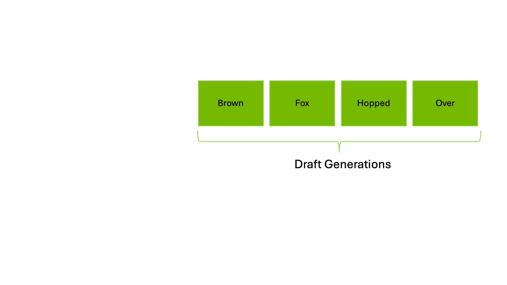

#LLMInference #디코딩 #Speculative_Decoding #Rejection_Sampling
>Reference
>https://developer.nvidia.com/ko-kr/blog/an-introduction-to-speculative-decoding-for-reducing-latency-in-ai-inference/
>https://coding-review.tistory.com/611

- AI의 가장 큰 화두는 이제 성능은 저 우주 최고 빅테크에서만 관심을 가지고 그걸로 밥 벌어 먹고 살 수 있다.
- 우리는 기존 모델에 대해서 그래서 어떻게 효율적으로 해서 좋은 오픈소스 모델을 잘 활용할 수 있을 까를 생각해야 한다. 즉 어떻게 해야 자원도 적게 먹고 좋은 답을 빠르게 얻을 수 있을지를 알아야 한다.
- flash_Attention, paged_Attention 등 메모리 관련 기법과 디코딩은 아니지만 디코딩 결과를 빠르게 받는 가속 기법인 Speculative Decoding이 있다.

## Speculative Decoding이란?
- Speculative Decoding은 추론 속도를 극대화하기 위한 방법으로 고성능 모델 대상으로 가벼운 모델을 하나 더 두고 작은 모델이 전체 문장의 일부분을 예측하고 고성능 모델은 가벼운 모델이 예측한 토큰을 판단하고 일부분을 가져다 쓰면서 전체적인 추론 속도를 올리는 방법을 말한다.
- 기본적으로 언어 모델은 이전에 생성된 단어들을 보고 이번에 생성할 단어를 예측한다. 근데 큰 모델은 당연히 이렇게 한 단어씩 생성을 하기에는 부담이 된다. 
- 그래서 Flash_Attention으로 메모리 코스트를 줄이거나 Page_Attention으로 메모리를 최대한 빈 곳없이 활용할려고 한다.
- Speculative Decoding 즉 추론 디코딩은 LLM의 계산량을 획기적으로 줄여 준다. 물론 큰 모델 기준으로 이야기 하는거지만 큰 모델이 하나한 단어를 예상할 때 보다 성능은 떨어지지만 계산량이 작아 추론속도가 빠른 작은 모델은 문장을 만들어 내고 이를 큰 모델이 판단 한다.
- 실행을 정리하면 아래와 같다.
	- 작은 모델을 드래프트 모델이라고 한다. 드래프트 모델이 여러개의 토큰을 큰 모델에게 빠르게 제안한다.(결국 작은 모델이 토큰을 예측 즉 생성 하는 것 이다.)
	- 큰 모델 즉 메인 타겟 모델은 드래프트 모델에게 받은 토큰을 한 번의 포워드 패스로 검증한 뒤, 자신의 예측과 일치하는 가장 긴 접두어(prefix)까지 수용한다.
	- 그 이후는 큰 모델이 다시 토큰을 예측하고 최종 답변을 생성하낟.
- 이렇게 진행을 하면 기존 오토리그레시브 방식이 매번 한 토큰씩 생성하는 데 비해, Speculative Decoding은 여러 토큰을 한꺼번에 처리할 수 있다.
	- 이 방식은 뭔 소리냐 할 수 있는데 결국 GPU의 계산의 문제이다. 
	- GPU에선 HBM이 있고 SRAM이 있는데 보통 HBM에 값을 저장하고 SRAM에서 계산을 한다.
	- 근데 HBM에 있는 값을 SRAM에 올리는게 계산보다 더 오랜 시간이 걸리는데 이거 LLM 추촌의 병목 현상인데, 하나하나씩 예측을 하는 게 아닌 토큰 후보를 한꺼번에 SRAM에 올리면 결국 한번의 계산에 여러 토큰을 만들 수 있다. 그래서 여러 토큰을 한번에 처리한다고 하는 것 이다.(임커밋 Flash_attention 참조)
- 이러한 방식은 결과 퀄리티는 유지하면서 평균 2~3배 엄청 좋으면 4배 까지도 속도가 올라간다.
- 실제로 네이버 클로바 노트에서 음성을 텍스트로 찍어주는 서비스에서 이 기술을 이용한다.

## Speculative Decoding의 Draft-Target

- Draft-Target 방식을 활용한 speculative decoding은 다음과 같은 단계를 거친다.
	- 드래프트 생성
		- 작고 효율적인 매커니즘이 여러 후보 토큰(일방적으로 3~12개)을 생성
		- 동일한 데이터 분포로 학습된 별도의 소형 모델이 이러한 역할을 수행함
		- 소형 모델인 드래프트 모델은 일반적으로 타겟 모델(큰 모델)의 출력을 정답으로 삼아 학습된다.
	- 병렬검즘
		- 큰 모델(이하 타겟 모델)은 입력 시퀀스와 드래프트 토큰 전체를 한 번의 포워트 패스로 동시에 처리하며, 각 위치에 대한 확률 분포를 계산한다.
		- 이 병럴 처리는 모델의 전체 연산 성능을 순차적으로 생성 중 대기 상태로 두지 않고 완전히 활용할 수 있다는 점에서 큰 효율성 향상을 제공한다.
			- 여기서 KV 캐시는 중요한 역할을 한다. 기존 prefix의 값 들은 이미 계산되어 저장되어 있기 때문에, 이 검증 단계에서는 새롭게 제안된 토큰만 셰산 비용이 들게 된다.
		- 검증이 완료된 토큰들은 다음 생성 단계를 위한 새로은 prefix로 활용된다.
	- 거절 샘플링(Rejection Sampling)
		- Rejection Sampling은 타겟 모델이 확률 분포를 계산한 이후에 진행되는 결정 단계
		- 핵심은 수락 판단 로직(acceptance logic)이다.
		- 아래 그림에서 보여주듯, 이 로직은 드래프트 모델이 제안한 확룰 P(드래프트 제안 토큰)와 타겟 모델이 실제로 계산한 확률 P(Targer 모델)을 비교한다.
		- 아래의 예를 들어 첫 두 토큰인 "Brown"과 "Fox"의 경우, Target P와 Draft P보다 높기 때문에 두 토큰을 수락한다. 하지만 그 뒤 토큰은 낮게 나타나 신뢰하기 어려운 예측으로 간주되어 거절된다.
		- 이렇게 수락되지 않은 토큰이 발생하면, 그 이후의 모든 드래프트 토큰도 함께 폐기된다. 그리고 모델은 마지막으로 수락된 토큰 "Fox"를 기준으로 표준 오토리그레시브 방식으로 다시 생성 작업을 이어 간다.

드래프트 토큰이 타겟 모델이 생성햇을 결과와 일치할 때에만 수락된다. 이처럼 토큰 단위로 엄격하게 검증하는 과정을 통해 최종 출력이 타겟 모델 단독 생성 결과와 완전히 동일하게 유지되며, 속도 향상은 얻되 손실은 계산되지 않는다.

수락된 토큰 수를 전체 제안된 토큰 수로 나눈 값이 수락률(acceptance rate)이고 수락률이 높을 수록 속도 향상이 크다.

## **Speculative Decoding 실전 사용시 유의사항**
- 실전에서 바로 사용하기 위해선 신경써야할 부분이 꽤 있다.
- **타겟 모델과 드래프트 모델의 토크나이저 일치**
	- 타겟 모델과 드래프트 모델간의 토크나이저가 일치해야 답변의 퀄리티가 깨지지 않는다.
	- 보통 같은 모델의 큰 모델과 작은 모델을 사용한다.(llama -70b와 llama-7b)
	- 가장 중요한 유의사항으로 지켜지지 않을 시 답변 퀄리티에 치명적인 결함이 발생
- **Speculative Decoding과 양자화**
	- 타겟 모델과 드래프트 모델간의 양자화 정도가 일치해야 한다.
	- 두 모델에 대한 양자화가 4-bit이면 둘 다 4-bit, 8-bit이면 둘 다 8-bit로 양자화된 모델이여야 한다.
	- 양자화는 확률 분포에 노이즈를 만든다. 기본적으로 부동소수점 이하 부분을 플랫하게 눌러주기에 양자화 값이 맞지 않으면 서로 생성하는 토큰 값 즉 결과 값이 많이 상이하게 된다.
	- 그럼 드래프트 모델이 만드는 값에 대해 채택이 되지 않으면 결국 오토그래시브 디코딩을 하게 되는데 이게 너무 빨리 실행되면 드래프트 모델 공간만 잡아 먹는다.
- **TPS의 극단적인 향상을 위한다면 드래프트 모델은 최대한 작게**
	- 많은 개발자들이 권장하는 타겟 몯ㄹ과 드래프트 모델간의 비율은 100:1이다.
	- 드래프트 모델의 주 역할은 답변의 퀄리티가 아닌 빠른 토큰 생성이므로 격차가 클 수록 tps는 기존에 비해 극단적인 향상을 이뤄낸다.
- **웬만하면 NVIDA 환경, 그리고 서버에서 사용할 것**
	- Apple Silcon 진영과 Windows에서 사용하는 llama.cpp는 vLLM과 다르게 타겟 모델과 드래프트 모델을 왔다 갔다 하는 메모리 컨텍스트 스위칭 비용이 크다.
		- 이건 ccp는CPU라 그런거 같다.
		- 서버간의 하드웨어와 개인용 PC는 차이가 크다.
	- 서버용 하드웨어 메모리 대역폭과 일반 PC의 대역폭은 작게는 10배 크게는 그 이상의 속도 차이를 보이기에 vLLM 환경을 최대한 활용할 수 잇는 nVidia나 다른 TPU 서버 전용 그래픽 카드 환경에서 해야한다.
- **VRAM을 고려하여 부족하면 사용하지 않는다.**
	- 어찌보면 가장 당연하지만 안그래도 KV_cache를 VRAM에 올려야 한다.
	- 드래프트 모델까지 VRAM에 올리게 되면 매모리 압박이 심해져 결국 속도 향상을 기대하기 어려워 진다.
	- 아무리 page_attention으로 메모리 단편화를 해결해도 이는 큰 부담이다.
	- 심지의 VRAM 해결을 위해 양자화는 더욱 금물이다.  Dequantize하는 과정에서 심각한 오버헤드가 발생할 수 있다.