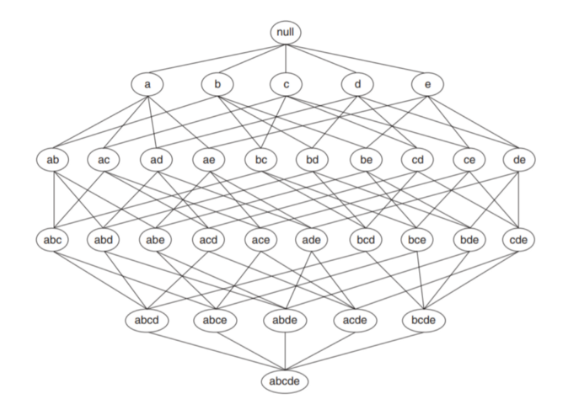
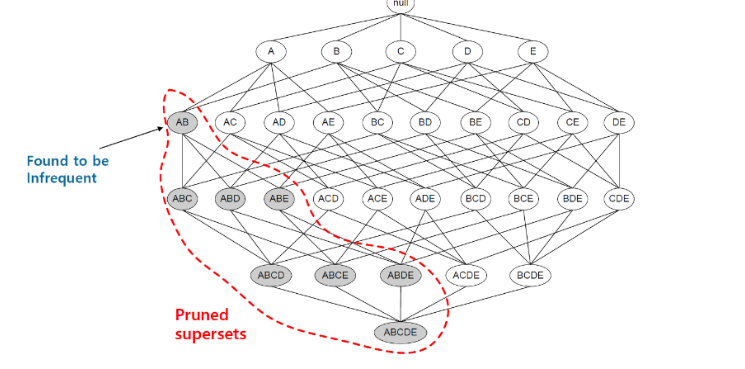
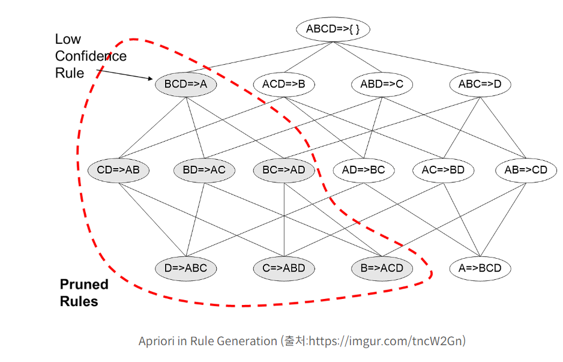
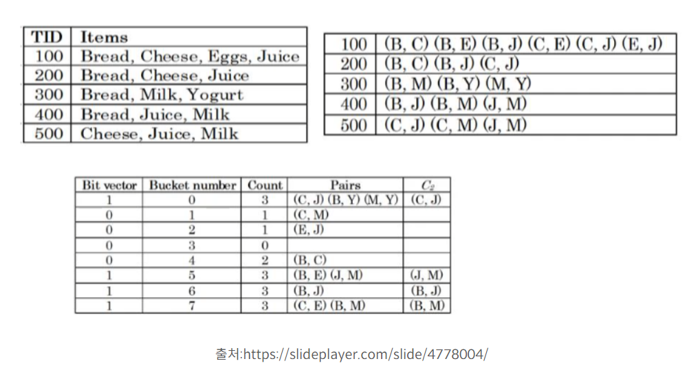

#추천시스템 #알고리즘 #확률 

> Reference
>
> [연관 규칙 탐색 알고리즘](https://killerwhale0917.tistory.com/21)
>
> [[RecSys]연관분석](https://velog.io/@minchoul2/RecSys-%EC%B6%94%EC%B2%9C%EC%8B%9C%EC%8A%A4%ED%85%9C-%EA%B8%B0%EB%B2%95-%EC%97%B0%EA%B4%80%EB%B6%84%EC%84%9DAssociation-Analysis)

-  cost를 줄여 Frequent Itemset Generation를 하기위한 3가지 알고리즘에 대해서 설명한다.
- 용어 설명
  - *N* : transaction 수
  - *W* : transaction의 아이템 수
  - *M* : Itemset 수 (*d* : item의 unique 갯수)

## Brute Force Appoach

> 출처:https://medium.com/machine-learning-and-artificial-intelligence/3-2-association-rule-mining-using-apriori-and-eclat-algorithms

- 가장 기본적이로 단순한 방법으로 가능한 모든 연관 규칙을 탐색하여  minimum support와 minimum confidence를 만족시키는 연관 규칙만 후보군으로 올리는 방법
- 당연히 가장 기본적인 방법이면서 엄청나게 많은 cost를 잡아먹는다.
- 빈발 집합 생성:  Minimum support 이상의 모든 Itemset을 생성
- 규칙 생성: Minimum confidence 이상의 연관 규칙 생성

## Apriori Algorithm

> Apriori in Frequent Itemset Generation (출처:https://ratsgo.github.io/machine%20learning/2017/04/08/apriori/)

- 가지치기와 비슷한 방법론이다.
- O(NMW)[이건 임계점보다 높은 itemset을 찾는거 의미] 할 때 가장 문제가 되는 M 즉 itemset의 개수를 줄이는 방법이다.
- 어떤 Itemset X가 minimum support를 만족하는 빈발집합이라면, X의 모든 부분집합은 빈발 집합을 만족한다.
- 반대로 보면, 빈발집합이 아닌 Itemset XX가 있다면, XX를 부분집합으로 갖는 모든 집합은 후보에서 제거되어도 된다는 것이며 이 과정을 pruning 과정이라고 부른다.
- 이 알고리즘은 빈발 집합을 생성하는 과정 이외에 규칙(Rule)을 생성하는 과정에서도 적용될 수 있다.

$$
\forall_{X, Y} : (X \subseteq Y) \Rightarrow \text{support}(X) \geq \text{support}(Y)
$$

>유튜브 설명대충 적고 정리하기
>
>https://www.youtube.com/watch?v=WGlMlS_Yydk
>
>https://www.youtube.com/watch?v=guVvtZ7ZClw
>
>- 가장 고전적인 데이터 마이닝 방식으로 빈번한 항목과 관련 연관 규칙을 마이닝하는데 사용된다.
>
>- 효과적인 장바구니 분석에 많이 사용된다.
>
>- 핵심 개념은 ???다.
>
>- 트렌젝션은 하나의 데이터 테이블이 아니라 하나의 거래를 의미한다.
>
>- support는 데이터 베이스에 나타난 거래 비율(등장 비율), 항목세트의 인기를 대변한다.
>
>- confidence는 supp(xUy)/supp(x) 를 의미한다. 가능성을 의미한다. 조건부 확률이다. 하지만 단점도 존재한다. 인기 항목과 비인기 항목의 확률을 계산하면 정확하지 않다. 그래서 lift를 사용한다.
>
>- lift -> supp(xUy)/supp(x)*supp(y) 이 방법은 인기 항목과 그 인기항목의 확률을 계산하기에 제일 정확하다.
>
>- Conviction -> con(x->y)는 1-supp(y)/1 - conf(x->y), 1에서 y의 지지도를 뺀 값이다. 이는 y에 가 나올 때 그 전에 x가 등장할 확률이다.
>
>- confidence는 x가 나올 때 y가 등장할 확률 얼마나 긍정하냐
>
>- Conviction은 y 전에 x가 등장할 확률 즉 얼마나 부정하냐 ->이렇게 말해도 될지는 모르겟지만
>
>- Conviction의 진행을 아래 정리한다.
>
>- 일단 임계값 50%일 때
>
>- 발생하는 모든 항복의 각 빈도 테이블(아이템 빈도 테이블)을 구한다. 이를 통해서 각 항목(아이템, 아이템 세트 아님)support를 구한다. 
>
>- 임계값을 기반으로 아이템을 삭제한다.
>
>- 이렇게 뽑아낸 아이템만을 가지고 모든 itemset(쌍)을 만든다.
>
>  - > 아니 18 여기선 왜 itemset을 등장 순서 상관없는 집합으로 규정을 쳐하냐 이러면 개념이 다르잖아
>    >
>    > 개념적으로 Rule이 등장 순서라는걸 담고있는 개념이고 itemset을 그냥 항목을 담고 있는 개념이 잖아. 내가 잘못생각한게 맞는거 같은데
>    >
>    > Frequency Itemset은 걸러낸 아이템셋이고 Frequency Rule?이 걸러낸 등장 순서 쌍인가?
>    >
>    > 아 ㅋㅋ
>
>
>
>  - 2 -itemset을 만든다. ab=ba다
>
>    - 이거의 계산식은 아래와 같다.
>
>    - $$
>      \frac{n!}{r!(n-r)!}
>      :n = \text{number of item(아이템의 개수)}, n = \text{number of item in group(그룹의 길이)} 
>      $$
>
>- 이 값을 구하고 임계값에 기반하여 필터링을 한다.
>
>- 3-itemset을 만든다.
>
>  - 자체 조인이라 또 다른 규칙이 필요하다.
>  - 2 아이템 세트에서 살아난 조합 한다.
>  - 근데 영상선 버거 양파 우유는 왜 안만듬
>  - 여기선 abc=bca=cab=cba라는 거 없는거 보니 3 부터는 순서를 신경쓰나? 2템일땐 조건부 확률과 conv가 순서가 바껴도 값이 같나?
>
>- 일단 이렇게 구하고 또 임계값으로 선택한다.
>
>- 이게 아피기오 알고리즘 진행 과정이다.

## DHP Algorithm 

- DHP는 Apriori 알고리즘의 성능을 개선시키기 위해 나온 알고리즘이다. 
- DHP는 Direct Hashing & Pruning으로 Apriori 알고리즘의 Pruning에 Hashing을 적용
- 위 사진을 예시로 들면 먼저  itemset을 만드는데 예를들어 2개의 아이템 구성된 가능한 모든 Itemset을 검색
- 각 itemset이 전체에 몇 번 등장하는지 기록
- https://killerwhale0917.tistory.com/21
