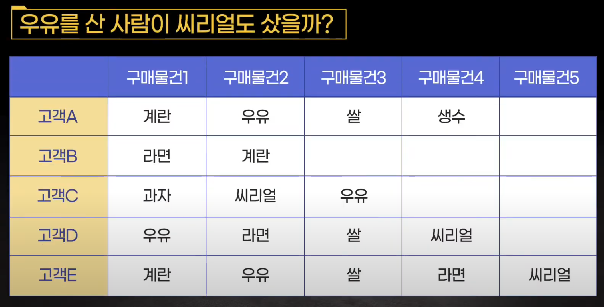

#추천시스템 #알고리즘 #확률 #선형대수 

## 연관분석(Association Rule Analysis)

> Reference
>
> - [[RecSys] 연관분석(Association Analysis)](https://velog.io/@minchoul2/RecSys-%EC%B6%94%EC%B2%9C%EC%8B%9C%EC%8A%A4%ED%85%9C-%EA%B8%B0%EB%B2%95-%EC%97%B0%EA%B4%80%EB%B6%84%EC%84%9DAssociation-Analysis)]
> - [개념 연관성 분석.youtube](https://www.youtube.com/watch?v=RqayCHnJfbw)
> - [하든킴의 메모장](https://hardenkim.tistory.com/177)
> - [[알고리즘]Disjoint Sets(서로소 집합)](https://doing7.tistory.com/82)

- 연관 분석은 흔히 장바구니 분석이라고 불린다. 

- 연관 분석은 비지도 학습의 대표적인 학습법이다.
- 주어진  Transaction(거래 내역 같은거 아래 사진과 같은) 데이터에 대해서 상품 A 구매시 상품 B가 같이 등장하는 규칙같을걸 찾는것이다.
- 즉 연관성 분석은 독립변수간의 관계를 파악하는 방식이다.**하지만 이러한 모든 분석 결과들이 그렇듯 이것이 인과관계를 설명하지 않는다. 이는 하나의 판단 척도로만 사용되어야 한다.**

- 연관성은 condition(조건)과 result(결과)를 사용하여 정의한다.
- 선행 조건(antecedent)으로 인해 논리의 결과(consequent)가 생기는 아이템 집합이 빈번하게 발생하는 규칙 가운데 기준을 만족하는 일부를 찾는게 목표이다. 이를 연관 규칙 이라고 한다.
- 선행 조건(antecedent)과 논리의 결과(consequent) 를 각각 구성하는 상품들의 집합을 ItemSet이라고 한다. 각각 서로소 집합(disjoint)를 만족해야 하나의 itemset이라고 부른다. 즉 하나의 선행조건에 논리의 결과에 해당하는 제품군들이 존재하면 안된다.(보통 트리기반 모델의 가장 중요한 전제 조건이다.)

- 이러한 연관 규칙은 지지도, 신뢰도, 향상도와 같은 척도를 가지고 얼마나 의미 있는 규칙인가를 판단한다. 이러한 척도를 사용하여 유의미한 itemset을 뽑아내고 이렇세 선별된 itemset들을 빈발집합(Frequent Itemsets) 이라고 표현한다.

### 빈발 집합(Frequent Itemsets)

- 모든 제품에 대해서 itemset을 구성을 하면 그 수가 너무 많아진다.
- 그렇기에 척도의 value가 사용자가 지정한 임계값(minimum support 값)이 이상인 값만 추출한 itemset만 선별하는데 이게 빈발 집합이다.
- 아래에서 설명하겠지만 support란 전체 transcation에서 특정 itemset이 등장하는 비율을 의미한다.
- support를 사용하여 Itemset의 값을 계산할 수 있다면 이 값에 대한 특정 임계값을 정하고 임계값을 넘는 itemset을 빈발 집합이라고 정의한다. 
- 이 개념은 연관 규칙을 이해하는 중요한 개념이다.
- 이 빈발 집합은 **Item을 활용하여 만드는 여러가지 규칙(Rule)과는 개념이 다르다. 이 규칙 중 임계값을 통과한 규칙을 빈발 집합이라고한다.**

### 연관규칙 척도

> 출처: https://www.youtube.com/watch?v=RqayCHnJfbw

- 지지도(support) - 해당 규칙이 얼마나 범용적인지를 측정하는 지표
  - 조건절이 일어날 확률
  - 전체 거래 중 상품 A와 상품 B가 동시에 포함되는 거래 비율
  - 전체적인 구매 경향을 파악한다.
  - 만약 맨 위 그림의 기준으로 `우유를 사면 씨리얼을 산다.(우유 ->씨리얼) `이라는 규칙의 지지도는 3/5가 된다.
  - 아래는 수식이다.

$$
P(A \cap B) = \frac{\text{A와 B가 동시에 포함된 거래 수}}{\text{전체 거래 수}}
$$

- 신뢰도(confidence) - 조건 물건을 구매할 때 얼마나 결과 물건을 사는지 알아볼 수 있는 지표, 즉 **조건 물건을 구매할 확률 가운데 조건과 결과 물건을 모두 구매하는 확률**
  - 조건절이 주어졌을 때, 결과절이 일어날 조건부 확률
  - 상품 A가 포함된 거래 중에서 상품 A,B가 동시에 포함되는 거래 비율
  - 연관성의 정도를 파악한다. 예를 들어 A를 구매하면 B도 구매
  - 맨 위 그림의 기준으로`우유를 사면 씨리얼을 산다.(우유 -> 씨리얼)`의 신뢰도는 아래와 같이 계산한다.
    - 우유를 구매할 확률 `p(우유) = 4/5`
    - 우유와 씨리얼을 함께 구매할 확률 `p(우유, 씨리얼) = 3/5` **즉 지지도를 사용한다.**
    - `우유를 사면 씨리얼을 산다.(우유 -> 씨리얼)`의 신뢰도는 `3/5`/`4/5` = `3/4`
    - 전체 실제 우유를 산 사람 중 시리얼까지 같이 사는 사람은 총 75%가 된다.
  - 아래는 수식이다.

$$
\frac{P(A \cap B)}{P(A)} = \frac{\text{A와 B가 동시에 포함된 거래 수}}{\text{A를 포함하는 거래 수}}
$$

- 향상도(lift) - 조건 물건과 결과 물건이 서로 얼마나 동시에 발생하냐 즉 관계가 있나 를 알아보는 지표

  - 조건절과 결과절이 서로 독립일 때와 비교해 두 사건이 동시 발생하는 확률
  - 상품 B가 포함된 거래 중에서 상품 A를 거래 후 상품 B를 거래한 비율
  - 향상도 -> 1 : 향상도가 1에 가까울 수록 두 물건을 서로 관계가 없다 즉 독립적이다. 
  - 향상도 > 1: 함께 구매가 되는 물건이 될 확률이 높다.
  - 향상도 < 1: 조건 물건을 항 때 결과 물건을 사지 않을 확률이 높다.

  - 위 의 그림과 예제(우유를 사면 씨리얼을 산다)로 설명을 하면`우유와 시리얼을 함께 구매할 확률/ 우유를 구매할 확률 *씨리얼을 구매할 확률`로 구한다.
  - 아래의 계산으로 인해 해석을 하면 우유와 씨리얼이 아무 관계가 없다고 가정했을 때보다 1.25배 두 물건을 함께 구매한다.

  $$
  향상도(우유를 사면 시리얼을 산다.) = \frac{\text{3/5}}{\text{4/5 * 3/5}} = 1.25
  $$

$$
\frac{P(B | A)}{P(B)} = \frac{P(A \cap B)}{P(A)P(B)} = \frac{\text{A와 B가 동시에 포함된 거래 수 * 전체 거래 수}}{\text{A를 포함하는 거래 수 * B를 포함하는 거래 수}}
$$

- 이러한 척도들의 목적은 Itemset을 걸러내기 위해 사용된다. **Itemset이 많으면 연관 규칙의 개수(Rule)은 기하급수적으로 늘어나는데 이중 유의미한 Rule만 선별하는 작업이 필요하다.** (Frequent Itemsets)

- 주로 만들어진 연관 규칙을 **향상도(lift)값으로 정렬하거나, 앞서 정의한 지지도(Support)와 신뢰도(Confidence)를 임계값으로 활용하여 유의미한 연관 규칙을 선별한다.**

- 주로 lift 값을 가지고 내림차순 정렬을 하여 Rule를 선별하는 방법을 사용한다.

- lift값은 support와 confidence 두 가지 전부 사용하기에 보다 안정적인 Itemset 선별이 가능하다.

  > [연관규칙의 척도로 lift가 가장 알맞은 이유/연관 규칙 척도의 사용](https://killerwhale0917.tistory.com/20)

- 척도를 이용하여 빈발 집합 생성(Frequent Itemset Generation)하는 작업은 연관 분석에 있어 필수로 시행되는 작업이다.

- 하지만 Item을 활용하여 ItemSet을 만드는 작업은 모든 규칙을 만들어 척도를 사용하여 선별해야하기에 Cost가 어마무시하게 든다.

- 그래서 연관 분석 규칙 알고리즘들을 사용하여 Cost를 줄이는 방법이 필요하다.

