#git #github
**일단 내가 항상 잘 몰랐던 것**

1. git bash와 git cmd 차이점
2. vscode로 git을 연결 했을 때 git bash랑 git cmd랑 차이점
3. branch 개념
4. master brain와 main branch 의 개념
5. git으로 add와 commit pull push 직접 해보기

## Git 최초 설정

[Git](https://git-scm.com/download)에 들어가서 자신의 OS에 맞는 GIt을 다운 받는다. 다운로드 받는 중간 아래와 같은 창이 뜨는데 난 그냥 뭣 모르고 맨 위에거 누른 듯 근데 맨 위에거는 git bahs만 사용할 거냐고 두번째는 CMD와 다른 서드파티 소프트웨어를 사용할 거냐 인데 나는 공부 중이니 그냥 1 번 함

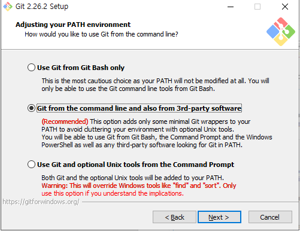


다 다운 받으면 `Git Bash`,`Git cmd`, `Git GUI`이렇게 있다. 

각각의 차이 점이 있는데

- Git Bash: GIt을 사용하는 리눅스 환경
- Git cmd: GIt을 사용하는 윈도우 환경
- Git GUi: 이건 Bash와 Cmd와 같이 서버에서 치는 게 아니라(검은 화면에 코드) 그래픽 인터페이스로 하는 것 이건 추가 tool이 많다.

일단 나는 `Bash`로 공부하기로 마음먹음 리눅스 환경에도 조금 조금 익숙해 질겸

제일 먼저 `Git CMD`에 접속해서 `git --vsrsion` 을 쳐서 버전이 맞게 다운되었는지 확인 후 아래 코드를 사용하여 Git 사용자 정보를 등록한다.

```cmd
git config --global user.name 사용자명(닉네임 나같은 경우 east-right)
git config --globla user.email 이메일주소(깃헙 들어갈때 치는 이메일)
```

## GIt과 GIthub

공부를 시작하기 전에 Git과 Github를 계속 헷갈려 했다. 하지만 직접 실습을 진행을 해보면서 Git과 GitHub에 대해서 조금씩 알게 되었다.

GIt 간단하게 이야기 하자면 아래와 같다.

> **Git**: 분산 버전 관리 시스템으로 변경 사항을 추적하는 시스템이다. Git은 기본적으로 Local에서 실행되며 우리가 파일을 commit 하는 순간을 이력으로 남겨 버전을 관리한다.

코드 버전은 프로젝트시에 매우 중요하다. 

1. 수정할 때마다 파일 새로 만들면서 관리하기는 매우 어려움
2. 언제든 이전 버전의 코드로 돌아갈 수 있기 때문에
3. 이력을 남기기 위해
4. 하나의 프로젝트를 두고 여러명의 개발자들이 협업할 수 있기 때문데

이렇기에 git으로 인한 버전 관리는 매우 중요하다. 

여기서 내가 조금 헷갈릴수도 있는게 **GIt**과 **Github**는 전혀 별개의 다른 것 이다.

> **Git**: Local의 버전 관리 소프트웨어다. 즉 내가 git이라고 지정한 폴더는 이제 모든 기록이 남아 빠른 롤백 혹은 변경사항 메모, 수정 시간 등을 가지고 있다.
>
> **GitHub**: GitHUb는 Git으로 저장된 파일을 Local이 아닌 서버에 올려 저장하는 방식, 이러한 방식은 협업 시 공유하기가 편하다.

## Git init과 gir clone

맨 처음 git을 하기 위해선 항상 git 폴더를 생성을 해야한다. 여기서 git폴더를 생성하는 방법은 2가지가 있는데 `git init`과 `git clone`이다. git 폴더로 만들면 폴더안에 비밀폴더로 `.git`이란 폴더가 생성된다.

여기서 git int과 git clone은 차이가 있는데 간단하게 말하면 git init은 처음부터 작업을 할 때 사용하는 방식이고 git clone은 기존의 작업물을 들고와서 git폴더로 만드는 방식이다.

**git init 과 git clone의 차이**

> - git init: 폴더를 git 저장소로 만들거나 기존 저장소를 다시 초기화 하는 명령어
> - git clone: git 저장소(혹은 github 레포지토리)에 해당하는 저장소를 복제해 새 디렉터리로 가져오는 명령어

즉 git init은 처음부터 프로젝트를 시작하는것, git clone은 프로젝트 내에 중간에 투입할 때 사용하는것 즉 프로젝트 폴더를 복사이다.

그런 다음 새로운 파일을 생성하고 

## git add와 commit

이제 그 Git폴더에 파일 생성 혹은 수정 후 저장을 하면 이제 Git이 판단하여 새로운 버전의 파일이라고 인식을 한다. 그걸 `git status`로 확인할 수 있는데 

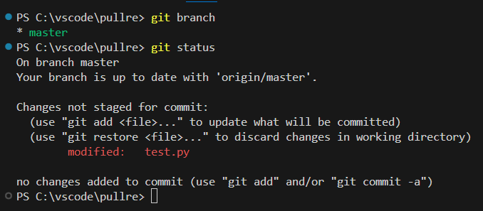

위와 같은 코드가 뜬다. 위 사진은 clone을 통하여 들고온 파일을 수정하고 저장했을때 `git status`을 입력하면 나온다. `test.py`라는 파일이 수정되었가는 이야기고 이 버전의 `test.py`는 아직 커밋을 하기위해 준비되지 않았다는 이야기다. 여기서 너의 브렌치는 `origin/master`라는 내용이 있는데 이건 다음 포스팅때 자세하게 리뷰해 보겠다. 

> 여기서 origin이란 레포지토리 별칭이다. github에서가 아닌 git에서의 별칭이다. 만약 특정 작업이 없거나 clone으로 가져 올 때 아무 설정을 안하면 가장 초기 레포지토리 별명인 origin으로 설정이 된다.

이제 commit을 하기 위해선 `git add`를 하던가 `git commit -a`을 하라는 문구가 보인다.

난 주로 `git add .`을 사용한다. 기존 버전과 차이가 나는 변경된 파일은 모두 add시킨다는 명령어로 `git commit -a`하는거 보다 일단 먼저 수정된 파일을 add를 시켜 먼저 commit 준비를 시킨다. 혹여나 잘못 commit이 되는일이 없게 말이다. `git add`를 하고 `git status`로 상태를 확인하면 아래와 같은 장면을 볼 수 있다.

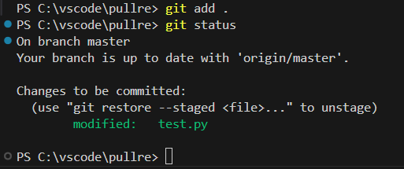

> git add . : 현재 폴더에 있는 버전이 업데이트된 모든 파일을 스테이징(commit 대기)영역으로 보낸다.
>
> git add -A : 모든 디렉토리에 있는 수정된 파일 전부를 스테이징(commit 대기) 영역에 추가합니다.

준비가 완료된 파일은 위와 같이 녹샌으로 나오면서 준비가 완료 됐다는 표시를 해준다. 그런다음 `git commit`을 사용해서 커밋을 해준다. 여기사 당황하는 상황이 나올 수 있는데 `git commit`하고 `git commit -m "커밋 내용"`하고 나오는 결과가 조금 다른데 바로 `git commit`을 입력하면 커밋내용을 입력하라는 vim창이 뜨기에 당황하지 말고 거기서 입력하면 된다. `-m`이 붙은건 바로 코드단에서 커밋내용을 입력을 한 것이다.

이제 여기서 커밋이 뭔지 자세하게 알아보면 commit은 이 commit을 기점을 버전을 저장한다. commit을 시킴으로써 우리가 git을 사용하는 목적에 다다를수 있는것이다.

> 이전 버전에는 없는 파일이 생기면 `Untracked`가 생기는데 이건 이번에 생긴 파일의 이전 버전을 추적할 수 없다는 이야기다. 파일이 새로 만들어 졌거나 혹은 모종의 이유로 파일의 이전 버전이 날아 갔거나, 새로만든거면 당황하지 말고 아니면 매우 당황해야한다.

## git 원격 저장소 연결

이제 git을 넘어 github의 목적까지 나아갈 것이다. git이 폴더를 지정하여 commit을 기점으로 파일의 버전을 관리하는것이라면 이제 github는 이런 파일들을 원격저장소에 저장하여 어떠한 환경에서도 혹은 다른 사람과도 파일과 버전을 관리하는것이 목표이다.

위와 같이 commit을 시키고 `git status`를 사용하면 아래와 같은 결과가 나온다.

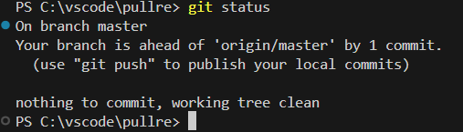

지금 한개의 commit된 즉 업데이트된 버전이 존재한다고 나온다. 여기서 내 사진은 지금 clone으로 인한 github저장소와 연결이 되어 있어서 위와 같은 상황이 뜬다. 본인이 어느 원격저장소 하고 연결이 되어 있는지 확인하고 싶으면 `git remote -v`를 통해서 확인 가능하다.

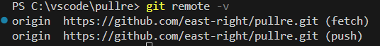

연결이 안되어 있으면 `git remote -v`를 입력을 해도 아무 반응을 보이지 않는다.

> 만약 init으로 인해 github와 연결이 되어 있지 않은 면 직접 연결을 해줘야한다.
>
> ```cmd
> git remote add test https://github.com/east-right/pullre.git
> ```
>
> `git remote <원격 저장소 이름> <원격 저장소 URL>`
>
> test github의 저장소 이름을 사용해도 되고 내가 임의로 지정해줘두 된다.
>
> **원격 저장소를 연결할 때 따로 이름을 지정하지 않으면 'origin'으로 원격 저장소 이름이 저장이 된다.**
>
> > 추가: 이 글을 작성하고 추후에 보니깐 <원격 저장소>를 명시해주지 않으면 코드 실행이 안된다. 내가 잘못안건지 앞에게 잘못 안건지 잘 모르지만 일단 이번에 기억안나서 다시 보니깐 그렇드라.

### git remote 추가 내용

> 참조: [[Git] remote 명령어로 원격 저장소 연결/삭제/이름 변경하기](https://choiiis.github.io/git/how-to-remote-project/)

하나의 디렉토리에 여러개의 원격 저장소와도 연결이 가능하다.

```cmd
$ git remote add test2 https://github.com/choiiis/Selfit.git

$ git remote
test
test2

$ git remote -v
test    https://github.com/choiiis/balanchew.git (fetch)
test    https://github.com/choiiis/balanchew.git (push)
test2   https://github.com/choiiis/Selfit.git (fetch)
test2   https://github.com/choiiis/Selfit.git (push)
```

`git remote`를 입력하면 2개의 원격 저장소에 연결된 것을 확인할 수 있고,
`git remote -v`로 각 원격 저장소가 어떤 프로젝트와 연결되어 있는지 좀더 자세히 알 수 있다.

그리고 이때, `ls`를 입력하면 아무 파일도 존재하지 않는 것을 확인할 수 있다.
즉, `remote`만으로는 저장소에 있는 데이터를 가져오지 못한다.

확실히 remote로 연결하는 것보다는 clone으로 하는 것이 훨씬 편하다. 상황에 따라 다르겠지만, 전체 프로젝트를 통째로 가져오고 싶은 것이라면 그냥 clone을 하는 것이 빠르고 편하다.

원격 저장소 삭제는 

```cmd
$ git remote remove test2

$ git remote
test
```

위와 같은 코드로 삭제가 가능하다.

원격 저장소 이름 변경을 원할때는

```cmd
$ git remote rename test testtt

$ git remote
testtt

$ git remote -v
testtt  https://github.com/choiiis/balanchew.git (fetch)
testtt  https://github.com/choiiis/balanchew.git (push)

```

`git remote rename`을 통해라 간단하게 변경이 가능하다.

## git push와 pull

이제 commit도 하고 원격 저장소와도 연결이 완료 되었으면 `git push`를 하면 아래와 같은 결과가 출력이 되면서 우리가 수정한 파일들이 내가 선택한 원격 저장소로 연결이 된다.

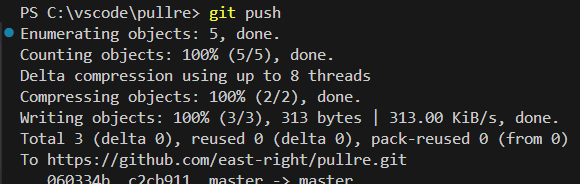

그리고 원격 저장소에 저장된 파일을 불러오기 위해선 `git pull`을 해줘야한다. 그럼 아래와 같은 문구가 나올 것 이다.

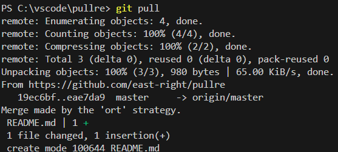

> 참고로 위의 사진은 다른 타이밍의 사진이다. 정상적으로 pull이 되면 위와 같은 문구가 나온다는걸 보여주기 위해서다.

이러한 작업을 과거 이력까지 확인하고 싶으면 `git log`를 사용하면 확인가능하다. `git log`를 사용했을때 이력이 많으면 나올때 `q`를 누르면 나올수 있다. `git log --stat`을 사용하면 더욱 자세하게 알 수 있다.

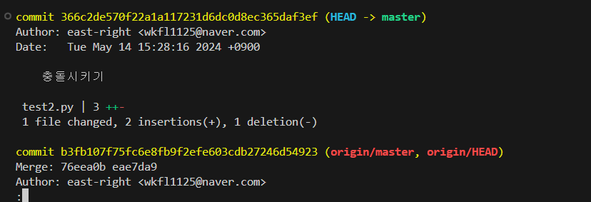

### git pull 과 git clone의 차이점

> 참조 : [git clone과 git push의 차이점](https://kimcoder.tistory.com/288)

공부를 하다가 궁금한 점이 생겨서 포스팅 한다. 분명 두개 모두 원격 저장소에 저장된 파일을 내 git 로컬 저장소에 끌어 온다는 점은 변함이 없다. 당장 생각나는 거만 해도 clone은 git 폴더가 아니라도 원격 저장소에 저장된 모든 파일을 들고 와서 내 폴더와 동기화를 시키는 작업이고 git pull도 원격 저장소와 연결이 되어 있으면 저장소에있는 모든 파일을 그대로 들고오는 건데 보통 우리가 github를 처음 복제할 때 는 git clone을 사용하고 push하고 당길때는 pull을 하지 않는가? 차이가 뭘까?

하지만 이 둘은 명백한 차이점이 있다. **먼저 `git clone`명령을 사용하면 로컬 저장소의 내용이 원격 저장소의 내용과 일지해진다.** 기존에 작업중이었던 사람이 git명령을 사용해서 원격 저장소의 내용을 그대로 가져와버리면 기존에 내가 작업했던 내용들은 직접 복구해야한다. 즉 `git clone`은 프로젝트에 처음 투입될 때 사용되어야 하는 명령어인 것이다. **반면 git pull 명령은 원격 저장소의 내용을 가져와서 현재 브랜치와 병합(merge)까지 해주기 때문에**, 기존에 작업했던 내용은 유지하면서 최신코드로 업데이트할 수 있는 것이다.

pull에 관해 한번 실습을 해보면

먼저 일단 내 git폴더에 새로운 파일을 한개 만들었다(기존의 실습하던 파일은 test.py다)

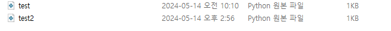

아래는 지금 원격 저장소 상황이다.

!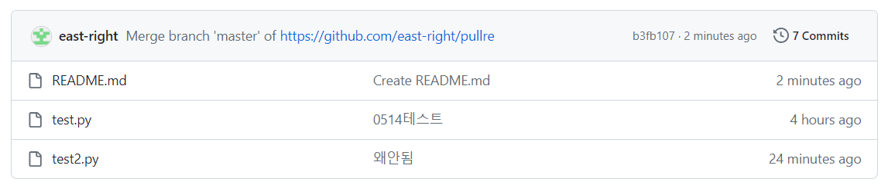

test.py는 변경사항이 없고 원격 저장소에는 test2.py라는 파일이 존재하고 내 로컬 저장소에는 tesr3.py라는 파일이 존재한다. 이러한 상황에서 `git pull`을 해보면 아래와 같아 진다.  

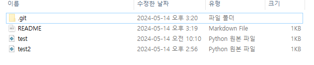

> 원래라면 서로 겹치는 파일하고 원격 저장소에만 있고 로컬에만 있는 파일들을 각각만들어서 비교 해 볼 생각 이었지만 잘 뭐가 안되서 이렇게 한다. 참조  블로그에 자세히 실습이 설명되어 있다.

**이처럼 pull은 기존의 작업 내용을 유지해준다는 사실을 알 수 있다.** 만약 같은 이름의 파일이 내용이 변경되고 커밋 된 상태에서 pull을 하면 충돌이 나서 충돌 해결을 해줘야 한다. 아니 근데 `Already up to date.` 때문에 안된다. 진짜 죽이고 싶네

### pull 시 Already up to date. 뜰때

> 참조: [GIT Already up to date. 오류](https://velog.io/@woowoon920/GIT-Already-up-to-date.-%EC%98%A4%EB%A5%98)

`git pull`실습을 할때 계속 `Already up to date.`현상이 발생하였다. 이 문구는 git과 github의 버전이 일치하여 pull을 땡겨올게 없을때 발생하는 문구이다. 이 문제를 찾아보니 원격 저장소에 내 최신 코드가 아직 반영되지 않아 pull을 땡겨도 안땡겨 와지는 것이었다. 또한 git pull을 하다보면 종종 이런 문제가 발생할 수 있다. 

pull시 들고와야할 파일이 안들고 와 졌는데`Already up to date.`가 뜨면 보통

```cmd
$ git fetcf -all
$ git reset --hard origin/master
** 절대 쉽게 사용하지 말것 **
```

을 사용한다.  하지만 이러한 방법은 github master에 있는 모든 내용을 **패치로 들고와서 억지로 덮어 씌우기 때문에 만약 로컬에 작업을 해놓은 내용이 있으면 전부 날라가 버린다.** 그래서 아래와 같은 방법을 시도한다.

```cmd
$ git fetch origin(원하는 저장소)
$ git merge origin/main(난 master)
```

git을 원격저장소의 최신 상태로 fetch해주고 하드리셋이 아니라 merge를 해주면 pull과 비슷한 결과를 반환해준다.

### git pull --set-upstream <git저장소이름> <브렌치 이름>

본 글을 적고나서 다시 git을 할려고 하니깐 좀 해매서 적는다. 여기서 적을건 `git push -set-upstream origin master`코드에 대한 이야기 이다.

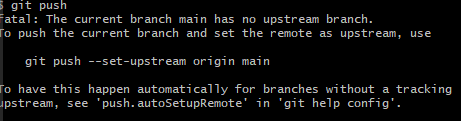

다음에 다시 git을 만질 때 git init으로 구축한 다음 git push를 하면 위와 같은 에러 메세지가 뜰 확률이 매우높다. 그 이유? 어려운게 아니라 내가 생각하는 내 특성상 익숙해 질 때 까지 계속 띄울거 같다. **지금 이 문단을 작성하는 시간 기준으로 이거 한번 잘못했다가 2시간을 날려먹었다. **

`--set-upstream <저장소 이름><브렌치 이름>`은 일단 git push를 할 때 업스트림 브렌치 설정이 안되어 있으면 뜬다. 이 명령어는 **기본적으로 로컬 브렌치와 원격 브렌치가 연결이 되어 있는 상태인지 알려주는 코드이다. 연결이 되어 있으면 업스트림 브랜치가 설정된 상태라고 생각하면 된다.**

만약 업스트림 상태이면 `git branch -vv`라고 입력하면 아래와 같이 뜬다

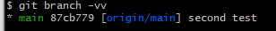


근데 내가 실수한게 git init을 하고 새로 만들어진 github 레퍼지토리랑 remote를 하면 기본적으로 조금 꼬이는데 github의 기본 브렌치의 이름은 main으로 나오고 git의 기본 브렌치의 이름은 master로 나온다.

이때 내가 그냥 아무생각없이 origin master로 업스트림을 하고 git push를 하니깐 보내는 지는데 깃허브에서 main에 올라가지 않고 master 브렌치를 만들고 생성됨

여기까진 아무 문제없음 그냥 풀리퀘스트 해서 master에 있는걸 main으로 올리면 된다고 생각을 해서 근데 이게 제일 위기임

두 브랜치들은 서로 연관이 없는 즉 tree가 이어지지 않은 브랜치 들이라는 문장이뜸, 그러면서 풀리퀘스트가 안됨

이때 로컬에도 `git brabch  -a`을 하면 브렌치가 두개가 뜨는데 한개는 기존은 master와 원격 저장소 브렌치인 origin/master가 뜸 master와 origin/master는 같은 내용을 담고 있지만 origin/master는 원격저장소 즉 깃허브 전영 브런치가됨

이러면서 꼬임 적고나서 보니 별거 아닌거 같네 ㅋㅋ 일단 좀 고생함 한번꼬이니 여러번 고생을 해서

핵심은 **업스트림 할 때 잘해라**

> 아니면 그냥 처음 깃푸쉬할 때 `git push -u <로컬 깃 저장소이름> < 브랜치 이름>` 쓰셈, <로컬 깃 저장소이름> = <git 저장소이름>같은 말임 쓰다보니 다글게 쓴거

*간단 정리*

| 설명                            | 명령어                                                |
| ------------------------------- | ----------------------------------------------------- |
| 저장소 생성                     | git init                                              |
| 저장소 상태 확인                | git status                                            |
| 저장소에 파일 추가              | git add 파일이름(혹은 .)                              |
| 저장소에 파일 취소              | git rm --cacged 파일이름                              |
| 저장소에 변경 내용의 반영       | git commit (-m "커밋 내용")                           |
| 깃허브 원격 연걸                | git remote add origin 깃허브주소, 그 후 git remote -v |
| 깃허브에 commit 내용 업로드     | git push                                              |
| 로그 확인                       | git log                                               |
| 깃허브 레포지토리 내용 복사하기 | git clone                                             |
| 깃허브 레포지토리 내용 들고오기 | git pull                                              |

**`git log` 나오고 싶으면 `q`**를 누르면 나와진다. 

## git 한 컴퓨터에서 깃헙 계정 여러 개 사용하기

> 참조: [한 컴퓨터에서 깃헙 계정 여러개 사용하기!](https://yjleekr.tistory.com/124)

중간에 뭐가 안되서 고생좀 했네, 하나의 컴의 git에서 두개 계정 사용할려면 본 작업을 해야함 

### **1. SSH Key 생성하기**

2개의 계정을 등록을 먼저 해야하는데 일단 `.ssh`폴더에 기존 ssh key가 있는지 없는지 확인한다. 만약 있다면 써두되고 삭제 시켜두됨

```bash
#폴더를 이동해서 ssh 파일을 보는법
cd ~/.ssh
ls -al
```

or

```bash
#폴더를 이동하지 않고 ssh폴더의 리스트를 받아보는 방법
ls ~/.ssh
```

그런 다음 ssh key를 생성하기 위해 아래 명령어를 친다. 깃헙에서 사용하는 email과 이제 만들어줄 ssh key의 이름을 먼저 정한다.

```bash
ssh-keygen -t rsa -C "A이멜주소" -f "id_rsa_east"
ssh-keygen -t rsa -C "B이멜주소" -f "id_rsa_west"
```

그럼 아래와 같이 공개키+ 개인키(?)를 만들고 있고 구문을 넣으라고 하는데 난 엔터치고 그냥 생략함

```bash
Generating public/private rsa key pair.
Enter passphrase (empty for no passphrase):
Enter same passphrase again:
```

 그런 다음 `~/.ssh`폴더에 보면 아래의 사진과 같이 생성이 되있다.

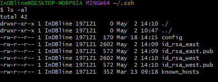

키 관리를 위해 ssh-agent에 새로 생성한 키들을 저장해 준다.

아래 명령어로 백그라운드에 ssh-agent를 싱행 시켜준다.

```bash
$ eval "$(ssh-agent -s)"
> Agent pdi 1111
```

아래 명령어로 각각 생성한 개인키를 ssh-agent에 저장해준다.

```bash
ssh-add ~/.ssh/id_rsa_jane 
# 출력 Identity added: /Users/yjlee/.ssh/id_rsa_east (회사계정주소)
ssh-add ~/.ssh/id_rsa_yj
# 출력 Identity added: /Users/yjlee/.ssh/id_rsa_west (개인계정주소)
```

아래 명령어로 ssh-agent에 정상적으로 ssh 개인키가 추가되었는지 재확인 해준다.

```bash
ssh-add -l

# 출력 : 3072 SHA256:ky... east계정주소 (RSA)
# 출력 : 3072 SHA256:YL... west계정주소 (RSA)
```

### **2. 깃헙에 새로운 SSH 공개 Key 추가해주기**

1. 공개키 복사를 위해 위에서 생성된 id_rsa_jane.pub 와 id_rsa_yj.pub를 복사해야한다.

복사하거나 편집기를 열어서 복사하는 방법이 있다.

```bash
# 복사하기
pbcopy < ~/.ssh/id_rsa_east.pub
pbcopy < ~/.ssh/id_rsa_west.pub

# 편집기 열기
code ~/.ssh/id_rsa_east.pub
code ~/.ssh/id_rsa_west.pub

# 코드 출력하기
cat ~/.ssh/id_rsa_east.pub
cat ~/.ssh/id_rsa_west.pub
```

참고로 복사는 code 혹은 cat으로 열었을때 나온 코드값 전부 복붙하면됨 다른 블로그글 잘못 읽고 앞에 두 부분 안 넣었다가 1시간 고생함..

2. 복사를 했으면, **깃헙 계정 - 프로필 클릭 - Settings - SSH and GPG keys 클릭 -> New SSH Key 클릭** -> 아래 두 항목 작성하기

\- **Title** : 기억하기 좋은 공개키 이름, 별명 적기

\- **Key** : 위에서 복사한 공개키 넣기

계정별로 실행한다.

 

### **3. SSH config 파일 설정 후 테스트**

1. config 파일에 들어가서 환경 설정해주기

```bash
cd ~/.ssh/config
vi config
```

2. 각 계정마다 환경 설정을 해주는데, 되도록 아래의 양식을 지켜준다. 특히 Host 부분을 잘 지을 것 

```bash
#east 계정에 대한 SSH 설정
Host github.com-jane
    HostName github.com
    User 유저 아이디
    IdentityFile ~/.ssh/id_rsa_east
    
#west 계정에 대한 SSH 설정
Host github.com-yj
    HostName github.com
    User 유저 아이디
    IdentityFile ~/.ssh/id_rsa_west
```

 

- **Host github.com-jane** : 나중에 ssh로 연결할 때 Host 지시자로 설정한 값을 사용하니 구분이 쉽고 편한 이름으로 작성한다.
- **HostName github.com** : github 도메인
- **User 유저 아이디** : github 사용자 아이디 (github 아이디로 설정)
- **IdentityFile ~/.ssh/id_rsa_jane** : 위에서 만든 개인키 경로 

**나중에 SSH 연결을 할 때 Host에 설정해둔 값인 github.com-east 으로 호출하면, 지정한 HostName(깃헙)에 접속해서 User로 지정해둔 깃헙 계정을 가지고 IdentityFile 에 적어둔 개인키 경로에서 그 개인키를 참조해 인증하는 방식이다.**

 

3. 아래 명령어로 ssh 연결 테스트

```bash
ssh -T git@github.com-east
ssh -T git@github.com-west

# 출력 : Hi 깃헙 계정! You've successfully authenticated, but GitHub does not provide shell access.
```

 

### **4. SSH 로 깃헙 레파지토리 클론 받아보기** 

1. 클론할 레파지토리 - code 클릭 후 HTTPS가 아니라 SSH 클릭해서 복사하면 아래와 같이 나올 것이다.

```bash
git@github.com:깃헙이름/레파지토리.git
```

2. 이걸 이제 아래와 같이 바꿔서 클론해준다.

즉 **github.com 를 위의 ssh config 파일의 Host로 지정한 github.com-east 를 넣으면 된다.**

기가 막히게 클론된다.

```bash
$ git clone git@github.com-jane:깃헙이름/레파지토리.git
```

3. 커밋이나 푸쉬 하기 전 user.name과 user.email을 확인해서 수정해주고 커밋하고 푸쉬해야한다.

```bash
git config user.name 회사계정아이디
git config user.email 회사계정이메일

# 전역으로 설정하고자 할 때 --global로 설정
git config --global user.name 
git config --global user.email 

# 설정 잘 됐는지 확인하려면 아래 명령어로 확인
git config user.name
git config user.email
```

 

**주의할점!**

새로운 레파지토리 생성 후 remote 연결 후 push 할 때,

git remote add origin git@github.com:깃헙레파지토리 주소 어쩌고.git 대신 git clone 하는 것처럼

git remote add origin git@github.com**-east:**깃헙레파지토리 주소 어쩌고.git 라고 해야 Permission denied 에러가 안난다.

## git의 Branch

> 참조: [브렌치로 작업하기](https://velog.io/@hyhy9501/Git-GitHub-6-%EB%B8%8C%EB%9E%9C%EC%B9%98branch%EB%A1%9C-%EC%9E%91%EC%97%85%ED%95%98%EA%B8%B0)

이제 가장 중요한 branch에 관해서 알아볼 시간이다. 보통 협업을 하면 가장 최상위 브렌치가 존재하고 그 하위 브렌치에 작업을 한다고 한다. 그럼 여기서 브렌치란 무었일까?

먼저 깃의 동작방식을 설명하자면 아래와 같다.

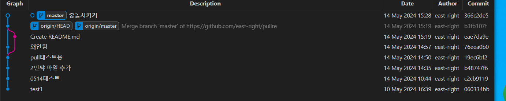

- 커밋을 하면, 각 커밋은 숫자와 문자가 연속적으로 조홥된 특이한 해시를 갖는다.
- 해시는 유니크해야 하고, 커밋의 내용이나 기타 ㅁ몇 가지 사항들에 부합한다.
- 이 독특한 해시는 전에 있었던 부모 커밋 하나를 참조해야 한다.
- 위 사진과 같이 한 커밋이 다음 커밋으로 연결되고 그 다음으로 연결되는 식의 직선적인 성직을 가진다.

위 사진은 vscode의 확장 프로그램중 `git graph`를 사용한 git의 log이다. 한번 휘어진게 있지만 기본적을 git을 통한 작업은 매우 직선적이다. 이러한 방식은 혼자 작업을 할때는 문제가 없지만 프로젝스에서는 여러 사황에서 동시에 작업을 하는 경우가 많다.

이러한 상황에서 서로의 작업이 영향을 미치지 않는다면, 족립적으로 하는 것이 보다 효율적이다. 그래서 우리는 **브렌치**를 사용한다.

브렌치는 프로젝트 타임라인이라 할 수 있다. 우리가 원할 때 별고의 contexts를 생성할 수 있게 한다. 또한 우리가 한 브랜치에서 어떤 작업을 하든 다른 브랜치에 영향을 미치지 않는다, 즉 내가 브렌치에 작업을 하면 다른 브렌치랑 합치기 전까지는 무슨일을 하든 독립적인 시행인것이다.

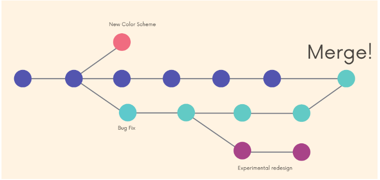


*<출저 브렌치에서 작업하기>*

### 마스터 브랜치(혹은 메인 브랜치)

마스터 브랜치는 새 브랜치를 만들었을때 생성되는 기본 브랜치 이름이다. git init명령을 실행했을 때, 자동적으로 시작하는 브랜치가 바로 master브랜치이다.

특별히 어떤 작업이나 능력이 있는 것이 아니고 여타의 다른 브랜치와 마찬가지로, 같은 능력을 가지고 있다. 다른 점은, 우리가 만든 게 아니라 git 이 생성이 되면 자동 적으로 생성이 된다는것 뿐이다.

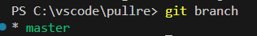

git의 브랜치는, 생성되자마자 처음 커밋한 곳을 master브랜치로 지정한다. 이후 커밋을 만들면 master브랜치는 자동으로 가장 마지막 커밋을 가르친다.

git 버전 관리 시스템에서 master브랜치는 특별하지 않다. 하지만 모든 저장소에서 master브랜치가 존재하는 이유는 git init 명령으로 초기화할 때 자동으로 만들어진 이 브랜치를 다른 이름으로 변경하지 않기 때문이다.

master브랜치는 보통 최상위 브랜치로 사용이되고 깃허브에서도 마찬가지이다. 하지만 최근 들어 깃허브에선 레포지토리를 생성하면 master브랜치가 아니라 main브랜치로 생성이된다. git에서선 여전히 master이다. 그래서 과거 문서를 참고 할때 master라는 이름이 있으면 깃허브에선 main이라고 보면 된다.

**깃허브에서 맨 처음 레포지토리를 때  `readme.md`파일을 자동생성을 하지 않으면 기본 브랜치인 `main`가 생성이 되지 않는다. 이러한 상황에서 `git init`으로 만들어진 레포지토리와 연결하면 가장 처음 만들어지는 브랜치 이름은 `master`가 된다. **

`readme.md`파일을 레포지토리 생성때 만들고 `git init`이 아닌 `git clone`으로 프로젝트 레포지토리를 생성하면 `main`브랜치가 초기 브랜치가 된다.

이러한 `master`혹은 `main`브랜치 들은 프로젝트를 진행할 때 **최상위 브랜치**로 취급을 하여 이 브랜치에선 작업을 하지 않는다. 각각 새로은 브렌치를 만들어서 작업을 하고 특정 타이밍에(주에 한번 혹은 매주 화,금 etc..)에 한꺼번에 merge를 한다.

 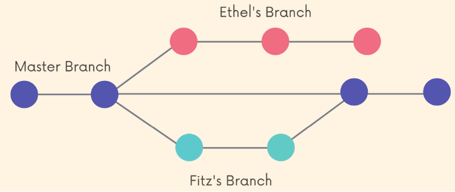

*<출저 브렌치에서 작업하기>*

### HEAD란 무엇인가?

우리가 로그를 확인 해 보기 위해 `git log`를 보면 아래과 같이 나올 수 있다.

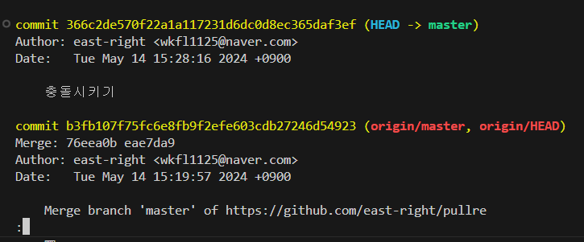

혹은 log를 확인 하기 위하여 vscode의 확장 프로그램인 git graph를 사용해도 된다.


여기서 보면 두 사진 모두 `HEAD`혹은 `origin/HEAD`라는게 보일 것이다. 이는 깃 용어중 하나이고, 특히 저장소에서 현재 우리의 위치를 가리키는 포인터 이다. 즉 어떤 작업들 중 가장 마지막에 한 작업을 가리키는 포인터 또는 레퍼런스 이다.

> **여기서 git graph의 head표시는 `○`가 git의 head표시이다. 저기서 `origin/HEAD`는 github의 HEAD 표시이다.**

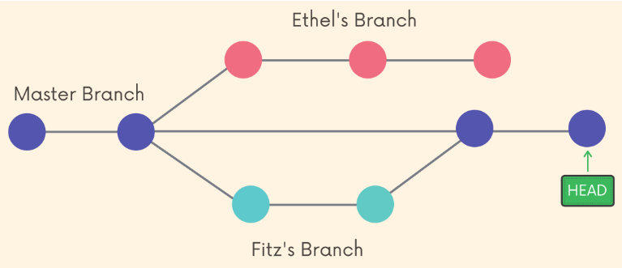

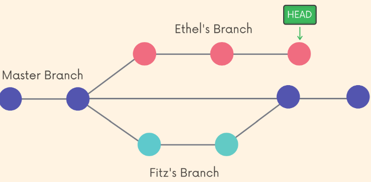

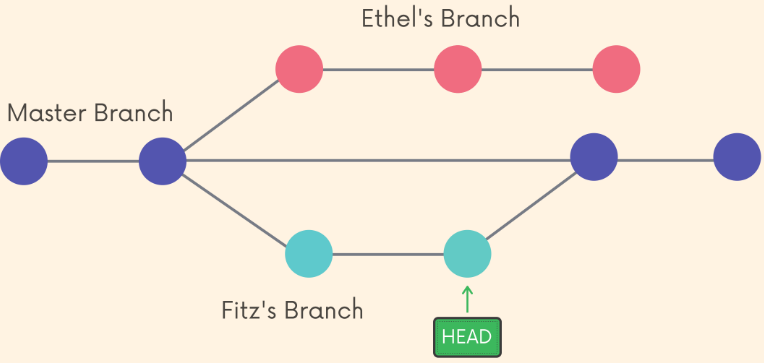

> 정리하자면
>
> - HEAD는 브랜치 포인터에 대한 레퍼런스 포인터이고 브랜치 포인터는 현재 브랜치가 있는 위치이다.
> - 여러 개의 브랜치를 가질 수 있고, 각 브랜치는 브랜치 레퍼런스를 갖는다.

*<출저 브렌치에서 작업하기>*

## git branch 작업하기

이제 브랜치를 직접 생성해볼 차례이다. 

먼저 현재 저장소에 있는 브랜치를 알고 싶으면 `git branch`를 입력하면 된다. 혹은 `git branch -a`

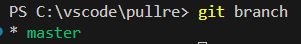

`*`은 현재 내가 사용하고 있는 브랜치를 가르키며 작업 시작시 꼭 확인 해야한다. 만약 프로젝트시 작업을 완료하고 push를 했는데 최상위 브랜치면? ㅋㅋ 망한거지 뭘

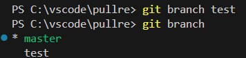

git의 새로운 브랜치는 `git branch <브랜치이름>`으로 생성이 가능하다.  브랜치 이름을 `test`로 설정하여 만들어 보았다.

> 여기서 잠깐! branch를 생성 했을때 그 브랜치는 HEAD가 위치한 시점의 파일들을 복사 하여 새 브랜치에 적용한다.

일단 먼저 master브랜치에 커밋을 해 보겠다.

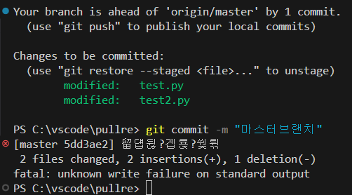

커밋을 시키고 log를 확인해보면

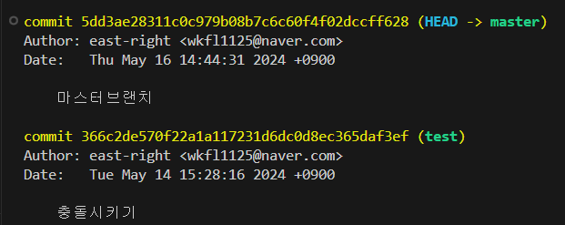

Head는 지금 master를 가르키고 이 matser 브랜치는 가장 최근에 commit 시킨 "마스터브랜치"라는 커밋 메시지를 가진 버전을 가지고 있다 고 확인가능하다.

그리고 test 브랜치는 최초로 만들어 질때의 타이밍인 "충돌시키기" 시점에 아직 머물러 있다는걸 알 수 있다.

git graph로 보면 보다 보기 편하다.

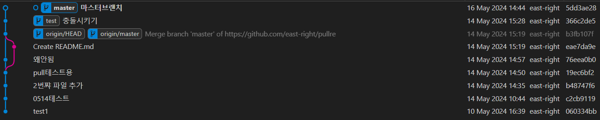

이제 브랜치를 이동하겠다. 브랜치 이동은 `git switch <브랜치 이름>`으로 이동가능하다.

> 과거의 브랜치 체인지는 `git checkout`을 사용하였다. 하지만 `git checkout`은 브랜치 체인지 뿐만 아니라 파일 복원 등과 같은 너무 많은 기능이 `git checkout`에 포함되어 있어서 따로 분리 시킨거 같다.
>
> - 브랜치 생성: git checkout -b <브랜치 이름> --> git branch <브랜치 이름>
> - 브랜치 이동: git checkout <브랜치 이름> --> git switch <브랜치 이름>
> - 파일 복원: git restore <파일이름> 혹은 git restore --staged <파일이름>

지금 master 브랜치에 있는 파일을 보면 아래와 같다.

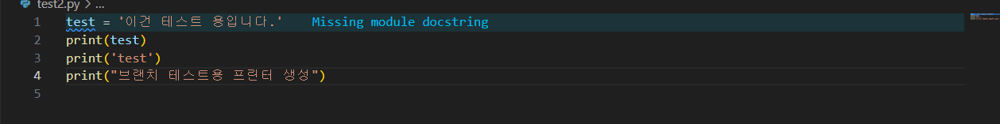

그리고 여기서 `git switch test`로 브랜치로 이동하면

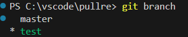

`*`이 test로 이동하게 되면 브랜치가 변경이 된다. 그런다음 git graph와 git log를 확인해보자

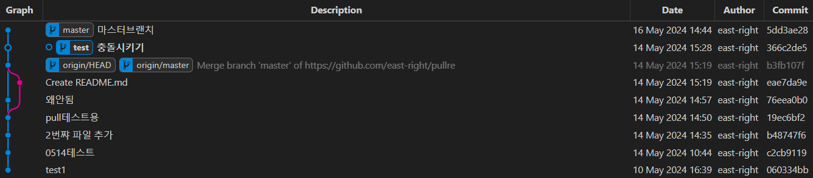

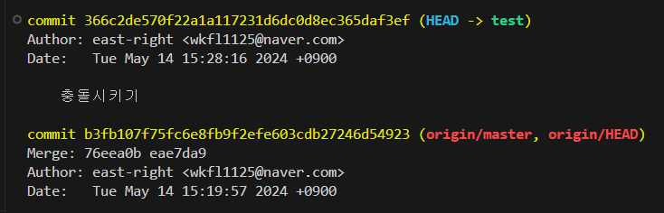

헤드를 나타내는 `○`가 test브랜치로 내려간걸 확인할 수 있고 test브랜치는 커밋할 당시"충돌시키기" 타이밍의 파일을 들고 있다는걸 확인이 가능하다. 그럼 이제 다시 test2.py를 확인해보면

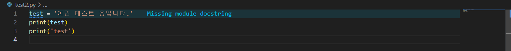

파일이 "출동시키기" 커밋 당시의 내용으로 돌아간 것을 확인이 가능하다.

이제 test의 파일을 변경하여 커밋 해본다.

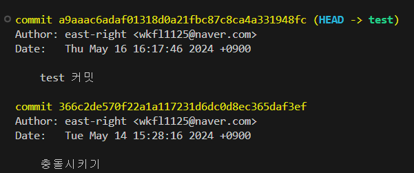

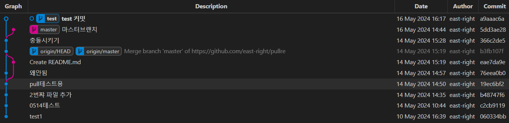

이제 git graph를 보면 새로운 갈래가 생긴것이 확인 가능해 진다. 

### git의 merge

> 이 부분은 github의 merge와 pull request에서 더 다룰 예정이다. 지금은 뭔가 불편해서 적는거다.

순서가 약간 꼬이긴 했다만 먼저 merge에 대해 알아볼려고 한다.

앞서 설명 했듯이 프로젝트 시에 각각 새 브랜치를 만들고 최종적으로 master브랜치에 merge를 하는것이 목표이다.

지금 위의 사진과 같이 test와 master브랜치가 합쳐지지 않은 새로운 분기를 만들어 따로 논 상황이다. 보통은 브랜치는 단체 프로젝트시에 사용을 하여 github에서 주로 하지만 지금 내가 너무 불편해서 `git merge`를 사용해볼 생각이다.

```cmd
$ git merge <브랜치이름>
```

으로 보통 merge를 한다.

master 브랜치에 test 브랜치의 내용을 합칠 거니 주체가 되는 브랜치로 먼저 이동을 한다. 그런 다음 `git merge test`를 사용하여 git을 merge 한다.

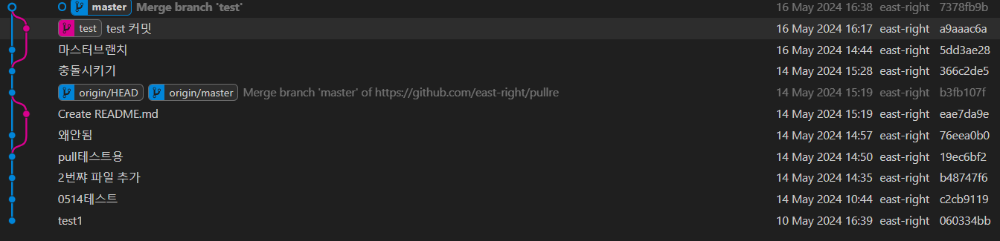

> 지금 merge가 쉽게 되는 이유는 두 브렌치에 있는 수정된 파일들이 차이가 없기 때문이다. 만약 다른 브렌치에서 하나의 파일에 수정된 내용이 다르면 이제 추가적인 작업이 필요하다.

근데 지금 test와 master의 시점이 다른걸 확인이 가능할 것이다.

선은 연결되어 있는데 분기가 다르다. 그 이유는 각 브랜치의 head가 다르기 때문인데 보통 깃허브의 pull request를 하면 둘다 merge가 되어 두개의 브랜치가 같은 파일 같은 시점으로 조정이 되지만 merge는 다른거 같다.

그래서 `test` 브랜치에서 `git merge master`를 하니 아래의 사진과 같이 시점이 같아 지면서 두개의 브랜치가 완전히 같은 파일과 버번을 가질수 있게 되었다.

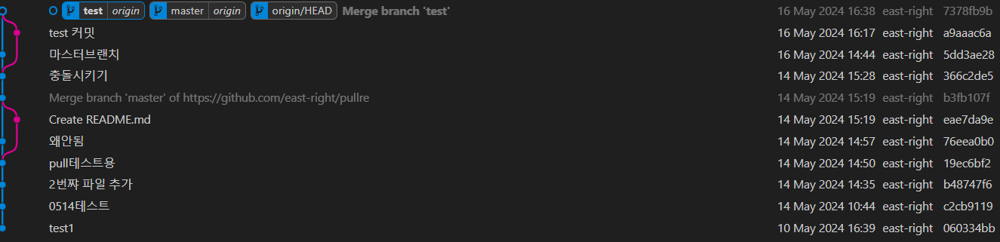

> 참고로 지금 저 git grapch 상태는 내가 git push를 해서 깃헙과 git 의 모든 브랜치가 같은 버전을 들고 있어서 저렇게 뜨는거다. 뭐 헷갈리거 없다. 사진의 순서가 잠시 꼬인거다.

이제 이 내용들을 push를 해서 github에 올릴꺼다

### fatal: The current branch test has no upstream branch.

잠시 내가 test와 master 브랜치의 시점을 다르게 하고 실습을 진행해 보겠다. git으로 브렌치를 만들고 `git push` 를 하면 안되는 상황이 종종 존재한다.

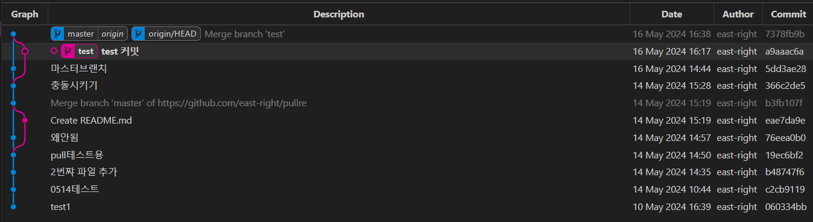

사진과 같이 `master`브랜치를 push 했을때는 문제가 없이 작동이 되었지만 `test`브랜치는 push를 하면 아래와 같은 에러가 뜬다.

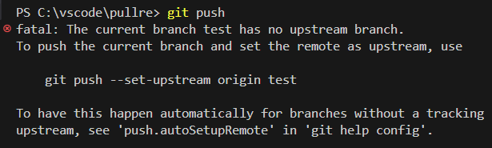

지금 github에 test 브랜치가 없으니 생성하란 이야기다. 저기 나와 있는 설명대로 아래의 코드를 입력을 하면 **새로운(test) 브랜치가 github에 생성이 되면서 push가 작동이 된다.**

```cmd
git push --set-upstream origin test
```

git hub에 들어 갔을 때 새로운 branch가 생성이 된걸 확인이 가능하다.

## git branch의 다른 명령어들

| 명령어                                                | 내용                            |
| ----------------------------------------------------- | ------------------------------- |
| git branch                                            | 현재 존재/사용 중인 브랜치 확인 |
| git branch <브랜치 이름>                              | 브랜치 생성                     |
| git switch <브랜치 이름>(git checkoout <브랜치 이름>) | 브랜치 이동                     |
| git merge <브랜치 이름>                               | 브랜치 합치기                   |
| git branch -d <브랜치 이름>                           | 브랜치 삭제                     |
| git switch -c <브랜치 이름>                           | 브랜치 생성 후 이동             |
| git branch -m <브랜치 이름>                           | 현재 브랜치 이름 변경           |
| git clone --branch <브랜치 이름> <repo_URL>           | 특정 브렌치만 clone             |


## git merge 충돌

> 참조: [브랜치 병합하기](https://velog.io/@hyhy9501/Git-GitHub-7-%EB%B8%8C%EB%9E%9C%EC%B9%98-%EB%B3%91%ED%95%A9%ED%95%98%EA%B8%B0-%EB%A7%99%EC%86%8C%EC%82%AC)

merge를 하다보면 충돌이 날 경우가 있다. merge는 두 개의 브랜치의 다른 점을 합칠때 사용하는 명령어 이다. 보통 협업시 브랜치 마다 각각 다른사람이 작업을 하고 같은 파일을 작업하는 경우가 보통은 없다. 하지만 종종 내가 작업을 하기 위해 다른 파일을 건드려야하는데 그 파일이 다른 사람이 작업하는 파일이라면?

이럴 경우 같은 파일내 두 브랜치의 내용이 다를때(각 브랜치 마다 에 겹치지 않는 내용이 양쪽다 존재할 때) merge를 하면 충돌이 나서 직접 처리를 해야한다. 

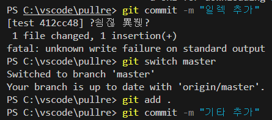

위의 사진과 같이 같은 파일에 각각 "일렉"이란 단어와 "기타" 라는 내용을 추가하고 `git merge`를 하니 아래와 같은 상황이 일어 났다.

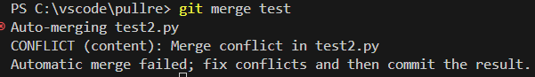

오토 머지를 `test2.py`라는 파일에 실행을 했는데 실패 했다는 내용이다. 이 내용을 got graph로 보면 아래와 같다.

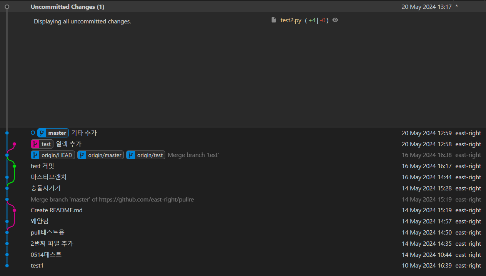

`Uncommitted Changes(1)`라는 문구가 뜨면서 뿌리가 뻗지 않은 모습니다. `test2.py`파일에 돌아와서 보면 아래와 같은 창으로 변경ㅇ 되는데

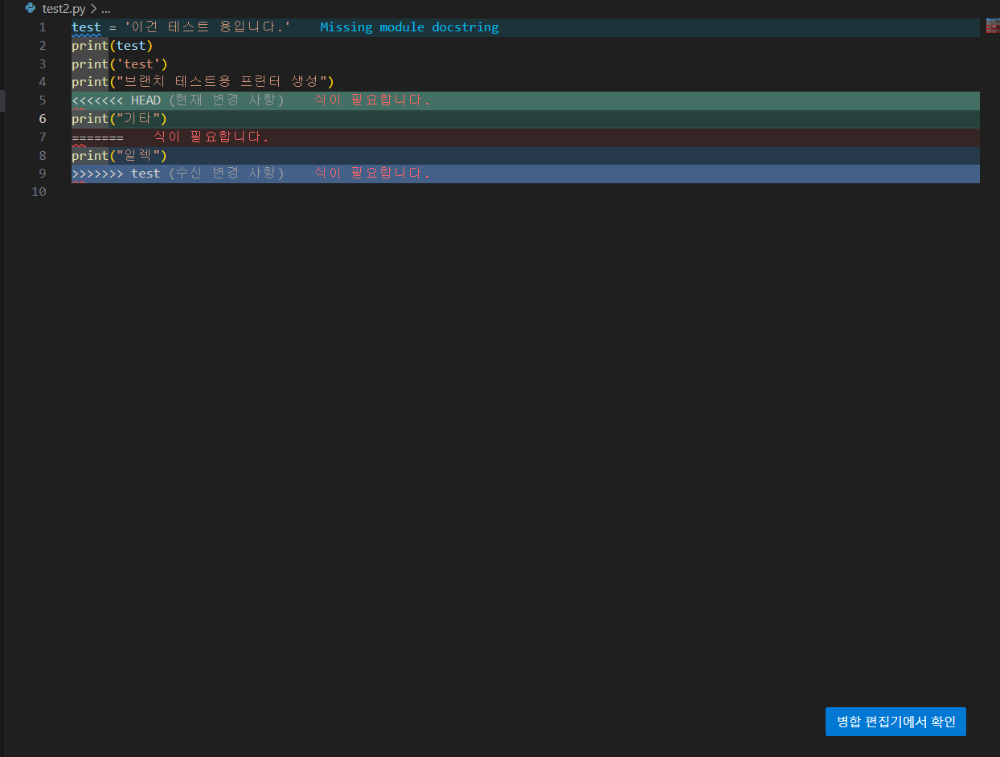

여기서 vscode 인터페이스인 `병합 편집기에서 확인`을 클릭하면 

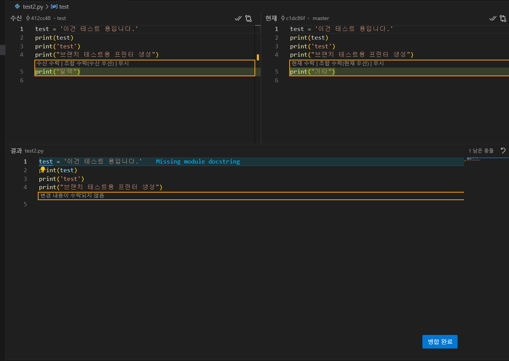

아래와 같은 창이 뜬다. 여기서 수신은 받은거 즉 `test`브랜치의 내용이고 현재는 `master`브랜치의 내용이다. 원하는 코드를 수락을 하면 결과에 반영이 되고 병합 완료를 누르면 간편하게 병합을 완료 할 수 있다. 아래는 각각 수락의 결과들 이다.

<수신 수락>

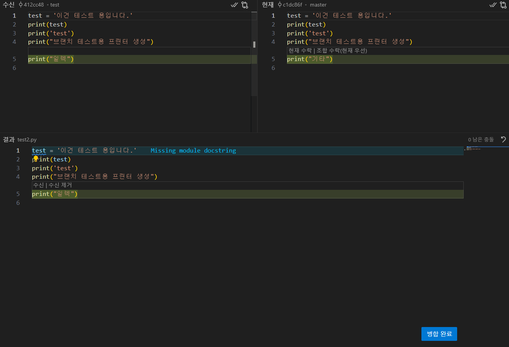

<조합 수락(수신 우선)>

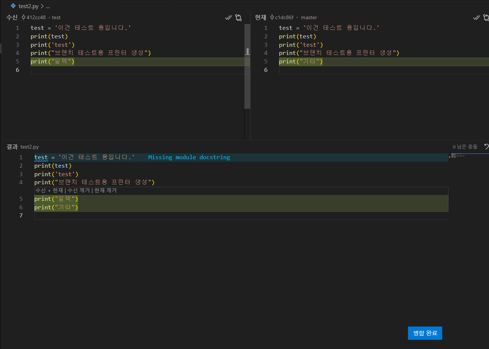

<조합 수락 (현재 우선)>

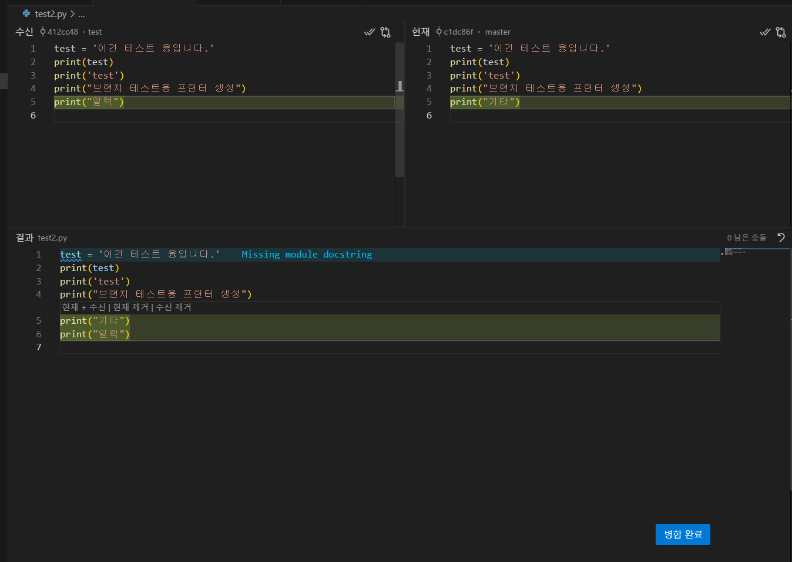

원하는걸 선택후 `병합 완료`를 누르고 커밋을 실행하면 이제 충돌 해결 완료이다.

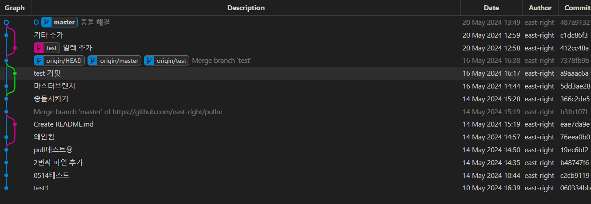

## 변경 사항을 알아보는 git diff

diff는 파일의 변경 사항을 알아보는 명령어이다.

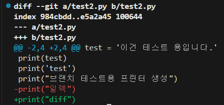

파일을 변경하고 `git diff`를 실행하면 아래와 같은 결과를 볼 수 있다.

천천히 의미하는 바를 알아보면

- 첫번째 줄은 변경된 파일을 보여준다. 만약 파일명이 바뀌었으면 그냥 파일명만 출력이 되지만 지금은 파일 명은 변경이 되지 않았기에 `a/`와`b/`로 구분을 한 상황이다.
- 메타에디터이다.
- 3~4 줄은 각각의 파일의 내용을 기호(마크)시킨 내용이다. 기존에 존재 했지만 변경된 내용은 `-`새롭게 추가된 파일의 변경된 내용은 `+`
- @@가 존재하는 줄은 청크를 나타낸다.  2,4 의미는 2번째 줄 부터 자기 포함 아래로 4줄이 있다. 라는 뜻이다.
- 여기선 두 파일의 차이점을 보여준다.

`git diff HEAD`를 사용하면 스테이징된(add) 변경 사항을 보여준다.

## Github의 pull request

깃허브의 백미인 풀리퀘스트다.  협업시 각각 다른 브렌치에 작업을 하고 이제 메인(혹은 master) 브랜치에 작업물을 올려야 한다. 이때 우리는 pull request(이하 풀리퀘)를 해야한다.

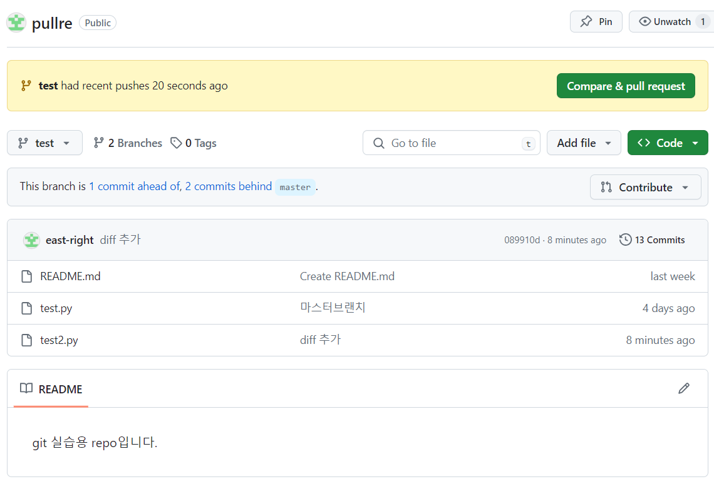

먼저 하위 브랜치에 push를 하면 위의 사진과 같이 풀리퀘 버튼이 나온다.

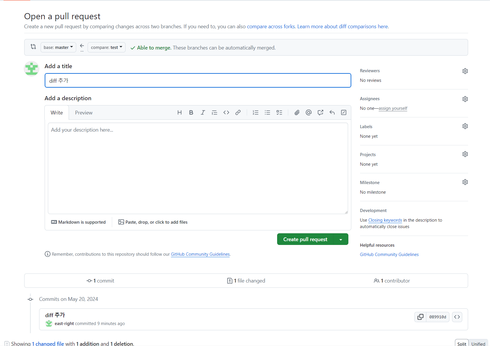

누르면 이제 풀리퀘스트 창이 나온다. 풀리퀘 창에선 봐야할 정보들이 많다.

- base와 compare: base는 받을 브랜치 compare는 줄 브랜치
- `add a title`과 `add a description`은 풀리퀘 제목과 내용
- 우측의 Reviewers는 메인 프랜치로 옮기기 전의 코드 검토자
- assignees는 작업 담당자
- Label은 옮기는 코드 태그
- etc..

대충 대표적인 것들만 나열을 했다. 풀리퀘는 협업시 매우 민감한 단계이므로 꼭 합치기 전에 서로 검토하는 작업이 포함되어 있다. 

풀리퀘를 하기 위햐서 리뷰어로 설정한 사용자들에게 코드 리뷰를 받아야한다.

이제 설정을 하고 `Create pull reqest`를 누르면 다음 창으로 넘어간다.

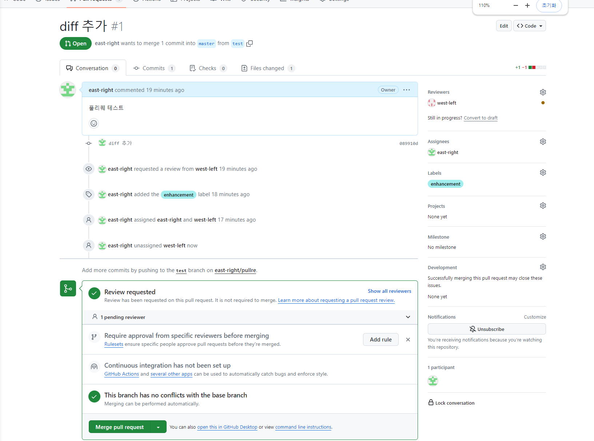


이제 풀리퀘 창으로 넘어오면 이러한 창이 뜬다. 리뷰어와 담당자와 태그가 우측에 표기가 되고 리뷰어들이 리뷰를 달거나 수정사항을 기록해준다.

여기서 중요한건 `Merge pull request`를 누르면 이제 두 브랜치가 merge가 되면서 메인브랜치고 내용이 올라간다. 그렇기에 모든 리뷰 담당자들에게 확인을 받지 않으면 함부로 눌리지 않는다.

이제 리뷰어로 배정된 사람의 계정으로 들어가 리뷰를 한번 남겨 보겠다.

리뷰 담당자는 repo에 들어와 상단 바의 `pull reqest`로 넘어가면 다른 작업자의 pull request 이력을 볼 수 있다.

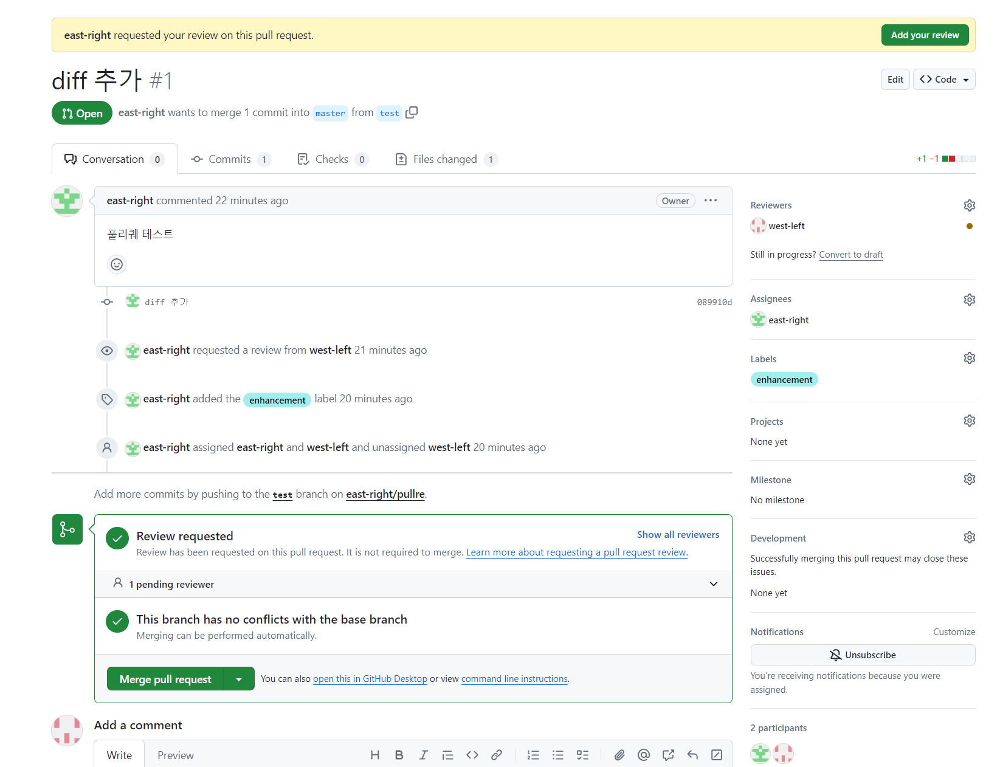

여기서 `Commits`로 넘어가 코드 리뷰를 할 수 있다.

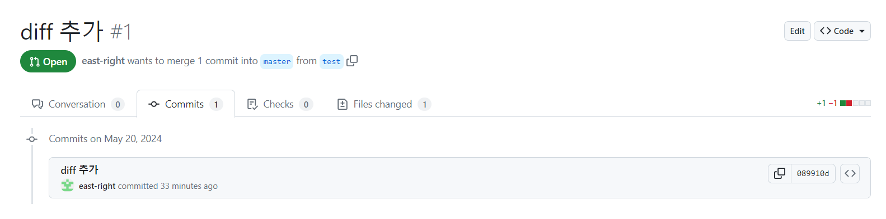

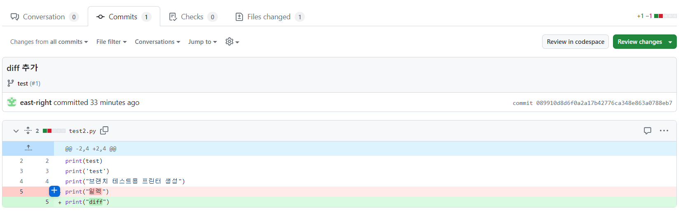

`Commits`창에서 넘어오면 위와 같은 창이 뜬다. 여기서 코드에 대한 리뷰를 남겨야 한다. 기본적으로 `git diff`와 비슷하며 코드에 마우스를 올리면 사진과 같은 파란 박스가 나오는데 이걸 클릭을 하면 줄마다 코드 리뷰를 남길 수 있다.

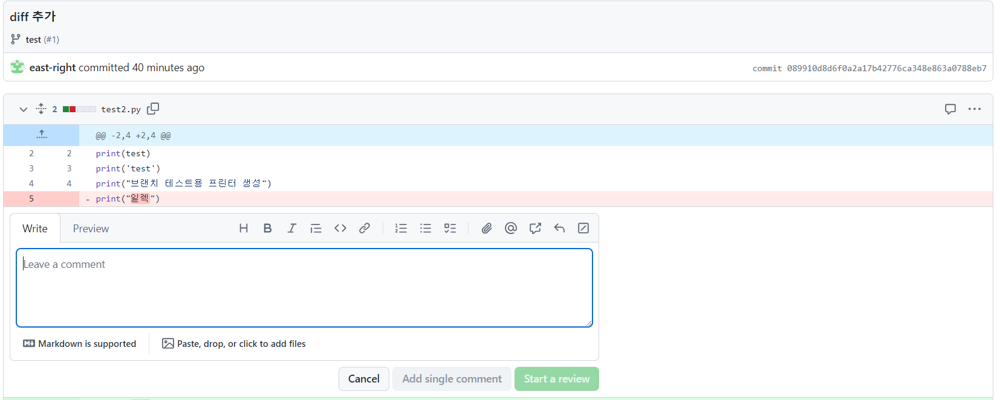

내용을 입력하고  `Start a review`를 누르면 이제 리뷰 내용을 남길 수 있다. 또한 `Add single commnet`는 리뷰가 아닌 바로 바로 간단한 코맨트를 남기는데 이걸 누르면 임시저장 단계 없이 바로 리뷰가 적용이 되어 코멘트로 들어간다.

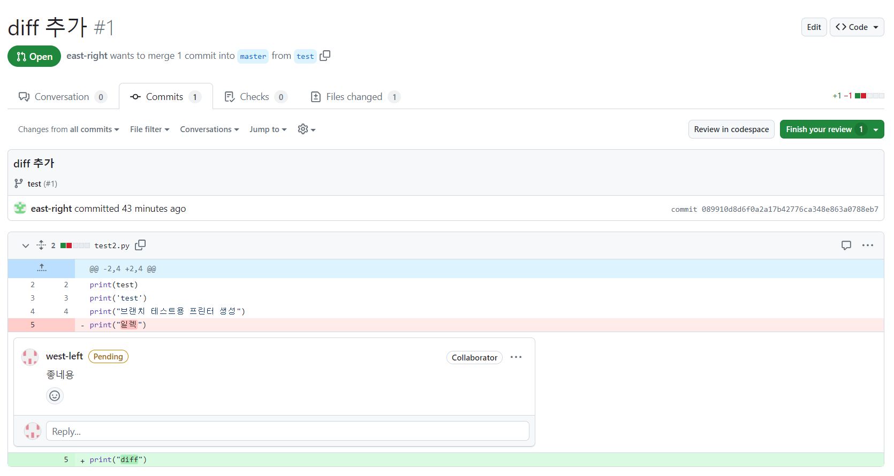

여기서 리뷰를 남기면 `Pending`이란 표시가 뜨는데 이는 아직 리뷰로 확정이된 단계가 아니고 나한테만 보이는 단계이다. 여기서 리뷰를 다 남겼으면 `Finish your review`를 누르면 되는데

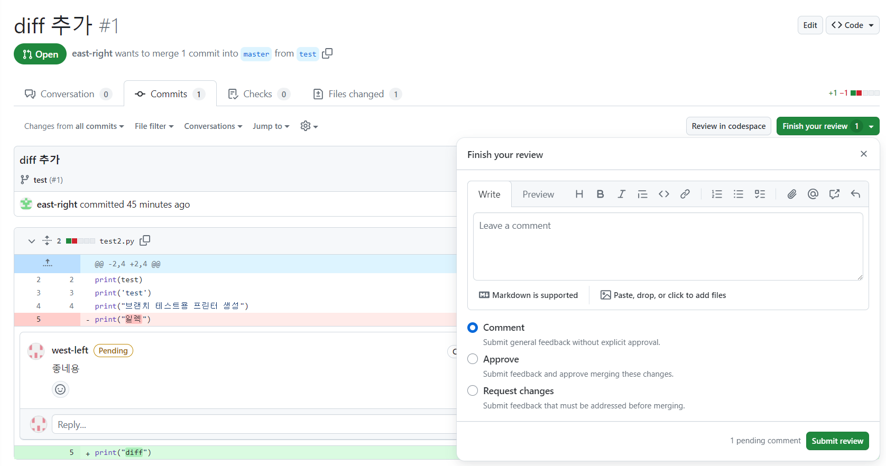

그럼 위와 같은 창이 뜬다. 여기서 입력하는 코멘트 화이트 박스는 코드 한 줄 한 줄에 관한 코멘트가 아니라 이번 리뷰에 대한 코멘트를 남기는 창이다. 

또한 각각 `Comment`와 `Approve`, `Request changes`가 존재한다.

- Comment: 이때까지 작성한 내용을 전부 코멘트로 남긴다.
- Approve: 코드 리뷰를 확인하고 merge를 승인한다.
- Request change: 리뷰를 남긴 줄의 코드를 변경해라

보통 리뷰어로 지정된 사람이 모두 Approve를 눌러야 merge를 시행을 한다. 그리고 Request changes를 선택하고 리뷰를 완료하면 코드를 바꿔 다시 승인이 떨어지기 전까지 이전 페이지의 merge 버튼이 빨간색으로 변한다. 

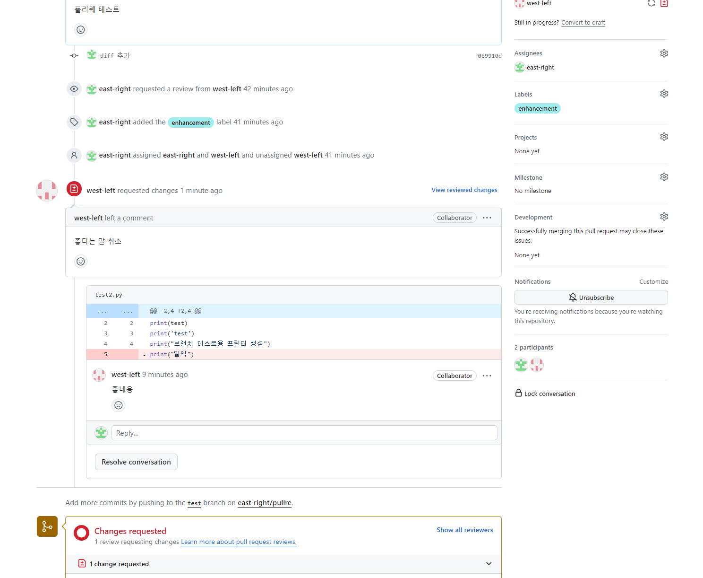

다시 풀리퀘 담당자 창으로 넘어오면 위와 같이 리뷰를 볼 수 있다. 지금은 Request changes요청이 들어온 상황이다. 그럼 이제 코드를 다시 작업을 해서 push를 시켜보자

> 원래 풀리퀘 조건을 걸어서 `request change`가 존재하면 merge를 못시키게 하거나 리뷰어들 전부 Approve를 해야 merge를 할 수 있게 하는데 지금은 그런 제약을 걸지 않았다.

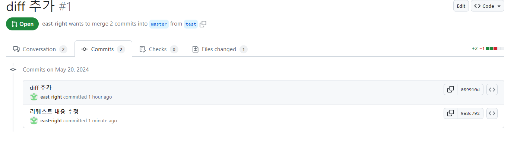그럼 이제 커밋 내용이 다시 나오고 코드 담당자는 Resolve conversation을 눌러 작업을 했다는 기록을 남긴다.

리뷰어는 다시 확인을 하여 리뷰를 해서 comment를 하든 Approve를 하든 다시 반려를 하든 선택하여 리뷰를 완료한다. 

이제 리뷰어가 승인을 완료를 하면 아래와 같이 빨간 원이 승인이 되었다는 초록원으로 바뀐다.

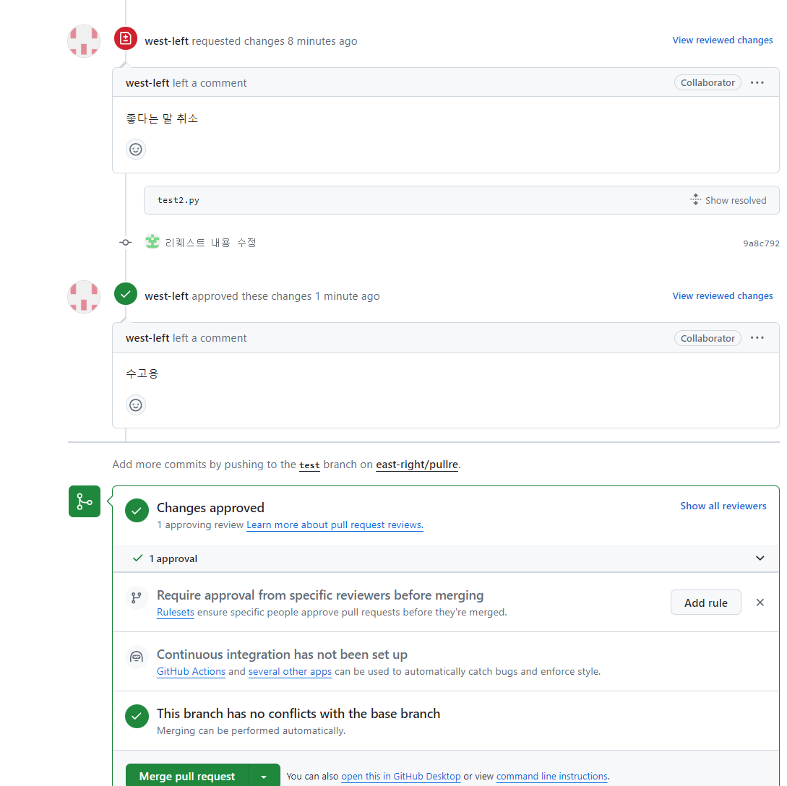

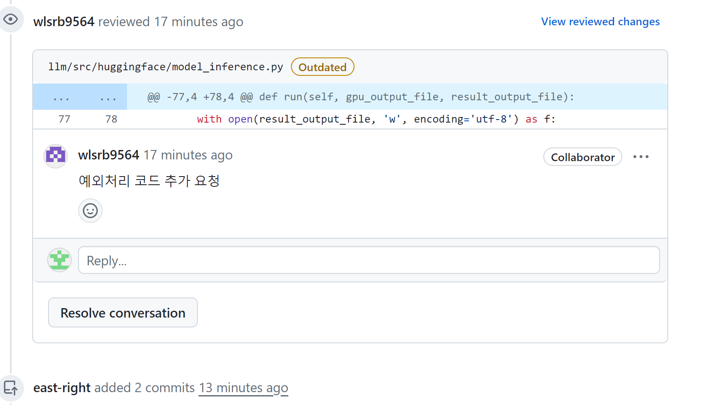

> 수정이 완료되면 사진과 같이 `Outdated`가 뜬다.

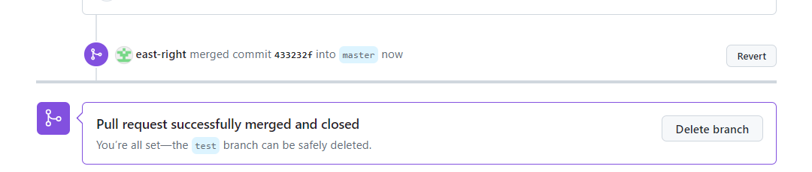

완료 했다.이제 브랜치가 필요 없으면 삭제하면 된다.

### 만약 Pull request에서 충돌이 난다면

> 여기는 스터디에서 캡쳐한 사진으로 대체 하겠다.

만약 충돌이 난다면 재밌는 상황? 이다.망한거니깐

근데 해결을 해야하니 알아보겠다. 충돌이 나면 아래와 같이 **`develovpe`브랜치가 생길 것 이다.**

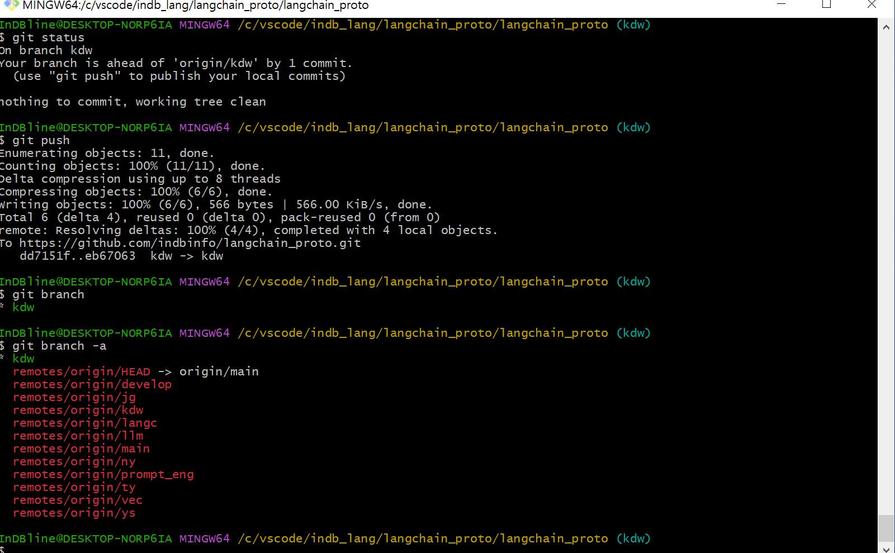

그럼 `develovpe`브랜치에 들어가면 우리가 merge에서 해왔던 작업과 마찬가지로 기존, 수신, 둘다선택 중에 선택하여 코드를 만들고 다시 commit과 pull을 하면 이제 정상적인 풀리퀘 리뷸 페이지로 넘어갈 수 있다.

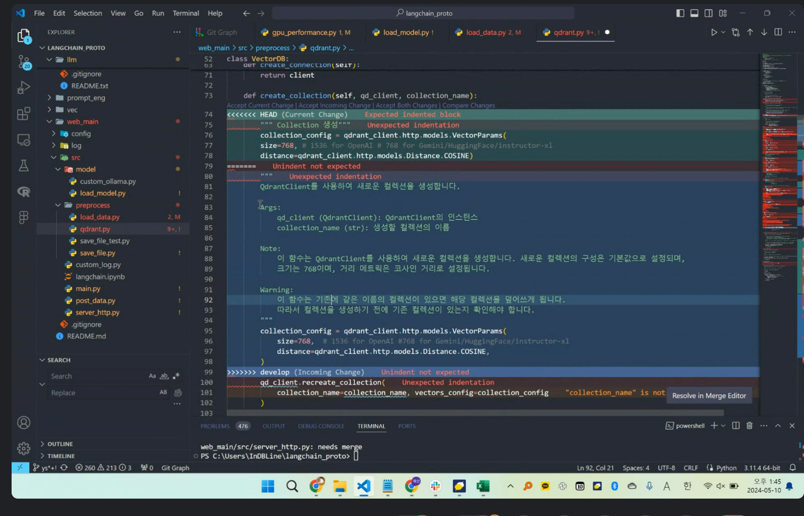

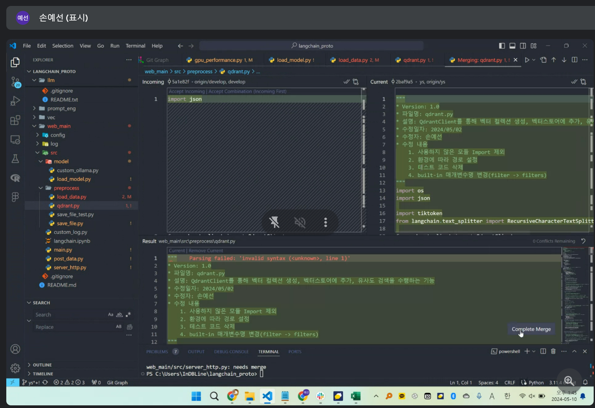

## git clone 후 원격에 branch가 있을 때
git clone 후 원격에 branch가 있을 때 원격에 있는 branch 이름으로 git switch를 하면 그 브렌치가 복사가 되면서 local에 그 브랜치가 생긴다.

- `git clone` 후엔 자동으로 `main` 브랜치가 체크아웃된다.

- `origin/dongwoo` 원격 브랜치가 있으면, `git switch dongwoo` 실행 시
    - 로컬에 `dongwoo` 브랜치가 없으므로
    - **자동으로** `origin/dongwoo`를 추적하는 로컬 브랜치 `dongwoo`를 생성하고 체크아웃

- 로그 메시지 “branch 'dongwoo' set up to track 'origin/dongwoo'.”은
    - “로컬 `dongwoo`가 원격 `origin/dongwoo`를 추적하도록 설정됐다”는 뜻

- 결과적으로 한 번의 `git switch dongwoo`로
    - 브랜치 생성 + 체크아웃 + upstream 설정까지 모두 이루어진 것


*추가 Referrence*

>[VSCode 깃허브 연동 및 설정](https://miaow-miaow.tistory.com/17)
>
>[Repo와 git bash 연결하기](https://transferhwang.tistory.com/160#google_vignette)
>
>[Tracked와 UnTracked](https://abled.tistory.com/8)
>
>[git add/commit](https://hihiha2.tistory.com/4)
>
>[git 계정 두개 연결하기/ssh 설정](https://yjleekr.tistory.com/124)
>
>[유튜브 git 강의](https://www.youtube.com/watch?v=iiAlXe8H5y8&list=PLHF1wYTaCuixewA1hAn8u6hzx5mNenAGM&index=4)
>
>[위키독수 vs 사용자를 위한 git](https://wikidocs.net/151852)
