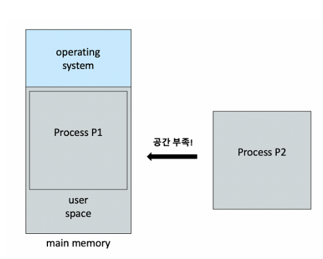
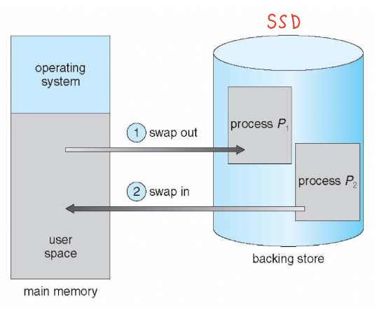
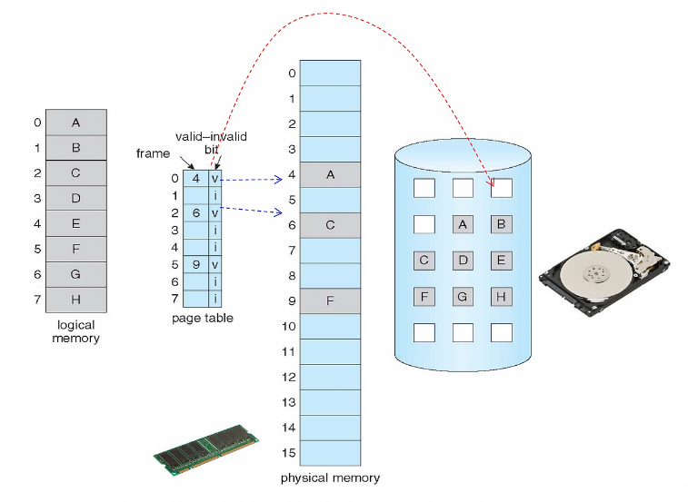
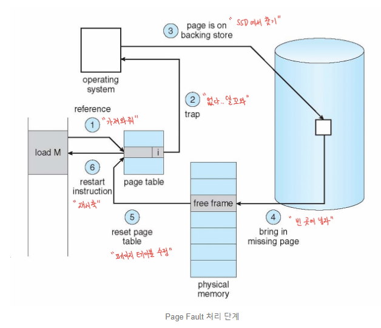
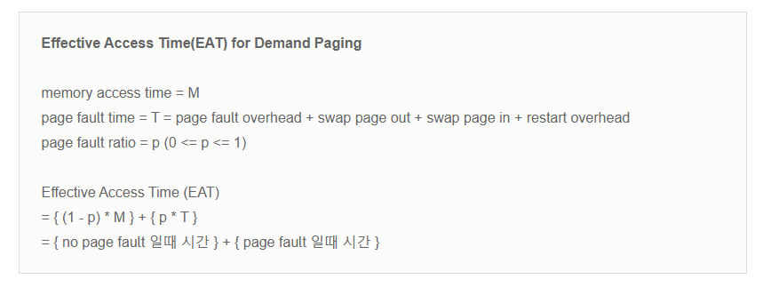

#memory #OS #자료구조 

- 메모리는 주소의 집합이다. 가상 메모리는 가상 주소의 집합에 불과하다.
- 우리는 논리적 주소(가상 주소)를 "CPU 입장에서의 주소"라고 칭하고, 모든 프로세스의 가상 주소는 0부터 시작한다.
- **모든 프로세스는 각각 독립적인 가상 주소 공간을 가지는데, 이를 가상 메모리라고 한다.**
- 가상 메모리를 이용하는 이유는 아래와 같다.
  - 사용자 편의성 
    - 사용자는 가상 메모리만 신경쓰면 된다. 물리적 메모리로의 사상은 OS가 알아서 처리한다.
  - 프로세스간 메모리 보호
    - Base Register와 Limit Register로 프로세스는 물리적 메모리에서 자신의 접근 영역을 알 수 있다. 접근 영역을 벗어나면 trap 발생
  - 프로세스가 물리적 메모리의 크기에 한정되지 않는다.
    - **물리적 메모리보다 더 큰 크기의 프로그램을 실행시킬 수 있다는 말이다.**
- 여기서 핵심은 3번이다. 만약 어떤 프로그램을 실행시키려고 하는데 물리적 메모리에 여유 공간이 없다면? 이 때 가상 메모리를 사용한다.

## Swapping

- 프로그램을 실행시키려면 데이터가 메모리 위에 올라가야 하낟. 이는 불변의 버칙이다. 오직 메모리 위에 있는 내용만 컴퓨터가 실행할 수 있다.

> 출처: https://charles098.tistory.com/114?category=947356

- 근데 만약 위와 같이 P2가 실행되기 위해서는 메인 메모리에 로딩돼야 하는 데 물리적 메모리에 여우 공간이 없는 상황이다. 
- 여기서 프로세스 P2를 실행시키기 위해서는 P1을 보조기억장치(SSD)에 옮겨 자리를 만들어주고, 빈자리에 P2를 넣는 방법이 있다.
- **이를 swapping이라고 한다. 메인 메모리에서 SSD로 가는 것을 Swapout, SSD에서 메인 메모리로 가는 것을 Swap in이라고 한다.**

> 출차: https://charles098.tistory.com/114?category=947356

- 하지만 swapping은 굉장히 비효율적이다. SSD까지 안그래도 먼데 언제 옮기고 들고오냐 그래서 현대의 OS는 이 방법을 말고 Demand Paging이라는 방법을 쓴다.

## Demand Paginig

- **과연 프로그램을 실행할 때 SSD에 저장되어 있는 모든 내용을 다 메모리에 옮길 필요가 있을까?**
- 그럴 필요가 없다. 왜냐하면 **우리가 프로그램을 실행할 때 사용하는 기능은 극히 일부 이기 때문이다.**
- 예를 들어 GTA 게임의 옹량은 자그마치 80GB이다. 수많은 애니메이션, 아이템, 맵 그래픽 등등 많은 정보가 있다. 하지만 이걸 전부 항상 메인 메모리에 올려 들고 있어야 할 까?
- 정답은 아니다. 사용자가 하는 행동에 맞는 정보만 메모리 위에 있으면 게임하는데 아무런 지장이 없다. 맵이동을 하면 해당 맵에 대한 정보만 SSD에서 들고와서 보여주면 된다. 로딩의 존재 이유이다.
- 이렇게 보니 로딩없는 오픈월드 게임이 얼마나 대단한지 알거 같다. 물론 알게 모르게 로딩이 있겠지만 ......
- 여기서 핵심은 **프로그램 실행에 필요한 코드는 아주 일부분이기 때문에 필요한게 있으면 그때 끌어다 쓰면된다.**
- 어떠한 프로그램이라도 실행시키기 위한 최소의 코드만 메인 메모리에 로딩시키면된다. 
- 여기서 페이지의 힘이 도 나온다. 메모리는 페이지라는 단위로 관리된다. **모든 프로그램은 페이지 단위로 조각화 되어 있기 때문에, 프로그램 실행에 필요한 페이지만 메모리에 로딩하면 된다. 나머지 페이지는 필요할 때 로딩하면 된다.** 이게 바로 Demand Paging의 개념이다.

> Dmend Paging
>
> :프로그램 실행 중 필요한 페이지를 그때 로딩하는 방법, 사용하지 않는 페이지는 물리적 메모리에 로딩되지 않는다.

- 점선들은 무시하고, 위 그림에서 가상 메모리의 페이지는 총 8개이다.
- 모든 페이지는 SSD에 저장되어 있고, 메인 메모리 위에 A, C, F만 올라가 있다.
- 이제 CPU는 프로그램 실행 중 페이지를 요구할 때, 메인 메모리에 이미 존재하는 페이지는 페이지 테이블을 통해 그대로 접근하면 된다.
- 메인 메모리에 존재하지 않는 페이지는 SSD에서 가져와 쓴다.
- 그런데 **페이지 테이블에서 접근하고자 하는 페이지가 메인 메모리에 로딩되어 있는지, 로딩되어 있지 않는지 여부는 어떻게 구분할 수 있을까**

> **Valid bit**:해당 페이지가 메인 메모리에 존재하는지 알려주는 값으로 page table entry 마다 존재한다.
>
> 
>
> 1)  Valid bit = v(valid)
>
>    : 해당 페이지가 메인 메모리 위에 있다.
>
> 2) Valid bit = i(invalid)
>
>    : 해당 페이지가 메인 메모리 위에 없다. 따라서 SSD에서 가져와야 한다. 이를 Page Fault라고 한다.

- Page Fault가 발생하면 SSD에서 페이지를 가져와야 하기 때문에 소프트웨어 인터럽트(Software interrupt)가 발생한다.

> 출처: https://charles098.tistory.com/114?category=947356

>1. 페이지 테이블에서 valid bit 검사
>2. 값이 i 면 page fault 이므로 trap 발생시킴
>3. SSD에서 필요한 페이지 탐색
>4. 메인 메모리 Free frame 에 로딩
>5. 페이지 테이블에 Valid bit를 v로 수정
>6. 명령 재수행

- Page Faule가 발생하면 SSD까지 갔다돠야 하기 때문에 오버해드가 발생한다.
- 따라서 Page Fault의 발생 비율은 페이징의 성능에 큰 영향을 미친다.
- 만약 Page Fault가 발생하는 비율을 알 수 있다면, 수식을 통해 Deand Paging 성능을 도출해낼 수 있다.

- Page Fault Ratio(p)는 낮을수록 EAT 값이 단축되므로 p를 최대한 낮추는 것이 효율적이다.
- Page Failt는 크게 두 부류로 나뉘는 데, 첫째는 free frame이 있는 경우고, 둘 째는 free frame이 없는 경우다.
- p 값에 영향을 미치는 것은 후자로, free frame이 존재하는 경우 그냥 할당하면 되지만, free frame이 없는 경우 메인 메모리에 있는 페이지를 하나 빼야한다.
- **어떤 페이지를 뺄 것인지는 상당히 중요한 문제다.** 앞으로 가장 안 쓰일 페이지를 빼는 것이 p 값을 낮추는데 도움 되기 때문디ㅏ.
- 만약 바로 다음에 사용해야할 page를 잘못 빼버리면, 다시 불러와애 해서 page fault가 또 발생한다.
- 글서 페이지 교체 알고리즘이 존재하다.**페이즈 교체 알고리즘을 사용하는 이유는 Page Fault Ratio를 최대한 낮추기 위해서 이다.**

