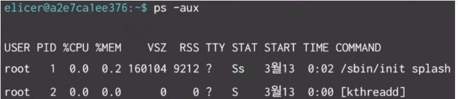

#OS #linux #ubuntu
**root(관리자 권한)**

>`sudo ----`: 대부분의 작업에 보안 혹은 권한으로 인해 막혀도 진행가능하게 해줌
>
>`sudo password root`: root 계정 비밀번호 생성(가장 처음에 해줘야하는거)
>
>`su`or`su root`: 일반 계정으로 들어왔을 때 root 계정으로 변경
>
>`exit`: root 계정 종료하고 일반계정으로 변경

****

**리눅스 기본 폴더 정보**

| 디렉토리                     |                 | 정보                          | 추가 설명                                                                                                                                                        |
| ------------------------ | --------------- | --------------------------- | ------------------------------------------------------------------------------------------------------------------------------------------------------------ |
| /                        |                 | 루트 디렉토리                     | 루트 디렉토리로 파일 시스템 계층 구조의 시작점 **빈 상태로 유지하는 것이 바람직**                                                                                                             |
| /boot                    | BOOT            | 부트 이미지 디렉토리                 | 환경 설정 파일을 제외한 **부팅 과정에서 필요한 모든 구성 요소 들이 포함됨**                                                                                                                |
| /bin                     | BINaries        | 사용자 명령어 디렉토리                | **실행 파일들이 모두 모여 있음**, 이 디렉토리에는 많은 필수적인 프로그램들이 포암되어 있음 `ls -F`를 사용하여 /bin의 대두붑ㄴ의 파일들에서 `*`가 파일명 끝에 추가되어 있는 것을 볼 수 있다. 이것은 이 파일이 실행 가능한 파일임을 표시하는 것       |
| /dev                     | DEVice          | 장치 파일 디렉토리                  | 이 폴더 안의 파일들은 **디바이스 드라이버**이다. 이것들은 디스크 드라이버, 모뎀, 메모리 등과 같은 시스템 디바이스나 자원들을 접근하는데 사용된다.                                                                        |
| /dev/console             |                 |                             | **시스템의 콘솔**이며, **모니터가 시스템에 직접 연결되어 있음**을 말합니다.                                                                                                               |
| /dev/ttys `and `/dev/cua |                 |                             | 직렬 포트를 액세싱한다. 예를 들어 /dev/ttySO는 도스 상의 "COM1"을 뜻하며 /dev/cua는 "callout"장치로써 모델을 직접 액세스할 때 사용                                                                   |
| /etc                     | ETCetera        | 시스템 환경 설정 디렉토리              | **시스템의 부팅, 셧다운 시에 필요한 파일들과 시스템의 전반에 걸친 설정 파일**들 및 **초기 스크립트파일** 들이 있습니다. 시스템에 어떠한 문제가 발생한다거나, 시스템 전체 환경에 관한 설정을 바꾸기 위해서는 이들 디렉토리 내에 포함되어 있는 파일들에 대해서 잘 알아야함. |
| /etc/re.d/rc             |                 |                             | /bin/sh shell이 시스템디 부트되면, 자동적으로 싱행되는 스크립트                                                                                                                    |
| /home                    | HOME            | 사용자 홈 디렉토리                  | 사용자의 홈 디렉토리로써 login하였을 경우, 처음으로 위치하게 되는 디렉토리, 예로 /home/kdw는 사용자"kdw"의 홈 디렉토리, 시스템이 새로 설치되면, 이 디렉토리 안에 아무 것도 포함되어 있지 않음                                       |
| /lib                     | LIBraries       | 공유 라이브러리 및 커널 모듈 디렉토리       | **부팅과 시스템 운영에 필요한 공유라이브러리와 커널 모듈이 위치한다.**                                                                                                                    |
| /lost+found              | LOST+FOUND      | 공유 라이브러리 및 커널 모듈 디렉토리       | 파일 시스템의 이상 유무을 진단하고 복구하는 프로그램인 **fsck에 의해서 사용되는 디렉토리**                                                                                                       |
| /misc                    | MISCellaneous   | 아키텍처 독립 자료 디렉토리             | 시스템 아키텍처와 무관한 프로그램들과 자료들이 위치한다. 레드햇 리눅스는 이 디렉토리 구성을 하지 않음                                                                                                    |
| /mnt                     | MouNT           | 마운트 포인트 디렉토리                | 루트 파일 시스템에 연결된 파일 시스템들의 마운트 디렉토리, 마운트하지 않은 상태에서 빈 디렉토리로 존재하지만 마운트 시키게 되면 해당 파일 시슽메의 내용이 그대로 포함된다.                                                            |
| /opt                     | OPeraTion       | 애드온(Add-on) 소프트웨어 패키지 디렉토리  | Add-on 소프트웨어 패키지가 설치                                                                                                                                         |
| /proc                    | ProCess         | 커널과 프로세스를 위한 가상 파일 시스템 디렉토리 | 가상 파일 시스템, 이 디렉토리의 내용들은 시스템에서 운영되고 있는 다양한 프로세서들에 관한 내요오가 프로그램에 대한 정보를 포함하고 있습니다. 이 디렉토리에서 볼 수 있는 것은 실제 드라이브에 저장되어 있는 내용이 아니며, 메모리 상에 저장되어 있는 것입니다.           |
| /root                    | ROOT            | 루트 사용자 홈 디렉토리               | 시스템 관리자인 root의 홈 디렉토리 입니다.                                                                                                                                   |
| /sbin                    | System BINaries | 시스템 명령어 디렉토리                | **시스템 관리를 위한 전반적인 실행 유틸리티**를 담고 있습니다. 이 디렉토리에 있는 명령어들은 일반 사용자는 실행 불가                                                                                         |
| /tmp                     | TeMPorary       | 임시 작업 디렉토리                  | 프로세스 진행 중 발생하는 임시 파일들이 젖아되는 작업 디렉토리                                                                                                                          |
| /usr                     | USeR            | 공유 파일 시스템 디렉토리              | 공유가능한 대부분의 프로그램들이 설치되며 네트워크를 이용해서 여러 개의 시스템을 연결할 경우, 이 디렉토리를 공유해서 설치된 프로그램들을 활용할 수 있게 된다.                                                                    |
| /var                     | VARable data    | 가변 자료 디렉토리                  | 내용이 수시로 변경될 수 있는 변수를 담고 있는 파일들이 위치                                                                                                                           |

****

**폴더와 폴더 정보**

>`pwd`: 지금 디렉토리의 위치를 알려줌
>
>`mkdir <디렉토리명>`: 디렉토리 생성
>
>`mkdir -p` or `mkdir -parents`

****

**유저 추가**

> 일단 내가 생성한 유저 인벤토리
>
> user: sllm
>
> passwd: <비밀번호>

유저 추가법
1. 일단 root로 로그인
   - root아니면 유저 추가안됨 `su`를 이용해서 관리자로 바꾸거나, root 계정으로 접속
2. `adduser`혹은 `useradd`로 유저 추가
   - `adduser`추가법
     - `adduser [유저아이디]`을 사용한다. 유저아이디에 적은 내용이 유저 이름이 된다.
     - 이 방법으로 하면 아주 간단하게 `/home`디렉토리에 유저가 추가된다.
     - 분명 홈페이지에서 찾아보면 아이디 생성중에 자연스럽게 비밀번호를 추가한다는데 안됨
     - 그래서 나는 `passwd [유저아이디]`로 passwd 추가함

> `cat /etc/passwd` 를 활용하여 계정목록 확인가능
>
> `cut -f1 -d: /etc/passwd` 이걸로 계정 이름만 확인 가능, 아마 cut은 cat과 비슷한데 잘라서 가져오는듯
>
> `/etc/shadow`에서 사용자 비밀번호 확인가능 
>
> `sllm:!!:19975:0:99999:7:::` 이게 내 passwd로 비밀번호 추가 안했을 때 sllm 비밀번호 검색시 뜸 !!는 비밀번호를 생성 안한 상태 라는 뜻

****

**지금 작업 돌아가는거 확인**

이게 우리가 작업을 하면 프로세스란 이름으로 돌아가는데 그 프로세스라고 하는데 모든 프로세스는 아래의 공통된 구성요소를 가진다.

**프로세스**

1. PCB
   - 이건 운영체제가 프로세스를 제어하기 위해 정보(CPU 레지스터 값들)를 저장해 놓는 곳으로 프로세스의 상태 정보를 저장하는 구조체이다.
   - 운영체제에서 프로세스는 PCB로 표현된다. PCB는 프로세스 상태 관리와 context switching을 위해서 필요하다. PCB는 프로세스의 중요한 정보들을 담고 있으므로 **일반 사용자는 접근하지 못하는 보호된 메모리 영역에 존재**한다.
2. PID
   - 프로세는 각 고유한 번호를 가지고 있으며 이를  PID라고 한다. 데비안 리눅스가 부팅될 때 모든 프로세스의 최상위 프로세스인 systemd(PID 1)이 생성되고 모든 프로세스들은 이 1번 프로세스의 자식 프로세스가 된다. 
   - 리눅스에서 PID 1 은 `init` 프로세스, 2번은 `kthreadd`(커널 스레드 데몬) 프로세스가 실행한다. 즉, init 프로세스는 나머지 모든 시스템 프로세스의 부모, kthreadd 프로세스는 모든 스레드의 부모 프로세스가 된다.
   - 혹여사 Kill을 할 때 항상 pid 관리를 잘해라 실수로 job의 1번 작업을 죽인다고 **kill -9 1 하면 그냥 회사 짤린다**
   - kill -9는 항상 조심하자. kill 1은 그래도 보호되고 있어서 입력해도 삭제가 안되는데 kill -9는 얄짤없다. 
3. PC
   - CPU는 "기계어를 한 단위씩 읽어서 처리하는데 프로세스를 실행하기 위해 다음으로 실행할 기계어가 저장된 메모리 주소를 가리키는 값"
   - pc는 CPU 내에 있는 레지스터 중 하나로, 현재 실행 중인 명령어의 주소를 가리키는 역할 을 한다.

그리고 등등 이 있다. 그리고 쓰레드라는거도 있는데 이건 다음에 공부

****

**프로세스 관련 명령어**

1) 조회와 종료
- `ps`: 실행중인 프로세스의 정보를 출력해 준다.
  **option**
  - -e: 현재 실쟁 중인 모듬 프로세스 정보 출력
  - -f: 모든 정보 확인
  - -a: 실행중인 전체 사용자의 모든 프로세스 시작 시간 등을 출력
  - -u: 프로세스를 실행한 사용자와 프로세스 시작 시간 등을 출력
  - -x: 터미널 제어 없이 프로세스 현황 보기

- 기본적으로 `ps`만 치면 아래의 정보가 출력된다.
  1. PID
  2. TTY: 현재 수행중인 터미널의 번호
  3. TIME: 프로세스가 CPU를 사용한 시간  -> 생성되고 얼마나 지났는지
  4. CMD: 프로세스의 이름
- 여기에 -ef를 붙이면 아래 3가지가 더 뜬다.
  - UID: 프로세스를 실행한 유저 아이디
  - PPID: 부모  -> PID과 1,2, 는 PPID가 0 이다. -> 부모가 없다.
  - STIME: 프로세스가 시작한 날짜
- -aux를 붙이면 아래 사진과 같다. => 새로고침 되면서 갱신이 된다.

- `kill`은 프로레스를 종료시키는 명령어다.

  **option**
  - -l: 사용가능한 시그널 목록을 출력
    - 자주 사용하는 시그널
      - 1: 재실행
      - 9: 강제종료
      - 15: 정상 종료

**백그라운드와 포그라운드**

- 포그라운드: 리눅스에서 실행시키는 거의 모든 명령어는 포그라운드, 앞에서(보고 있는 화면에서) 작동하는 것
- 백그라운드: 뒤에서 작동하는 것, 보고있지 않는 상태에서 동아가는 프로세스 -> 대표적으로 명령어에 `&`를 붙이면 된다.
- [How to Foreground a Background Process in Linux](https://www.baeldung.com/linux/foreground-background-process) 글을 추천한다.

**job**

- 백그라운드로 실행되는 작업을 보여주는 명령어. job은 프로세스와 달리 터미널 명령을 통한 작업만을 의미한다.
- job을 통해 프로세스를 실행할 수 있지만 터미널이 종료되면 job과 함께 프로세스도 종료, 터미널에 의존적이고 각각의 터미널마다 job은 따로 존재한다.
- job을 활용하여 포그라운드와 백그라운드를 효율적으로 관리할 수 있다.
- job의 킬은 `kill %작업번호`로 죽이기 가능하다.

**at**

- 지정된 시간에 1회 실행되는 작업 명령어. 시간이 되면 수행되고 작업 리스트에서 사라진다.
- `at [옵션][시간][날짜][+증가시간]`

​**option**

- -m: 출력 결과가 없더라도 작업이 완료될 때 사용자에게 메일을 보냄
- -f: 스크립트 파일 등을 실행할 때 사용
- -l: 예약된 작업 목록 출력, atq 명령어 또한 같은 동작을 수행
- -v: 작업이 수행될 시간 출력
- -d: 예약된 작업을 삭제, atrm 명령어 또한 같은 동작을 수행
- `atq`는 현재 실행 예약이된 at의 리스트를 보여준ㅏ.
- `atrm` 삭제를 원하는 at 넘버를 뒤ㅔㅇ 붙여 삭제가 가능하다. 실행 예시는 아래와 같다.

**corn**
-  corn은 리눅스의 작엽 예약 스케쥴러 이다. 
> [리눅스 - 리눅스 작업 예약 스케쥴러 cron, crond, crontab](https://velog.io/@qlgks1/리눅스-작업-예약-스케쥴러-cron-crond-crontab)
- 지정된 시간에 1회 실행되는 at와는 달리,지정된 시간에 따라'주기적'으로 실행 하는 작업이다.

**option**
  - -l : 현재 계정의 설정된 crontab 정보를 보여준다.
  - -e: 현재 계정의 cromtab 정보를 수정한다.
  - -r: 현재 계정의 crontab 정보를 모두 삭제하낟.
  - -u: 특정 사용자의 crontab 정보를 다루게 해준다.(root 권한 필요)

****

**리눅스 환경 변수 관련**

`export`: 쉘 환경에서 환경 변수를 설정하고, 그 변수를 현재 쉘과 그로부터 시작된 모든 하위 프로세스에서 사용할 수 있도록 하는 명령어이다.

`echo $[변수]` :이건 뭐 환경 변수 전용은 아니고 자주 사용하더라 print라고 생각하면 편함

****

**리눅스 파이썬 가상환경**

window랑 크게 차이가 없다. 크게 다른점은 두 가지인데

- python3이 깔려있어야 하고 깔았으면 python3으로 작동 해야한다. 그래서 `python3 -m venv [가상환경이름]`으로 생성해야한다.
- `source [가상환경이름]/bin/activate`로 실행한다. window는 `[가상환경이름]/Scripts/activate.bat`으로 실행한것과 차이가 난다.

**리눅스에 주피터 노트북 설치**

- 크게 어려운거 없더라 .ipyn파일로 만들고 커널 찾기하고 마켓플레이스에서 찾기 하니깐 sllm_env에 주피터 노트북 설치하기 그거 누르니깐 설치되고 커널찾기가 나오더라
