#OS #memory

>참고
>- [운동개발좋아](https://charles098.tistory.com/101?category=947356)
>- [CPU는 어떻게 작동할까](https://www.youtube.com/watch?v=Fg00LN30Ezg)
>- [GPU는 어떻게 작동할까](https://www.youtube.com/watch?v=ZdITviTD3VM)

## 0. 들어가며

- vLLM 리뷰를 위해 페이징을 공부하기 위해 메모리 저장과 페이징에 대해 공부한다.
- 어떻게 작동할까 시리즈 유튜브 영상이 매우 많은 도움이 되었다.
- 기본 OS 개념에 많은 도움이 되었다.

## 1. 메모리와 계층구조

- 컴퓨터의 부속 장치들은 연산장치와 기억장치로 분류 가능하다.
- 여기서 CPU와 GPU는 연산장치로 CPU는 연산능력은 좋지만 다수의 문제에 대한 연산속도는 느리고 GPU는 연산 능력은 떨어지지만 다수의 문제에 대한 연산속도가 빠르다.
- 그래서 컴퓨터의 전반적인 운영과 환경은 CPU가 전담하고 게임, 영상, 머신러닝과 같은 단순 계산영역은 GPU가 담당한다.
- 기억장치에는 DRAM, SSD, HDD등이 있다.
- 요즘은 주로 SSD와 HDD는 컴퓨터의 주 기억장치로 DRAM과 달리 전류가 흐르지 않아도 정보가 계속 저장된다.
- CPU는 프로그램을 실행시키기 위해선 SSD에 있는 데이터와 명령어를 들고와야 하는데 SSD와 CPU의 거리는 멀어도 너무 멀다. 그래서 DRAM과 Cache를 사용한다.
- DRAM은 SSD와 달리 전류가 끊기면 모든 정보가 초기화 되는데,  그럼 이 DRAM은 어디에 쓰냐? DRAM은 CPU와 SSD의 중간다리 역할을 한다.
- DRAM은 장기 기억이 아닌 단기기억에 특화된 장치로 자주 load되거나 한번 load 된걸 DRAM 혹은 Cache에 저장을 하고 오래걸리는 SSD에 요청을 적게 보내는 역할을 한다.
- Cache -> DRAM -> SSD 순으로 기억장치에 데이터가 없으면 다음 순서로 탐색을 한다.
-  그럼 Cache와 DRAM의 차이는 뭘까? 먼저 Cache는 SRAM이라고도 하고 아래와 같다.
  - **DRAM(Dynamic Random Access Memory)**
    - 1 caoacitor (전자를 저장해준다.)
    - 1 transistor
    - 휘발성이기에 저장된 내용을 읽었다가 다시 써주는 행위 반복(refresh)
    - 집적도가 커 많은 양의 데이터를 저장할 수 있다.
    - refresh를 주기적으로 해줘야 하기 때문에 속도가 느리다.
  - **SRAM**
    - 4 transistor for storage
    - 2 transistor for access
    - 비 휘발성이라 refresh 과정이 필요없다.
    - refresh 과정이 필요없어 빠르다.
    - 집적도가 작아 DRAM에 비해 적은 양의 데이터 저장 가능
- 즉 **DRAM은 느리지만 데이터 Pool이 넓고 SRAM은 빠르지만 데이터 Pool이 좁다.**
- 이러한 운영체제의 목표는 trade-off를 통한 적절한 속도와 용량이다.
- 둘의 관계는 반비례로 용량이 크면 속도가 느리고, 속도가 빠르면 용량을 키우는데 한계가 있다.

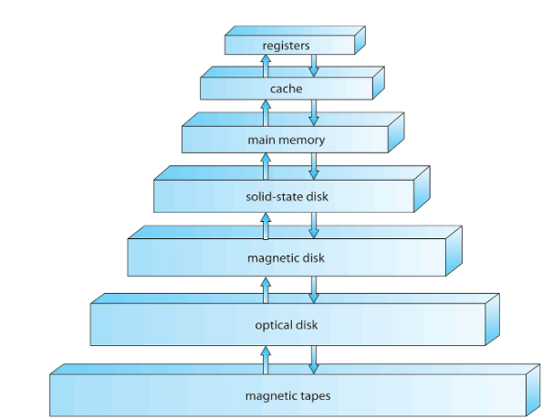

> 출처: https://charles098.tistory.com/101?category=947356

- 메모리 계층 구조는 위의 사진과 같다. 프로세서 실행에 최우선 적으로 필요로 하는 데이터를 최대한 가까운 곳에 위치시켜 속도를 향상시킨다.
- 보통 통상적인 메모리라고 한다면 cache(SRAM)과 main memory(DRAM)까지이다.
- register는 프로세스를 실행할 때 놔두는 공간으로 음식의 접시라고 생각하면된다. cache는 후추?(음식점에 가면 항상 후추 주는곳은 테이블에 있음) 와 같이 자주 등장, 필요로 하는 데이터는 CPU가까이 놔둔다.
- **메모리 관리하는 것은 저 표의 cache와 main memory까지의 데이터를 얼마나 효율적으로 관라하냐 이다.**
- 더 나아가 '가상 메모리' 파트까지 가는데 하드 디스크를 메인 메모리처럼 사용하는 방법이다. 이는 메인 메모리보다 용량이큰 프로세서를 가동 시킬 때 컴퓨터가 어떻게 실행 시키냐이다.

## 2. Thread(쓰레드)

- 쓰레드 이전에는 프로세스가 하나의 CPU의 실행 단위 였다. 하지만 쓰레드의 등장으로 CPU의 기본 실행 단위는 이제 쓰레드로 계산한다.
- 쓰레드가 한 개 즉 '단일 쓰레드' = 프로세스 라고 한다. 이 말은 즉슨 기존 프로세스에서 더욱 세분화 하여 구분하는 단위를 쓰레드라고 생각하면 된다.
- 프로세스의 단점은[fork()](https://charles098.tistory.com/75?category=947356)를 할 때 프로세스에게 code-stack까지의 모든 메모리 공간을 새롭게 할당한다는 점이다.

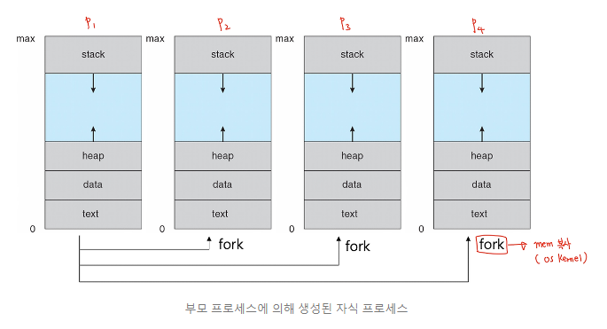

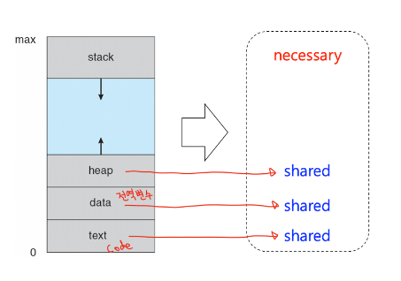

> 출처: https://charles098.tistory.com/77?category=947356

- fork에 의해 생성되면 부모 프로세스의 모든 공간을 그대로 복사하여 새로운 공간에 붙혀 넣는다. 하지만 stack 부분을 제외하곤 나머지 부분은 같아도 상관 없다. 그래서 기존의 방식과 달리 의미없이 새롭게 공간을 창출하여 같은 내용을 담아 낭비하지 말고 내용을 공유하자! 이렇게 나온게 쓰레드 인다.

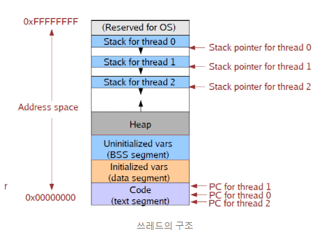

> 출처: https://charles098.tistory.com/77?category=947356

- 쓰레드라는 개념이 생기고 나서 부터는 프로세스는 그냥 쓰레드를 담는 컨테이너 즉 그릇으로 생각하면된다. CPU의 실행 단위는 이제 쓰레드가 차지하게 된 것이다.
- 위 그림은 메모리가 정해진 프로세스 기준에서 쓰레드가 어떻게 진행되고 배치되냐이다.
- 쓰레드의 장점
  - 복잡한 프로그램은 쓰레드를 통해 일을 분담 한다.
  - [IPC](https://charles098.tistory.com/76?category=947356)가 필요 없다.
  - 새로운 쓰레드를 생성할 때 프로세스는 [PC](https://charles098.tistory.com/72?category=947356)와 스택 공간만 할당해주면 된다.
  - Cache Flush 과정이 없기 때문에 [Context Switch](https://charles098.tistory.com/72?category=947356) 속도가 빠르다.

- 물론 위의 모든 장점은 1~4번 모두 같은 프로세스 안에(쓰레드가 같은 큰 행동안의 다른 행동일 때) 있는 쓰레드 일 경우헤만 해당된다.

## 3. 주소 공간

- 주소 공간은 위에서 설명한 CPU 영상에 마지막 부분에 아주 이해가 잘 되도록 설명이 되어 있다. 그래서 여기선 간단하게 정리
- CPU는 메모리의 주소값을 통해 `0100111`이런식으로 되어 있는 명령어 혹은 데이터에 접근하여 CPU에 들고와서 계산하거나 실행한다.

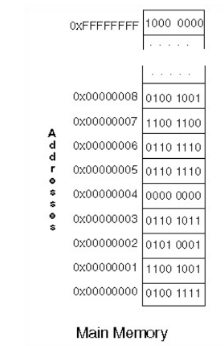

> 출처: https://charles098.tistory.com/103?category=947356

- 위 그림의 `0x001000000`과 같은 게 주소이고 그 옆이 주소박스이다. 주소 박스의 숫자 한 개당 1비트 이고 하나의 주소박스당 8개의 숫자 즉 8비트만 들어간다. 
- 한 주소박스를 1바이트라고 하고 바이트는 메모리의 주 단위로 사용된다.
- 그래서 우리가 운영체제가 32비트 64 비트 라는건 하나의 주소에 32개가 들어가거나 혹은 64개가 들어간다는거다. 즉 4칸을 먹냐 8칸을 먹냐이다.
- 주소에는 **물리적 주소와 논리적 주소** 두 개가 존재한다.
- **물리적 주소는 메모리 자체의 인덱스이다.** 위 그림의 `0x00010000`과 같은 인덱스 값을 실제로 어디에 들어있는지 의미하는 인덱스 즉 물리적 주소이다.
- **논리적 주소는 CPU 입장에서의 메모리 주소, 또는 프로그램 실행 중에 CPU가 생성하는 주소이다.** 따라서 가상 주소라고도 하며 이 가상 주소들은 멀티 프로세싱 때문이다.

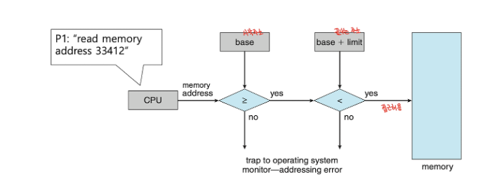

> 출처: https://charles098.tistory.com/103?category=947356

- 물리적은 하드디스크의 주소라면 논리적 주소는 CPU가 프로그램 실행을 위해 캐시나 DRAM과 같은 공간으로 명령어 혹은 데이터를 끌고왔을 때 이 두 데이터를 서로 겹치지 않게 구분하게 하기 위해서다. 만약 가상 주소가 없으면 멀티 프로세스시에 서로의 공간에 대한 정보가 없어 물리적 공간에서 서로 충돌할 가능성이 생긴다.
- 그래서 멀티 프로세스와 같은 작업을 하기 위해 서로의 주소 공간을 표현을 `시작 주소 + 크기` 로 표현하여 사용한다. 그래서 모든 프로세스는 '시작주소'와 '크기'를 정의하는 레지스터가 정의되어 있는데, 각각 'Base Register'와 ''Limit Regiter'라고 부른다
- 프로세스가 시작하면 논리적 주소를 하나 배정하는데 0번부터 순차적으로 배정한다. 이 논리적 주소는 시작 주소가 되고, 이제 끝 주소에 해당하는 물리적 주소는 논리적 주소(시작 주소) + 프로세스 크기 로 계산하여 해당하는 물리적 주소의 인덱스에 배정을 함으로써 서로의 충돌을 피한다.

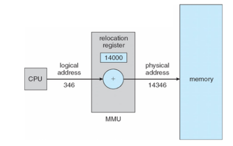

> 출처: https://charles098.tistory.com/103?category=947356

- 프로세스가 물리적 주소에 접급하려면 결국 +연산을 해야하는데 이를 논리적 주소를 물리적 주소로 Mapping하는 과정이라고 하며 MMU(Memory Management Unit)이 이 역할을 한다.
- 그래서 **주소 매칭은 주소 할당과 같고 논리적 주소를 물리적 주소로 매칭시킨다는 것은 논리적 주소애게 새로운 주소를 할당 한다는 뜻이다.**
- 한 프로세스의 모든 논리적 주소에 동일한 base register를 더하는 주소 할당을 '연속 할당' 이라고 한다.

**주소 바인딩**

- 주소 바인딩이란 `논리적 주소를 물리적 주소로 언제 Mapping 시킬것인가?`에 대한 고찰이다.
```c
  data = 10;
  
  store $98000 10 //$98000은 data의 논리적 주소
  ```

1.  **Compile Time Binding**

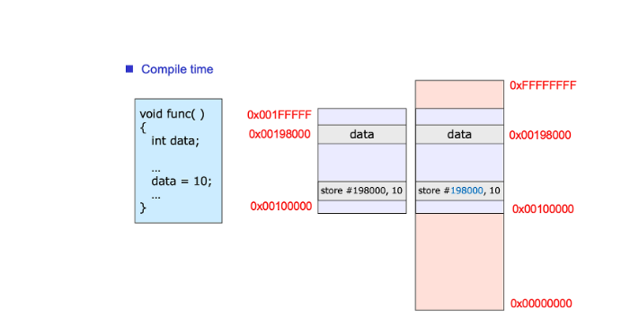

> 출처 : https://charles098.tistory.com/103?category=947356

- 이 바인딩은 프로그램이 컴파일 될 때 주소가 매핑되는 경우이다. 즉 명령어가 실행되고 메모리에 올라가기도 전에 이미 물리적 주소를 결정하는 방식이다.
- 결국 이 방식은 실제로 집이 비어 있는데 나 여기서 살거라고 내 집이라고 하는 것과 같다.
- 이렇게 바인딩을 하여 주소를 매핑하면 결국 멀티 프로세스는 포기하는 것과 매한가지다.
- 실제론 안 들어 갔는데 여기 들어가요~ 라고 말하고 보니깐 다른 사람이 살고 있으면 내가 못 들어 가서 살듯이, **논리적 주소를 사용하는 이유가 서로의 공간을 정확히 할당해서 충돌을 피하기 위함인데, 두 가지 프로세스를 돌리면 일단 물리적 주소에는 아무것도 안 올라가 있으니 같은 공간에 충돌이 날 경우가 매우 높아진다.**
- 메모리에 오직 한 개의 프로그램만 올라가 있는 상황이 아니면 절대 사용하면 안된다.

2. **Load Time Binding**

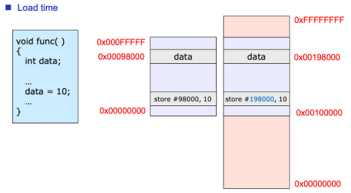

> 출처: https://charles098.tistory.com/103?category=947356

- 메모리에 로딩할 때 바꾸는 방법이다. 우선 논리적 주소와 물리적 주소를 분리시켜 멀티프로그래밍이 가능하다.
- 하지만 프로그램 안에 있는 모든 주소를 전부 relocation을 시켜야 하기에 로딩할 때 시간이 오래 걸린다.
- 만약 컴파일러가 주소를 특정할 수 없는 경우 전부 다싱 Relocation을 해야 하고 공간을 쓸대 없이 더 잡아먹기에 오버헤드가 심하다.

3. **Excution Time Binding**

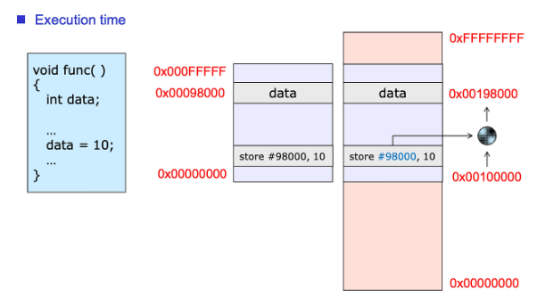

- 마지막 방법은 실행할 때 바꾸는 방법이다.
- 프로세스가 실행되고 계산을 거치고 code level에서 작동을 시작할 때 rocation해주는 방식이다.
- load time 방식이랑 다른점은 load time은 메모리에 로딩할 때 주소 변환을 미리 하는 방법이고 excution time은 로드를 마지고 실행한다.

**가상 메모리란**

- 가상 메모리란 간단하게 메인 저장장치인 SSD를 메모리처럼 사용하는 방법을 말한다.
- 프로그램을 실행시키기 위해서는 데이터가 메모리에 적재되고 그걸 빠르게 들고와야 하는데 이는 램에서 이루어진다. 즉 램의 용량보다 훨씬 더 큰 프로그램은 원래 작동시키기 어렵다.
- 하지만 우리는 가상 메모리란 기술을 이용해서 막 80GB가 넘는 게임도 16GB 램에서도 돌리고 이런다.
- 그 방법은 CPU Reguster 의 크기에 있다.  CPU는 SSD에 접근을 못하지만 가상 주소를 배정하는 운영체제를 이용하여 **할당 주소의 범위가 램의 물리적 주소 범위를 넘어가면 SSD로 넘겨서 정보를 관리하자**

**32 bit CPU vs 64 bit CPU**

- 영상에 나온 내용과 비슷하지만 정리한다.
- 32 64 는 CPU 마다의 주소 체계를 뜻한다.
- 주소의 한 줄은 1byte라고 하고 한 줄(한 칸)에는 8개의 글자가 들어가고 한 글자 당 1bit라고 하니 1byte = 8bit이다. 이건 그냥 어딜 가든 국룰이다.
- 32와 64 bit는 프로세서가 한 번에 처리할 수 있는 데이터의 양이고 이러한 데이터의 양을 Word라고 한다. **64bit CPU의 경우 1word의 크기는 8byte(64bit, 한 칸 즉 1byte = 8bit이고 그게 8개니 64bit이다.)고, 메인 메모리에서 한 번에 8줄을 읽을 수 있다** 는 뜻이다. Word의 크기는 데이터 단위라고 생각하면된다. 또한 word의 크기는 CPU의 Register의 크기와 같다.
- 그러면 CPU Register 크기에 따라 할당할 수 있는 주소의 범위는 어떻게 될까? 결론부터 말하면 **32bit CPU에서 는 2^32 만큼의 논리적 주소를 할당할 수 있고 64 bit CPU 에서는 2^64 만큼의 논리적 주소로 할당 가능하다.**
- 이게 뭔 소리냐면 32bit CPU라는 말은 주소 공간의 주소의 길이가 32비트 라는 것이고 이것은 각 메모리 주소가 32비트로 표현이 된다는 의미이다.
-  32비트로 표현할 수 있는 모든 조합의 수는 2^32 개 이고, 따라서 주소 공간이 2^32 라는 것은 총 2^32 개의 고유한 메모리 주소를 가질 수 있다.
- 32비트의 전체 메모리 용량을 계산하면 주소 공간이 2^32아고, 각 주소가 1바이트를 가리키므로

$$
총 메모리 용량 = 
2
^{32}
×
1
바이트
=
4
,
294
,
967
,
296
바이트
=
4
GB
$$

- 즉, 최대 4GB의 메모리를 주소 지정할 수 있다.
- 주소 공간이 2^32인 이유는, 비트 수와 주소의 개수 관계 때문이다. n비트로 표현할 수 있는 주소의 총 개수는 2^n이다. 이는 이진수 시스템에서 각 비트가 0 또는 1의 두 가지 값을 가질 수 있기 때문이다.
- 요약하면 주소의 길이가 32비트 라는 것은 각 메모리 주소를 나타내는 데 32비트의 이진수가 사용된다고 이를 저장할 수 있는 칸(메모리 주소)이 2^32개 있다는 뜻 이다.

## 4. 메모리 관리와 페이징

- 와 드디어 페이징이다. 메모리 관련이 참 많은 거 같다. 다음에 시간을 내서 깊게 공부해 봐야 겠다.
- 페이징은 논리적 주소를 물리적 주소로 mapping 할때 연속적으로 mapping 하면 어떤 문제가 발생하는지, 이에 대한 해결책은 무엇인지가 핵심인 내용이다.

**외부 단편화**

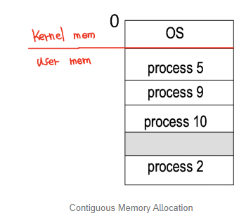

> 출처: https://charles098.tistory.com/106

- 연속할당의 문제점은 외부 단편화에 있다.
- 연속할당이란 프로세스의 모든 논리적 주소에 동일한 base register를 더해주는 것이다.
- 이는 MMU에 의해 덧셈으로 이루어 지며 Excution time에 바인딩 된다는 특징이 있다.
- 모든 프로세스는 논리적 주소가 0번지 부터 시작해서 차례대로 증가하기에 물리적 주소도 시작 주소만 다르지 연속적으로 배치되어 있다.
- 위의 사진과 같이 가상 주소 + 프로세스 크기가 물리적 주소로 매핑되기 때문에 process2처럼 떨어져서 배치되는 문제가 있는데 이게 가장 문제다. 
- 외부 단편화는 결국 논리적 주소를 사용해서 생기는 물리적 주소의 고르지 못한 저장이다.
- 이때 새로운 용어가 등장하는데 partition과 hole이다.

>Partition: 프로세스의 메모리 공간
>
>Hole: 메모리에서 할당 받지 못한 공간. 사용공간

- 운영체제는 Hole을 제외한 파티션 개수 만큼 동시 실행 가능하다.
- 만약에 새로운 프로그램을 실행하려고하는데, 요구하는 **프로세스의 용량이 Hole의 크기보다 크면 메모리에 올라갈 수 없으므로 실행되지 못한다.**
- 그 내용의 대표적인 예가 아래와 같다.

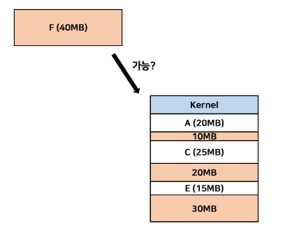

> 출처: https://charles098.tistory.com/106

- 위 사진의 주확생은 위에서 말한 hole이고 새로운 프로세스 F가 실행되기 위해선 40MB의 메모리 용량이 있어야 하는데 공간이 의미 없이 떨어져 있어 실행되지 못하는 상태이다.
- 하지만 그림을 보면 알겠지만 온전히 수치적으로 본다면 실행될 공간은 충분하다. 하지만 딱딱 붙어서 배치가 안되어 공간을 충분히 활용할 수 없다.
- 이러한 문제를 **외부 단현화 문제**라고 한다. 외부 단편화는` 메모리에 공간이 충분히 있음에도 불구하고 연속된 Hole의 크기가 프로세스의 크기보다 작다는 이유로 할당 되지 못하는 문제` 이다.
- 연속 할당을 할 경우 외부 단편화로 인해 메모리 공간의 1/3을 낭비한다고 하는 데 이를 '50percent rule'이라고 한다.

**외부 단편화 해결 방법1 - Compaction**

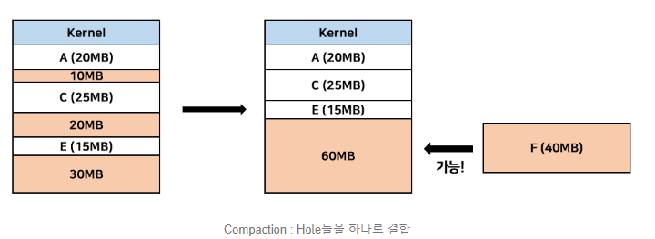

- 첫 번째 방법으로 파티션들을 재배치해서 모든 hole을 한 곳으로 결합하는 방법이다.
- 이러한 방식은 가장 간단하지만 제일 문제가 하나있는데, 기존의 메모리를 임시 공간에 복사하고 다시 들고와햐 한다는 거다.
- 메모리에 복사가 불가능하기에 하드디스크에 복사했다가 다시 들고 와야 하는데 이는 오버헤드가 굉장히 심하다. 그래서 잘 사용하지 않는 방법이다.

**외부 단편화 해결 방법2 - 불연속 할당**

- 외부 단편화의 발생 원인은 '연속 할당'에 있다. 그러면 주소를 불연속적으로 할당하면? 당연히 외부 단편화는 발생하지 않는다.
- 이렇게 주소를 불연속적으로 할당하는 메로리 관리 구조를 **Paging**이라고 한다.

### 페이징

- 외부 단편화의 해결 방법으로, 주소를 불연속적으로 할당하는 메모리 관리 구조를 말했는데 이에 대한 해답이 페이징이다.

>Page(페이지): 가상 메모리를 일정한 크기로 나눈 블록
>
>Frame(프레임): 물리 메모리를 일정한 크기로 나눈 블록
>
>페이지의 크기 = 프레임 크기

- 여기서 핵심은 일정한 크기이다.
- 페이지와 프레임의 크기는 같게 만들면서 페이지에 대응되는 프레임을 찾기 쉽게 만든다.
- 페이지의 크기는 CPU에 의해서 결정되고 모든 프로세스는 페이지의 크기 만큼 조각화 된다.
- 프로세스의 각 페이지는 물리적 메모리의 조각인 프레임에 불연속 적으로 할당 되는데, 이때 페이지와 프레임의 대응 관계도는 **페이지 테이블 이란 곳에 저장 되어 있다. 즉 주소의 메타데이터를 저장하는 위치가 페이지 테이블이란 말이다.**

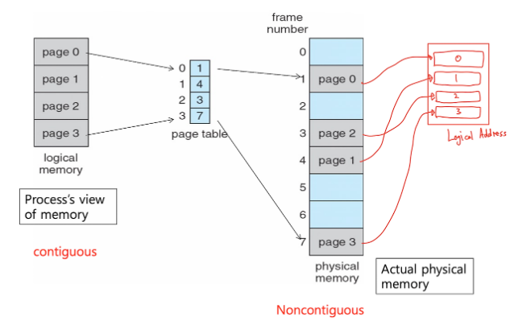

> 출처: https://charles098.tistory.com/106?category=947356

- 페이징의 핵심은 페이지 테이블에 있다. 페이지 테이블은 모든 프로세스마다 개별적으로 가지고 있는 정보다.
- 페이징의 가장 큰 장점중 하나는 **외부 단편화 문제를 해결**할 수 있다.
- 페이지와 프레임의 크기가 같기에 빈 공간 즉 Hole의 걱정은 줄어든다. 하지만 **빈 공간이 아예 안나지는 않는다. 말 그대로 줄어든다는 거다.**
- 외부 단편화를 해결하면 **내부 단편화**라는 문제가 생기는데, 대표적인 예로 페이징의 크기가 4로 고정 되었는데 프로세스의 크기가 5면 2개의 페이지를 들고 와서 할당해야 하는 데 이 페이지의 크기는 8이고 프로세스의 크기는 5이기에 3의 Hole이 생긴다.
- **외부 단편화와 내부 단편화의 Trade-off가 중요하다. 두 문제를 한꺼번에 해결하고 싶어하는 방법은 있지만 그 마저도 완벽하지는 않다.** 해결 방식은 나중에 설명하겠다.

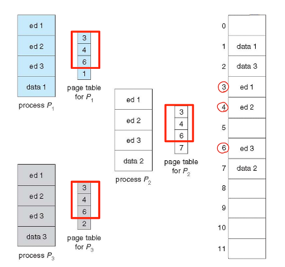

> 출처: https://charles098.tistory.com/106?category=947356 

- 위 그림은 프로세스별 공유하는 페이지의 물리적 주소를 페이지 테이블에 저장하는 이유에 대해서 보여준다.
- P1, P2, P3은 페이지 ed1, ed2, ed3,을 공유하고 있다. 각 프로세스의 페이지 테이블에 ed 시리즈를 물리적 주소를 저장해두면 메모리 공유가 훨씬 수월하다.
- 프로세스 페이지에는 힙, 스택과 같은 Private 데이터를 저장해두면 메무리 낭비를 줄일 수 있다.

### **Page -> Frame의 과정**

1. **오프셋(Offset)**

- **오프셋이란 위치를 찾기 위해 더해주는 값** 이다.
- 예를 들어 설명하면 주소 공간이 크기가 32이다.(0~31) 페이지 크기가 4로 설정이 되면 아래와 같이 8개의 페이지가 만들어 진다.

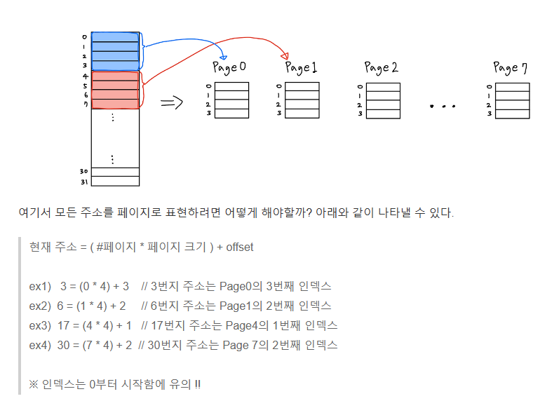

> 출처: https://charles098.tistory.com/106?category=947356

- 위와 같이 모든 주소는 페이지 번호에 페이지 크기를 곱해주고, 페이지 크기보다 작은 값을 더해주면 된다. 여기서 더해주는 값을 오프셋 이라고 한다.
- 아래의 사진은 이 개념을 수학적으로 접근한 예시이다.


> 출처: https://charles098.tistory.com/106?category=947356

2. **페이지 테이블**

- **페이지 테이블에 저장되어 있는 값은 정확하게 각 페이지의 "물리적 주소에서의 시작 주소 값(Base address)** "이다. 
- 모든 논리적 주소는 페이지 테이블에서 자신의 base address를 찾고 이 값에 offset을 더해주면 이 값이 물리적 주소가 된다.
- index - value 구조를 가지기에 페이지 테이블의 인덱스는 페이지의 개수만큼 필요하기에 페이지와 페이지 테이블의 값은 일대일 대응 관계가 된다.

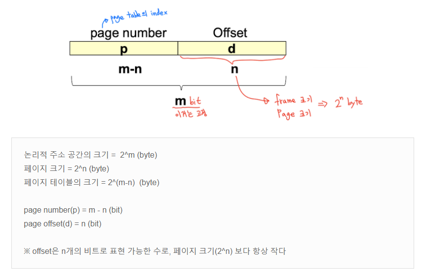

> 출처: https://charles098.tistory.com/106?category=947356

- 예를 들어 16bit CPU의 경우 논리적 주소는 16비트로 표현된다.(0001000100010001) 만역에 페이지 크기를 4비트로 정하면 페이지 개수는 12비트로 자연스럽게 구해진다.(ssss iiii iiii iiii, s가 페이지 크기, i가 페이지 정보 혹은 개수)
- 위와 같이 되는 이유는 **페이지의 개수는 페이지 테이블이 가지는 값의 개수와 일치해야 하므로 page number를 page table index로 봐도 무방하다.** 
- 따라서 페이지와 페이지 테이블의 매핑 관계를 그림으로 정리하면 아래와 같다.

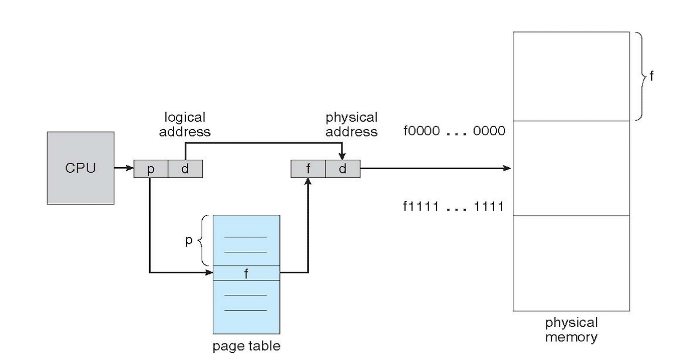

- **base address에 페이지의 offset 값을 더할 수 있는 이유는 페이지의 크기와 프레임의 크기가 동일하기 때문이다.**

- 한편 페이지 테이블의 참조는 굉장히 비번하게 일어나므로 하드웨어의 도움을 받아야 한다.
- 주소 바인딩을 할 때 MMU의 도움을 받는 데, 이 경우도 똑같이 MMU의 도움을 받는다.

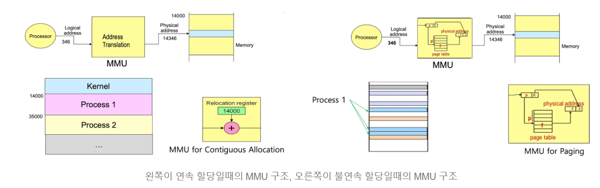

> 출처: https://charles098.tistory.com/106?category=947356

## 5. 페이징 계산 예시

- 여기는 논리적 주소와 페이지 오프셋이 주어졌을 때, 이 주소가 몇 번째 페이지의 몇 번째 오프셋인지 구해보는 예제를 살펴보는 파트이다.
- 이 부분을 이해하면 일단 페이징의 계산과 전반적인 이해는 완료 된거 같다.
- 그리고 이 부분을 보니까 위에 대부분의 내용이 이해가 된다.

**논리적 주소로 Page, offset 구해보기**

> 16 bit CPu
>
> Logical Address: 46027 = 1011001111001011(2)
>
> 
>
> 1) page offset = 4bit
> 2) page offset = 8bit
> 3) page offset = 12 bit
>
> > 참고로 저기 물리적 내용의 뒤에 (2)는 0,1로 이루어진 이진수라는 말이다.

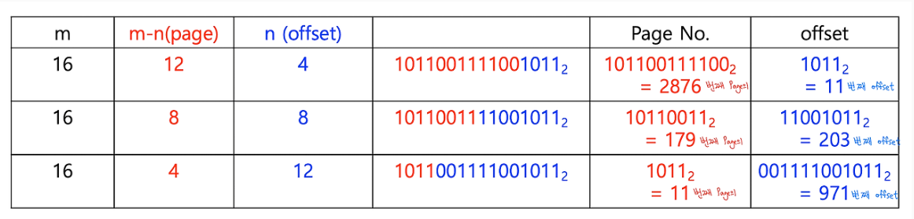

- 16bit니깐 한 프로세스의 명령의 숫자의 길이는 16줄이다.
- 페이지의 개수는 offset의 길이 만큼 뺀 나머지 공간을 페이지의 위치를 나타내는 공간으로 사용한다. page를 12, 8, 4 조각으로 나눴다는 뜻이 아니다.
- m-n(page)는 페이지를 나타내는 물리적 언어(?)가 2 진수로 이루어진 값 인데 그 길이가 12줄 이란 이야기이다.
- 빨간색은 페이지를 나타내는 이진수 이걸 십진수로 바꾸면 Page No 처럼 몇 번째 테이블인지 알려준다.
- Offset의 범위에 있는 이진수 숫자를 10진수로 변경하면 해당 페이지의 몇 번째에 위치해 있는지 알려준다.
- 위 사진을 보면 알겠지만 페이지 개수와 페이지의 크기는 Trade-off 관계다. 
- 페이지 개수가 너무 많으면 페이지 테이블의 크기 또한 커지므로 배보다 배꼽이 커지는 상황이 발생한다. 반대로 오프셋의 크기가 너무 크면 내부 단편화가 발생할 수 있다.
- **참고로 이 계산이 중요한 이유는 이 계산이 Page Table에서 물리적 주소를 찾는 작업이기 때문이다.**

**페이징 예제**

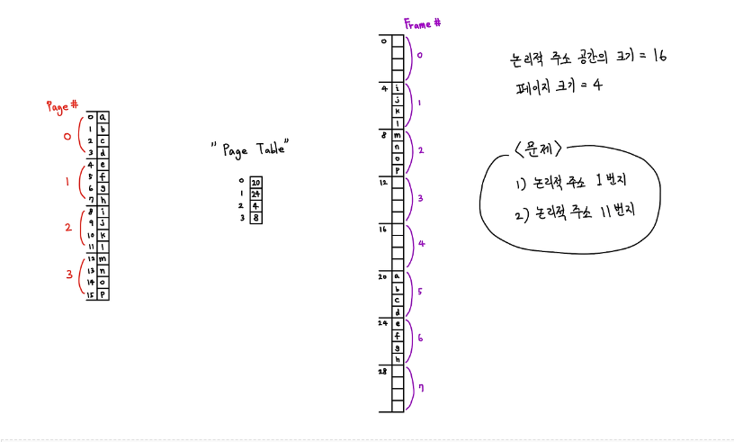

> 출처: https://charles098.tistory.com/106?category=947356

- 위와 같이 데이터가 실제로 저장되어 있는 예제이다.
- 페이지의 데이터와 프레임 데이터는 당연히 일치해야 한다. 논리적 주소가 주어졌을 때, 어떤 과정으로 물리적 주소로 매핑되는지 직접 봐야 안다.
- 왼쪽은 논리적 주소 공간, 오른쪽은 물리적 주소 공간이다.

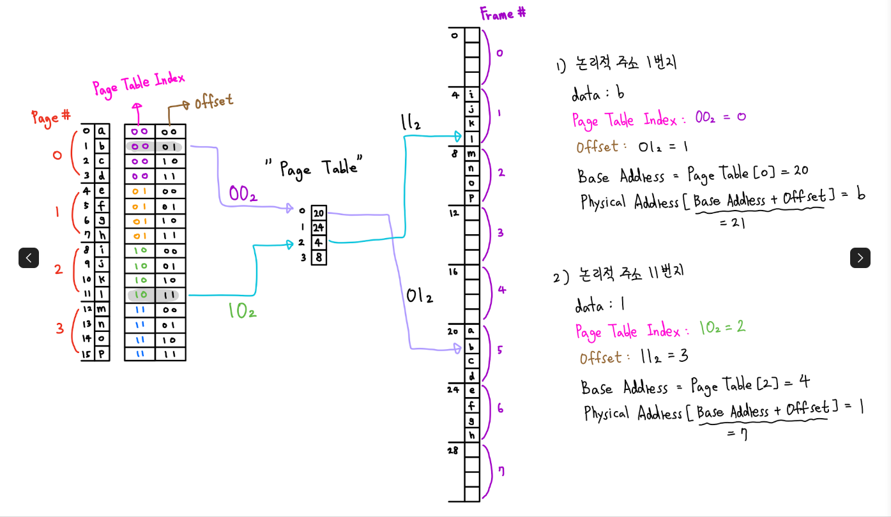

> 출처: https://charles098.tistory.com/106?category=947356

- 위 그림과 같이 계산하면 된다.  그림이 복잡게 되어 있는데 크게 어렵지 않다.
- 논리적 주소 1번은 page0번에 속해 있고, 그 페이지 안의 두 번째에 위치해 있다.
- 그렇기에 페이지 테이블에서 봐야하는 곳은  첫번 째 즉 인덱스 0번에, 페이지 안의 번호 즉 오프셋은  `(0 * 4) + x = 1`이 되어야 하므로 인덱스 1 즉 두 번째에 위치해 있어 20 +1 이기에 21이다.

- 논리적 주소 11번도 위와 같이 계산하면 된다.

## 6. 추가

**빈 프레임은 누가 할당하는가**

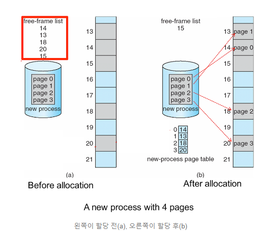

- 주소를 할당하기 전에 물리적 주소의 빈 곳을 찾는 게 선행되어야 한다.
- 이는 운영체제가 알아서 해주는데, free-frame list에 가용 프레임을 저장해놓고 새로운 프로세스가 생성되면 가용 프레임 주소를 페이지 테이블에 할당한다.

**페이지 테이블의 물리적 주소는 누가?**

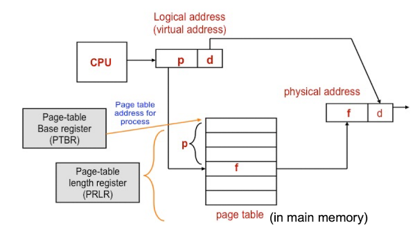

- 페이지 테이블도 메모리에 저장되어 있는 값이기 때문에 "페이지 테이블에 접근하기 위한 Base Register" 가 필요하다.
- 이를 Page-table base register(PTBR)이라고 한다.
- 또한 자신의 메모리 공간의 보호를 위해 Libit Register도 필요한데, 이를 Page-table length Register(PTLR)이라고 한다.

