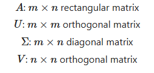
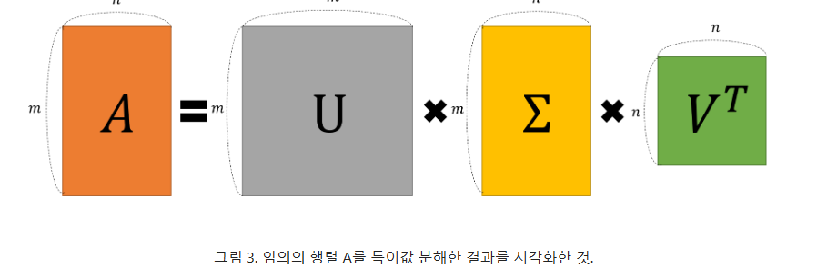
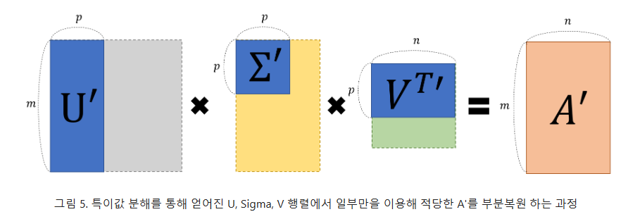

#선형대수 

> 참조 페이지: [공돌이 수락정리노트](https://angeloyeo.github.io/2019/08/01/SVD.html)
>
> - 특이값 분해는 보통 복소수 공간에 대하여 정의하는 것이 일반적이지만, 본 페이지와 리뷰는 실수 벡터 공간에 한정하여 작성
> - 본 article에서 열벡터 convention을 따른다.

- 이때까지 벡터의 선형변환에 대해 알아 보았다.
- 선형변환이란 벡터에 행렬을 곱하는 행위이고, 벡터가 변환이 이루어졌을 때 어떠한 결과를 보이게 하고싶은가이다.
- 여기시 특이값 분해(SVD)란 무었인가? **"직교하는 벡터 집합에 대하여, 선형 변환 후에 그 크기는 변하지만 여전히 직교할 수 있게 되는 그 직교 집합은 무었인가? 그리고 선형 변환 후의 결과는 무엇인가?**" 이다.
- 여기서 찾을 건 꽤 많다. 딱 정의 글만 봤을 때, 먼저 크기는 변하지 않아야 하니 **고유 벡터**를 찾아야하고, 그 길이에 대한 변화도 알아야 하니 **고유 값**도 찾아야한다. 거기에 기본적으로 행렬 분해 방법중 하나이고 [고윳값 분해](obsidian://open?vault=PARA&file=Area_of_responsibility%2F%EC%88%98%ED%95%99%26%ED%86%B5%EA%B3%84%2F%EC%84%A0%ED%98%95%EB%8C%80%EC%88%98_%EA%B3%A0%EC%9C%B3%EA%B0%92%20%EB%B6%84%ED%95%B4(eigen-value%20Decomposition)%2F%EA%B3%A0%EC%9C%B3%EA%B0%92%20%EB%B6%84%ED%95%B4(eigen-value%20Decomposition))도 사용한다. 또한 직교하는 두 벡터를 찾아야한다. 
- 특이값 분해는 임의의 m*n 차원의 행렬 A에 대하여 다음과 같이 행렬을 분해할 수 있다는 행렬 분해(Decomposition) 방법중 하나이다.

$$
A = U \Sigma V^T
$$

- 위 식들은 **SVD 분해의 정의**이다. `A라는 m*n 행렬을 U, sigma, V의 Transforge(V^T)로 나눌(분해) 수 있다.`
- 여기서 U는 직교행렬(orthogonal matrix)로 아래의 식을 만족한다.

$$
UU^T=U^TU=I,∴ U^{-1}=U^T
$$

-  Q^⊤는 Q의 전치 행렬이고, I는 단위 행렬(Identity matrix)입니다.
- 보통 직교 행렬은 공간적으로 볼땐 회전 혹은 반사를 뜻하며 신호 처리와 통계학에선 정규화, PCA에서 사용된다.
- sigma는 대각행렬(diagonal matrix)로 아래와 같은 모양을 따른다.

$$
\begin{pmatrix}
 \sigma_1 & 0 \\
 0 & \sigma_2
 \end{pmatrix}
$$

$$
\begin{pmatrix}
 \sigma_1 & 0 \\
 0 & \sigma_2 \\
 0 &0
 \end{pmatrix}
$$

$$
\begin{pmatrix}
 \sigma_1 & 0 &0\\
 0 & \sigma_2 & 0
 \end{pmatrix}
$$

$$
\begin{pmatrix}
 \sigma_1 & 0 & 0\\
 0 & \sigma_2 & 0 \\
 0 &0 & \sigma_3
 \end{pmatrix}
$$

- 보통 대각 행렬은 정사각형 모양을 띄고, 주대각선(좌상단에서 우하단으로 향하는 대각선)에만 값이 존재하고 나머지는 0만 존재한다. 위 그림은 이해를 돕기 위한 방식이다.
- 특징으론 대칭성을 가지고 있어 Transpose(전치, 우상단과 좌하단 방향으로 돌리는거)를 시켜도 같은 값을 유지한다.
- SVD는 위에서 설명했듯 **" 직교하는 두 벡터에 대한 집합에 대하여 선형 변환 후에 그 크기는 변하지만 여전히 직교할 수 있게 만드는 그 직교 벡터 집합과 변형 후의 결과이다."** 
- 아래 그림은 행렬 A에 대하여 어떠한 임의의 벡터 `x`를 선형변환 시켰을 때 `Ax`의 결과를 보여준다.

$$
A=\begin{pmatrix}
 0.25 & 0.75 \\
 1 & 0.5
 \end{pmatrix}
$$

- 위 그림이 나타내는 의미는 간단하다. x는 임의의 벡터이고 저렇게 빙글 도는 이유는 저 x라는 벡터가 가질 수 있는 벡터가 쫙 존재하는데 그걸 표현할려고 돌리다 보니까, 범위가 저정도라는 뜻이다.

- 이 때 x가 A라는 선형 변환을 거치면 생겨나는 벡터 Ax에 대해서 그림으로 표현한 것이다.
- 저러한 움직임을 보이는 벡터의 선형변환 그림에서 우리가 찾아야하는 직교하는 두 벡터의 선형변환했을 때의 직교 벡터이다.
- 아래의 그림은 두 벡터를 선형 변환 했을 때 선형변환된 두 벡터의 직교 타이밍에대해서 보여준다.

- 위 그림을 봤을 때 x와 y라는 두 벡터가 존재하는 데 두 벡터는 초기에 직교한다.
- 이 때 두 벡터가 각각 A라는 행렬로 인해 선형변환하여  `Ax`로 변하고 `Ay`로 변할 때 x와 y가 어떠한 값일 때 선형 변환한 벡터마저 직교하는지 보여준다.
- 움직이는 그림에서 중간중간 멈출때 보면 파란선이 서로 직교하고 있다는 걸 알 수 있다.
- 즉 이 때 **크기는 다르더라도 여전히 직교하는 벡터들을 찾을 수 있냐?**라고 할 때 SVD를 사용한다.
- 그럼 아래의 SVD의 정의식에서 각각이 말하는 바는 무었일까?

$$
A = U \Sigma V^T
$$

- `V`는 벡터 집합을 나타낸다. 위 설명과 그림에서 두 벡터 집합이라고 했고 그림을 기준으로 두 벡터 집합은 벡터 x,벡터 y이기에 이 두 벡터를 행렬로 만든게 `V`이다.

$$
V= \begin{pmatrix} |  & | \\\\ \vec x & \vec y \\\\ |  & | \end{pmatrix}
$$

- `U`는 V라는 벡터를 A행렬변환 했을 때, `Ax`, `Ay`가 되는데 이 때 직교하는 두 벡터를 각각의 크기를 1로 정규화한 두 벡터 u를 모은 행렬을 의미한다. 

$$
U= \begin{pmatrix} |  & | \\\\ \vec u_1 & \vec u_2 \\\\ |  & | \end{pmatrix}
$$

- sigma는 여기서 크기를 의미한다. singular value(즉, Scaling factor)로서 행렬의 길이를 조절해주는 역할이다. 
- sigma는 scaling의 의미 답게 차원을 줄여주는 방식으로도 쓰이는데, 차원을 줄이고 싶으면 줄이고 싶은 수만큼 열을 설정함 된다.

$$
\Sigma= \begin{pmatrix} \sigma_1 & 0 \\\\ 0 & \sigma_2 \end{pmatrix}
$$

- 즉 V에 있는 열벡터(V)를 행렬 A를 통해 선형변환 할 때, 그 크기는 σ1σ1, σ2 만큼 변하지만, 여전히 직교하는 벡터들 u1,u2를 찾을 수 있겠느냐 라고 묻는 것이다.
- `V`는 직교행렬(orthogonal matrix)이니깐 결국  `V^−1=V^T` 이다.
- 그래서 최종 수식은 아래와 같아진다.

$$
AV=U\Sigma \\ AVV^T=U\Sigma V^T \\ A=U\Sigma V^T
$$

- 위 식을 하나하나 풀어서 쓰면 아래와 같다.
- 아래의 식은 U와 V 즉 고윳벡터를 찾는 방법이다.

$$
A=U\Sigma V^T \\
A^T=(U\Sigma V^T)^T = V\Sigma^TU^T \\
① \Rightarrow AA^T = U\Sigma V^T V \Sigma^T U^T =U\Sigma \Sigma^T U^T = U\Sigma^2 U^T \\
②\Rightarrow A^TA =  V\Sigma^2 V^T
$$

- 위 방식을 사용하면 U와 V를 구할 수 있다.
- 여기서 어디서 많이 보이는 계산식이 보이지 않는가? 맞다 바로 `U 시그마 U^T`부분은 eigen decomposition 방식을 사용하면 바로 풀린다.

>**직접 계산하기 예시**
>$$
>A=\begin{pmatrix}
> 0.25 & 0.75 \\
> 1 & 0.5
> \end{pmatrix}
>$$
>
>- 위와 같이 두 벡터 A라는 행렬이 존재한다.
>- 그럼 U를 구하기위해 `AA^T`를 찾아야 한다. 
>
>$$
>AA^T=\begin{pmatrix}
> 0.25 & 0.75 \\
> 1 & 0.5
> \end{pmatrix}
>\begin{pmatrix}
> 0.25 & 1 \\
> 0.75 & 0.5
> \end{pmatrix}
> = \begin{pmatrix}
> (0.25×0.25+0.75×0.75) & (0.25×1+0.75×0.5) \\
> (1×0.25+0.5×0.75) & (1×1+0.5×0.5)
> \end{pmatrix}
> = \begin{pmatrix}
> 0.625 & 0.625 \\
> 0.875 & 1.25
> \end{pmatrix}
>$$
>
>- V와 특이값을 구하기 위해`A^TA`를 구한다.
>
>$$
>A^TA=\begin{pmatrix}
> 0.25 & 1 \\
> 0.75 & 0.5
> \end{pmatrix}
>\begin{pmatrix}
> 0.25 & 0.75 \\
> 1 & 0.5
> \end{pmatrix}
> = \begin{pmatrix}
> (0.25×0.25+1×1) & (0.25×1+0.75×0.5) \\
> (0.75×0.25+0.5×1) & (0.75×0.75+0.5×0.5)
> \end{pmatrix}
> = \begin{pmatrix}
> 1.0625 & 0.625 \\
> 0.625 & 0.8125
> \end{pmatrix}
>$$
>
>- **`V(A^⊤A)`고유값과 고유벡터를 구한다.**
>
>$$
>det(A^⊤A−λI)=0 \\\\
>det\begin{pmatrix}
> 1.0625-λ & 0.625 \\
> 0.625 & 0.8125-λ
> \end{pmatrix}=0 \\\\
>(1.0625−λ)(0.8125−λ)−(0.625)^2 = λ^2−1.875λ+0.47265625 =0 \\\\
>λ= \frac{1.875± \sqrt{(1.875)^2−4×1×0.47265625}}{2}\\\\
>
>𝐷=(1.875)^2−4×1×0.47265625=3.515625−1.890625=1.625\\
>\sqrt{1.625}≈ 1.2748 
>∴ \\
>λ1= \frac{1.875+1.2748}{2}=\frac{3.1498}{2}≈1.5749 \\
>λ2= \frac{1.875-1.2748}{2}=\frac{0.6002}{2}≈0.3001
>$$
>
>- **고유값을 바탕으로 특이 값을 구한다.**
>
>$$
>σi = \sqrt{λi}\\
>따라서\\
>σ1 = \sqrt{1.5749} ≈ 1.2559
>σ2 = \sqrt{0.3001} ≈ 0.5478 
>$$
>
>- 

> 차원이 변하는 경우의 특이값 분해
>
> 가능하다. 전제가 기존 직교 벡터 모음에 선형변환을 해도 이 직교 벡터들은 어떠한 것이 있는가? 라고 물어보는거이기에
>
> 
>
> 
>
> 위 그림과 같이 3차원일 때 세 개의 벡터가 존재한다 치고 이걸 2차원으로 선형 변환하면 위와 같은 그림들이 나온다.
>
> 평면으로 선형변환하는거 처럼 보이는데, 이때 세 백터중 하나의 벡터는 사라져서 0이 되는 걸 알 수 있다.
>
> 여기서 초록색 화살표로 표시한 벡터들은 선형변환 전의 직교하는 벡터들이고
>
> 파란색 화살표로 표시한 벡터들은 선형 변환 후에 직교하는 벡터들이다.
>
> 이처럼 선형 변환 전 벡터들 중 하나의 scaling factor(즉, singular value)를 0으로 만듦으로써
>
> 차원이 변하는 선형변환의 경우에도 특이값 분해가 가능하다.
>
> 이러한 sigma를 식으로 표현하면 아래와 같다.
> $$
> \Sigma= \begin{pmatrix} \sigma_1 & 0 & 0 \\ 0 & \sigma_2 & 0 \\0 & 0 & 0\end{pmatrix}
> $$

- 그럼 이러한 **특이값 분해의 목적은 무었일까?**

$$
A = U\Sigma V^T
$$

$$
= \begin{pmatrix} |  & | & {} & | \\\\
 \vec u_1 & \vec u_2 &\cdots &\vec u_m \\\\
 |  & | & {} &| \end{pmatrix} 
 
\begin{pmatrix} 
\sigma_1 &  &  &  & 0\\\\
 & \sigma_2 &  &  & 0\\\\
 & & \ddots &     & 0\\\\
 & & & \sigma_m   & 0
\end{pmatrix}

\begin{pmatrix}  - & \vec v^T_1 & - \\\\
- & \vec v^T_2 & - \\\\
  &\vdots& \\\\
- & \vec v^T_n & -
\end{pmatrix}
$$

- 위와 같은 식이 존재할 때 아래와 같이 풀어쓰기가 가능하다.

$$
= \sigma_1 \vec u_1 \vec v_1^T + \sigma_2 \vec u_2 \vec v_2^T +\cdots+ \sigma_m \vec u_m \vec v_m^T
$$

- 결국 위와 같은 식으로 변하는데 여기서 시그마 값들은 **저 고유 벡터들의 길이를 설명하기에 결국 V혹은 U의 정보량들을 결정하는 매개체가 된다.**
- Scaling factor는 정보량의 크기가 되기에 u와 v는 matrix가 된다. **우리는 SVD라는 방법을 이용해 A라는 임의의 행렬을 여러개의 A 행렬과 동일한 크기를 갖는 여러개의 행렬로 분해해서 생각할 수 있는데, 분해된 각 행렬의 원소의 값의 크기는 σ의 값의 크기에 의해 결정된다.**
- 즉 SVD의 **정의는 정보량의 크기에 따라 A를 여러 layer로 쪼개 준다고 생각하면 된다.**

- 이게 무슨 말이냐면 아래와 같다.

$$
A=\begin{pmatrix}
 0.25 & 0.75 \\
 1 & 0.5
 \end{pmatrix}
$$

- 위와 같은 선형 변환이 존재하면 이걸 SVD를 돌리 결과값은 아래와 같다.

$$
U=\begin{pmatrix}
 -0.53 & -0.85 \\
 -0.85 & 0.53
 \end{pmatrix} \\
\Sigma=\begin{pmatrix}
 1.28 & 0 \\
 0 & -0.49
 \end{pmatrix} \\
V=\begin{pmatrix}
  -0.7678 & 0.6407 \\
 -0.6407 & -0.7678
 \end{pmatrix}
$$

- 각각 이렇게 나오게된다. 여기서 Sigma는 하나는 1.28, 0.53가 나오게 되는 데 Sigma(1,1)에 해당하는 Singular value가 더 크다는걸 알 수 있다.
- 이 뜻은 아래의 식에서 σ1의 크기가 더 크다는 뜻이다.

$$
A = 1.28 \vec u_1 \vec v_1^T + -0.49 \vec u_2 \vec v_2^T
$$

- 즉 앞의 벡터들이 더욱 많은 정보량을 들고 있다고 판단 가능하다.
- 또한 위 식에서 제일 중요한거는 각 **v와 u는 layer 마다 나뉘어지며, sigma로 인해 각 layer의 크기는 달라진다.**
- 특이값 분해로 인해 결국 모든 정보들이 나뉘어 지면 분해되는데, 특이값 분해는 분해되는 과정보다 분해된 행렬을 다시 조합하는 과정에서 그 응용력이 빛을 발한다.
- 기존의 U, Σ, VT로 분해되어 있던 A행렬을 특이값 p개만을 이용해 A’라는 행렬로 ‘부분 복원’ 할 수 있다. 

- p는 각 레이어의 길이로 결국 p =1 이면 1개의 layer만 p = 10이면 10개의 layer를 들고와 정보를 조합하여 확인한다. 그렇게 조합한걸 A`라고 하며 이는 전부를 복원한게 아니라 일부만 복원한 값을 잃컫는다.
- 이러한 방식으로 영상 압축 혹은 이미지 압축과 같은 저화질로 바꾼다거나, 내 생각에는 원래 오토인코더와 같은 복원 모델은 데이터를 막 일부러 흩트리고 복원하면서 그 정보를 추출하는데 거기서도 많이 사용 될거 같다.
- 아니면 정보를 나누니깐 거기서 가장 많은 정보를 담고 있는 부분 만 추출한다든가, 아니면 그 정보를 담고 있는 부분은 서로 길이를 비교 한다던가 등등
- 무튼 매우 흥미롭ㄴ다.