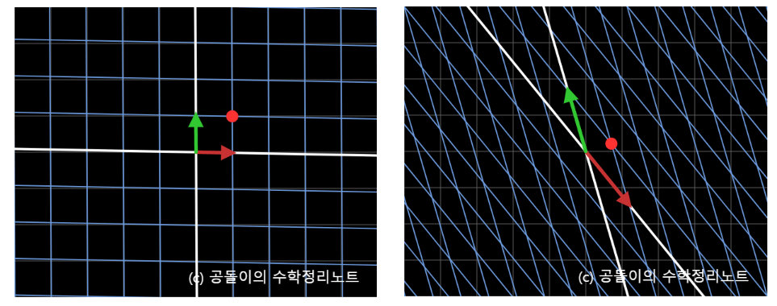
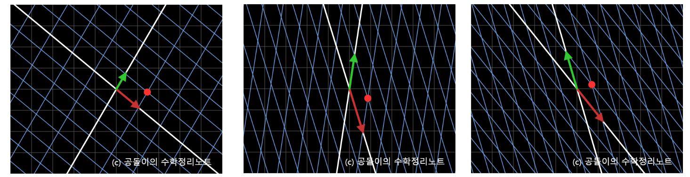
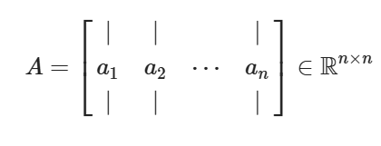
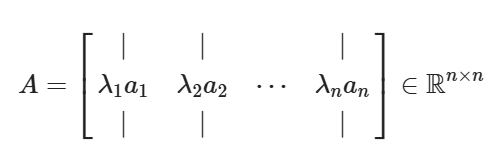
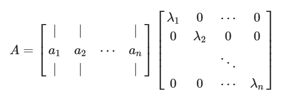
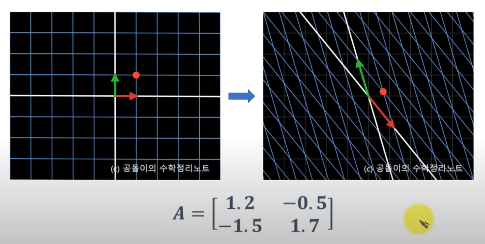

#선형대수
**backgroud**
[선형 벡터와 고윳값 그리고 고유 벡터 의미](obsidian://open?vault=PARA&file=Area_of_responsibility%2F%EC%88%98%ED%95%99%26%ED%86%B5%EA%B3%84%2F%EC%84%A0%ED%98%95%EB%8C%80%EC%88%98_%EC%84%A0%ED%98%95%20%EB%B2%A1%ED%84%B0%EC%99%80%20%EA%B3%A0%EC%9C%A0%EA%B0%92%20%EA%B7%B8%EB%A6%AC%EA%B3%A0%20%EA%B3%A0%EC%9C%A0%20%EB%B2%A1%ED%84%B0%20%EC%9D%98%EB%AF%B8%2F%EC%84%A0%ED%98%95%20%EB%B2%A1%ED%84%B0%EC%99%80%20%EA%B3%A0%EC%9C%A0%EA%B0%92%20%EA%B7%B8%EB%A6%AC%EA%B3%A0%20%EA%B3%A0%EC%9C%A0%20%EB%B2%A1%ED%84%B0%20%EC%9D%98%EB%AF%B8)
> https://angeloyeo.github.io/2020/11/19/eigen_decomposition.html

- 위와 같은 선형변환이 일어 났을 때 각 변환방법을 아래와 같이 생각할 수 있다.

- 각각 우로 돌리기(rotation),Shearing(늘리기),좌로 돌리기(rotation)를 시행한 변환이다.

> 행렬의 선형변환의 종류는 매우 무궁무진하기에 [공돌이 수학노트/행렬과 선형변환](https://angeloyeo.github.io/2019/07/15/Matrix_as_Linear_Transformation.html) 참조

****

- 행렬은 벡터들의 모음이다.
- 2번 사진과 같이 상수배가 취해진 벡터들이 존재할 때 3번의 사진과 같이 인수분해가 가능하다.
- 상수들은 인수분해가 되면 Diagonal Matrix(대각 행렬)이 된다.

> 대각행렬이란, 주대각선 성분 이외의 모든 성분이 0인 행렬을 대각행렬이라 한다. 만약 주대각선이 1로만 이루어져 있으면 그걸 단위행렬이라고 한다. 

- $$
  Av_i = \lambda_i v_i\text{ for } i = 1, 2, \cdots, n
  $$

- 위와 같은 임의의 nxn 행렬 A에 대해 여러개의 고윳값과 고유벡터를 얻었다고 가정한다.

- 고윳값 분해를 위해선 아래의 정의를 만족해야한다.

$$
V = \begin{bmatrix} 
   | &  | & \text{ } &  | \\ 
   v_1 & v_2 & \cdots & v_n \\ 
   | &  | & \text{ } &  | \end{bmatrix}
$$

$$
AV =  \begin{bmatrix} 
   | &  | & \text{ } &  | \\ 
  \lambda_1 v_1 & \lambda_2 v_2 & \cdots & \lambda_n v_n \\ 
   | &  | & \text{ } &  | \end{bmatrix}
$$

$$
\Lambda = \begin{bmatrix}\lambda_1 & 0 & \cdots & 0 \\ 0 & \lambda_2 & 0 & 0 \\ \text{ } & \text{ } & \ddots & \text{ } \\ 0 & 0 & \cdots & \lambda_n\end{bmatrix}
$$

$$
식 (6) \Rightarrow AV = V\Lambda ∴ A = V\Lambda V^{-1}
$$

- 위의 수식과 같이 행렬 `V`가 존재할 때, 맨 우의 관계식 때문에 `AV`의 식은 수식과 같이 변한다.
- `AV`를 인수분해하면 결국 마지막과 같이 결과가 나온다.  여기서 중요한 점은 `V`가 역행렬이 존재한다는 가정에서만 맨 아래의 식이 성립한다.
- 맨 아래의식이 결국 **고윳값 분해의 최종 수식이다.**
- 그럼 고윳값 분해가 결국 의미하는 바는 무엇일까? **고윳값 분해는 행렬의 선형변환이 어떻게 이루어지는가를 보여준다.**
- 고윳값 분해는 행렬로 표현되는 선형변환은 rotation, shearing, rotation 이 세 가지의 과정을 통해 분해가 가능함을 보여준다. 

- 고윳값 분해의 예시를 들기 위해 아래의 A의 선형 변환 결과를 보자

$$
A = \begin{bmatrix}1.2 & -0.5 \\ -1.5 & 1.7\end{bmatrix}
$$

- 이  A와 같은 선형변환이 존재할 때 그 행렬의 고윳값과 고유벡터는 아래와 같다.

$$
\lambda = 0.5486 \text{ or } 2.3514
$$

$$
\vec{v}_1 = \begin{bmatrix}0.6089 \\ 0.7933\end{bmatrix}
$$

$$
\vec{v}_2 = \begin{bmatrix}-0.3983 \\ 0.9172\end{bmatrix}
$$

- 행렬 A의 고윳값 즉 람다 중 기저백터 중 하나는 0.5로 줄어들고 또 다른 하나는 2.3정도로 늘어난다는 뜻이다. 
- 이러한 고유값과 고유벡터를 사용해서 아래 행렬A를 분해하기 위한 행렬들을 써보면 아래와 같다.

$$
V = \begin{bmatrix}0.6089 & -0.3983 \\ 0.7933 & 0.9172\end{bmatrix}
$$

$$
\Lambda = \begin{bmatrix}0.5486 & 0 \\ 0 & 2.3514\end{bmatrix}
$$

$$
V^{-1} = \begin{bmatrix}1.0489 & 0.4555 \\ -0.9072 & 0.6963\end{bmatrix}
$$

$$
A = V\Lambda V^{-1} \notag
$$

$$
\Rightarrow \begin{bmatrix}1.2 & -0.5 \\ -1.5 & 1.7\end{bmatrix}=\begin{bmatrix}0.6089 & -0.3983 \\ 0.7933 & 0.9172\end{bmatrix} \begin{bmatrix}0.5486 & 0 \\ 0 & 2.3514\end{bmatrix}\begin{bmatrix}1.0489 & 0.4555 \\ -0.9072 & 0.6963\end{bmatrix}
$$

- V는 **선형변환의 방향을 알려준다.** 즉 rotation으로 고유벡터를 모아놓은 행렬이다. 
- 고유벡터는 기본적으로 방향을 알려주는 벡터이기에 고유벡터 값을 기반으로 선형변환을 하면 회전하는 듯 한 움직임을 보여준다.
- Λ는 **선형변환의 길이**를 알려준다. 즉 Shearing으로 고유값의 길이를 알려준다.
- V^-1은 V의 역행렬로 V로 인해 **돌아간 방향을 다시 원상복구** 시키는 역할을 한다. 즉 rotation으로 고유벡터의 역행렬이다.
- 다시 변환 시키는 이유는 선형변환의 정의는 길이는 변환이 일어났을 경우 방향은 달라지지 않아야 한다.
- 다만 변환 후의 기저 벡터의 길이가 모두 같은 것은 아니라는 점과 변환 시 뒤집어 지면서 변환 할 가능성이 있기에 완전히 회전 변환과 같다고 볼 수는 없다.
- 결국 여기서 제일 중요한 개념은 결국 돌리고 그걸 복구시켜도 shearing를 했을 때 알 수 있듯 완전히 복구되지 않는 다는 점이다.
- 그리고 이 고윳값 분해에서 제일 중요한 예제는 나중 SVD에서 사용될 **대칭 행렬의 고윳값 분해 이다.**
- 대칭 행렬이란 `A=A^T`로 선형변환의 행렬이 대칭 행렬일 때 고윳값 분해는 일반적인 정방 행렬의 고유분해와 다르게 특이하다.
- 대칭행렬의 경우 **행렬 A가 아래와 같이 고윳값 분해가 가능하다면  고유 벡터가 서로 직교하는 성질을 보인다.**

$$
A=A^T
$$

- 대칭 행렬의 고윳값 분해는 위와 같은 성질은 만족한다.

$$
A = V\Lambda V^{-1} = A^T = (V\Lambda V^{-1})^T = (V^{-1})^T\Lambda^TV^T
$$

- 만약, 행렬 A가 위와 같이 고윳값 분해가 가능하다면, 위와 같은 내용이 성립한다.
-  Λ는 대각행렬이므로 `Λ^T=Λ`이고 `(xy)^T`는 식의 괄호를 해제하면 `y^T x^T`로 변한다. 그래서 위와 같이 최종결과가 나온다.

$$
V\Lambda V^{-1} = (V^T)^{-1}\Lambda V^T
$$

$$
V^T = V^{-1} \Rightarrow V V^T = V^TV = I
$$

- 따라서,  `vv^t`와 `v^Tv`는 Identity matrix가 되어야 하는데 이게 대칭행렬이 가장 중요한 이유이다.
-  Identoty matrix가 되기 위해선 벡터와 벡터의 T가 서로 같은 행벡터의 내적을 구할 때는 1이 나오고 다른 행벡터와 곱할 땐 서로 직교(값이 0)이어야한다는 소리이다.
- **즉 각각의 고유 벡터들은 1인데 서로 직교한다. 라고 정의 가능하다.**

$$
A = V\Lambda V^{-1} = V\Lambda V^T = Q\Lambda Q^T
$$

- 고유벡터들이 서로 직교할 땐 `Q`로 나타내기에 위와 같은 식이 성립이 된다.

- 이러한 대칭 행렬의 기하학적인 의미는 **고윳값, 고유벡터 관점에서 봤을 때 일반적인 정방 행렬과 대칭 행렬의 차이는 고유벡터들이 서로 직교한다는 것이다.**
- 따라서, 행렬 Q에 의해서 선형 변환되었을 때는 선형 변환 후에도 여전히 기저 벡터들의 길이는 1이면서 동시에 직교하기 때문에 벡터 공간을 회전 시켜놓은 것 같은 결과를 확인할 수 있다.
- 여기서 ‘회전 시켜 놓은 것 같은’이라고 말하는 것은 행렬 Q의 열벡터의 위치에 따라 기저벡터가 뒤집혀서 선형변환 될 수도 있기 때문이다.
-  대칭 행렬의 고유벡터를 모아 얻은 행렬 QQ는 회전행렬과 유사한 의미를 갖는다, 즉 Q^T, Λ, Q의 선형 변환을 차례대로 적용하면 원래의 선형 변환 A와 같은 것을 알 수 있다.