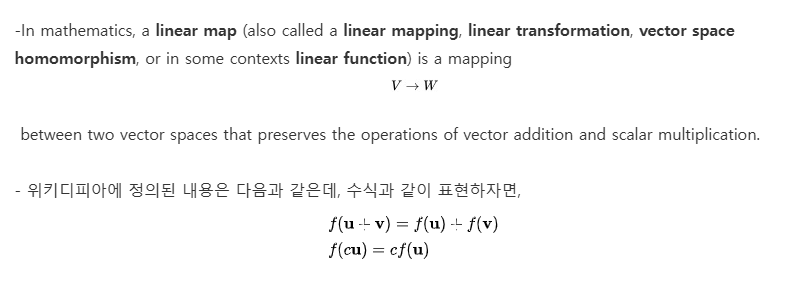
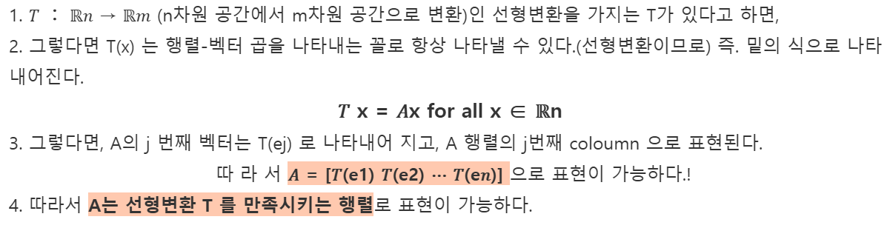
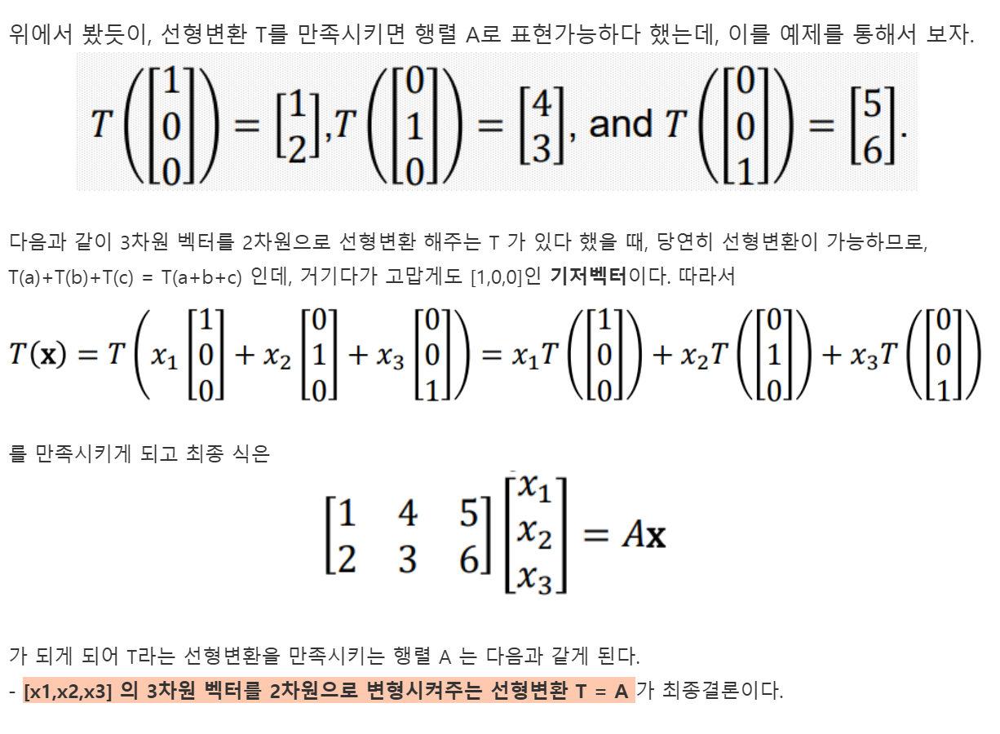
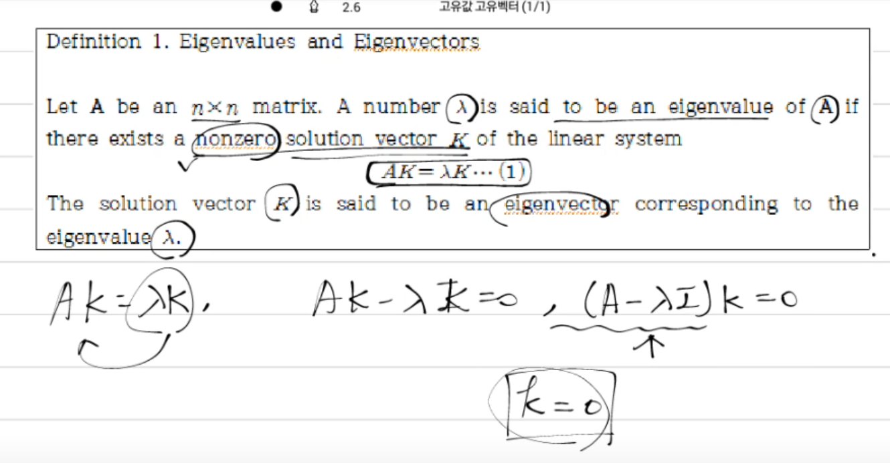
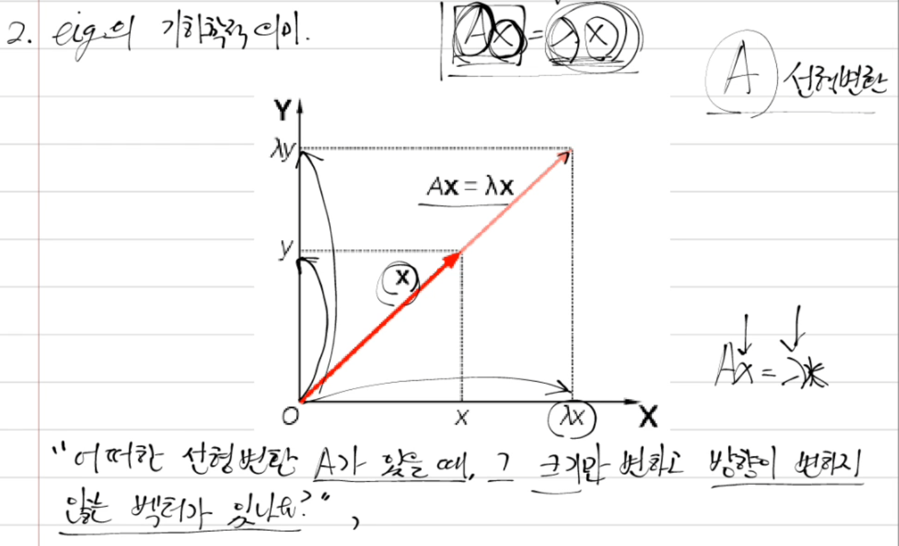
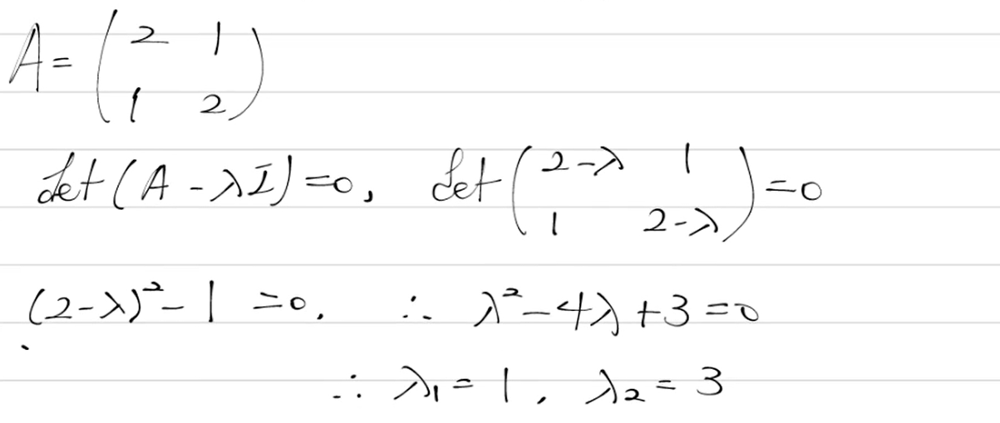
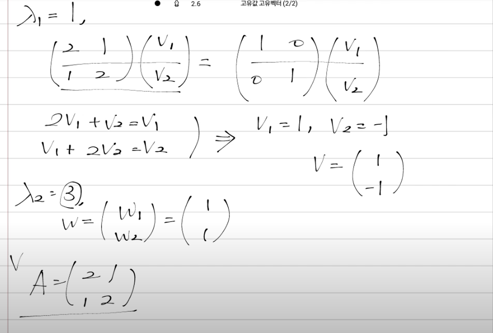
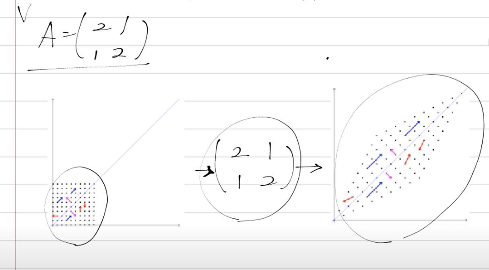
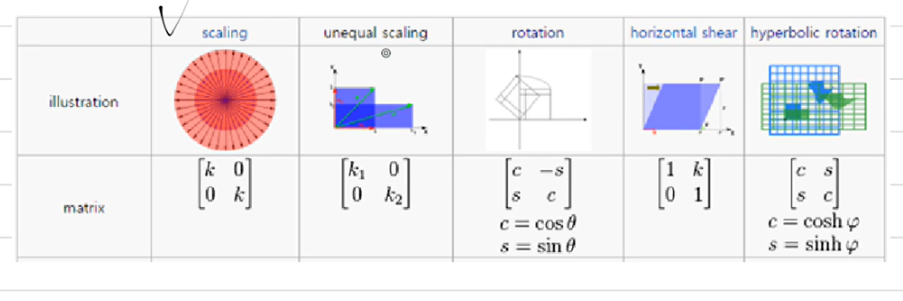

#선형대수
## 선형 변환

>출처: https://guru.tistory.com/62

## 1. 정의

- 벡터 필드 K 내부에 U와 V 2개의 벡터공간이 있다고 해보자. 그렇다면, 식 F_matrix: V-&gt;W로 바꿔주는 F_matrix(행렬) 에 대해 `F(C·U+D·V) = C·F(U) + D·F(V)` 를 만족시킨다면, 선형변환이 된다고 정의한다.
- 즉 쉽게 말하면, `F=3x+2y`이 존재하고, 이 공간의 벡터필드 `U = [1,2]와 V=[3,5]`가 존재한다 했을 때, `F[U+V] = F[[1,2], [3,5]] = F[4,7] = 4·3+2·7 = 26` 이 된다.
- 저 위 식의 정의대로 우변의 식 까지 해보면 `F[U] + F[V] = F[[1,2]]+F[[3,5]] = 3·1+ 2·2 + 3·3+ 2·5 = 26`이 되서 `F=3x+2y`가 다음과 같은 선형변황을 만족 시키게 된다. 우리가 어렸을 때, **덧셈 뺄셈 했던 거 다 선형변환의 일종이다.**

- 단!!!! 우의해야 할 점은 **bias term이 있는 변환**은 선형변환이 안된다.
- 하지만 이 또한 특정한 변형을 통하여 선형변화으로 나타내줄 수 있다.
- 아래는 선형 변환의 예시이다.
  1) `F(x,y) = (2x,y)`가 성형 변환을 통해 `(x,y)->(2x,y)`로 변환

2) `a+b = (a)+(b)`를 만족시킨 a,b가 `F(a+b) = F(a) + F(b)`를 통해 선형변환을 만족시킨다.
3) 선형변환을 만족시킬 때, F(c·a) = c·F(a)를 만족시킨다.

****

## 2.선형성의 특징

- 선형변환을 만족시킬 때, 선형변환은 곧 행렬로 표현될 수 있다.

- 즉 **그냥 선형변환을 말족하면, 행렬로 표현가능하고, 그 행렬이 선형변환 T를 나타내는거다.**

## 3. 선형변환과 행렬의 관계 예시

## 4. 고유값과 고유벡터의 기하학적 의미

> 출처:[공돌이의 수학정리 노트](https://www.youtube.com/watch?v=Nvc7ZRVjciM&list=PL5yujGYFVt0BCu7DXfEgD7M51Tj6S7s4A&index=2)

- **고유벡터**: 선형변환 A에 의해 방향은 변하지 않고 크기만 변하는 0이 아닌 벡터 k.

- **고윳값**: 그때의 스칼라 값 `λ`로,` Ak=λk`를 만족합니다.

- eigenvector(고유벡터)가 존재하는 필요 충분 조건은 아래와 같다.

  -  `Ak = λK`라 했을 때 아래와 같이 변형이 가능하다.
  - `AK - λK = 0` 이고 아래와 같이 변형이 가능하다.
  - `det(A-λI)K = 0`이 되는 데, 만약 `(A - λI)K`가 역행렬이 존재한다면 `K=0`이 된다.
  -  `I`는 단위행렬이고, 이 값은 아래와 같고 어떠한 일이 있어도 고정인 값이다.

  $$
  I = \begin{pmatrix} 1 & 0 \\ 0 & 1 \end{pmatrix}
  $$

  - 그런데 이 형식이 참이 되면 위의 nonzero solution vector가 모순적이 된다.
  - 위 말이 무슨말이냐면 `(A-λI)K`가 역행렬이 존재하면 `k=0`만 가능하지만 nonzero solution vecto라는 조건을 주면서 **0이 아닌 고유벡터를 찾고 싶어하는 것 이다.**
  - 그래서 저 위의 조건 들을 사용해`det(A - λI) = 0`이 되는 것이 eigenvector(고유벡터) 인 `K`와 eigenvalue(고유값)  `λ`를 찾아 줄 수 있는 필요 충분 조건 값들을 찾는다.
  - 따라서 이 필요 충분 조건은 비자명한 해 `k=!0`을 얻기 위해 작성 되며 `det(A-λI)K = 0`이 된다.

- 그 전에 기하학적의 의미부터 알아보자

- 위 그림에서 `Ax = λX`라고 표현이 되어 있다. 이거 헷갈리지 마라 그냥 예시가 정석인 x로 표현된거지 `AK = λK`랑 같은 의미이다.

- 위 그림은 기존 `x(벡터)` 라는 벡터가 존재하는데, 선형 변환으로 x축으로 `λ`만큼 늘리고 y축으로 `λ` 만큼 늘린 그림이다.

- 이렇게 하면 `λx`의 정의는**벡터의 방향은 변하지 않고 크기만 변하는 `λx`라는 벡터가 만들어 진다. 이는 0이 아닌 벡터에 대해서 항상 성립하는 벡터의 성질이다.**

- 그럼 `AX`는 어떻게 해석이 되냐면, **"`X`라는 벡터를 A가 선형변환을 시켰다"**라고 해석이 가능하다.

- 즉 총 집합적으로 `AX = λX`의 의미는 **A 라는 선형변환을 했을 때 x를 λ 만큼 변환했을 효과가 나는 그러한 벡터가 존재하는가?** 묻고 있는것이다. 저 그래프 아래에 있는 글이랑 같은 말이다.

- 저 수식에서 구해야 하는건 결국 `x`와 `λ`이다.

- 예시이다. 예시의 선형변환 A는 위의 사진과 같다.

- A라는 선형 변환 행렬이 존재할 때 eig Value와 eig Vector를 찾아보면서 기하학적 의미를 알아본다.

- Non-tribute Vector를 찾기 위해선 `det(A - λI) = 0`라는 명제가 성립해야한다. 이 식을 A 행렬에 대입하면 아래와 같다.

- $$
  det\begin{pmatrix} 2-λ & 1 \\ 1 & 2-λ \end{pmatrix} = 0
  $$

> **단위 행렬(I) 의미와 역할**
>
> 단위행렬은 행렬 연산에서 **항등원**(Identity Element)의 역할을 합니다. 즉, 어떤 행렬 A에 단위행렬 I를 곱하면 원래의 행렬 A가 그대로 나온다.
> $$
> A \times  I = A 및 I \times  A = A
> $$
> 이는 스칼라 곱셈에서 숫자 1이 곱셈의 항등원인 것과 같은 원리다.
>
> 그래서 `λI`는 아래의 의미를 가진다.
> $$
> λI = λ\begin{pmatrix} 1 & 0 \\ 0 & 1 \end{pmatrix} = \begin{pmatrix} λ & 0 \\ 0 & λ \end{pmatrix}
> $$
> 
>
> **즉 `A - λI`의 의미는 아래와 같다.**
>
> - **스칼라 곱셈 형태로 행렬에서 스칼라를 뺄 수 없기 때문에**, 단위행렬에 스칼라 `λ`를 곱하여 `λI`를 만들고, 이를 A에서 뺀다.
> - 이렇게 하면 행렬 **A의 주대각선 요소에서 λ를 빼는 효과가 있다.**
>
> - 이를 통해서 특정 방정식을 세우고 고윳값 λ를 구할 수 있다.
>
> 
>
>  **단위행렬의 개념적 이해는 아래와 같다.**
>
> - **항등변환**: 단위행렬은 벡터나 행렬을 변환하지 않고 그대로 유지시키는 역할을 합니다.
> - **기준점**: 선형대수에서 단위행렬은 다른 행렬의 성질을 이해하고 분석하는 데 기준이 됩니다.
> - **역행렬과의 관계**: 어떤 행렬 A에 대해 A×A^{−1}=I가 성립하며, 여기서 A^{-1}은 A의 역행렬입니다.
>
> 
>
> **즉 전체를 요약하면 아래와 같다.**
>
> - **단위행렬 I**: 주대각선이 1이고 나머지가 0인 정사각 행렬.
> - **역할**: 행렬 곱셈에서 항등원으로 작용하며, 고윳값 계산 시 주대각선 요소에서 스칼라 λ를 빼는 역할.
> - **개념적 의미**: 선형 변환에서 자기 자신을 그대로 유지시키는 변환을 나타냄.

- 위 식의 계산 전개는 아래와 같다.

  - $$
    A = \begin{pmatrix} 2 & 1 \\ 1 & 2 \\ \end{pmatrix}, \quad I = \begin{pmatrix} 1 & 0 \\ 0 & 1 \\ \end{pmatrix}
    $$

    

  - `A-λI`는 각 원소별로 계산된다.

  - $$
    A - \lambda I = \begin{pmatrix} 2 - \lambda & 1 \\ 1 & 2 - \lambda \\ \end{pmatrix}
    $$

    - 주대각선 요소:  `2−λ`
    - 비대각선 요소: 그대로 유지(1) 이니깐

  - 그런 다음 2x2 행렬식을 계산한다.

  - $$
    \det\begin{pmatrix} a & b \\ c & d \\ \end{pmatrix} = ad - bc

    $$

  - 따라서 행렬식은 다음과 같이 계산된다.

  - $$
    \det(A - \lambda I) = (2 - \lambda)(2 - \lambda) - (1)(1) = (2 - \lambda)^2 - 1
    $$

  - 위와 같은 행렬식이 되는 이유는 대각선 곱에서 비대각선 곱을 뺀 값이기에

  - 특성 방정식은 아래와 같다.

  - $$
    (2 - \lambda)^2 - 1 = 0
    $$

  - 이 방석식을 풀면 아래와 같다.
    $$
    (2 - \lambda)^2 = 1
    $$

    $$
    2 - \lambda = \pm 1
    $$

    $$
    1번 경우 = 2−λ=1 \quad \Rightarrow \quad \lambda = 2 - 1 =1
    $$

    $$
    2번경우 = 2 - \lambda = -1 \quad \Rightarrow \quad \lambda = 2 + 1 = 3
    $$

    

  - 즉 **고윳값은 `λ =1` 또는 `λ=3`**이다.

- 위 식을 기하학적 말로 하면, "선형 변환을 했을 때 그 크기는 변하고 방향은 바뀌지 않는 벡터가 존재한다. 그 벡터의 크기는 각각 1배와 3배가 된다."

- 이제 이 결과를 바탕으로 eig Vector를 구하면 위 사진과 같다.
- 참고로 위 사진의 `V`은 저 맨 윗사진으 `K`와 같다.
- `λ =1` 땐 행렬의 합을 사용해 `2 *V1 +V2 = V1`과 `V1 + 2 * V2 = V2`가 된다.
- 위 식을 사용해서 `V1 = 1 일때 V2 = -1`이다.
- "W 벡터는 선형변환 A (2112)를 취했을 때, 그 방향은 변하지 않고 그 크기는 1배가 된다. "
- `λ =3`인 경우를 계산하면 위 그림과 같다. 저 위의 그림은 그냥 구분을 위해 벡터를 W로 한거다. 기하학적으로 말로 설명하면 아래와 같다.
- "W 벡터는 선형변환 A (2112)를 취했을 때, 그 방향은 변하지 않고 그 크기는 3배가 된다. "

> 저 고유 벡터를 계산 하는 방식을 기하학적 말로 말고 수식으로 풀어 쓰면 아래와 같다.
>
> **첫 번째 고윳값 `λ=1`**
>
> 1. `A−λI` 계산
>    $$
>    A - I = \begin{pmatrix} 2 - 1 & 1 \\ 1 & 2 - 1 \\ \end{pmatrix} = \begin{pmatrix} 1 & 1 \\ 1 & 1 \\ \end{pmatrix}
>    $$
>
> 2. 방정식 설정
>    $$
>    \begin{pmatrix} 1 & 1 \\ 1 & 1 \\ \end{pmatrix} \begin{pmatrix} k_1 \\ k_2 \\ \end{pmatrix} = \begin{pmatrix} 0 \\ 0 \\ \end{pmatrix}
>    $$
>
> 3. 연립방정식:
>    $$
>    \begin{cases} k_1 + k_2 = 0 \\ k_1 + k_2 = 0 \\ \end{cases}
>    $$
>    
>
> 4. 해석:
>
>    - 하나의 독립적인 방정식이므로` k1 = −k2`
>
>    - 고유 벡터는 아래 값의 배수 입다. 
>
>    - $$
>      k = \begin{pmatrix} 1 \\ -1 \end{pmatrix}
>      $$
>
> **두 번째 고윳값 `λ=3`**
>
> 1. `A−λI` 계산
>    $$
>    A - I = \begin{pmatrix} 2 - 3 & 1 \\ 1 & 2 - 3 \\ \end{pmatrix} = \begin{pmatrix} -1 & 1 \\ 1 & -1 \\ \end{pmatrix}
>    $$
>
> 2. 방정식 설정
>    $$
>    \begin{pmatrix} -1 & 1 \\ 1 & -1 \\ \end{pmatrix} \begin{pmatrix} k_1 \\ k_2 \\ \end{pmatrix} = \begin{pmatrix} 0 \\ 0 \\ \end{pmatrix}
>    $$
>
> 3. 연립방정식:
>    $$
>    \begin{cases} -k_1 + k_2 = 0 \\ k_1 - k_2 = 0 \\ \end{cases}
>    $$
>    
>
> 4. 해석:
>
>    - 하나의 독립적인 방정식이므로` k2 = k1`
>
>    - 고유 벡터는 아래 값의 배수 입다. 
>
>    - $$
>      k = \begin{pmatrix} 1 \\ 1 \end{pmatrix}
>      $$

- 선형 변환을 취해 줄 때 아래와 같이 나온다.

.gif)

- 파란색 화살표 즉 파라색 벡터를 보면 방향은 변하지 않고 그 크기만 커지는걸 확인 가능하다. 파란색은 3 만큼 이동하는데 즉 이게 eig Verctor(고유 벡터) 3이란거다
- 보라색도 마찬가지 인데 각 칸의 1만 연결해 있는데 이 값이 eig Vector 1인거다.
- 나머지는 벡터의 방향이 변하는걸 알 수 있다.

> 와 근데 이거 이렇게 움짤로 보니깐 이해가 장난아니게 된다. 이게 PCA의 직교 개념이랑도 연동 되는거 같다.

- 최종적으로 기하학적으로 이야기 하면 위 행렬만큼 선형 변환을 하면 위 의 그림 처럼 변한다.

- 실제론 위와 같은 선형 변환들이 존재한다. 이러한 변환들 모두 고윳값과 고유벡터를 들고 있다.
- 고윳값과 고유 벡터의 의미를 확장 시키면, 변환할 때 그 주축이 되는 점을 찾느것 이라고 말할 수 있다. PCA와 같은 분석법에서 제일 중요한 방법론이다.