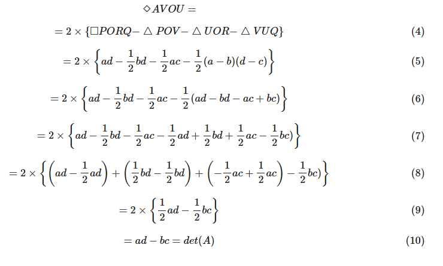
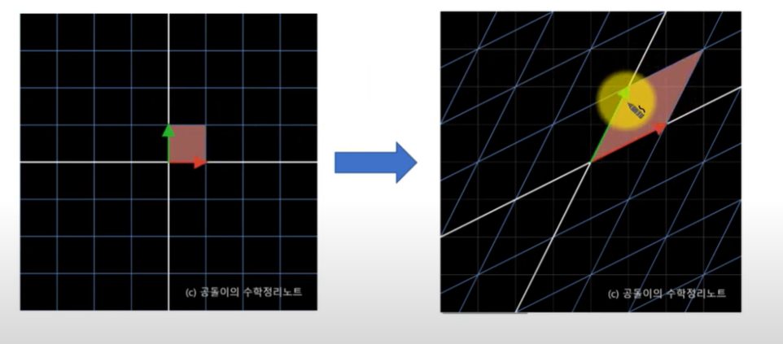
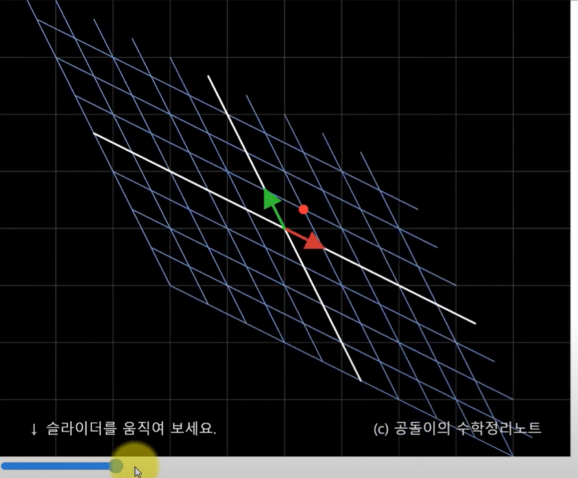

#선형대수 #확률 

- 특이값 분해를 공부하다가 조금 더 알고 싶은 개념이 생겨서 알아본다.
- 내가 꽃힌 개념은 EVD의 정의에서 V가 선형 독립이면 EVD의 정의가 성립한다고 했을 때 왜 그런지 이유를 생각해보니 여기까지 왔다
  - 고유벡터들(V, 말이 복수가 아니라 단수면 v1,v2 같은 거)이 선형 독립일 때 그 행렬은 역행렬이 가능하다.
  - 그 이유가 뭘까?
  - 거기서 더 나아가 역행렬을 깊이 들어가보자

- 라고 생각해 보니 의사역행렬이라는 개념까지 도달했다. 차차 해보겠다.
- 모든건 실수와 열벡터를 기준으로 한다. 레퍼런스 페이지에서 이해를 돕기 위해 이렇게 설명해주고 복소수 공간에서 설명하면 그냥 이해 안될듯

## 행렬과 역행렬

- 벡터의 정의 => 벡터는 벡터, 덧셈규칙, 곱셈 규칙으로 이루어 져 있다

$$
(V, +, \cdot)
$$

- 곱샘 규칙은 덕셈 규칙이 정의되는 원소들이며, 이들의 집함에 이 연산들이 정의된 집합을 벡터 공간이라고 한다.
- 이러한 상수배와 덧셈 규칙이 정의되는 원소들을 "선형성을 가진다."
- 벡터들의 선형성의 여부는 매우 중요한 문제인데, 선형성을 가지는 지 알아보는 방법은 매우 중요하다. **행벡터가 처리 대상인 데이터가 아니라 함수임에도 선형성을 가진다면 일반적인 벡터에 적욜할 수 있다고 알려진 모든 method들에 적용할 수 있기에** 이 설명은 헹벡터에 대한 선형성 설명이다.
- 저리하면 아래와 같다.
  - 열벡터를 입력으로 받아 스칼라(즉, 숫자)를 출력하는 함수
  - 또, 행벡터는 선형연산자이다.
  - 다시 말해 두 벡터를 더한 채로 함수 출력을 볼 때와 두 벡터의 함수 출력을 합한 것이 같음.
  - 또 다시 말해, 선형연산자이기 때문에 입력에 상수배를 해준 채로 함수를 출력할 때와 출력된 함수에 상수배를 해준 것의 결과는 같음.
- 그럼 열공간은 무었일까?, 먼저 행공간은 열공간의 쌍대공간이다.
- 행벡터는 열벡터를 받아 스칼라를 출력한다.(이거 그 행렬곱 생각하면됨, 들어올때 T하는 이유)

- 벡터로 이루어진 행렬식은 **선형변환 될 때 단위 면적이 얼마만큰 늘어나는기?**를 해결하기 위해 사용된다.
- 2*2 행렬은 다음과 같이 정의 된다.
- **모든 예시를 지금 열벡터를 기준으로 설명한다. 만약 행벡터로 기준을 하면 det(A) = ac-bd이다.지금 모든 포스팅은 열벡터를 기준으로 한다.**

$$
행렬 \\
A=\begin{pmatrix}a& b \\ c & d \end{pmatrix} \\
에 대하여 \\
det(A) = ad-bc \\
로 정의된다.
$$

- 역행렬은 아래와 같이 정의된다.

$$
행렬 \\
A=\begin{pmatrix} a& b \\ c & d \end{pmatrix} \notag \\
에 대하여 \\
A^{-1} = \frac{1}{det(A)} \begin{pmatrix}d& -b \\ -c & a \end{pmatrix} \\
로 정의된다.
$$

- 대수적으로` AA^−1=A^−1A=I`라는 것을 보일 수는 있지만, 선형 대수학을 너머 행렬을 사용하는 수많은 수학 분야에서 행렬식은 등장한다.
- 특히 기하학에서 행렬식은 그 역할을 톡톡히 하는데 과연 행렬의 행렬식은 기하학적 의미로는 어떤 의미를 가질까?
- 행렬을 가장 이해하기 좋은 방법은 **행렬은 일종의 선형 변환이며 임의의 행렬(A)는 기저 벡터 `i=(1,0), j=(0,1)`을 새로운 기저 벡터 `u=(a,c)`, `v=(b,d)`**로 바꿔저는 역할을 수행한다.

$$
A=\begin{pmatrix} a& b \\ c & d \end{pmatrix}\notag
$$

- 임의의 기저 벡터 u와v는 좌표 평면상에 위와 같이 그려 표현할  수 있다.
- 이 때, 아래 그림과 같이 두 벡터를 통해 만든 평행사변형(각 길이 만큼 상대 길이를 늘림) AVOU의 넓이는 det(A)이다.
- 넓이는 삼각형 VOU의 넓이를 구한 뒤, 두배를 해주면 된다.

- 평행사변형 ACOU의 넓이는 det(A)다.삼각형 VOU의 넓이는 사각형 PORQ에서 삼각형 POV, UOR, VUQ의 넓이를 빼준 빗금친 부분의 넓이와 같다. 그러므로,

- 위의 사진과 같인 식이 전개가 된다. 그래서 det(A)는 ad-bc가 되는것이다.

- 위 그림을 이해하기 위해선 의식의 흐름대로 설명해보겠다.

  - 위 설명은 일단 이해를 돕기 위해서 실수를 기준으로 말한다. 하지만 벡터이기에 기저 벡터 i=(1,0)이란 뜻은 i= (2,0) 혹은 (3,0) (4,0).....(n,0)으로 발산하는 벡터를 의미한다.
  - 위 설명과 같이 기저 벡터 j도 같은 의미이다.
  - 이제 마름모꼴 그림에서 저러한 가장 초기 기저 벡터가 P와 R는 지금 실수 공간에 그냥 간단하게 표현되어 점으로 있다.근데 그 점을 가르키는 화살표가 있는데 이게  벡터이다.
  - 근데 여기서 U와 V라는 각각의 벡터로 선형변환을 할꺼다.  **즉 R을 U로 만들고 P를 V로 만들거다.**
  - 이렇게 선형 변환 하는걸 각각의 벡터로 표현안하고 묶어서 설명하니 행렬로 표현한다.
  - 위에서도 설명했지만 행렬식이란 **선형변환 될 때 늘어나는 단위 면적**이다.
  - 변환이 일어나 기존 벡터가 들고있는 스칼라 값들 범위(빨간 점선 박스)도 변환이 일어난다. 
  - 저게 변환되는 과정은 등고선을 생각하면 쉽다. 그림을 기준으로 P가 1마다 커질때 위치할 스칼라값의 위치를 기준으로선을 그었을 때 P를 V로 선형 변환을 하면 그 등고선이 기울어 진다. 즉 단위 면적이 기울어 진다. 
  - 반대인R이 U로 선형변환하는거도 마찬가지

  

  - 그래서 선형변환 후 벡터가 가지는 범위를 재정의 하기 위해 마름모꼴의 넓이가 선형 변환된 벡터를 나타낸다.

- 그럼 역행렬도 행렬이니깐 성형변환이라고 할 수 있을까? 대답은 선형 변환으로 취급한다 이다.**결국 역행렬이란 기존 행렬의 역 방향으로 움직이는 선형변환이란 밀이다.**그럼 역행렬의 선형변환은 어떻게 해석이 가능할까?

- **원래 행렬의 선형변환이 정사각형을 평행사변형으로 늘려주는 변환이라면 역행렬은 편행사변형을 다시 정사각형으로 돌려주는 방향으로 변환한다.** 그래서 역행렬에는 1/det(A라는 요소가 들어가 있음

- 

- 위 의사 진과 같이 기존 행렬 변환이 우상단으로 늘어지는 변환이라면 그 역행렬은 좌상단으로 늘어지는 변환이라는 그림이 나온다.
- 그 이유는 A * A^-1은 I 즉 Indentity matrix가 나와야 하는데 I는 `[1,0][0,1]`을 가지는 행렬이니 맨 처음 결과가 나온다. 즉 **아무런 변화가 일어 나지 않았다는 말이다. 결곡 원 행렬에 그 역행렬을 곱하면 아무 일도 일어나지 않은 상태가 된다.**
- 결국 역행렬은 아래와 같은 특성을 가진다.

$$
AA^{-1} = A^{-1}A = I
$$

- 지금 그림이 이해하기 쉽게 `[1,0][0,1]`로 나와있어서 I가 나온다. A가 원래 선형 변환을 나타내기에 거기애 A^-1을 하면 맨 처음 벡터 그대로 나온다 만약 `[1,2][3,4]`에 원래 A 의 선형 변환을 해주고 다시 A^-1을 해주면 저 1234가 나올거다.
- 그럼 저기서 I라고 하는건 뭐냐? 그냥 아무 일도 없었다는 의미이다.

## 의사역행렬과 기하학적 의미

- 