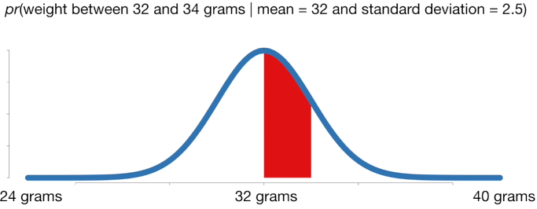
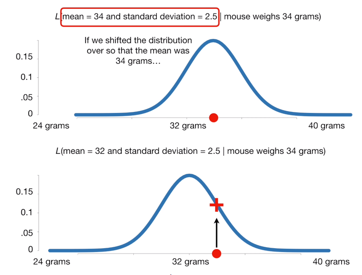
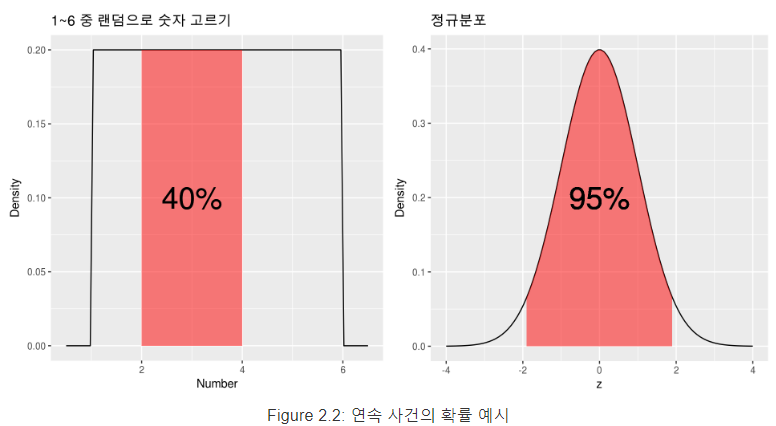
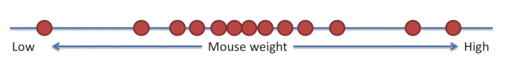
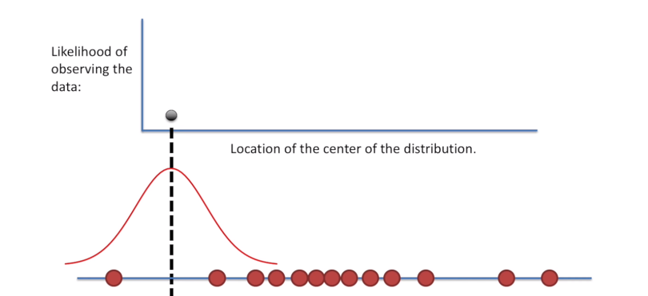
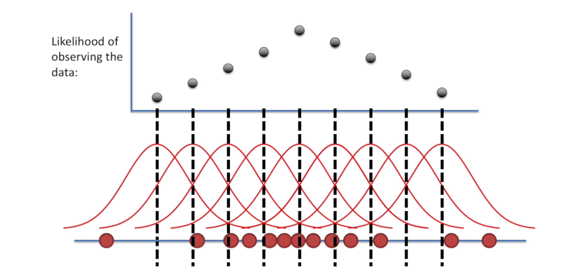

# LikeHood(우도, 가능도)와 Maximum likelihood(최대우도추정)

우도, 가능도, 라이크후드 등등..... 많은 이름을 가진 친구이자 AI의 확률통계의 기초이자 AI의 뼈대인 친구이다.

분명 학부생일 때 완벽히 이해하고 머신러닝 마스터를 했다고 생각했는데 지금 와서 보니 다 까먹고 기억도 안난다..

Probability는 확률, Likehood는 가능도 혹은 가능성 혹은 우도라고 불린다. Likehood는 "어떤일이 일어날 가능성"을 의미하기에 "확률"과 비슷하지만 다른 의미를 가진다.

**Probability와 Likehood**

- Probability(이하 확률)는 주어진 확률 분포가 고정된 상태에서, 관측되는 사건이 변화될 때, 확률이라고 하고 이걸 표현하는 단어다.
- Likehood(이하 우도)는 관측된 사건이 고정된 상태에서 확률 분포가 변화될 때, 우도라고 하고 이걸 표현하는 단어다.

## 확률과 우도

확률은 위의 말처럼 주어진 확률 분포가 고정된 상태라는 개념을 먼저 깔고 거기서 우리가 관측한 값 혹은 관측 구간이 분포 안에서 얼마의 확률로 존재하는 가를 나타내는 값이다. 이 확률 분포를 고정한다 이 부분이 매우 중요하다.

위와 같이 평균이 32이고 표분편차가 2.5인 정규 분포에서 쥐의 몸무게가 32~34 사이로 관측될 경우는 몇퍼일까? 이러한 개념이 **확률(Probability)**이다.  

그렇다면 우도는 무엇일까? 우도는 확률의 개념에서 시각을 반대로 한 것 이다. 확률이 고정된 확률 분포에서 관측값을 본다면 우도는 관측값을 먼저 발견하고 특정 확률 분포에서 관측될 경우는 몇퍼일까? 일 때 우도라는 확률개념이 사용된다.

예를 들어 34라는 관측 결과가 위와 같은 확률 분포(평균이 32이고 표준편차가 2.5인)에서 등장할 확률은 0.12이다. 이때 이 0.12는 우도 즉 가능도가 되는 것 이다.  여기서 확률 분포가 변한다고 가정했을 때 평균이 34이고 표준편차가 2.5인 확률 분포에선 34라는 관측값이 이 확률 분포에서 등장할 확률은 어떻게 될까? 아마 이전 확률 분포 보단 등장할 확률이 높아지기에 우도가 커질 것 이다.

**즉 확률은 주어진 확률 분포에서 해당 관측값이 나온 경우이고 우도는 주어진 관측값에서 이것이 해당 확률 분포에서 나왔을 경우를 수치적으로 표현한 것 이다.**

## 우도의 사용 이유?

우도가 확률 분포가 고정되어 있지 않은 상태에서 관측값의 확률이 우도인건 알았다. 그럼 이러한 우도가 사용되는 이유는 무엇일까? 위의 설명만 보면 뭐 관측된 값을 고정되지 정규 분포를 사용하여 어쩌구 하면서 설명을 하는데 그냥 여러개 정규 분포 들고와서 확률 사용하면 안됨? 아니 막말로 결국 저것도 확률아닌가? 라고 생각할 수 있는데 이 우도의 사용이유는 **연속사건의 확률** 구하고 비교한다에서 그 의의가 있다.

먼저연속적인 값에서 **특정 사건의 확률은 모두 0**이란걸 알아야 한다. 이게 무슨 말 이냐면 1과 6사이의 숫자 중 4를 뽑을 확률은? 이라는 질문에 들어왔을 때 우린 흔히 1/6이라고 대답할 수 있다. 

하지만 이건 정수 1~6 사이에서 4를 뽑을 확률이고, 연속적인 즉 실수에서 4를 뽑을려고 하면 그건 계산이 불가능하다. 당장 1~2의 수만해도 **무한대**이기 때문이다. 1.1, .1.11, 1.1111111, 1.2 etc... 수는 끝없이 존재하기 때문이다. 실수에서 하나를 콕 찝어서 그거의 등장 확률은`1/무한대`라고 정의하기에 그 값은 0이다. 

그러면 실수에서 확률을 구할 때 는 어떻게 나타낼까? 우리는 이러한 대안으로 하나를 찝는게 아니라 정의를 **특정 구간에 속할 확률**을 구하는 것이 그 대안이다.

**확률 밀도 함수**

우리는 1~6 사이의 에서 4가 등장할 확률이라고 하면 이제 0이란걸 안다. 그럼 우리가 이 연속된 값들 사이에서 확률을 구하는 방법은 특정 사건에 대한 확률 대신 특정 구간에 속할 확률을 구함으로 써 간접적으로 확률에 대한 감을 잡을 수 있다. 이것을 설명하는 곡선이 **확률 밀도 함수**이다. 

확률 밀도 함수는 특정 구간에 속할 확률을 계산하기 위한 함수이다. 이 확률 밀도 함수는 그래프를 활용해서 설명하면 그래프에서 특정 구간에 속한 넓이 = 특정 구간에 속할 확률로 설명이 가능하다.

위 그림은 확률 분포를 그래프로 나타 내었을 때 분포에 따라 특정 구간의 확률 변동에 대해서 말하고 있다. 여기서 우리가 자주 사용하는 분포는 정규 분포이고 위 그림은 가장 유명한 표준 정규 분포이다. 표준 오차를 사용한 p-value 구하기 등등 가설검정과 회귀에 기초가 되는 내용이 여기 정규분포를 활용한 확률 밀도 함수를 사용한다.

위 그림에서 연속되지 않은 문제의 분포에서 확률 밀도 함수를 구하면 그냥 평범한 확률을 구하듯이 구하면 된다.

여기서 중요한 내용은 정규 분포의 확률 밀도 함수를 구하는 식은 아래와 같다.
$$
f(x)=\frac{1}{\sigma\sqrt2\pi}e^{-\frac{z^2}{2}}    : \sigma는 표준편차 \mu는 평균이다. 그리고 z=\frac{x-\mu}{\sigma} 이다.
$$
그 중 가장 많이 등장하고 사용하고 정규 분포의 주인공인 표준 정규분포라는게 존재한다. 표준 정규 분포는 평균이 0이고 분산이 1인 정규 분포를 의미하는데 이는 많은 현상을 해석하는 데 활용되고 연구 중 가설이 정규분포를 만족한다를 알아보기 위해 표준정규 분포로 변환하는 작업이 있는데 이렇게 가설 검증에서 가장 핵심적이다.  

즉 **연속 사건의 경우에는 특정 사건이 일어날 확률은 모두 0 이며, 어떤 구간에 속할 확률은 확률 밀도 함수를 사용하여 구할 수 있다.**

정리하자면 우도를 사용하는 이유는 두 연속사건에서 특정 사건이 일어날 확률을 비교하기 하기 위해 사용하며 이 우도는 확률 분포가 정규분포이면 확률 밀도 함수를 우도로 사용한다. 즉 우도의 정의는 아래와 같다.

- 우도의 직관적인 정의: 확률 분포 함수의 y값이 우도이다.
  - 연속적이지 않는(셀 수 있는) 사건: 확률 = 우도
  - 연속 사건: 우도/=확률, 후도 = 확률 밀도 함수 값PDF값

## 최대우도추정

그럼 Maximum likehood(이하 최대우도추정)은 무엇일까? 최대 우도 추정은 각 관측값에 대한 총 우도(관측된 모든 우도의 곱)가 최대가 되게하는 정규분포를 찾는 것이라고 할 수 있다. 

그럼 어떻게 찾을 수 있을까? 막말로 순 노가다다. 임의의 정규 분포를 가정하고 관측된 값(하나일 수도 있고 복수일 수도 있음)에 대한 우도를 구하고 그 우도의 곱을 계산함, 여기서 정규 분포의 평균을 계속 변경하면서 우도의 곱이 어떻게 변화는가를 관측하면 어느순간 고점을 딱 찍고 내려오는 구간에 있는데 그 고점이 우리가 수집한 관측 값들이 나올 수 잇는 가장 확률이 높은 정규 분포이다. 

아래 그림을 보면서 설명하겠다.

먼저 위의 그림과 같이 관측된 여러 값이 존재한다.

두 번째 그림을 보면, 위에서 설명했듯 임의의 정규 분포를 두고 관측된 값의 우도의 곱을 구한다. 만약 우리가 가정한 정규 분포가 우리가 관측한 값의 왼쪽에 치우쳐저 있으면 우도의 곱은 위 검은 점 위치와 같을 것이다.

세 번째 그림은 정규 분포의 평균을 조금씩 키웠을 때마다 우도의 곱은 어떻게 변하는가를 확인할 수 있다. 즉 우리가 수집한 관측값들이 나올 수 있는 가장 가능한 확률 분포는 가능도가 제일 큰, 검은 점이 제일 높이 위치한 정규 분포에서 왔다고 추정할 수 있다.

## Reference

1. [우도란 무엇인가](https://recipesds.tistory.com/entry/%EC%9A%B0%EB%8F%84%EB%9E%80-%EB%8F%84%EB%8C%80%EC%B2%B4-%EB%AC%B4%EC%97%87%EC%9D%B8%EA%B0%80-%EC%A0%90-%EC%B6%94%EC%A0%95%EC%A0%84%EC%97%90-%ED%95%98%EB%8A%94-%EC%A4%80%EB%B9%84-%EC%B2%B4%EC%A1%B0-%EA%B0%80%EB%8A%A5%EB%8F%84-Likelihood%EB%9D%BC%EA%B3%A0%EB%8F%84-%EB%B6%88%EB%A6%AC%EB%8A%94-%EC%B9%B4%EC%98%A4%EC%8A%A4%EC%A0%81%EC%9D%B8-%EB%82%A9%EB%93%9D)
2. [Likelihood와 Probability](https://xoft.tistory.com/30)
3. [최대우도추정법(MLE)](https://xoft.tistory.com/31?category=1058478)

4. [기초 통계 개념 정리 우도 vs 확률](https://bookdown.org/mathemedicine/Stat_book/probability-vs-likelihood.html)

5. [StatQuest 우도 동영상 리뷰](https://jjangjjong.tistory.com/41)

